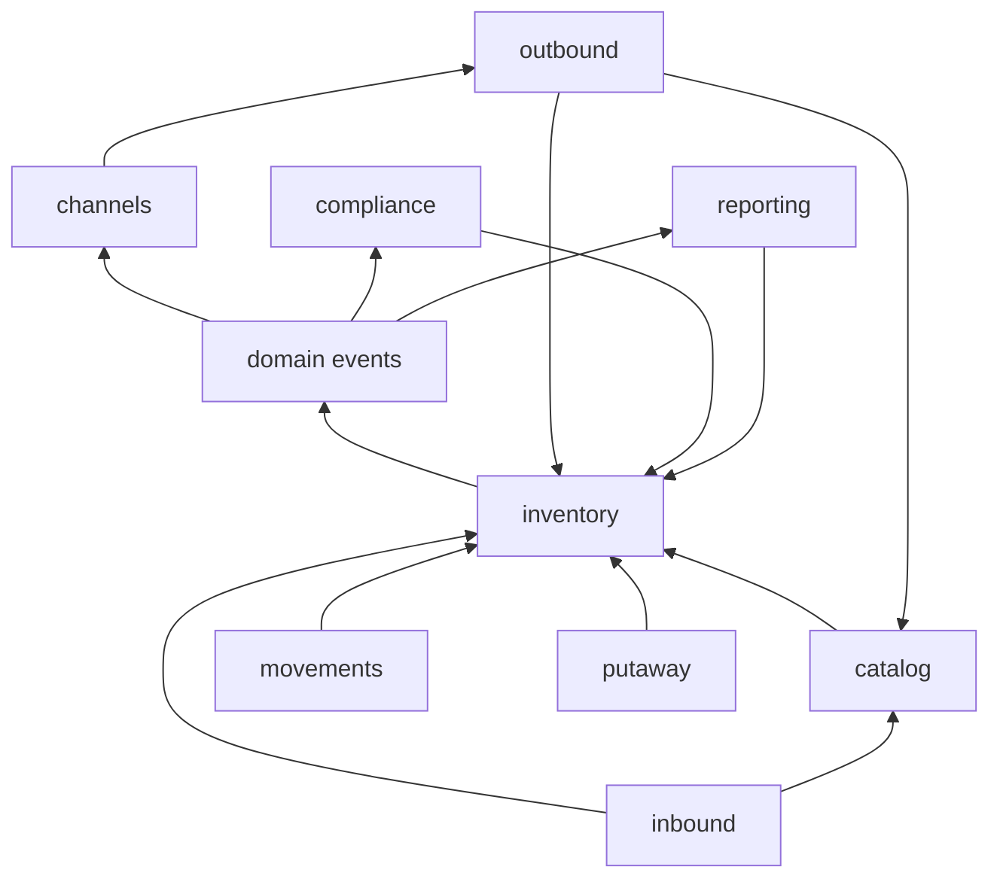
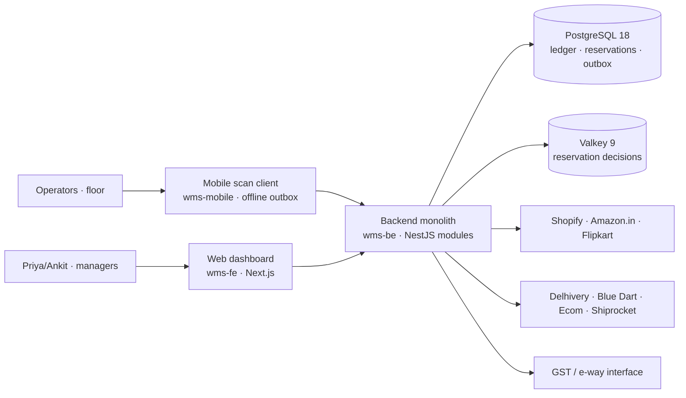

# Architecture Spine — WMS v1 Platform

## Design Paradigm

**Event-sourced modular monolith.** One deployable backend built as bounded modules with clean event seams; the inventory core is event-sourced (append-only ledger, everything else is a projection). Map to code: each module = one Nest module with its own folder, owning its tables; modules talk only through injected module interfaces and domain events — never through each other's tables. Ports (OpenAPI controllers, integration adapters, schedulers) sit at module edges; domain logic is framework-free in the middle.

## Invariants & Rules

### AD-1 — Ledger is the only stock truth `[ADOPTED]`

- **Binds:** all modules that touch stock: inbound, outbound, movements, counts, channels, compliance
- **Prevents:** mutable "current quantity" tables; any state a replay can't reproduce; silent write-offs
- **Rule:** every stock movement writes one immutable `ledger_event` (typed, batch/serial-aware, `from_bin`/`to_bin`, signed qty, actor, `occurred_at`/`recorded_at`, `reference_doc`, `idempotency_key`) in the same transaction as any relational state it drives. On-hand, ATP, QC-held, in-transit, KPIs are projections derived from the ledger — no code path stores a quantity that isn't re-derivable. Corrections are new events. A continuous replay-reconciliation job (NFR-1) quarantines on divergence, rebuilds projections from the ledger, and alerts — it never silently writes.

### AD-2 — Reservation: one atomic decision point, Postgres is the truth `[ADOPTED]` *(tightened by reviewer gate)*

- **Binds:** FR-5, FR-12, FR-17, FR-24, FR-25, NFR-2
- **Prevents:** check-then-write races (two channels selling the last unit); row-lock queuing at flash-sale load; live reservations evaporating on Valkey failover/restart
- **Rule:** every grant/release/reconcile of reservationable ATP happens through a single pre-declared-keys Lua script on Valkey (multi-key ops use hash-tag co-location; no keyless EVAL) — no module implements a second check-and-decrement. Every winning grant is journaled as a durable `reservation` record in Postgres in the same transaction as the order state it belongs to; the ledger carries the corresponding order event. **Postgres wins on all divergence**: cold start rebuilds Valkey from ledger + reservation journal; reconciliation reverses any Valkey state with no journal behind it. Dispatch/cancel serialization goes through the same script; the durable order event commits first, the Valkey mirror follows, and a missed mirror is repaired toward Postgres — never the reverse. Every reservation carries an owner (channel/order/task), a TTL, and a reaper transition; a losing racer receives a deterministic outcome (backorder/reject per Channel policy), never an error retry.

### AD-3 — Tenant + warehouse scope on every row and every access path `[ADOPTED]` *(tightened by reviewer gate)*

- **Binds:** all modules, both repos, mobile
- **Prevents:** cross-tenant reads (severity-1 defect, NFR-4); a later warehouse-count retrofit
- **Rule:** every table carries `tenant_id`; every operationally-scoped table also carries `warehouse_id` as first-class partition key. Repository/base-layer scope injects both on every query; Postgres RLS is defense-in-depth behind the app layer. Scoping extends to everything that *isn't* the API hot path: background jobs, projection/replay rebuilds, export workers (per-tenant artifact paths), and reporting queries all take explicit tenant context — a superuser bypass is a named, audited exception, not a default. Valkey reservation keys are tenant-namespaced. Idempotency keys are tenant-scoped (AD-5).

### AD-4 — Offline-first mobile client with outbox replay `[ADOPTED]` *(tightened by reviewer gate)*

- **Binds:** FR-14, FR-29, FR-30, NFR-3; wms-mobile
- **Prevents:** scan loss in dead zones; silent conflict resolution; "wait for network" moments
- **Rule:** the client keeps an encrypted local store (SQLite WAL) + FIFO outbox; scan decisions (accept/reject, FEFO, wrong-bin) run on-device; only ledger persistence waits for network. Reconnect replays in task order with client-generated ULID idempotency keys. Devices are enrolled and revocable; a wiped/lost device's cache is useless; every replayed item is re-authorized against current session/role/device state at the server — a deactivated operator's queued actions do not apply. Conflicts are never auto-merged (LWW forbidden) — they resolve by the taxonomy in AD-14. Queue state is shown as queue depth, never as error.

### AD-5 — Every write is idempotent by contract `[ADOPTED]` *(tightened by reviewer gate)*

- **Binds:** all mutating API endpoints, channel webhooks, carrier callbacks, offline replay
- **Prevents:** duplicate ledger events from webhook retries, double-tap, or offline replay; cross-tenant idempotency replay
- **Rule:** every mutating API call carries an `Idempotency-Key` (client-generated ULID); the backend stores key + request-payload hash → response, tenant-scoped, and de-dupes in the same transaction as the write. First-party clients use ULIDs; inbound webhooks/callbacks derive a deterministic key from `(integration, event-id, signature-verified payload hash)` — a verified webhook signature is a precondition, never an option. Integration consumers are idempotent by the same discipline: at-least-once delivery, exactly-once effect. Key retention is bounded (windowed, not 7 years) and never spans tenants.

### AD-6 — Module boundaries: interfaces and events, never tables `[ADOPTED]` *(tightened by reviewer gate)*

- **Binds:** wms-be monolith
- **Prevents:** distributed-monolith coupling — one module's schema change silently breaking another module's queries
- **Rule:** a module's tables are private to it. Cross-module reads/writes go through the owning module's injected interface; cross-module reactions subscribe to domain events. The inventory module (ledger + projections) depends on nothing; everything stock-touching depends on it. Direction may not invert, and the inventory module may never import another module's interface. Entity ownership is exclusive — one module owns each entity's lifecycle: **tenancy** owns Bin master data (create/merge/retire), **putaway** owns Bin operational state (block, suggestion); **catalog** owns Batch/Serial identity, the ledger owns Batch/Serial quantities; **outbound** owns the order state machine (no other module may add or transition order states).



### AD-7 — Transactional outbox for every integration crossing `[ADOPTED]` *(tightened by reviewer gate)*

- **Binds:** channels sync (FR-24/25), carriers (FR-17), e-way/GST (FR-26), notifications, exports (FR-28)
- **Prevents:** lost or duplicated external updates when a state change and its external effect span systems; runaway integration loops
- **Rule:** state change and outbound event commit in one Postgres transaction; a relay publishes at-least-once with a dead-letter queue and a sync-lag SLO (channel availability sync p95 ≤ 60 s, FR-24). External failures (carrier API down, e-way portal error) retry with backoff and never block or roll back the domain state — dispatch records first, label/eway retries follow. Inbound integration payloads must pass signature verification before any effect (AD-5). Every integration call is metered per tenant and circuit-broken on runaway volume (AD-17).

### AD-8 — OpenAPI is the contract; clients consume generated types `[ADOPTED]` *(tightened by reviewer gate)*

- **Binds:** wms-be ↔ wms-fe ↔ wms-mobile; `docs/repos/*` interface contracts
- **Prevents:** hand-copied DTO drift across three repos
- **Rule:** wms-be exposes a versioned OpenAPI document as the single API truth; wms-fe and wms-mobile commit generated typed clients (type-only: `openapi-typescript`; SDK: `@hey-api/openapi-ts` — pinned in Stack); no hand-written API types on the consuming side. A backend change that breaks the generated types is a build failure in the consuming repo, not a runtime surprise.

### AD-9 — Deterministic primitive types: exact arithmetic, UTC, UUIDv7 `[ADOPTED, amended 2026-09-17]`

- **Binds:** all repos
- **Prevents:** float money and quantity bugs, quantity-unit ambiguity, timezone chaos, unordered ids across offline clients
- **Rule:** quantities are **fractional**, represented as **scaled integers in milli-units** (base UoM x 10^3) stored as `bigint`; each UoM declares its real decimal precision, capped at **3 decimal places** by the scale, and decimal conversion happens **only at API and UI edges**. Money is integer paise; GST rates are basis points; timestamps are ISO-8601 UTC (IST is a display concern); identifiers are UUIDv7 (client-generatable, time-ordered). Every event's `qty` is signed by movement direction, never by convention. Regulatory constants (e-way thresholds, GST rules) live as versioned config data, never code literals.
- **Amendment (2026-09-17, multi-domain expansion).** The original rule was *integers in base UoM*. Measured goods — grain, fertilizer, cement, chemicals, petroleum, LPG, bulk alcohol, and length-measured steel and pipe — cannot live inside it, and the "use a tiny base unit" escape fails twice: `integer` overflows before silo scale (2,147,483,647 g is ~2,147 t), and **catch weight cannot be expressed at any base unit**. Quantities therefore become fractional. `bigint` milli-units reach 9.2 x 10^15 base units, and the binding limit is not `bigint` but the 2^53 exact-integer ceiling of JS and Lua doubles, which milli-unit scaling keeps at ~9.0 x 10^12 base units, ample for silo and tank scale.
- **Why scaled integers and not `numeric`.** The reservation path decrements ATP counters in Valkey through a Lua script, and Lua numbers are IEEE doubles — decimal quantities there would reintroduce exactly the float-precision errors this decision exists to prevent. `numeric` in Postgres plus scaled integers in Valkey means two representations and a conversion boundary in the most concurrency-sensitive code in the system. One exact representation everywhere, following the repo's own money-as-integer-paise precedent.
- **Why milli and not micro (human decision, 2026-09-17).** The scale is bounded by the *doubles*, not by `bigint`. Quantities cross two IEEE-double boundaries — Lua 5.1 in the Valkey script and JavaScript itself — both exact only to 2^53 (~9.007 x 10^15). At x10^6 that leaves ~9.0 x 10^9 base units, which caps a grams-based silo at ~9,007 t: better than int4's ~2,147 t but still reachable by a real silo. At x10^3 the same ceiling becomes ~9.0 x 10^12 base units, a thousandfold more headroom, at the cost of capping declared precision at 3 dp — which covers every UoM the domain list needs (kg, litre, tonne, metre all at 3 dp; each at 0 dp). Revisit only if a UoM ever genuinely needs more than 3 decimal places (troy ounces, chemical actives), and understand that doing so trades range for precision against a fixed 2^53 budget.
- **Catch weight is NOT a quantity.** The actual weight of an individual handling unit (a case of beef is *one* unit weighing 18.4 kg — handled by unit, priced by weight) is a per-handling-unit field under AD-22. It never enters this rule, which is what keeps the migration confined to the quantity columns.
- **Migration oracle.** Story 2.2's continuous replay-reconciliation recomputes derived quantities from the ledger and compares them against live counters. After the quantity migration, **replay must reproduce every balance** — that is the acceptance test for the change.

### AD-10 — One command layer owns state mutation `[ADOPTED]` *(tightened by reviewer gate)*

- **Binds:** wms-be, wms-fe, wms-mobile
- **Prevents:** parallel mutation paths (API + scheduler + webhook) diverging on invariants like approval gates
- **Rule:** all state changes — user action, scheduled job, integration — enter through the same module command services, which enforce role/approval gates and write audit + events. Authorization is re-evaluated at command-service entry against the current role epoch — never trusted from token claims alone (FR-3's "effective on next action"); short-lived JWT + rotating refresh are transport, not authority. Clients are thin: the web and mobile apps hold no business rules beyond on-device scan validation (AD-4), which mirrors — never overrides — server rules.

### AD-11 — Ledger event envelope is a versioned, registered schema

- **Binds:** inventory module (owner); every module that emits or consumes ledger events
- **Prevents:** two builders choosing incompatible event grammars (`reference_doc` as string vs typed union; `adjustment.applied` vs `adjustment.increased/decreased`) that silently break one replay job and FEFO ordering
- **Rule:** the inventory module owns the event envelope: `schema_version`, a registered event-type enum, a typed `reference_doc` union, and pinned batch/serial discriminated-union arms. New event types are added by registration, not by free-form emission; consumers compile against the registry. Every event carries a server-assigned, gap-free per-warehouse sequence number — the replay order (UUIDv7/ULID ids are not a total order).

### AD-12 — Reservations are durable first-class records with a lifecycle

- **Binds:** FR-5, FR-12, FR-17, FR-24, FR-25; channels, outbound, movements
- **Prevents:** ATP leaking through accepted-but-never-dispatched orders; grant-side crashes leaking or phantom-locking stock; cancel-vs-dispatch double-release
- **Rule:** a reservation is a Postgres record owned by the granting flow (`owner_type`, `owner_id`, TTL, state `held→committed→released/expired`), created in the state-change transaction (AD-2's journal). A reaper transitions expired holds; release paths (cancel, dispatch, reaper) serialize through the reservation identity so exactly one terminal transition wins. Availability sync exposes ATP net of *all* live reservation states.

### AD-13 — Channel buffers are standing reservations, not sync-time math

- **Binds:** FR-5, FR-24; channels module; inventory module
- **Prevents:** buffer subtraction at sync time double-selling into another channel's buffer at flash-sale load (and violating AD-6's dependency direction)
- **Rule:** the inventory module publishes only unallocated sellable quantity (on-hand − QC-held − committed); it knows nothing of channels. Each channel's Safety Buffer is a standing reservation held through the same AD-2 script, owned by the channels module; channel-visible availability = unallocated − that channel's standing reservation. Sync (AD-7) delivers the arithmetic result; it never performs it.

### AD-14 — Offline work settles only pre-reserved task stock

- **Binds:** FR-12…FR-15, FR-18, FR-20, NFR-3; wms-mobile
- **Prevents:** offline replays consuming ATP that a channel already reserved; conflicting concurrent mutations (pick, short-pick, count, adjustment) racing on one bin; negative stock
- **Rule:** pick/transfer tasks carry their reservation from release time (waves reserve at release); the offline client settles existing reservations only — granting new ATP, releasing foreign reservations, or accepting fresh orders is always an online operation. Server-side mutation checks a per-bin `state_epoch` captured at task start: on mismatch (concurrent movement), the conflict resolves by taxonomy — (1) quantity unchanged → apply; (2) reservation still valid → settle; (3) bin state moved on → short-pick/re-plan flow (FR-15); (4) unresolvable → quarantine to human review without blocking the operator's other tasks. Bin on-hand never goes negative: a violating event is rejected or routed to review, not written.

### AD-15 — Integration secrets are tenant-scoped, encrypted, rotatable

- **Binds:** channels (FR-24/25), carriers (FR-17), compliance/e-way (FR-26)
- **Prevents:** marketplace OAuth tokens, carrier API keys, or GSP credentials landing in plaintext, code, or config; orphaned credentials after disconnect
- **Rule:** third-party credentials are stored per-tenant under envelope encryption (KMS master key), referenced by id — never in env vars or code; rotation is a first-class operation; disconnecting a channel/carrier deletes its credentials and revokes its tokens. Secret material never appears in logs, exports, or ledger events.

### AD-16 — Audit is tamper-evident and retention is architected

- **Binds:** FR-28, NFR-5; inventory module
- **Prevents:** "immutable" that only means "we don't update it" — no defense against edits to the ledger itself; retention as an unimplemented number (NFR-5)
- **Rule:** ledger events are hash-chained (each event carries the hash of its predecessor); the chain head is periodically anchored to immutable storage (WORM-locked object storage). Exports carry a verifiable digest. Retention ≥ 7 years is implemented as a lifecycle (partitioning + archive tiering + restore-verified backups), not a policy statement. Any chain break is a severity-1 alert.

### AD-17 — The interactive scan path is protected from background work

- **Binds:** NFR-4, FR-24, FR-27; scheduler, channels, reporting, exports
- **Prevents:** background sync/exports/projection rebuilds starving floor scanning during peak; runaway sync storms burning carrier/marketplace quotas; silent cost bleed
- **Rule:** background work (availability sync, projections, exports, alerts, reaper) is sheddable: under load it yields to scan-path and order-accept traffic (NFR-4's priority). Every integration's outbound call volume is metered per tenant with automatic circuit-breaking on runaway loops — and those same counters are the metering surface that keeps commercial tiering technically meterable (PRD Monetization).

### AD-18 — Storage conformance and segregation are enforced at the command layer `[PROPOSED]`

- **Binds:** wms-be, wms-mobile; FR-40…FR-45
- **Prevents:** cold-chain breaks invisible until audit; incompatible goods stored together; high-value and controlled stock in open locations
- **Rule:** every SKU and every location carries a storage class and, where applicable, a hazard class — both from **controlled vocabularies backed by DB CHECKs, never free text**. Putaway and pick refuse a non-conforming placement, and refuse co-location of segregation-incompatible goods. Conformance is a command-layer rule, never a UI convention and never a bin-naming habit. Temperature excursions are ledger events like any other movement, so chain of custody is reconstructible from the ledger alone.

### AD-19 — Product identity is two-level; the SKU stays the ledger's unit `[PROPOSED]`

- **Binds:** all repos; FR-37, FR-38
- **Prevents:** a variant model that forces a ledger migration; lossy channel mapping
- **Rule:** `products` sits **above** `skus`; a SKU is the stock-keeping unit and remains what every ledger event, reservation, pick and bin quantity references. Variants are an identity and presentation concern; no table below the catalog ever learns what a variant is. This is what keeps apparel support and Shopify's product→variant mapping additive.

### AD-20 — Reverse movements are registered ledger event types `[PROPOSED]`

- **Binds:** wms-be; FR-46…FR-48
- **Prevents:** returns arriving as sign-flipped receipts that corrupt receiving analytics and inbound KPIs
- **Rule:** returns register their own grammar arms under AD-11 (`return.received`, `return.restocked`, `return.scrapped`). A return is never a receipt with a negative quantity and never a reversal of the dispatch event — the dispatch happened, and the ledger is append-only. Disposition decides which arm is written.

### AD-21 — Fiscal and legal state gates movement `[PROPOSED]`

- **Binds:** wms-be; FR-55…FR-66
- **Prevents:** duty-unpaid stock dispatched as if cleared; three disconnected compliance subsystems
- **Rule:** customs status, excise status and controlled-substance status are **states on stock, not parallel ledgers**. Movements are gated on them and every transition is an auditable event. One mechanism serves bonded storage, excise control and controlled goods — three regulatory regimes, one model. Statutory registers are projections over those events, never a separately maintained book.

### AD-22 — Handling units carry identity; returnable containers are assets `[PROPOSED]`

- **Binds:** wms-be, wms-mobile; FR-33, FR-52…FR-54
- **Prevents:** catch weight modelled as quantity; container fleets tracked in spreadsheets
- **Rule:** a handling unit (pallet, case, cylinder, keg) may carry its own identity, its **actual weight** (catch weight), and its own location. **Returnable containers are assets tracked distinctly from the stock they carry** — a cylinder's location, custody and deposit survive the gas inside being consumed.

## Consistency Conventions

| Concern | Convention |
| --- | --- |
| Naming | DB tables snake_case plural; entities PascalCase singular; ledger event types `<domain>.<verb-past>` (`grn.received`, `order.dispatched`); REST resources plural nouns; Nest modules one-per-domain-folder, kebab-case files |
| Data & formats | IDs UUIDv7; timestamps ISO-8601 UTC; money integer paise; qty fractional as scaled integers in milli-units (base-UoM x 10^3, `bigint`, 3 dp cap), decimals only at API/UI edges (AD-9); GST basis points; API errors RFC 9457 problem-details envelope with machine-readable `code` + `trace_id`; pagination cursor-based; every ledger event distinguishes `occurred_at` (device/event time) from `recorded_at` (server ingest) |
| State & cross-cutting | Mutation only via command services (AD-10); structured JSON logs with `tenant_id`/`warehouse_id`/`request_id` on every line; config via env only, per-tenant customization via metadata tables, never code (addendum §1.2); auth = short-lived JWT + refresh, roles Owner/Ops Manager/Operator/Accountant per FR-3; background jobs run through the same command layer via one scheduler |

## Stack

| Name | Version |
| --- | --- |
| Node.js (backend runtime) | 24 LTS (Active LTS; 22 is maintenance) |
| TypeScript | 6.x (7.x GA but programmatic API lands 7.1 — revisit for tooling) |
| NestJS (backend framework) | 12.0 |
| Drizzle ORM (Postgres access; 1.0 series still RC — defer) | ≥ 0.45.2 (0.45.2 fixes a SQL-injection CVE) |
| Next.js (web dashboard) | 16.3 |
| TanStack Query (web data layer) | 5.x |
| Expo + React Native (mobile scan client) | SDK 57 / RN 0.86 |
| expo-sqlite, WAL, encrypted (offline local store) | SDK 57 bundled |
| PostgreSQL (ledger, projections, outbox, RLS) | 18.6 |
| Valkey (reservation decisions, Lua; Redis-compatible) | 9.1 (ElastiCache Valkey 9.1 GA; pre-declared-keys Lua only) |
| Zod (schema/validation, shared with Nest Standard Schema) | 4.x |
| `openapi-typescript` (type gen) / `@hey-api/openapi-ts` (SDK) | 7.13 / 0.99.x |
| AWS ap-south-1 (Mumbai) — ECS Fargate, RDS Postgres, ElastiCache for Valkey, S3 (+ WORM-locked audit anchor) `[ASSUMPTION: infra provider; PRD OQ6 leaves India-region as preference]` | current |

## Structural Seed



```text
wms-be/ (NestJS monolith)
  src/
    shared/            # primitives (AD-9), problem-details, idempotency, event bus + outbox relay
    modules/
      tenancy/         # tenants, users, roles, warehouses, zones, bin master data (FR-1, FR-3)
      catalog/         # SKUs, UoM, batch/serial identity, import (FR-2)
      inventory/       # ledger, projections, ATP, reservation script + journal — depends on nothing (AD-6)
      inbound/         # POs, GRN, QC hold (FR-7…FR-9)
      putaway/         # directed putaway, bin operational state, slotting jobs (FR-10, FR-11)
      outbound/        # orders + order state machine, waves, picklists, picks, pack, dispatch (FR-12…FR-17)
      movements/       # transfers, adjustments, cycle counts (FR-18…FR-21)
      replenishment/   # reorder points, alerts, suggested POs (FR-22, FR-23)
      channels/        # Shopify/Amazon/Flipkart adapters, standing-buffer reservations, availability sync (FR-24, FR-25)
      compliance/      # GST invoices, e-way generation (FR-26)
      reporting/       # dashboard projections, audit trail, exports (FR-27, FR-28)
      carriers/        # India carrier adapters, rating, labels, manifests (FR-17)
      notifications/   # alerts, webhooks, task push
    api/               # OpenAPI controllers — thin, per module
    jobs/              # scheduler: reconciliation (AD-1), reservation reaper (AD-12), sync, nightly slotting, alerts — all sheddable (AD-17)

wms-fe/ (Next.js dashboard)
  src/app/             # App Router routes per PRD §4 surfaces
  src/lib/api/         # generated OpenAPI client only (AD-8)

wms-mobile/ `[ASSUMPTION: its own repo — register in docs/repo-catalog.yaml + workspace; meta CLAUDE.md updated for it]`
  app/                 # Expo Router screens: badge-in, task inbox (FR-29)
  src/scanning/        # on-device scan decision engine (AD-4), capture-agnostic scan events (FR-30)
  src/offline/         # encrypted SQLite store + outbox + replay (AD-4, AD-14)
```

## Capability → Architecture Map

| Capability / Area | Lives in | Governed by |
| --- | --- | --- |
| Onboarding & admin (FR-1…3) | tenancy + catalog modules | AD-3, AD-9, AD-10 |
| Ledger, ATP, traceability (FR-4…6) | inventory module | AD-1, AD-2, AD-11, AD-12, AD-5, AD-9 |
| POs, receiving, QC (FR-7…9) | inbound module | AD-1, AD-5, AD-10 |
| Putaway & bins (FR-10, FR-11) | putaway module | AD-1, AD-6 (bin ownership split), AD-10 |
| Orders, waves, picking (FR-12…15) | outbound module + wms-mobile | AD-2, AD-12, AD-14, AD-5 |
| Pack, carriers, dispatch (FR-16, FR-17) | outbound + carriers modules | AD-7, AD-5, AD-2 (dispatch serialization) |
| Transfers, adjustments, counts (FR-18…21) | movements module | AD-1, AD-14 (non-negativity, epoch), AD-10 |
| Replenishment (FR-22, FR-23) | replenishment module | AD-1, AD-10 |
| Channel sync & oversell protection (FR-24, FR-25) | channels module | AD-2, AD-13, AD-7, AD-15 |
| GST & e-way (FR-26) | compliance module | AD-7 (retries never block dispatch), AD-15, AD-9 (constants as config) |
| Dashboard & audit (FR-27, FR-28) | reporting module | AD-1 (KPIs are projections), AD-3, AD-16 |
| Mobile scan client (FR-29, FR-30) | wms-mobile | AD-4, AD-14, AD-8, AD-9 |
| Quantity model & catch weight (FR-31…34) | inventory module + all consumers | AD-9 (amended), AD-22 |
| Product, variants, kits, shipment address (FR-35…39) | catalog + outbound modules | AD-19, AD-9 |
| Storage conformance & segregation (FR-40…45) | putaway + inventory modules | AD-18, AD-10 |
| Returns & reverse logistics (FR-46…48) | new returns module | AD-20, AD-11, AD-1 |
| Traceability & shelf life (FR-49…51) | inventory module | AD-1, AD-11, AD-9 |
| Containers & handling units (FR-52…54) | new assets module | AD-22, AD-3 |
| Customs, excise, controlled goods (FR-55…66) | compliance module | AD-21, AD-16, AD-10 |
| Manufacturing flows (FR-67…70) | new manufacturing module | AD-1, AD-9, AD-10 |
| Bulk & tank storage (FR-71…74) | inventory + putaway modules | AD-9, AD-18, AD-1 |

## Deferred

- **Event transport at scale** — in-process event bus + Postgres outbox for v1; Kafka/Webhook fan-out infra only when tenant count makes the relay a bottleneck. Not decided: managed streaming choice.
- **E-way bill path** (PRD OQ3): official portal API vs GSP intermediary — the compliance module owns one `EwayGateway` port; choose before FR-26 build, swap without touching the spine.
- **Carrier adapter set** (PRD OQ1): Shiprocket-aggregator-first vs direct Delhivery/Blue Dart/Ecom APIs — same `CarrierAdapter` port; commercial conversations settle it.
- **Serial tracking v1 vs v1.5** (PRD OQ5): the ledger's batch/serial field is a discriminated union either way; deferring changes catalog surface, not architecture.
- **Marketplace API approvals** (PRD OQ2): launch fallback is Shopify + manual (addendum §5); adapter architecture unchanged.
- **True `numeric` quantities, and scales finer than milli** — considered at the AD-9 amendment (2026-09-17). `numeric` rejected because decimals cannot cross the Valkey/Lua reservation path safely; finer scales rejected because the 2^53 double ceiling is a fixed budget split between range and precision, and 3 dp buys ~9.0 x 10^12 base units of range. Revisit only for a UoM that genuinely needs more than 3 dp.
- **Defence, classified and strategic-reserve depots** — personnel-clearance handling, classified segregation and a government procurement path. The foundations are reachable via AD-18 and AD-21; deliberately not planned (PRD §2.2) as a different product and sales motion.
- **Multi-region, per-tenant DBs, CRDTs, 2PC, RFID edge, Kafka** — rejected for v1 (addendum §1.4); the rejection is safe because the capture edge produces a normalized, device-agnostic scan-event shape (RFID-tolerance preserved); 3PL multi-client billing (v2) stays reachable through AD-3 tenancy — no single-client assumptions anywhere.
- **Mobile scanning internals** — camera library vs ML Kit, symbology config: feature-level decision under FR-30; spine fixes only the on-device-decision + ≤1.5 s budget + capture-agnostic scan-event shape.
- **Count/short-pick mechanics detail** (FR-15/20/21): count snapshots pin bin `state_epoch` at task start; variance routing details are feature-level.
- **Operational envelope** — decided here: observability is a first-class surface (metrics + alerting pipeline is load-bearing for NFR-1; stack choice in the platform workstream); load testing at 15× median before every peak season is scheduled work (NFR-2), not a deferred intention; backups/DR are restore-verified RDS + S3 with the 7-year lifecycle per AD-16. Deferred: concrete tooling (IaC, CI/CD shape, dashboards, on-call).
- **wms-mobile repo registration** — follow-up meta-repo change: `docs/repo-catalog.yaml` entry, workspace registration, `docs/repos/wms-mobile/` contract doc.