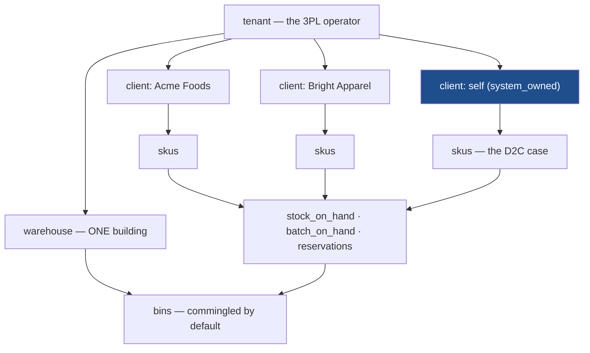
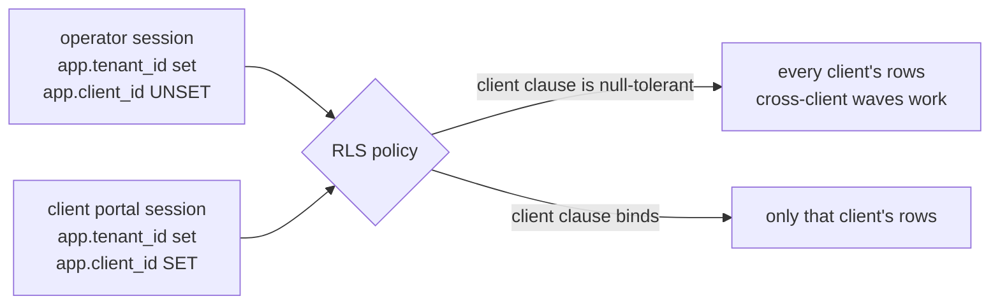
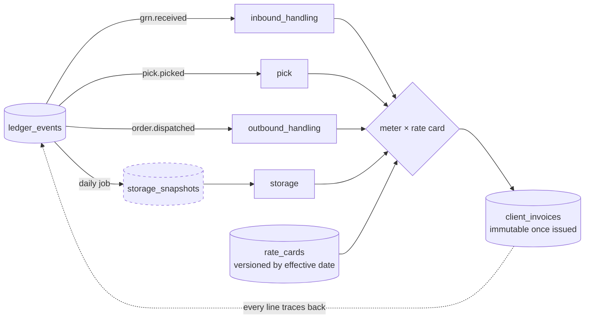
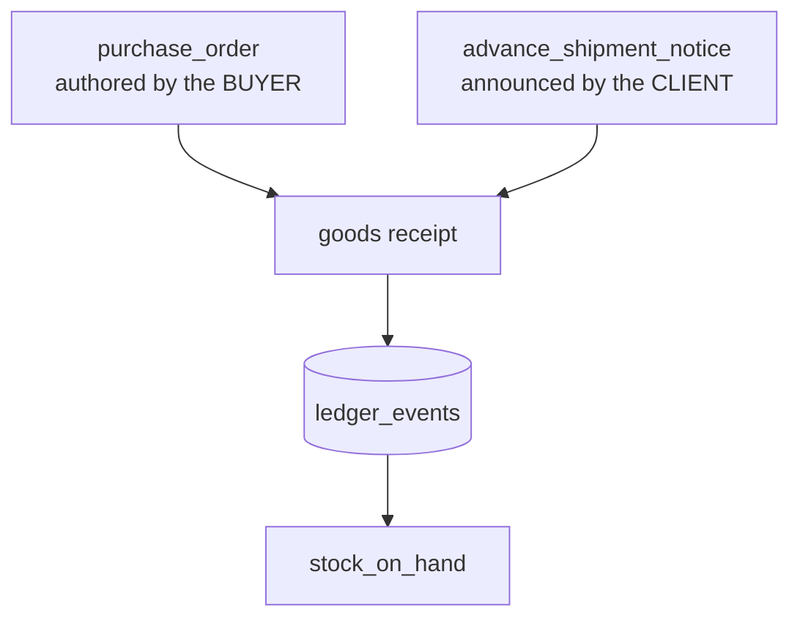

# Diagrams

Companion to `SPEC.md`. Per the spec convention, all diagrams live here rather than in the kernel.

## The client dimension: where it sits

**What the picture is saying:** clients sit *inside* one tenant and share the warehouse and the bins. That sharing is the point — a 3PL's efficiency comes from one operator walking one route for two clients. D2C is the same shape with a single system-owned client, which is why no code branches on "3PL mode" (AD-23).

## Isolation: one policy, two session shapes

The same policy serves both. An operator leaves `app.client_id` unset and the clause is satisfied trivially; a portal session sets it and the database makes other clients unreachable — below every surface, query, report and export at once (AD-24).

## Billing: aggregation, never a second book

Three of the four charges are aggregations over events that already exist. **Storage is the exception** — it needs duration, so a daily snapshot stands in, drawn dashed because it is a rebuildable projection and not a source of truth (AD-25).

The dotted return arrow is the requirement the whole design serves: **every invoice line traces back to the events that produced it.** Billing a client is easy; defending the bill is the hard part.

## Inbound: the ASN sits beside the PO

An ASN is a second *reference document* for the same receiving flow, not a second flow. Partial, blind and over-receipt handling are unchanged (CAP-9) — the only difference is who authored the expectation.
