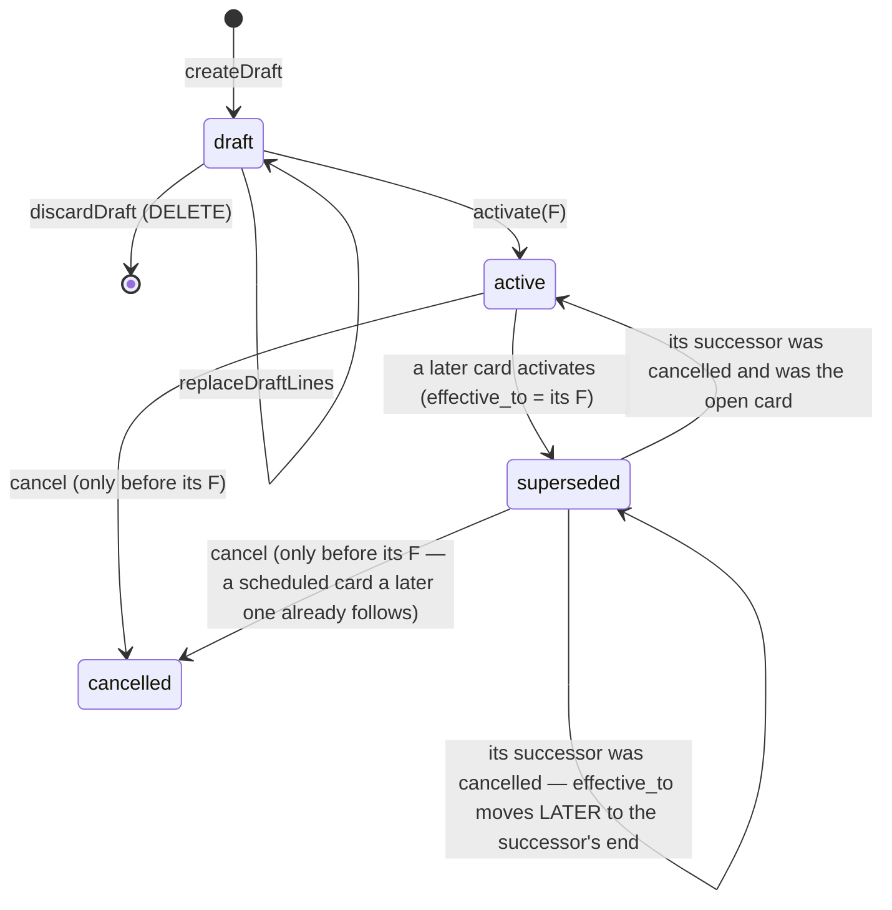
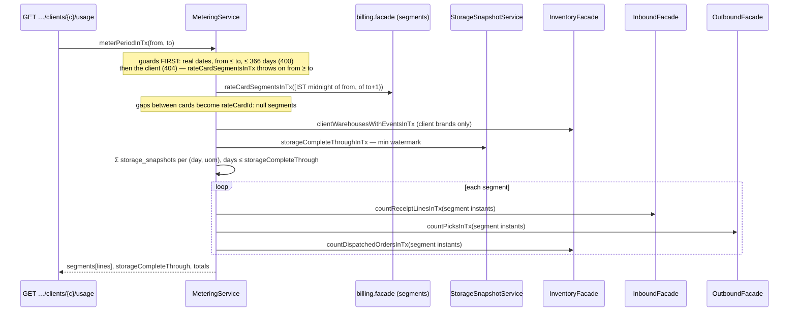
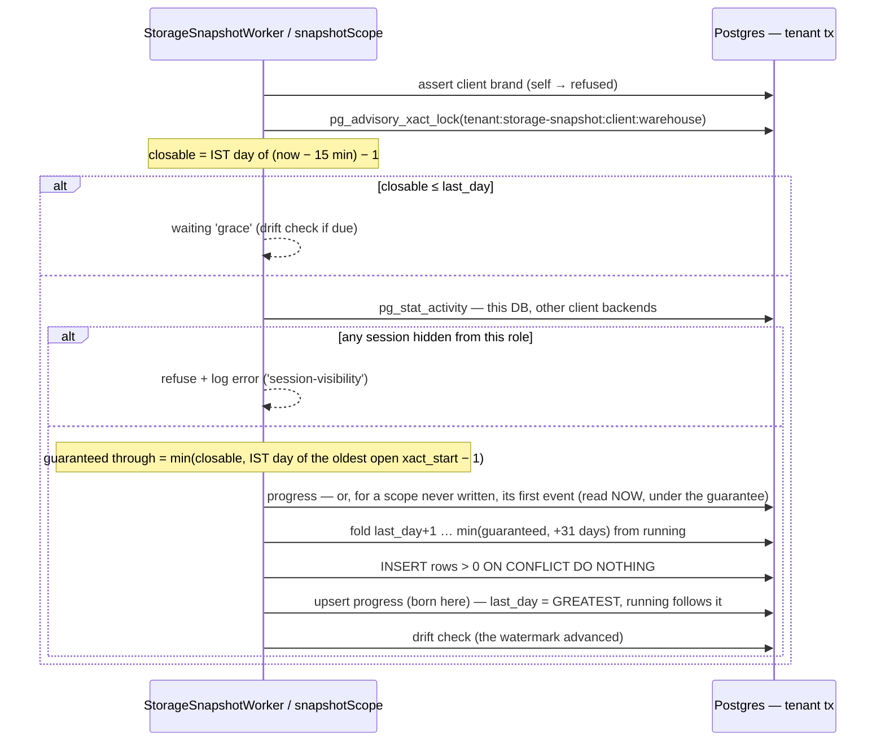

# Billing module

> What a 3PL charges each client brand, and from when (FR-77, CAP-4), and how much each one used (FR-78, CAP-5, CAP-6). Story 21-3 stands the module up with **rate cards**; story 21-4 adds **metering** and the **daily storage snapshots**; story 21-5 adds **client invoices** — a monthly services (SAC) GST tax invoice per client brand and supplying GSTIN, frozen at issue. Billing is a projection over the ledger (AD-25): it reads, prices and records — it **writes no stock**.

Paths are relative to `workspace/core/backend/wms-be`. Read [`../IMPLEMENTATION-GUIDE.md`](../IMPLEMENTATION-GUIDE.md) first — the command skeleton, the migration checklist and the vocabulary pattern are assumed here, not repeated. The client entity is [`clients.md`](clients.md).

---

## Owns

| Table | Holds | Key invariants (all in `drizzle/0060_rate_cards.sql`) |
|---|---|---|
| `rate_cards` | One card of one client: `status`, `effective_from`, `effective_to`, the create / activate / cancel stamps | `status` ∈ `draft \| active \| superseded \| cancelled`. Both dates are **IST midnights** (`mod(epoch + 19800, 86400) = 0`). `effective_to > effective_from`. draft ⇔ `effective_from` null ⇔ `activated_at` null; superseded ⇔ `effective_to` set; cancelled ⇔ `cancelled_at` set. Partial unique `rate_cards_one_open_per_client` — one `active` card with no `effective_to` per `(tenant_id, client_id)`. Index `(tenant_id, client_id, effective_from)` |
| `rate_card_lines` | One priced charge: `charge_code`, `basis`, `amount_paise`, stamped with the card's `tenant_id` + `client_id` | `charge_code` ∈ `storage \| inbound_handling \| pick \| outbound_handling`; `basis` ∈ `per_thousand_units_per_day \| per_receipt_line \| per_pick \| per_order`; the **pair** CHECK (each charge on exactly one basis); `amount_paise` 0..10,000,000 (₹1 lakh), GST-exclusive; `UNIQUE (rate_card_id, charge_code)` |

| `storage_snapshots` (21-4) | One client brand's closing stock in one warehouse on one IST day, per SKU base UoM: `snapshot_date`, `uom`, `on_hand_milli` | `on_hand_milli > 0` (a zero day has no row — the watermark says it was measured); `UNIQUE (tenant_id, client_id, warehouse_id, snapshot_date, uom)`. Written once by the job, never rewritten by it (the rebuild script is the only other writer). `drizzle/0061_storage_snapshots.sql` |
| `client_invoices` (21-5) | One invoice of one client brand for one IST calendar month under one supplying GSTIN: `status`, `supplier_gstin` (the group key), `place_of_supply` / `supply_type`, the number (`invoice_no`, `fy_label`, `series_seq`), the totals (`subtotal`, `cgst`, `sgst`, `igst`, `tax`, `total`, `round_off`, `payable` paise), `gaps` / `warnings` / `party` (jsonb), `content_hash`, `replaces_invoice_id`, the issue and status stamps, `status_note` | `drizzle/0062_client_invoices.sql`. `status` ∈ `draft \| issued \| disputed \| settled \| void`; the period is the 1st to the month's last day; the 0054-style totals CHECKs (`subtotal + tax = total`, `cgst + sgst + igst = tax`, `payable = total + round_off`, `payable % 100 = 0`, `round_off ∈ [−49, 50]`); draft ⇔ no number ⇔ never issued; a non-draft row carries no gap; dispute/void carry a note. **Partial unique `client_invoices_one_live_per_group`** on `(tenant, client, period_start, coalesce(supplier_gstin, ''))` WHERE `status <> 'void'`; unique `(tenant, supplier_gstin, invoice_no)` |
| `client_invoice_lines` (21-5) | One metered `(segment, charge, uom)` with quantity > 0 — unique `client_invoice_lines_invoice_segment_charge_uom_unique (invoice_id, segment_from, charge_code, coalesce(uom, ''))`: `rate_card_id`, `segment_from/to` (IST midnights), `charge_code`, `basis`, `uom`, `quantity` (bigint — milli-unit-days for storage, a count otherwise), `unit_amount_paise`, `amount_paise` (taxable), `sac_code`, `gst_bps`, `place_of_supply`, `supply_type`, `cgst/sgst/igst_paise` | The charge/basis pair CHECK; `(basis = per_thousand_units_per_day) = (uom IS NOT NULL)`; priced together and only by a card (rate, unit and amount null on a draft only); the tax split follows the supply type; SAC is six digits |
| `client_invoice_series` (21-5) | `(tenant, supplier_gstin, fy_label)` → `last_seq` — the services series, never interleaved with invoicing's goods `invoice_series` | full unique on the triple; advanced only under the row's `FOR UPDATE` |
| `storage_snapshot_progress` (21-4) | One row per (client, warehouse) scope: `last_day` (the watermark), `running` (jsonb uom → milli at the end of `last_day`), `drift_checked_on` (the IST day the drift check last ran) | `PK (tenant_id, client_id, warehouse_id)`; born only when the scope's first day is written under the commit guarantee; `last_day` only moves forward (`GREATEST` in the upsert). Indexes for metering: `storage_snapshots (tenant_id, client_id, snapshot_date)` and `ledger_events (tenant_id, client_id, type, recorded_at)` |

Vocabularies: `src/modules/billing/rate-cards.ts` (`RATE_CARD_STATUSES`, `CHARGE_CODES`, `RATE_BASES`, `CHARGE_BASIS`, `BASIS_COUNTING_UNIT`), pinned against the CHECKs by `test/rate-cards.spec.ts`, which also inserts **every** charge × basis combination (4 admitted, 12 refused).

RLS: **read-scoped, write operator-only.** Each rate-card and snapshot table has a `FOR SELECT` policy with the AD-24 client clause (a portal session reads only its own client's cards and lines) and `FOR INSERT` / `FOR UPDATE` / `FOR DELETE` policies that require `app.client_id` to be **unset** — a client never edits its own price list, not even its own rows (split per command because a `FOR ALL` WITH CHECK does not cover DELETE). A portal session's card INSERT is refused `42501`; its line INSERT is refused by the freeze trigger first (`P0001` — the parent lookup cannot see the card); its UPDATE/DELETE bind zero rows. Pinned in `test/client-isolation.spec.ts` (`STAMPED_TABLES`, `READ_ONLY_CLIENT_TABLES`, policy count 80 → **88** with 0061, whose two tables carry exactly the same four-policy shape). No FKs.

**Client invoices (0062)** follow the same four-policy shape with two differences: `client_invoices`' read clause is `client_id = app.client_id AND status <> 'draft'` — a portal session never sees a draft — and `client_invoice_lines` has no client column, so its read clause is an `EXISTS` on the parent (which runs under the parent's own policy: a line is visible exactly when its invoice is). `client_invoice_series` has one tenant policy that also requires `app.client_id` unset. Policy count 88 → **97**.

`test/architecture.spec.ts` pins: only `src/modules/billing` writes (or even names) the seven tables; billing writes no stock, ledger, client, SKU or order table and reaches the client entity only through `clients.facade.ts`; nobody outside the api shell imports billing past `billing.facade` / `billing.module` / `rate-cards`; and (21-4) **billing never names `ledgerEvents`, `picks` or `goodsReceipt*`, nor reads `ledger_events` / `picks` / `goods_receipt_*` in raw SQL** — every count is a facade read on the module that owns the table.

## The lifecycle



- **A card is drafted, then activated from an IST date, then frozen.** A rate change is a *new* card from a later date, never an edit.
- **In force at `t`**: the `active` or `superseded` card with `effective_from ≤ t < coalesce(effective_to, ∞)`. At most one per client by construction. A `cancelled` card is never in force; a draft has no date.
- **"Scheduled"** is not a status — it is a dated card (`active`, or `superseded` by a later card) whose `effective_from` is still ahead. Any scheduled card can be cancelled (decision 3).
- **Multiple drafts per client are allowed**; they do not interact until one is activated.

### Commands (`rate-card.command.ts`, all `rates.manage` — owner + accountant)

The house skeleton on every one: normalise + hash before the tx → authority → replay → locks → replay again under the lock → state guards → write → audit → idempotency key last. The **time rules sit behind the replay lookup** on `rateCardClock.now()` (an exported object the suite moves across IST midnight to prove a committed activation still replays).

| Command | Hash | Locks | Guards (in order) | Writes / audit |
|---|---|---|---|---|
| `createDraft` | `{tenantId, clientId, lines}` (lines sorted by `CHARGE_CODES`) | — | client exists (404) → not `self` (400 `validation-failed`) → `active` (409 `client-not-active`) → lines valid (400) | card + lines; `rate_card.drafted` |
| `replaceDraftLines` | `{tenantId, cardId, lines}` | the card row | 404 → `draft` (409 `rate-card-not-draft`) → lines valid | delete + insert lines, bump `updated_at`; `rate_card.lines-replaced` |
| `discardDraft` | `{arm:'discard', tenantId, cardId}` | the card row | 404 → `draft` (409) | delete lines, then the card; `rate_card.discarded`. 204; a replay under the same key 204; a repeat under a new key 404 (the channels disconnect precedent) |
| `activate` | `{tenantId, cardId, effectiveFrom}` | **the client row, then every card of the client** (by id) | `draft` (409) → client not `self` / `active` → **F ≥ today (IST)** with no `active`/`superseded` card, else **F ≥ tomorrow** (400 `rate-card-effective-date`, naming the earliest) → **F > every non-cancelled card's `effective_from`** (409 `rate-card-effective-overlap`) → ≥ 1 line (409 `rate-card-no-lines`) | the open card → `superseded`, `effective_to = F` (**first**), then the card → `active`; `rate_card.superseded` on the old, `rate_card.activated` on the new. A 23505 on the open-card index → 409 `conflict` |
| `cancel` | `{arm:'cancel', tenantId, cardId}` | the client row, then every card | `active` or `superseded`, and `effective_from > now` (409 `rate-card-not-cancellable`) | the card → `cancelled`, its window cleared (**first** — while it is the open one the predecessor cannot reopen), then its **predecessor** (the `superseded` card whose `effective_to` = its `effective_from`) **inherits its end**: the cancelled card was open → predecessor `active`, `effective_to` null; it was followed by a later card → predecessor stays `superseded`, `effective_to` moved later to that card's date (A → B → C, cancel B ⇒ A runs to C). No predecessor (a client's first card) ⇒ nothing is in force from that date. `rate_card.cancelled` / `rate_card.reopened` |

**Why the client-row lock.** Two activations of one client must serialise, and the *loser* must be judged against the *winner* (the matrix's concurrent row: same date → one 200, one 409 overlap). Locking the client row (`lockClientInTx`, `clients.facade.ts` — a lock, never a write) and then every card serialises every dated transition of that client. Replace/discard lock only their own card; nothing locks a card before the client row, so there is no cycle.

**Why tomorrow at the earliest for a replacement.** The boundary is an IST midnight; a replacement "from today" would reprice hours already passed (and anything already metered). A first card may start today — nothing was priced before it.

**Why an IST-midnight `timestamptz`, not a `date`.** Lookups are by instant (an event's time). The e-way thresholds store an IST `date` because their lookup key is a date; rate cards store the instant the date begins. The wire carries `YYYY-MM-DD` both ways (`istMidnightOf` / `istDateOf`, `shared/primitives/time.ts`).

## Frozen after activation — the triggers

A non-draft card and its lines never change except through the three transitions. The database enforces it, not just the command:

- `rate_cards_frozen` (BEFORE UPDATE OR DELETE): identity columns (`id`, `tenant_id`, `client_id`, `created_by`, `created_at`) never change; a draft may stay a draft or become `active`; a non-draft may only do **active → superseded** (`effective_to` null → set), **active|superseded → cancelled** (cancel stamps null → set, `effective_to` → null), and for a cancelled card's predecessor **superseded → active** (`effective_to` → null) or **superseded → superseded** with `effective_to` moved strictly **later** — in each, every column except `status`, `effective_to`, the cancel stamps and `updated_at` must be `IS NOT DISTINCT FROM` its old value. Only a draft is ever deleted, and only once its lines are gone (no orphan lines). **Time is not checked here** — "cancel only before its date" is the command's rule on the command's clock.
- `rate_card_lines_frozen` (BEFORE INSERT OR UPDATE OR DELETE): the **old and the new** parent must be a draft (an UPDATE re-pointing a line is two parents), read `FOR SHARE` so a concurrent activation serialises against the line write; a new line must carry its card's tenant and client. A missing parent reads as not-a-draft (fail closed — including under a portal RLS session that cannot see the parent).
- `*_no_truncate`: TRUNCATE is refused on both tables (the ledger 0006 precedent).

**Test teardown** deletes under `session_replication_role = replica` (the `eway.spec.ts` idiom); never TRUNCATE.

## The read seam (`billing.facade.ts`)

| Read | Contract |
|---|---|
| `BillingFacade.listRateCards(t, client)` | 404 unknown/foreign client; the newest 100 drafts first (`MAX_DRAFT_LIST`), then **every** dated card by `effective_from DESC` — a dated card is never dropped by a bound |
| `BillingFacade.getRateCard(t, id)` / `getRateCardInTx` | 404 unknown/foreign |
| `rateCardInForceInTx(tx, t, client, instant)` | the card in force or `null`; an unknown/foreign client → 404 (never a silent "not billed"); `instant` parsed by the strict UTC parser (`assertUtcIso` — `Z` only) and bound normalised; > 1 match throws a loud internal `Error` (never a silent pick) |
| **`rateCardSegmentsInTx(tx, t, client, from, to)`** | `[{card, lines, from, to}]` — every `active`/`superseded` card overlapping `[from, to)`, **clipped** to the period and ordered by time. A gap yields no segment (that stretch is not billed). `from ≥ to` throws. **This is 21-5's input**: decision 5 records the card on each invoice line, so a mid-period change splits the line |

`RateCardSnapshot` carries `effectiveFromAt` / `effectiveToAt` (the instants) for facade callers; the API's `RateCardDto` drops them and carries only the IST dates.

## The bases and what one unit counts

`BASIS_COUNTING_UNIT` (21-3) states the unit; 21-4's metering counts it (below), because the 3PL design named the wrong events:

| Basis | One unit is | Not |
|---|---|---|
| `per_thousand_units_per_day` | the client's daily on-hand in base milli-units ÷ 1,000,000 (₹ per 1,000 SKU **base units** per day, decision 1) | pallets / bins (no pallet concept exists — PENDING) |
| `per_receipt_line` | a distinct GRN line received | `grn.received` events — the ledger re-emits one on an over-receipt **approval** |
| `per_pick` | a distinct picklist line picked | `pick.picked` events — one per batch arm or serial |
| `per_order` | a distinct order dispatched | `dispatch.dispatched` events — one per order **line** |

**Rounding and overflow (21-4).** An amount ≤ 10,000,000 paise × a milli-unit count can pass 2⁵³, so metering multiplies in **BigInt** and rounds **once per line, half up** with `divideRoundHalfUp` (moved from `invoicing/arith.ts` to `shared/primitives/money.ts`; invoicing re-exports it unchanged). Storage never sums unlike base units: each base UoM is its own line (21-4 decision 1).

## Metering (story 21-4)

`metering.ts` — `MeteringService.meterPeriodInTx(tx, tenant, client, fromDate, toDate)`, IST dates **inclusive**; `BillingFacade.meterPeriod` opens the transaction. 21-5's client invoice consumes it; the web shows it as an estimate.



**The result.** `{segments: [{rateCardId | null, fromDate, toDate, lines: [{chargeCode, basis, uom | null, quantity: string, ratePaise | null, amountPaise | null}]}], storageCompleteThrough: string | null, totals: {billedPaise, unbilledLines}}`. One line per **(segment, charge, uom)**, summed across warehouses: storage one line per base UoM (or a single `uom: null`, `"0"` line when nothing was measured in the stretch), then `inbound_handling`, `pick`, `outbound_handling`. A charge the card does not price, or a stretch with no card, keeps its quantity with a **null** rate and amount (₹0 is different — billed at zero).

**The counting units and their instants** — each count has ONE predicate function on the owning facade, which 21-5's dispute drill-down reuses:

| Charge | Counts | Instant | Predicate |
|---|---|---|---|
| storage | Σ of the daily snapshots (base milli-units at the end of each IST day), per base UoM, across warehouses, only days ≤ `storageCompleteThrough` | the snapshot's IST day; day `D` priced by the card in force at `istMidnightOf(D)` | (the snapshot fold — below) |
| `inbound_handling` | every GRN line of the client's SKUs — **including** one whose excess was later rejected as an over-receipt (the unloading happened); the approval's re-emitted `grn.received` writes no second line | the GRN's `recorded_at` | `InboundFacade` — `receiptLinesPredicate` (`inbound.facade.ts`) |
| `pick` | `picks` rows (one per picklist line — `picks_line_unique`); a zero-unit short pick writes none; transfers create none | `picks.created_at` (the pick transaction's start, the server clock) | `OutboundFacade` — `picksPredicate` (`outbound.facade.ts`) |
| `outbound_handling` | distinct orders, each attributed to its **FIRST** `dispatch.dispatched` event (one is emitted per order LINE, and lines can dispatch on different days — an order straddling a card boundary or a period end counts once, where it first shipped), by the event's `client_id` — an order never mixes clients (21-2b) | the first dispatch event's `recorded_at` | `InventoryFacade` — `dispatchedOrderEventsPredicate` (`client-metering.ts`; on inventory because outbound reads no ledger) |

**Pricing.** Storage `Σ milli-unit-days × rate ÷ 1,000,000`; the rest `count × rate`; BigInt, rounded once half up; an amount past 2⁵³ throws loudly. **Quantities travel as decimal strings** — storage as base-unit-days to three decimals (`"1234.567"`), counts as whole numbers.

**Segments are IST-midnight-aligned** because cards begin at IST midnights, so a storage day lies wholly inside one segment and "priced by the card in force at the start of `D`" is just "the segment it falls in"; the counts split at the same instant (a GRN at 23:59:59.999 IST belongs to the earlier card, one at 00:00 to the later).

**`storageCompleteThrough`** is the minimum `last_day` across the client's (warehouse) scopes; a scope with events but no progress row counts as "the day before its first event". `null` = not measured: the tenant's own `self` client (decision 4 — never snapshotted), or a client brand with no ledger events at all. Each segment carries **`storageMeasuredThrough`** (≤ its `toDate`, or null); a storage line in a segment with unmeasured days carries the measured days' quantity but a **null amount** and is left out of `billedPaise` — never a ₹0 for days not yet measured. An amount past 2⁵³ is a typed `422 metering-amount-out-of-range`. The handling counts run to now regardless; the web labels a period that runs past today "in progress". **The route refuses a client-portal session** (a user carrying a `client_id`) with `403 role-denied`.

It freezes nothing and stores nothing. **21-5 must meter a period only after its end plus the commit guarantee** (`storageCompleteThrough ≥ period end`), and store its own output.

## Daily storage snapshots (story 21-4)

`storage-snapshot.ts` — `StorageSnapshotService`; `BillingFacade.snapshotScope / verifySnapshots / rebuildSnapshots / snapshotScopesOf`.

### The fold rule

On-hand per (client, warehouse) at instant `T` is the **ledger fold** over events with `recorded_at < T` — the ledger's own replay rule (`foldLedgerInTx`): an event counts **`+|δ|` when it has only a destination bin, `−|δ|` when it has only a source bin, 0 otherwise.** It holds for every registered type without naming one: relocations (putaway, bin merge, QC hold/release, the transfer outbound leg, a same-warehouse inbound leg) net to zero; `pick.picked` draws; `pack.packed`, `dispatch.dispatched`, `excursion.recorded` count nothing; a cross-warehouse inbound leg is a draw on the source chain and an intake on the destination's. Grouped by `ledger_events.client_id` (the event's stamp) and by the SKU's immutable `uom`. So **stock leaves storage when it is picked** (decision 2): received on the 10th, picked on the 18th ⇒ stored the 10th–17th. `test/metering.spec.ts` classifies every registered type's arm shapes and fails when a new type is registered unclassified.

`InventoryFacade.clientOnHandFoldByDayInTx(tx, scope, fromInstant | null, toInstant)` returns per (IST day, uom) the net delta — **one grouped query** on 0061's `(tenant_id, client_id, warehouse_id, recorded_at)` index; the snapshot carries a running total forward.

### One tick of one scope



### The commit guarantee

`recorded_at` is the app clock, stamped **before** the per-warehouse advisory lock, and nothing bounds a transaction's length — so an event stamped before `T` can commit long after `T`, and a fixed wait proves nothing. Day `D` (ended by `T`) is written only when both hold *(renegotiated by the human, 2026-10-07 — spec Change Log)*:

- **(a)** `now ≥ T + 15 min` — `SNAPSHOT_GRACE_MS`, a clock-skew margin;
- **(b)** **no session in `pg_stat_activity` has an open transaction with `xact_start < T`** — this database, client backends, excluding the job's own backend.

Every ledger, GRN and pick stamp is taken inside a transaction that began no later than the stamp, so (b) proves every event stamped before `T` has committed or rolled back — **whether or not it has an xid yet** — and it covers the **handling counts** (receipt lines, picks, dispatched orders) as well as storage. The probe runs **before** any read the fold depends on: a transaction not open at the probe has finished, and every later statement (READ COMMITTED) sees it. One call writes every day the oldest open transaction does not hold back (`guaranteed through = IST day of its xact_start − 1`).

**Session visibility is a deploy requirement.** If the job's role cannot see another session's transaction (an `<insufficient privilege>` row in `pg_stat_activity`), it **refuses to write and logs an error** (`STORAGE SNAPSHOT REFUSED …`, `waiting: 'session-visibility'`) — it never guesses. Keep **all app connections on one database role**, or grant the job's role **`pg_read_all_stats`**.

**The first watermark is born under the guarantee.** A scope never written has no progress row; its first day (its first event's) is read only after the guarantee holds, and the progress row is created with the first written day — so an event stamped before the scope's first *visible* event that commits later still gets its days.

Rows are written **once** (`ON CONFLICT DO NOTHING`) and the job never rewrites them. The watermark only moves forward (`GREATEST`); `running` follows it. A call folds **at most 31 days**, so a backfill advances a month per tick.

### The drift check, verify and rebuild

**Cadence: once per IST day per scope, or whenever the watermark advances** (`drift_checked_on`). It (1) re-folds the **last 7 written days** from the stored closing value of the day before them and diffs `(day, uom, value)` against the rows, and (2) the **genesis-sum check**: the full fold to the end of the watermark's day equals the stored `running` total — catching a wrong baseline the window cannot see. A mismatch means an event committed after its day was written — which the guarantee forbids — so it is **logged as an error** (`STORAGE SNAPSHOT DRIFT …`) and returned (`kind: 'row' | 'running'`), never silently corrected.

`verifySnapshotsInTx` — a dry run **under the scope lock** (a concurrent tick never reads as drift): re-fold from genesis through the watermark, diff the whole stored set (set equality on key + value; ids and `created_at` differ by construction) and the running total. `rebuildScopeInTx` — under the scope lock: delete the scope's rows, re-fold from genesis through the **existing** watermark, insert, reset `running` (the next tick folds from the rebuilt total).

### The worker

`StorageSnapshotWorker` (`src/jobs/jobs.module.ts`), env-gated by **`STORAGE_SNAPSHOT_POLL_MS`** (unset or 0 = off). Each tick: every tenant (cross-tenant, BYPASSRLS read) → `BillingFacade.snapshotScopesOf(tenant)` (non-`self` clients × the warehouses they have events in, an EXISTS probe per pair — a tenant with no client brand yields none) → one `snapshotScope` per scope in its own tenant transaction. A **rotating window** caps a tick at `MAX_STORAGE_SNAPSHOT_SCOPES_PER_TICK` (200) without starving the tail; a failing tenant or scope is logged and retried next tick; single-flight in-process; two instances are safe (the scope lock + `GREATEST`).

### Runbook

- **Enable** — set `STORAGE_SNAPSHOT_POLL_MS` (e.g. `300000`) on one or more job instances. With it off, every client brand's usage reads "Storage not measured yet" and no period's storage completes. **The job's role must see every app session** (one role for all app connections, or `pg_read_all_stats`): otherwise every scope logs `STORAGE SNAPSHOT REFUSED` and nothing is written.
- **A long transaction holds days back** — an open transaction that began before a day's end blocks that day (and later ones) for every scope until it finishes; an idle-in-transaction session stalls the job. Find it with `select pid, xact_start, state, query from pg_stat_activity where xact_start is not null order by xact_start`.
- **Backfill pace** — a scope with history starts at its first event and advances 31 days per tick: a year of history settles in ~12 ticks per scope; the 200-scopes-per-tick window rotates, each tick starting where the last stopped.
- **Drift cadence** — checked once per IST day per scope, or when its watermark advances.
- **Drift** — an error log `STORAGE SNAPSHOT DRIFT` names the client, warehouse and the first differing (day, uom). Verify, then rebuild:
  `bun scripts/rebuild-storage-snapshots.ts --tenant <uuid> --client <uuid> --warehouse <uuid>` (dry run; exit 0 clean, 1 drift, 2 error) and the same with `--write` (rebuilds under the scope lock, then re-verifies; prints `driftBefore` and `driftAfter` separately). The `self` client is refused.

### Facade reads metering uses (AD-6)

| Read | Owner | Contract |
|---|---|---|
| `clientOnHandFoldByDayInTx(tx, scope, from \| null, to)` | inventory | per (IST day, uom) net delta under the fold rule, `[from, to)` on `recorded_at`, BigInt |
| `clientWarehousesWithEventsInTx(tx, tenant, clientIds)` | inventory | `(client, warehouse)` pairs with any event — EXISTS on the `(tenant, client, warehouse, recorded_at)` index; the ids bound as one `uuid[]` parameter |
| `clientOnHandAtInTx(tx, scope, to)` | inventory | per-uom on-hand at an instant, from genesis — the drift check's genesis sum |
| `firstEventInstantInTx(tx, scope)` | inventory | earliest `recorded_at`, or null |
| `countDispatchedOrdersInTx(tx, scope, from, to)` | inventory | distinct orders FIRST dispatched in the window (`dispatchedOrderEventsPredicate` — window events with no earlier dispatch of the same order; the `(tenant, client, type, recorded_at)` index + 0039's orderId index) |
| `countReceiptLinesInTx(tx, scope, from, to)` | inbound | GRN lines (`receiptLinesPredicate`) |
| `countPicksInTx(tx, scope, from, to)` | outbound | picks rows (`picksPredicate`) |

## Client invoices (story 21-5)

`client-invoices.ts` — `ClientInvoiceService` (the commands and the reads) and the pure `computeClientInvoiceDraft`. A 3PL bills each client brand monthly for storage and handling with a **services tax invoice** (SAC, not HSN): one per (client, IST calendar month, **supplying GSTIN**), numbered in its own series, frozen at issue. Mutations need **`billing.invoice`** (owner + accountant — and it also gates the client tax-details write); reads are member-open, and a client-portal session is refused 403.

### The groups (decision 2)

Every tenant warehouse goes into exactly one group keyed by `warehouses.gstin ?? tenants.gstin` (a null key is one group that cannot issue — `supplier-gstin-missing`). Each group is metered over **all of its warehouses** with 21-4's `meterPeriodInTx(…, {warehouseIds})`: the storage scopes and sum, and the three count predicates take the list (`shared/db/warehouse-filter.ts` — `and <column> = any($ids::uuid[])`, absent = the 21-4 SQL byte for byte). The order count's "no earlier dispatch" probe stays tenant-wide, so an order is still attributed to its first dispatch. **The sum over a partition of the warehouses equals the unfiltered meter, charge by charge** (pinned in `test/client-invoices.spec.ts`). The narrowed read's own `storageCompleteThrough` (the minimum over the group's scopes) is **not** what the gap reads — see `storage-not-complete` below.

### The draft (`computeClientInvoiceDraft`, pure)

- **Lines** — one per metered `(segment, charge, uom)` with quantity > 0, in the order `(segment_from, CHARGE_CODES rank, uom — null first)`. Storage quantity is the metered base-unit-days as exact milli-unit-days (BigInt). `rate_card_id` is the segment's card; a no-card segment or a charge the card does not price, or a storage line in a not-fully-measured segment, is **unpriced** (rate, unit and amount null).
- **SAC and rate (decision 4)** — `SAC_BY_CHARGE`: storage `996729`, the three handling charges `996719`; every line at 1,800 bps — frozen onto the line.
- **Place of supply (decision 5)** — IGST Act s.12(2): the client GSTIN's state, else its billing state code; stored **per line**. Supply is `intra` when the supplier GSTIN's prefix equals it, `inter` otherwise, null (no tax) when either side is unknown.
- **Tax** — `computeLineTax(1000, amount, 1800, supplyType)` per line (`shared/primitives/gst.ts` — taxable = amount; tax half up; CGST the floor half, the odd paisa to SGST); totals are sums of rounded lines, `assertInvoiceTotals`, then `roundToRupee` for `payable` / `round_off`.
- **The party** — supplier: the tenant's name, the group GSTIN and its state (code + official name from `InvoicingFacade.gstStateResolverInTx`), and the `origin_*` address of the **lowest-code warehouse of the group with a full address** (decision 6); recipient: the client's code, name, legal name, GSTIN, state and billing address. A draft stores the party computed live; issue re-stamps it (equal by the hash) — the printed invoice reads only the stored party.
- **Gaps** (block issue, in this order): `supplier-gstin-missing`, `supplier-address-missing`, `client-legal-name-missing`, `client-billing-address-missing` (line 1, city, state code, pincode), `storage-not-complete` (the **client's** `storageCompleteThrough` — the unfiltered watermark, `MeteringService.clientStorageCompleteThroughInTx` — is short of the month's last day; the snapshot commit guarantee also proves the counts complete. *Code review C1:* not the group's — a group with counts but no stock events, e.g. a receipt rejected in full, has no snapshot scope and would never issue), `line-unpriced` (per line, with `segmentFrom`; **none for storage lines while `storage-not-complete` fires**), `einvoice-required` (the GSTIN's e-invoicing flag — `InvoicingFacade.eInvoiceAppliesInTx` — and a registered client). **Warnings** never block: `supplier-state-differs` (a group warehouse whose origin state resolves to another state than the GSTIN's).
- **The content hash (v1)** — sha256 over canonical JSON (keys sorted at every depth, bigint columns as decimal strings, lines in the canonical order, `"v": 1`) of everything the issued row stores **except** ids (the invoice's, the lines', the client's, the replaced invoice's), timestamps, status and lifecycle fields (number, FY, stamps, note). The rate card that priced a line IS content.

### The flows

```mermaid
sequenceDiagram
  participant W as /compliance (owner, accountant)
  participant S as ClientInvoiceService
  participant C as clients.facade
  participant T as tenancy (supplier facts)
  participant M as MeteringService
  participant I as InvoicingFacade
  W->>S: POST clients/{c}/invoices {month}
  S->>S: billing.invoice → replay → month shape (400)
  S->>C: lockClientInTx (404) → replay under lock
  S->>S: self → 409 client-not-billable; month not ended (clock) → 409 period-not-ended
  S->>T: clientInvoiceSupplierFactsInTx → groups by GSTIN
  loop each group
    S->>M: meterPeriodInTx(month, {warehouseIds})
    S->>I: eInvoiceAppliesInTx(gstin), gstStateResolverInTx
    S->>S: computeClientInvoiceDraft
    alt a live invoice covers the group
      S-->>S: existing[]
    else usage and none live
      S->>S: insert draft (+ replaces = latest unreplaced void), lines, audit
    end
  end
  S-->>W: 201 {created, existing} — or 409 nothing-to-invoice when no group has usage
  W->>S: POST client-invoices/{id}/issue (a NEW key per click)
  S->>C: lock the client, then the invoice row; status draft (409 invoice-not-draft)
  S->>M: re-meter → recompute the draft
  alt hash ≠ stored
    S->>S: store the fresh draft, audit, key — COMMIT
    S-->>W: 200 {outcome: stale, invoice} (no number used)
  else gaps
    S-->>W: 409 invoice-has-gaps {gaps}
  else
    S->>S: series row ON CONFLICT → FOR UPDATE → seq; formatServiceInvoiceNo
    S->>S: stamp issued_at/by, fy_label = fyLabelFor(issued_at), party; audit; key
    S-->>W: 200 {outcome: issued, invoice}
  end
```

### Commands (`ClientInvoiceService`, all `billing.invoice`)

| Command | Hash | Locks | Guards (in order) | Writes / audit |
|---|---|---|---|---|
| `prepare` | `{arm:'prepare', tenantId, clientId, month}` | the client row | month `YYYY-MM` (400) → client exists (404) → not `self` (409 `client-not-billable`) → the month has ended on `clientInvoiceClock` (409 `period-not-ended`) → some group has usage (409 `nothing-to-invoice`) | drafts + lines; `client_invoice.prepared` per draft; 23505 on the live index → 409 `invoice-exists` |
| `refresh` | `{arm:'refresh', …, invoiceId}` | the client row, then the invoice | draft (409 `invoice-not-draft`) | lines rewritten and row updated only when the hash moved; `client_invoice.refreshed` |
| `issue` | `{arm:'issue', …}` | the client row, then the invoice | draft → hash equal (else **200 stale, committed**) → no gap (409 `invoice-has-gaps`, `gaps` extension) → ≥ 1 line (409 `nothing-to-invoice`) | number, stamps, party; `client_invoice.issued` |
| `discard` | `{arm:'discard', …}` | the invoice | draft (409) | lines, then the row; `client_invoice.discarded`; 204 (a replay 204, a new key 404) |
| `transition` (dispute / settle / void) | `{arm:verb, …, note}` | the invoice | note required for dispute/void, ≤ 500 (400, **above the tx** — request shape) → `issued → disputed \| settled \| void`, `disputed → settled \| void` (409 `invoice-transition-invalid`) | status, `status_note` (the transition's OWN note, or null — a settle never inherits the dispute's reason), the stamps; `client_invoice.disputed\|settled\|voided` with `reference = "note: … (key …)"` — the audit keeps every note |

**Lock order:** client row → invoice row. Discard and the transitions lock only the invoice; nothing locks an invoice before its client, so there is no cycle. **The clock:** `clientInvoiceClock` (the `rateCardClock` precedent) decides "has the month ended" and the issue instant — the FY of the number is `fyLabelFor(issued_at)`, so a March invoice issued in April numbers in the next FY's series.

### Frozen at issue — the triggers (0062, the 0060 precedent)

- `client_invoices_frozen` (BEFORE UPDATE OR DELETE): the identity (id, tenant, client, period, supplying GSTIN, replaces, creator) never changes; a draft stays a draft or becomes `issued` — which needs the number, GSTIN and stamp, **refuses while any line is unpriced or has no place of supply**, and requires **at least one line, header subtotal / CGST / SGST / IGST equal to the lines' sums, and a non-empty `party`** (code review); a non-draft row never returns to draft and only moves `issued → disputed|settled|void`, `disputed → settled|void`, with a fresh `status_changed_at` and (dispute/void) a note — every other column compared as `to_jsonb(NEW) - [status columns] = to_jsonb(OLD) - […]`, so a column added later is frozen too. Only a draft is deleted, and only once its lines are gone.
- `client_invoice_lines_frozen`: the old and new parent must be a draft (read `FOR SHARE`; missing or invisible = not a draft — fail closed), with the line's tenant.
- `*_no_truncate` on both.

### Printing — Rule 48(2)

A services tax invoice is issued **in duplicate** (CGST Rule 48(2)): the web's `PrintableClientInvoice` prints an issued (or disputed, or settled) invoice twice — "ORIGINAL FOR RECIPIENT" and "DUPLICATE FOR SUPPLIER", a page break before the second (the duplicate is paper-only); a draft or a void prints once. The copies are a rendering of the one stored invoice — nothing on the backend records which copy was handed over.

### Reads

`list(tenant, actor, {clientId?, status?, cursor?, limit 1–100})` — keyset on `(created_at, id)` newest first, `fullPrecisionInstant` cursors (400 `invalid-cursor`); entries carry `gapCount` and the totals. `get(tenant, actor, id)` — the invoice with its lines (quantities as decimal strings: base-unit-days for storage), gaps, warnings and party. Both refuse a portal session (a user with `client_id`) 403 `role-denied`.

### Facade reads client invoices use (AD-6)

| Read | Owner | Contract |
|---|---|---|
| `lockClientInTx`, `getClientInTx` | clients | the row lock, then the snapshot with `taxDetails` |
| `clientInvoiceSupplierFactsInTx` | tenancy | the tenant's name and GSTIN, every warehouse's code, GSTIN and raw `origin_*` columns, by code |
| `eInvoiceAppliesInTx`, `gstStateResolverInTx` | invoicing (`InvoicingFacade`) | the 8-2b per-GSTIN flag; the CBIC list as `nameOf(code)` / `codeOfText(text)` |
| `meterPeriodInTx(…, {warehouseIds})` | billing (21-4) | the group-narrowed metering read |

### Gotchas

- **Stale commits.** A stale issue is a 200 that WRITES (the fresh draft) and records the key; the web mints a new key per Issue click, or a retry would re-serve "stale" forever.
- **The hash moves with the party.** Editing a client's legal name after preparing makes the next issue answer `stale` — by design: the operator approves what they saw.
- **An empty draft** (a refresh after the usage vanished) cannot issue: 409 `nothing-to-invoice` — discard it.
- **`ArithmeticOverflowError` is one class.** The tax helpers moved to `shared/primitives/gst.ts` with the error class itself; `invoicing/arith.ts` and `generator.ts` re-export the same objects, so the invoicing delivery handlers still ack it as a data fault (pinned by identity in the suite).

## API

See [`../API-SURFACE.md`](../API-SURFACE.md) — `billing`. Reads are member-open (rate cards and **usage**, `GET /tenants/{t}/clients/{c}/usage?from=&to=` — 21-4; client invoices — 21-5, portal sessions refused); rate-card mutations need `rates.manage`, client-invoice mutations and the client tax details `billing.invoice`. The 21-7 portal must **not** reuse the usage route: it is an operator read of commercial terms.

## Gotchas

- **A replacement's minimum is tomorrow even when the existing card is only scheduled** (any `active`/`superseded` card counts as "dated"), and the new date must also be after every non-cancelled card's date — so a scheduled card must be cancelled before an *earlier* replacement can be activated.
- **Cancel finds the predecessor by date equality** — the `superseded` card whose `effective_to` equals the cancelled card's `effective_from`. The strictly increasing dates make it unique; it inherits the cancelled card's end.
- **`rate-cards.ts` does not re-export the tables.** It is a public file (siblings import the vocabularies); a re-export would let them read past the facade — `test/architecture.spec.ts` refuses any `rateCards`/`rateCardLines` identifier outside billing and the shared schema.
- **The self client never has a card**: `self` → 400 at draft and activate. A client brand with no card in force is **billed nothing** — the web shows a banner; ₹0 is different (billed at zero).
- **`rates.manage` is owner + accountant, not ops_manager** — it is neither owner-only nor an ops verb, so the FE mirror carries an explicit ops-excluded set (`OPS_EXCLUDED_CAPABILITIES`) rather than riding `OWNER_ONLY_CAPABILITIES`.
- **`istDateOf` / `isIsoDate` moved to `shared/primitives/time.ts`.** The invoicing module re-exports them; its `istDateOf` wraps the shared one to keep throwing `ArithmeticOverflowError` (the e-way delivery acks that type as a data fault).
- **(21-4) The commit guarantee is a session check, not a transaction-id proof** — a `pg_snapshot_xmax` proof misses a running transaction with a newer xid, and an own-xid proof misses a transaction that has stamped but holds no xid yet. `pg_stat_activity.xact_start` sees both; the price is session visibility (refuse when blind).
- **(21-4) `recorded_at` is the bucket, not `occurred_at`** — storage and every count use server stamps; a device's offline backlog lands on the day it reached the server. A cross-warehouse transfer's two inbound legs share **one** `recorded_at` (`transfer.command.ts`), so the units are in exactly one warehouse on every day.
- **(21-4) Transfers are not billed handling** — they create no picks and no dispatch events (PENDING).

