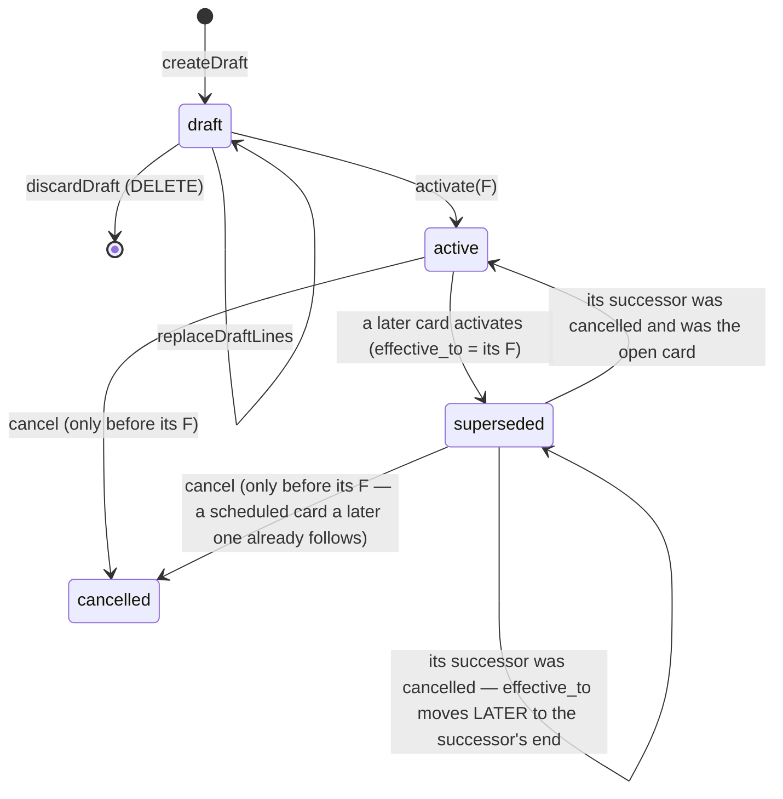

# Billing module

> What a 3PL charges each client brand, and from when (FR-77, CAP-4). Story 21-3 stands the module up with **rate cards**; metering (21-4) and client invoices (21-5) join it. Billing is a projection over the ledger (AD-25): it reads, prices and records — it **writes no stock**.

Paths are relative to `workspace/core/backend/wms-be`. Read [`../IMPLEMENTATION-GUIDE.md`](../IMPLEMENTATION-GUIDE.md) first — the command skeleton, the migration checklist and the vocabulary pattern are assumed here, not repeated. The client entity is [`clients.md`](clients.md).

---

## Owns

| Table | Holds | Key invariants (all in `drizzle/0060_rate_cards.sql`) |
|---|---|---|
| `rate_cards` | One card of one client: `status`, `effective_from`, `effective_to`, the create / activate / cancel stamps | `status` ∈ `draft \| active \| superseded \| cancelled`. Both dates are **IST midnights** (`mod(epoch + 19800, 86400) = 0`). `effective_to > effective_from`. draft ⇔ `effective_from` null ⇔ `activated_at` null; superseded ⇔ `effective_to` set; cancelled ⇔ `cancelled_at` set. Partial unique `rate_cards_one_open_per_client` — one `active` card with no `effective_to` per `(tenant_id, client_id)`. Index `(tenant_id, client_id, effective_from)` |
| `rate_card_lines` | One priced charge: `charge_code`, `basis`, `amount_paise`, stamped with the card's `tenant_id` + `client_id` | `charge_code` ∈ `storage \| inbound_handling \| pick \| outbound_handling`; `basis` ∈ `per_thousand_units_per_day \| per_receipt_line \| per_pick \| per_order`; the **pair** CHECK (each charge on exactly one basis); `amount_paise` 0..10,000,000 (₹1 lakh), GST-exclusive; `UNIQUE (rate_card_id, charge_code)` |

Vocabularies: `src/modules/billing/rate-cards.ts` (`RATE_CARD_STATUSES`, `CHARGE_CODES`, `RATE_BASES`, `CHARGE_BASIS`, `BASIS_COUNTING_UNIT`), pinned against the CHECKs by `test/rate-cards.spec.ts`, which also inserts **every** charge × basis combination (4 admitted, 12 refused).

RLS: **read-scoped, write operator-only.** Each table has a `FOR SELECT` policy with the AD-24 client clause (a portal session reads only its own client's cards and lines) and `FOR INSERT` / `FOR UPDATE` / `FOR DELETE` policies that require `app.client_id` to be **unset** — a client never edits its own price list, not even its own rows (split per command because a `FOR ALL` WITH CHECK does not cover DELETE). A portal session's card INSERT is refused `42501`; its line INSERT is refused by the freeze trigger first (`P0001` — the parent lookup cannot see the card); its UPDATE/DELETE bind zero rows. Pinned in `test/client-isolation.spec.ts` (`STAMPED_TABLES`, `READ_ONLY_CLIENT_TABLES`, policy count 80). No FKs.

`test/architecture.spec.ts` pins: only `src/modules/billing` writes the two tables; billing writes no stock, ledger, client, SKU or order table and reaches the client entity only through `clients.facade.ts`; nobody outside the api shell imports billing past `billing.facade` / `billing.module` / `rate-cards`.

## The lifecycle

- **A card is drafted, then activated from an IST date, then frozen.** A rate change is a *new* card from a later date, never an edit.
- **In force at `t`**: the `active` or `superseded` card with `effective_from ≤ t < coalesce(effective_to, ∞)`. At most one per client by construction. A `cancelled` card is never in force; a draft has no date.
- **"Scheduled"** is not a status — it is a dated card (`active`, or `superseded` by a later card) whose `effective_from` is still ahead. Any scheduled card can be cancelled (decision 3).
- **Multiple drafts per client are allowed**; they do not interact until one is activated.

### Commands (`rate-card.command.ts`, all `rates.manage` — owner + accountant)

The house skeleton on every one: normalise + hash before the tx → authority → replay → locks → replay again under the lock → state guards → write → audit → idempotency key last. The **time rules sit behind the replay lookup** on `rateCardClock.now()` (an exported object the suite moves across IST midnight to prove a committed activation still replays).

| Command | Hash | Locks | Guards (in order) | Writes / audit |
|---|---|---|---|---|
| `createDraft` | `{tenantId, clientId, lines}` (lines sorted by `CHARGE_CODES`) | — | client exists (404) → not `self` (400 `validation-failed`) → `active` (409 `client-not-active`) → lines valid (400) | card + lines; `rate_card.drafted` |
| `replaceDraftLines` | `{tenantId, cardId, lines}` | the card row | 404 → `draft` (409 `rate-card-not-draft`) → lines valid | delete + insert lines, bump `updated_at`; `rate_card.lines-replaced` |
| `discardDraft` | `{arm:'discard', tenantId, cardId}` | the card row | 404 → `draft` (409) | delete lines, then the card; `rate_card.discarded`. 204; a replay under the same key 204; a repeat under a new key 404 (the channels disconnect precedent) |
| `activate` | `{tenantId, cardId, effectiveFrom}` | **the client row, then every card of the client** (by id) | `draft` (409) → client not `self` / `active` → **F ≥ today (IST)** with no `active`/`superseded` card, else **F ≥ tomorrow** (400 `rate-card-effective-date`, naming the earliest) → **F > every non-cancelled card's `effective_from`** (409 `rate-card-effective-overlap`) → ≥ 1 line (409 `rate-card-no-lines`) | the open card → `superseded`, `effective_to = F` (**first**), then the card → `active`; `rate_card.superseded` on the old, `rate_card.activated` on the new. A 23505 on the open-card index → 409 `conflict` |
| `cancel` | `{arm:'cancel', tenantId, cardId}` | the client row, then every card | `active` or `superseded`, and `effective_from > now` (409 `rate-card-not-cancellable`) | the card → `cancelled`, its window cleared (**first** — while it is the open one the predecessor cannot reopen), then its **predecessor** (the `superseded` card whose `effective_to` = its `effective_from`) **inherits its end**: the cancelled card was open → predecessor `active`, `effective_to` null; it was followed by a later card → predecessor stays `superseded`, `effective_to` moved later to that card's date (A → B → C, cancel B ⇒ A runs to C). No predecessor (a client's first card) ⇒ nothing is in force from that date. `rate_card.cancelled` / `rate_card.reopened` |

**Why the client-row lock.** Two activations of one client must serialise, and the *loser* must be judged against the *winner* (the matrix's concurrent row: same date → one 200, one 409 overlap). Locking the client row (`lockClientInTx`, `clients.facade.ts` — a lock, never a write) and then every card serialises every dated transition of that client. Replace/discard lock only their own card; nothing locks a card before the client row, so there is no cycle.

**Why tomorrow at the earliest for a replacement.** The boundary is an IST midnight; a replacement "from today" would reprice hours already passed (and anything already metered). A first card may start today — nothing was priced before it.

**Why an IST-midnight `timestamptz`, not a `date`.** Lookups are by instant (an event's time). The e-way thresholds store an IST `date` because their lookup key is a date; rate cards store the instant the date begins. The wire carries `YYYY-MM-DD` both ways (`istMidnightOf` / `istDateOf`, `shared/primitives/time.ts`).

## Frozen after activation — the triggers

A non-draft card and its lines never change except through the three transitions. The database enforces it, not just the command:

- `rate_cards_frozen` (BEFORE UPDATE OR DELETE): identity columns (`id`, `tenant_id`, `client_id`, `created_by`, `created_at`) never change; a draft may stay a draft or become `active`; a non-draft may only do **active → superseded** (`effective_to` null → set), **active|superseded → cancelled** (cancel stamps null → set, `effective_to` → null), and for a cancelled card's predecessor **superseded → active** (`effective_to` → null) or **superseded → superseded** with `effective_to` moved strictly **later** — in each, every column except `status`, `effective_to`, the cancel stamps and `updated_at` must be `IS NOT DISTINCT FROM` its old value. Only a draft is ever deleted, and only once its lines are gone (no orphan lines). **Time is not checked here** — "cancel only before its date" is the command's rule on the command's clock.
- `rate_card_lines_frozen` (BEFORE INSERT OR UPDATE OR DELETE): the **old and the new** parent must be a draft (an UPDATE re-pointing a line is two parents), read `FOR SHARE` so a concurrent activation serialises against the line write; a new line must carry its card's tenant and client. A missing parent reads as not-a-draft (fail closed — including under a portal RLS session that cannot see the parent).
- `*_no_truncate`: TRUNCATE is refused on both tables (the ledger 0006 precedent).

**Test teardown** deletes under `session_replication_role = replica` (the `eway.spec.ts` idiom); never TRUNCATE.

## The read seam (`billing.facade.ts`)

| Read | Contract |
|---|---|
| `BillingFacade.listRateCards(t, client)` | 404 unknown/foreign client; the newest 100 drafts first (`MAX_DRAFT_LIST`), then **every** dated card by `effective_from DESC` — a dated card is never dropped by a bound |
| `BillingFacade.getRateCard(t, id)` / `getRateCardInTx` | 404 unknown/foreign |
| `rateCardInForceInTx(tx, t, client, instant)` | the card in force or `null`; an unknown/foreign client → 404 (never a silent "not billed"); `instant` parsed by the strict UTC parser (`assertUtcIso` — `Z` only) and bound normalised; > 1 match throws a loud internal `Error` (never a silent pick) |
| **`rateCardSegmentsInTx(tx, t, client, from, to)`** | `[{card, lines, from, to}]` — every `active`/`superseded` card overlapping `[from, to)`, **clipped** to the period and ordered by time. A gap yields no segment (that stretch is not billed). `from ≥ to` throws. **This is 21-5's input**: decision 5 records the card on each invoice line, so a mid-period change splits the line |

`RateCardSnapshot` carries `effectiveFromAt` / `effectiveToAt` (the instants) for facade callers; the API's `RateCardDto` drops them and carries only the IST dates.

## The bases and what one unit counts (for 21-4)

Nothing in 21-3 counts anything. `BASIS_COUNTING_UNIT` states the unit 21-4 must meter, because the 3PL design named the wrong events:

| Basis | One unit is | Not |
|---|---|---|
| `per_thousand_units_per_day` | the client's daily on-hand in base milli-units ÷ 1,000,000 (₹ per 1,000 SKU **base units** per day, decision 1) | pallets / bins (no pallet concept exists — PENDING) |
| `per_receipt_line` | a distinct GRN line received | `grn.received` events — the ledger re-emits one on an over-receipt **approval** |
| `per_pick` | a distinct picklist line picked | `pick.picked` events — one per batch arm or serial |
| `per_order` | a distinct order dispatched | `dispatch.dispatched` events — one per order **line** |

**Rounding and overflow belong to 21-4.** An amount ≤ 10,000,000 paise × a milli-unit count can pass 2⁵³; metering must multiply in BigInt and round once, per line, half-up (the `invoicing/arith.ts` discipline). Storage summing unlike base units (a `kg` SKU beside an `each` SKU) is an open question (PENDING).

## API (story 21-3)

See [`../API-SURFACE.md`](../API-SURFACE.md) — `billing`. Reads are member-open; mutations need `rates.manage`.

## Gotchas

- **A replacement's minimum is tomorrow even when the existing card is only scheduled** (any `active`/`superseded` card counts as "dated"), and the new date must also be after every non-cancelled card's date — so a scheduled card must be cancelled before an *earlier* replacement can be activated.
- **Cancel finds the predecessor by date equality** — the `superseded` card whose `effective_to` equals the cancelled card's `effective_from`. The strictly increasing dates make it unique; it inherits the cancelled card's end.
- **`rate-cards.ts` does not re-export the tables.** It is a public file (siblings import the vocabularies); a re-export would let them read past the facade — `test/architecture.spec.ts` refuses any `rateCards`/`rateCardLines` identifier outside billing and the shared schema.
- **The self client never has a card**: `self` → 400 at draft and activate. A client brand with no card in force is **billed nothing** — the web shows a banner; ₹0 is different (billed at zero).
- **`rates.manage` is owner + accountant, not ops_manager** — it is neither owner-only nor an ops verb, so the FE mirror carries an explicit ops-excluded set (`OPS_EXCLUDED_CAPABILITIES`) rather than riding `OWNER_ONLY_CAPABILITIES`.
- **`istDateOf` / `isIsoDate` moved to `shared/primitives/time.ts`.** The invoicing module re-exports them; its `istDateOf` wraps the shared one to keep throwing `ArithmeticOverflowError` (the e-way delivery acks that type as a data fault).
