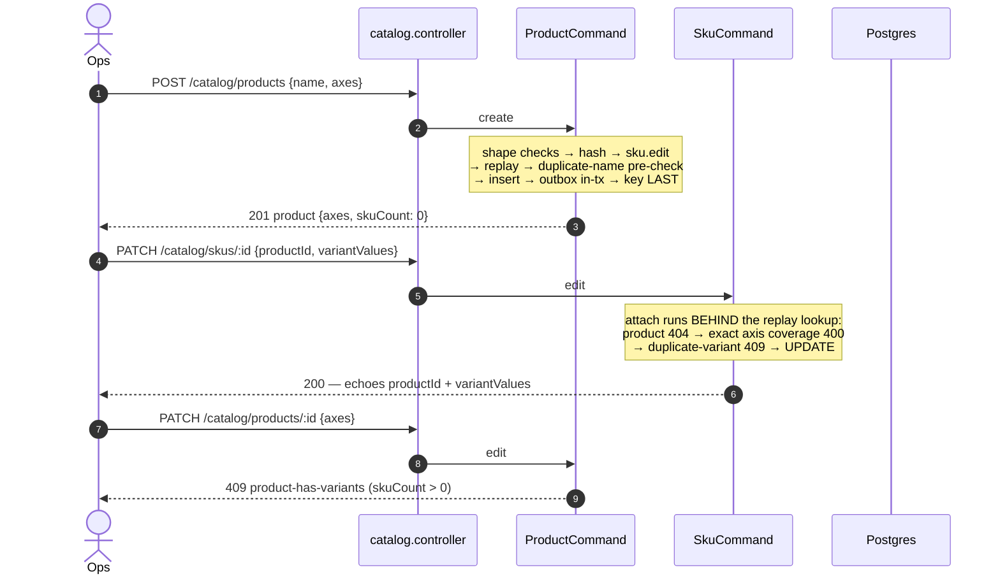
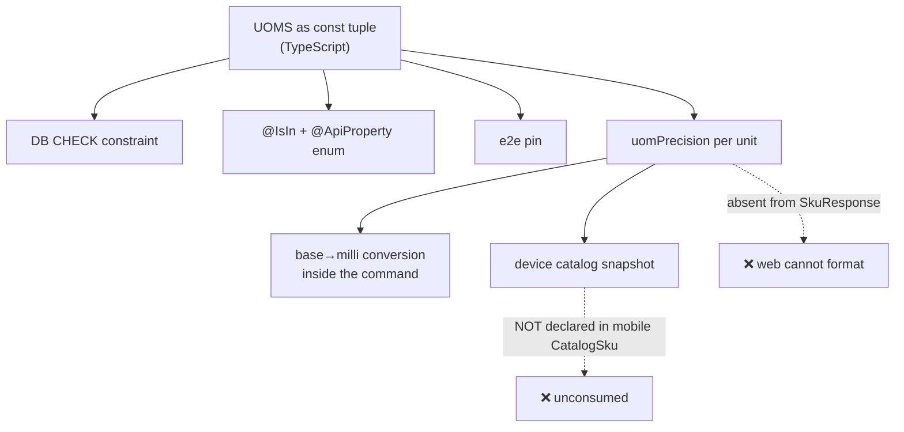

# Catalog module

> What a tenant sells and how it is counted: SKUs, the products that group them into variant ranges (11.3), the kit compositions that let a SKU sell as a bundle of other SKUs (11.4), the spreadsheet import that creates the SKUs, batch and serial identity, and the closed unit-of-measure vocabulary every quantity in the system is denominated in.

Paths are relative to `workspace/core/backend/wms-be`. Read [`../IMPLEMENTATION-GUIDE.md`](../IMPLEMENTATION-GUIDE.md) first — the command skeleton, the quantity/milli-unit boundary and the controlled-vocabulary pattern are assumed.

The module is small in code and large in blast radius: `uom.ts` decides how precise every quantity in the warehouse may be, and `CatalogFacade` is on the hot path of receiving, putaway, waving and picking.

---

## Owns

| Table | Holds | Key invariants |
|---|---|---|
| `products` (`src/shared/db/schema.ts`, `drizzle/0032_product_variants.sql`) | **Grouping identity only (AD-19, 11.3)**: `name` + declared `axes` (a jsonb array of 1–3 short names). No UoM, no tracking flags, no stock concept — a SKU remains every ledger event's unit | `products_tenant_id_name_unique` (the `skus.code` precedent). **No delete command**; **`axes` are immutable while any SKU is attached** (409 `product-has-variants`). `product_id` on `skus` is a bare uuid, **no FK** — the repo convention, validated in the command transaction |
| `skus` (`src/shared/db/schema.ts:272`) | Sellable units: code, name, base `uom`, GST bps, HSN, tracking flags, **static physical attributes (11.2)**, **variant identity (`product_id` + `variant_values`, 11.3)**, reorder defaults, barcode | `skus_tenant_id_code_unique` **and** `skus_tenant_id_barcode_unique`. `uom` is CHECK-constrained to the closed vocabulary (`skus_uom_check`, `drizzle/0027_uom_vocabulary.sql:351`). `reorder_point`/`reorder_qty` are `bigint` **milli-units**. `barcode` is NOT NULL — generated server-side as a uuidv7 when the file omits one. **`code` is immutable**; no create endpoint exists — SKUs enter through import only. `variant_values` pairs with `product_id` (both null or both set, the values a jsonb object) by the `skus_variant_values_pairing` CHECK (`0032`) |
| `uom_conversions` (`schema.ts:310`) | `factor` base units per alternate `uom`, per SKU | `uom_conversions_sku_id_uom_unique`; `factor` is a positive `integer`; target `uom` CHECK-constrained to the same vocabulary |
| `batches` (`schema.ts:344`) | Batch **identity** for batch-tracked SKUs: code, mfg/expiry dates, status | `batches_tenant_sku_code_unique`; `batches_status_check` ∈ {`active`,`blocked`} (`drizzle/0010_sharp_hardball.sql:71`). **No location or quantity column, by design** — those live in inventory's `batch_on_hand` |
| `serials` (`schema.ts:378`) | Serial **identity**: serial number, status | `serials_tenant_sku_serial_unique`; `serials_status_check`. **No location column** — a serial's location is derived from its latest `ledger_events` row |
| `kit_compositions` (`kit.store.ts` writes; `drizzle/0033_kit_compositions.sql`) | **Kit-ness (11.4, AD-19)**: one row per component of a kit SKU — `kit_sku_id` → `component_sku_id` × `qty` (per ONE kit, in the component's base-UoM milli-units). A kit **is** a SKU; kit-ness is the presence of rows, never a flag | `kit_compositions_tenant_kit_component_unique` (unique `(tenant, kit_sku_id, component_sku_id)`); `kit_compositions_qty_positive`; `kit_compositions_no_self` (row-local `kit_sku_id <> component_sku_id`) — all three hand-appended, migration-SQL-only. **No FKs** — bare uuids validated in the command transaction. **No delete command** (append-only philosophy) |
| `catalog_imports` (`schema.ts:410`) | One row per run: `mode`, committed/failed/skipped counts | The run ledger. Fix mode targets the **latest** row (`created_at` desc, `id` desc) |
| `catalog_import_errors` (`schema.ts:442`) | One row per rejected data row: `row_number`, `sku_code`, `reason_code`, `reason_detail` | The latest run's non-null `sku_code`s **are** the fix set |

`gst_rate_bps` is an integer in basis points (18% = 1800). There are no price or cost fields — a deliberate 1.4 boundary.

---

---

## Schema (field level)

### `products` (11.3)

| Column | Type | Null | Guard | Meaning |
|---|---|---|---|---|
| `name` | text | NO | `unique (tenant, name)` | The honest handle import and the UI use to reference the product; duplicate → 409 `duplicate-product-name` |
| `axes` | jsonb | NO | — | Array of 1–3 short axis names (`["size","colour"]`). **Presentation, not a normalised table** — the 11-6 matrix, 11-7 announcement and Epic 7 mapping all read the whole array. Element-wise immutable while attached |

There is **no delete command** (the append-only philosophy) and no per-axis value table.

### `skus` — the 11.3 variant columns

| Column | Type | Null | Guard | Meaning |
|---|---|---|---|---|
| `product_id` | uuid | **YES** | **No FK** — validated in the command transaction; `skus_product_id_idx` | The product this SKU is a variant of, or null when unattached (every pre-11.3 row) |
| `variant_values` | jsonb | **YES** | `skus_variant_values_pairing` CHECK (`0032`, migration-SQL-only — drizzle-orm 0.45 cannot model a CHECK) | Object keyed by the product's axes, `{"size":"M","colour":"Red"}`. Must cover the axes **exactly** — the command-side rule (`assertVariantValues`), the CHECK is the pairing backstop. Attach/detach happens **only** through the SKU edit PATCH (`hsn` template: absent = unchanged, `productId: null` = detach and clear values) |

### `kit_compositions` (11.4)

| Column | Type | Null | Guard | Meaning |
|---|---|---|---|---|
| `kit_sku_id` | uuid | NO | — (no FK) | The kit SKU — an ordinary `skus` row whose kit-ness is *derived from this table*, never stored on the SKU |
| `component_sku_id` | uuid | NO | `kit_compositions_no_self` (`0033`: `kit_sku_id <> component_sku_id`) | An ordinary, non-kit SKU (409 `kit-component-is-kit` refuses a kit as a component — the BOM is flat) |
| `qty` | bigint | NO | `kit_compositions_qty_positive` | Per **one** kit, in the component's base-UoM **milli-units** — 2 kg of a kg-component is `2000` |

`unique (tenant, kit_sku_id, component_sku_id)` is the duplicate-component backstop (409 `duplicate-kit-component` names the duplicate). **Every "is this a kit" question in the system is one SELECT on this table** — the import parser, the stock guards and the explosion all ask it through `getKitSkuIdsInTx`, and none of them consults a flag, because there is none.

### `skus` (the pre-11.3 columns)

| Column | Type | Null | Default | Guard | Meaning |
|---|---|---|---|---|---|
| `code` | text | NO | — | `unique (tenant, code)` | **Immutable after import** — `PatchSkuDto` has no `code` |
| `uom` | text | NO | — | `skus_uom_check` | One of 35 canonical units (10.2). **Also immutable** — no `uom` on the PATCH DTO, which is what makes the serial rule's `current.uom` read sound |
| `gst_rate_bps` | integer | NO | — | — | **Basis points, not a quantity** (18% = 1800) |
| `hsn` | text | **YES** | — | — | Goods classification. A 3PL would need SAC instead |
| `weight_grams` / `length_mm` / `width_mm` / `height_mm` | integer | **YES** | — | `skus_weight_grams_bounded`, `skus_{length,width,height}_mm_bounded` (all `0031`) | **Static physical attributes (11.2), WYSIWYG integers** — grams and millimetres, what carriers rate from. All `> 0`; `weight_grams` ≤ 1,000,000 (1 tonne), each dimension ≤ 10,000. **NOT the per-unit catch weight** — that lives on `handling_units.weightGrams` (10.3); the two answer different questions (what the SKU weighs vs what one physical unit weighed) and no backfill ever copies one to the other |
| `country_of_origin` | text | **YES** | — | `skus_country_of_origin_iso_alpha2` (`0031`) | ISO 3166-1 alpha-2 uppercase (`^[A-Z]{2}$`) |
| `batch_tracked` / `serial_tracked` | boolean | NO | `false` | — | **Both true is refused at pick** until story 14-1 |
| `reorder_point` / `reorder_qty` | bigint `mode:'number'` | NO | `0` | — | **Milli-units** — UoM-denominated, so 10.1 scaled them. Policy thresholds, not stock |
| `barcode` | text | NO | — | `unique (tenant, barcode)` | Collision → `409 duplicate-barcode` naming the conflicting SKU |

### `uom_conversions`
`sku_id` · `uom` text NOT NULL, guarded by **`uom_conversions_uom_check`** (`0027:352`) — a *separate* constraint from `skus_uom_check` (`0027:351`) with the same value list, so **widening one without the other is a live bug the shared naming hides** · `factor` **integer** NOT NULL. `unique (sku_id, uom)`.
**`factor` is an integer nothing multiplies by** — stored at import, echoed back, never applied. Fractional conversions wait for the story that first applies one.

### `batches`
`sku_id` · `code` (`unique (tenant, sku, code)`) · `mfg_date` / `expiry_date` timestamptz **nullable** · `status` text NOT NULL default `'active'` (`batches_status_check`).
**`expiry_date` drives FEFO** — which is why FEFO ordering lives outside inventory, in outbound and the api layer.
**Blocked status is unenforced on the draw side** (epic-2 retro a13).

### `serials`
`sku_id` · `serial_number` (`unique (tenant, sku, serial_number)`) · `status` (`serials_status_check`).
**No location column, by design** — a serial's location is derived from its latest `ledger_events` row via the `(tenant_id, serial_ref, seq)` index. The ledger is the only source of serial location and history.

### `catalog_imports`
`mode` text NOT NULL (`initial \| fix`) · `committed_rows` / `failed_rows` / `skipped_rows` integer NOT NULL — **counts, not quantities**, deliberately unscaled.

### `catalog_import_errors`
`import_id` · `row_number` integer NOT NULL · `sku_code` text **nullable** (null when the row failed before a code could be read) · `reason_code` NOT NULL · `reason_detail` NOT NULL.
**Durable error rows are what make fix mode possible** — it reprocesses the previous run's failed SKU codes. `reason_code` has **no DB CHECK**, so a new row-level arm needs no migration.

---

## Public seam

`CatalogModule` exports `CatalogFacade` only (`catalog.module.ts:32`). `ImportCommand` and `SkuCommand` are reachable only through this module's controller.

**`CatalogFacade`** (`catalog.facade.ts:98`):

| Method | Returns / does | Called by |
|---|---|---|
| `getImportSummary(tenantId)` `:101` | `{skuCount, lastImport}` | Tenancy's setup checklist |
| `findSku(tenantId, skuId)` `:138` | Identity + tracking flags, or `null` | Any module needing a 404 check before acting on a SKU |
| `getSkuSummaries(tenantId)` `:160` / `getSkuSummariesInTx(tx, …)` `:177` | The device catalog snapshot's scan identity: code, name, barcode, `uom`, **`uomPrecision`**, tracking flags | The api shell's device snapshot |
| `getBatches(tenantId, skuId)` `:198` | Batch identities, code-ordered | Inventory read surfaces |
| `getBatchesForSkusInTx(tx, tenantId, skuIds)` `:223` | Batch identities for a set, in the caller's tx | Outbound's wave planner (the FEFO half) |
| `findBatch` `:249` / `findSerial` `:275` | Identity + `skuId`, or `null` | Detail routes' 404 checks |
| `ensureBatches(tenantId, skuId, inputs)` `:307` / `ensureBatchesInTx` `:318` | Idempotent identity creation | Inbound's GRN command, stock adjustment |
| `ensureSerials(tenantId, skuId, serialNumbers)` `:371` | Idempotent identity creation | Same |
| `getKitCompositionInTx(tx, tenantId, kitSkuId)` `:457` | The composition rows (component sku id + milli-qty), **in the caller's tx** — the flat-BOM explosion read | Outbound's `createOrder` (11.4) |
| `getKitSkuIdsInTx(tx, tenantId, skuIds)` `:466` | The subset of the given ids that are kits, **in the caller's tx** — the batch "is a kit" answer | Inbound's GRN submit + over-receipt **approve** arm, inventory's `stock.adjust`, and the kit command's own `assertComponentsAreNotKits` |

**`uom.ts` file-level functions** are imported directly by anything that needs the vocabulary: `resolveUom`, `uomPrecision`, `isFractionalUom`, `serialTrackedFractionalUomDetail`, `unknownUomDetail`, plus the `UOMS` tuple (consumed by `catalog.dto.ts` for the OpenAPI enum).

**The `…InTx` pairing is not a convenience.** `getSkuSummariesInTx` exists because the device catalog snapshot composes SKUs, bins, putaway tasks and pick tasks and must do so on **one** connection: a nested `withTenantTransaction` reserves a second pooled connection while the first is held, and postgres.js queues connection requests with no timeout — concurrent snapshots then wait on each other forever. `catalog.facade.ts:166-176` records that this endpoint deadlocked once already.

---

## Flows

### CSV import — the only creator of SKUs

```mermaid
sequenceDiagram
  autonumber
  actor Ops
  participant Ctl as catalog.controller
  participant Cmd as import.command
  participant PG as Postgres

  Ops->>Ctl: POST /catalog/imports (multipart)
  Ctl->>Cmd: run(file)
  Cmd->>Cmd: PARSE the file  (import.command.ts:166-169)
  Cmd->>Cmd: assertPermission('catalog.import')  (:170)
  Note over Cmd: ⚠ INVERTED — parse precedes authority.<br/>An unauthorised caller drives a 5 MB parse<br/>and learns parse outcomes. Verified; tracked.
  loop each row
    alt valid
      Cmd->>PG: insert sku
    else
      Cmd->>Cmd: collect row failure
    end
  end
  Cmd-->>Ops: 201 — carrying PER-ROW failures
  Note over Cmd: PARTIAL COMMIT IS THE DESIGN.<br/>Row codes: validation-failed,<br/>duplicate-sku-code, duplicate-barcode
  Ops->>Ctl: POST again with mode=fix
  Note over Cmd: reprocesses ONLY the prior run's failures
```

There is no `POST /skus`. `code` and `uom` are immutable once written — a SKU's UoM is baked into every milli-unit quantity already stored against it, so changing it would silently reinterpret history.

### Products and variants (11.3)



The variant identity has exactly **one** write path per side: products are created/edited by `ProductCommand` (create + edit keyed by idempotency, the `createOrder` replay convention), and SKUs attach/detach/re-value through the **existing SKU edit PATCH** — no second write path. Import gains optional `product` / `variant_values` columns that **reference** an existing product by name (import never creates products — auto-declaring axes from the first CSV row's keys would make product identity an implicit side effect); a missing name is a row error, the uom-vocabulary refusal shape. Duplicate variants (two SKUs of one product carrying identical values) are refused in both paths via the sorted-keys `variantValuesFingerprint` — key-order independent, which is why it matches Postgres's semantic jsonb equality.

### Kits — the only door into kit-ness, and the never-independent-stock guards (11.4)

```mermaid
sequenceDiagram
  autonumber
  actor Ops
  participant Ctl as catalog.controller
  participant KCmd as KitCommand
  participant O as outbound (createOrder)
  participant PG as Postgres
  Ops->>Ctl: POST /catalog/skus/:skuId/kit {components: [{skuId, qty}]}
  Ctl->>KCmd: create
  Note over KCmd: shape checks → hash → sku.edit → replay<br/>→ lock kit + component sku rows .for('update') id-ordered<br/>→ kit-sku-holds-stock (no on-hand, no live reservation)<br/>→ already-composed / self-reference / component-is-kit / duplicate<br/>→ INSERT rows → outbox in-tx → key LAST
  KCmd-->>Ops: 201 {kit} — kit_compositions rows exist, kit-ness begins
  Ops->>Ctl: PUT /catalog/skus/:skuId/kit (full component array)
  Note over KCmd: replace — DELETE + re-INSERT in one tx;<br/>PUT on a NON-kit is 404 (create is the only door)
  KCmd-->>Ops: 200 {kit}
  Ops->>O: createOrder with a kit line
  Note over O: phase 1 resolves the composition via getKitCompositionInTx<br/>and explodes the kit line into child order lines<br/>(parent_line_id), each reserving its component —<br/>the parent line itself holds nothing
```

Three doors the stock system closes at once — **a kit never holds independent stock (FR-38)**, so every +stock writer refuses a kit SKU with 409 `kit-cannot-hold-stock` naming it: the GRN submit (`receiving.command.ts`), `stock.adjust` (sign-agnostic — a kit refuses a negative delta as much as a positive one), and the over-receipt **approve** arm, which is a third +stock writer because a pending excess applies as a fresh `grn.received` delta at *decision* time, days after the GRN's own kit check ran (the row stays `pending` for a human reject). The create side is the mirror: a SKU that already carries on-hand stock or a live (`held`/`committed`) reservation cannot become a kit — 409 `kit-sku-holds-stock` — because every stock writer would then refuse it forever, stranding the stock and its ATP with no write-off path.

**The race between a GRN and kit creation is closed by row locks, not timestamps.** Both commands take `.for('update')` on the same sku rows in id order — `receiving.loadSkus` orders by `skus.id` precisely so the lock order matches the kit command's `lockSkus` — so whichever commits first, the loser decides against committed state: a GRN that commits first makes the kit-create guard answer `kit-sku-holds-stock`; a kit-create that commits first makes the GRN's kit check answer `kit-cannot-hold-stock`.

**The CSV import is a second door into kit-ness (11.6), wearing the same guards.** Its `kit_components` column parses syntactically per row (the `uom_conversions` cell grammar) but resolves **after all SKU rows commit**, so a component may be an earlier row of the same file; per-kit it re-runs the KitCommand's guards (`kit-sku-holds-stock`, `kit-already-composed`, `kit-self-reference`, `kit-component-is-kit`, precision-validated component quantities) and emits `catalog.kit_created` through the same `kitEventPayload` builder. A refused kit cell leaves its SKU committed — the counts overlap — and only the PUT route retries a composition, never fix mode (see the row-validation section).

### The UoM vocabulary and its precision



**Replacing this vocabulary must be a superset operation, asserted at module load.** 10.2 replaced a 57-entry allowlist with a 24-entry one and silently made eleven units unrepresentable; any stored row using one would have aborted the migration. `uom_conversions.factor` remains an integer nothing applies — it is stored, echoed, and never used in arithmetic, so fractional conversions (kg↔lb) wait for the story that first applies one.

---

## Commands

### `ProductCommand.create / edit / list` (`product.command.ts`, 11.3)

Create and edit run the `createOrder` replay convention exactly: shape checks → `hashCommandPayload` → `assertPermission('sku.edit')` (deliberately no new capability — the story ships no FE surface beyond the regenerated client, so a new capability would fail the FE capability-mirror guard) → replay lookup → duplicate-name pre-check + unique-index backstop (409 `duplicate-product-name`) → insert/update → `catalog.product_created` / `catalog.product_edited` in-transaction → idempotency key LAST. An empty product PATCH is its own code, 400 `empty-product-edit`.

`edit` loads the product `for('update')` and refuses an axes change while any SKU is attached (409 `product-has-variants`, element-wise comparison — a reordered array is a different declaration, not the same one). `name` is always editable.

`list` is a read (open to any tenant member — reads are never gated), keyset-paged on `(created_at, id)`; each item's `skuCount` is stitched from ONE grouped count query over the page's product ids, never an N+1.

### `KitCommand.create / put / list` (`kit.command.ts`, 11.4)

The kit commands attach a composition to an **existing** SKU — the CSV import is still the only creator of SKUs, so a kit begins as an ordinary imported SKU. One body DTO, `PutKitDto`, serves both mutating routes; the edit method is `put` (replace semantics), not `edit`.

Both mutations run the `createOrder` replay convention: shape checks → `hashCommandPayload` → `assertPermission('sku.edit')` (deliberately no new capability — the story ships no FE surface beyond the regenerated client, the 11.3 precedent) → replay → **`lockSkus` takes `.for('update')` on the kit SKU row and every component SKU row, ordered by id** (this is what closes the concurrent mutual-composition cycle: two creates of A∋B and B∋A both see the other component as not-yet-a-kit under read committed, and the id-ordered row locks serialize them so the loser re-reads committed state and refuses 409 `kit-component-is-kit`) → the composition guards → write → `catalog.kit_created` / `catalog.kit_edited` in-transaction → key LAST.

Guards, in the order they actually run:

1. **Shape** — `assertComponents` (each qty > 0, milli-units of the component's base UoM) and the in-command duplicate check (409 `duplicate-kit-component` — the BOM is a set, not a list). An **empty array is deliberately left to the command**, not the DTO: `PutKitDto` carries no `@ArrayMinSize`, so the empty array reaches the guard and answers the named 400 `empty-kit-composition` on both routes instead of a generic edge-validation failure.
2. **Replay**, then **the sku row locks** (`lockSkus`, id-ordered) — which also carry the 404s: an unknown kit or component SKU is refused at the lock, before any guard sees it.
3. **Create only:** `assertNotKitInTx` (409 `kit-already-composed`), then `assertKitSkuHoldsNoStock` — 409 `kit-sku-holds-stock` when the SKU has `stock_on_hand > 0` or a live (`held`/`committed`) reservation. Decided against the locked kit row, so it answers committed state.
4. **PUT's own door:** replace is an edit of an existing kit — the in-transaction check that `kit_compositions` already has a row for the kit 404s a non-kit SKU rather than silently entering kit-ness; **create is the only door**.
5. `assertSelfReference` (400 `kit-self-reference`) → `assertComponentsAreNotKits` (409 `kit-component-is-kit`, via `getKitSkuIdsInTx`) → quantity conversion behind the locks.

**Replace is DELETE + re-INSERT in one transaction** (`replaceComposition`), inserting in the caller's component order — the snapshot and the event carry the BOM the operator named, and the `(kit, component)` uniqueness backstops the set property. There is no delete command: a composition cannot be removed once created (append-only philosophy).

`list` is a read, keyset-paged on the kit SKU's `(created_at, id)` — the `sku.list` shape; each kit's components are stitched from ONE joined query over the page's kit ids, never an N+1.

### `ImportCommand.execute` (`import.command.ts:151`)

The one command in the repo with **partial commit**: a 201 can carry failures.

Guards, in the order they actually run:

1. **Size cap** `:152` — `> 5 MB` → 422 `import-too-large`. (Multer also caps at the same constant and its 413 is translated by `CatalogUploadFilter`, `catalog.controller.ts:72-84`.)
2. **Parse** `:155` — format sniffed by extension then mimetype; anything else → 415. Header contract, row cap and blank-row filtering all happen here (see Key algorithms). **This runs before the capability check** — see Gotchas.
3. Payload hash over `{sha256(file bytes), mode}` `:159` — never the parsed rows.
4. `assertPermission(…, 'catalog.import')` `:170`.
5. Replay lookup `:175`.
6. Fix-set resolution (fix mode only) `:212-231`.
7. Per-row validation, then duplicate detection.
8. Bulk insert of valid rows, chunked at 2,000.

Writes: `skus`, `uom_conversions`, `kit_compositions` (11.6 — the kit resolution pass), `catalog_imports`, `catalog_import_errors`, `idempotency_keys`. Emits `catalog.imported` with the counts, plus one `catalog.kit_created` per composition the kit pass created (11.6 — the same `kitEventPayload` builder KitCommand uses).

Response = idempotency snapshot = `{importId, mode, committedRows, failedRows, skippedRows, errors[]}`.

### `SkuCommand.edit` (`sku.command.ts:181`)

PATCH-only; `code` and `uom` are not editable.

Guards: empty-body check `:202` → hash over the **base-unit** field values `:226` → `sku.edit` capability `:238` → replay `:247` → SKU exists in tenant (404) `:270` → **attribute bounds (`assertSkuAttributes`, 11.2 — behind the replay lookup, the 10.2 rule)** `:279` → **the 11.3 attach/detach/re-value block (also behind the replay lookup)** → serial-tracking × fractional-UoM refusal `:297` → quantity precision conversion `:354-366` → barcode uniqueness pre-check (409 `duplicate-barcode` naming the conflicting SKU) `:378` → UPDATE.

The five physical attributes (`weightGrams`/`lengthMm`/`widthMm`/`heightMm`/`countryOfOrigin`) and the two variant fields (`productId`/`variantValues`, 11.3) are **optional PATCH fields**: absent = unchanged, `null` = cleared (the `hsn` template). Because the payload hash is a spread over the fields, an omitted key drops out of the JSON — **pre-11.2 and pre-11.3 idempotency keys still replay 200** (no hash break, unlike 11.1's fixed-key-position addresses).

The 11.3 block, behind the replay lookup with the SKU row in hand: `productId: null` detaches and clears the values (a `variantValues` key riding a detach is refused — a mistake, not a silent drop) → attach resolves the product (404 `not-found`) and requires the values → `assertVariantValues` (the ONE shared validator, also called by the import parser: exact axis coverage, non-empty ≤ 64-char string values — a missing key, unknown key, blank or non-string value is 400 naming `variantValues` and the axis) → the duplicate-variant check in-transaction (409 `duplicate-variant-values`). A values-only patch re-values against the SKU's **current** attachment.

Emits `catalog.sku_edited` `{skuId, code}`.

### `SkuCommand.list` (`sku.command.ts:116`)

A read, open to any tenant member. Page + conversions in **one** tenant transaction (`:133-158`); conversions are fetched for the page's SKUs only and stitched in memory.

### `CatalogFacade.ensureBatches` / `ensureSerials`

Not idempotency-keyed commands — identity creation. Both: fail-closed tracked-flag check (404 unknown SKU, 400 non-tracked SKU, `:409-438`) → dedupe the input → `insert … onConflictDoNothing` → **re-select as the source of truth** → return aligned to the caller's input order.

**Ensure is creation, never edit.** An existing batch keeps its original `mfgDate`/`expiryDate`; a retry with different dates rewrites nothing (`:296-298`, `:332-334`).

---

## Key algorithms

### Partial commit

The import's whole point: valid rows land, bad rows are reported, and there is no all-or-nothing rollback. Mechanically:

- Every row is validated into either `valid` or `errors` (`:242-253`). No exception escapes a row — `validateRow` returns a tagged result.
- Duplicate detection then filters `valid` into `insertable`, pushing one error per rejected row (`:255-277`).
- `committedRows = insertable.length`, `failedRows = errors.length`, and **both the SKU inserts and the error rows commit in the same transaction** as the `catalog_imports` run row and the idempotency record.

So a failure list is durable evidence, not a transient response body — which is what makes fix mode possible.

The only things that abort the whole run are file-level: too large, unparseable, unsupported type, no data rows, or a unique-violation race against a concurrent import (`:302-318`).

### Row validation order (`validateRow`, `import.command.ts:746`)

Shape first, one error per row, **first failure wins**: `sku_code` present/≤64 → `name` present/≤200 → `uom` present/≤32 → **`uom` resolves in the vocabulary** → `gst_rate` integer 0–10000 → `hsn` ≤32 → `batch_tracked` → `serial_tracked` → **serial × fractional-UoM refusal** → `catch_weight_tracked` → **catch weight × serial refusal** → `reorder_point` → `reorder_qty` → `barcode` ≤64 → **the physical attributes (11.2)**: `weight_grams`/`length_mm`/`width_mm`/`height_mm` parse via `parseAttributeNumber` (`:966` — blank → null, the `^\d+(\.\d+)?$` grammar which ADMITS the decimal shape; only a minus sign or a non-numeric spelling is a row error naming the CSV column) and `country_of_origin`, then the ONE shared validator `assertSkuAttributes` rules on every present value — so a fraction or an over-cap number is refused THERE, naming the API field (`weightGrams`, not `weight_grams`) → `uom_conversions` parsing → **the variant columns (11.3)**: `product` ≤ 200, and a `variant_values` cell without a `product` cell is refused HERE (values ride the product); the cell parses with the `uom_conversions` cell-grammar precedent (`box:12` → `size=M; colour=Red` — split `;`, split the FIRST `=`, both sides trimmed) → **the kit column (11.6)**: `kit_components` is syntactically parsed HERE with the same cell grammar — `pad:2;tape:1`, `code:qty` per entry, `qty` a positive decimal, a duplicate component code in one cell is `duplicate-kit-component` (the BOM is a set), an empty cell is simply "not a kit" and >`MAX_KIT_COMPONENTS` entries is a row error — but the names resolve only in the kit resolution pass below, because a component may be an **earlier row of the same file** and rows are not yet SKUs.

Duplicate checks run afterwards because they need the whole file plus the tenant: file-internal code (naming the earlier row number), tenant code, then barcode (naming the conflicting SKU). Between those, the **variant resolution pass** (11.3) fetches the referenced products by name (a missing one is a row error — "import references products, it never creates them"), runs `assertVariantValues` against each product's axes (a mismatch is a row error naming the axis), and the duplicate loop adds `duplicate-variant-values` arms: within the file (naming the earlier row) and against the tenant's existing attached SKUs (naming that SKU's code). Errors are sorted by `rowNumber` before persisting (`:278`) so the report is in document order regardless of which pass produced each one.

**The kit resolution pass (11.6) runs after all SKU rows commit**, inside the same transaction, so a component may be an earlier row of the file: the pass maps every kit cell's SKU by code, then per row runs the **same guards the KitCommand runs** — `kit-sku-holds-stock` (a fail-closed bulk check: the pass runs on a fresh import where no committed SKU has stock, but the guard is deliberate so a future reorder of the passes cannot strand it), `kit-already-composed` (create is the only door into kit-ness; PUT replaces) → `kit-component-not-found` (names the code, tenant or file) → `kit-self-reference` → `kit-component-is-kit` (a pre-existing kit **or** a kit declared earlier in the file — the BOM stays flat) → the component quantity validated by `validateRecordableQuantity` against **the component's own base UoM and its declared precision** (the explosion's rule, milli-units per one kit). Every valid composition inserts into `kit_compositions` and appends a `catalog.kit_created` event **through the same `kitEventPayload` builder the KitCommand uses** — event parity, not a second payload shape.

The counts overlap on a kit refusal: **the SKU row and the kit failure are counted independently**, so `committedRows + failedRows` can exceed the file's row count. This is honest and deliberate — a refused kit cell does not un-commit its SKU. Only the **PUT kit route** can retry the composition: fix mode cannot, because the committed SKU is refused `duplicate-sku-code` on resubmit before the kit pass ever runs. The FE import card states this and points at the Kit action.

Machine codes clients branch on: `validation-failed`, `duplicate-sku-code`, `duplicate-barcode`, `duplicate-variant-values` (11.3), and the kit-pass row codes (11.6): `kit-component-not-found`, `kit-self-reference`, `kit-component-is-kit`, `kit-already-composed`, `kit-sku-holds-stock`, `duplicate-kit-component`, `empty-kit-composition`.

### Fix mode (`import.command.ts:212-231`)

Set membership, not diffing, and deliberately has **no import picker**:

1. Find the tenant's latest `catalog_imports` row (`created_at` desc, `id` desc — uuidv7 makes the tiebreaker chronological).
2. Collect that run's `catalog_import_errors.sku_code` values, dropping nulls (a row that failed before a code could be read cannot be targeted).
3. Filter the uploaded file to rows whose trimmed `sku_code` is in that set. Everything else is `skippedRows` and is **left untouched** — not re-validated, not re-imported.

Because each run's failures form the next run's fix set, repeated fix rounds compose: fix 30 rows, 5 still fail, the next fix targets those 5.

A fix upload is a full file, not a delta — the operator re-submits the corrected spreadsheet.

### Row error reporting

`rowNumber` is the **1-based data-row index with the header excluded**, and it is renumbered in `finalizeRows` (`:639-653`) after blank rows are dropped — so it is gap-free and identical between CSV and XLSX, even though CSV's `skip_empty_lines` already compresses blanks while XLSX rows carry sheet-row gaps.

`skuCode` is null when the row failed before a code could be read. Note the pattern at `:676-990`: helpers that validate a field return an error with `skuCode: null`, and the caller re-stamps it (`{...result.error, skuCode: code}`) once a code is known.

### Header contract and parsing

Shared by both formats: required `sku_code`, `name`, `uom`, `gst_rate`; optional `uom_conversions`, `hsn`, `batch_tracked`, `serial_tracked`, `catch_weight_tracked`, `weight_grams`, `length_mm`, `width_mm`, `height_mm`, `country_of_origin`, `reorder_point`, `reorder_qty`, `barcode`, `product`, `variant_values` (11.3), `kit_components` (11.6) (`:88-102`). An unknown column, a duplicate column, a missing required column, or a file with no data rows is 400 `file-unreadable` — **which is what forced 11.2, 11.3 and 11.6 through the parser**: a CSV carrying the new columns against a pre-story binary would be rejected wholesale, so the header contract and the row parser grew together.

Three parser traps handled explicitly:

- **CSV**: `relax_column_count` keeps parsing a row with extra fields but parks them in `__parsed_extra` — silent data loss, so it is rejected (`:553-566`). The header check runs inside csv-parse's `columns` callback but **captures** the problem rather than throwing, so the code never depends on how csv-parse propagates callback errors (`:527-551`).
- **XLSX**: a workbook with more than one worksheet is rejected — only the first would silently win (`:594-596`). `cellText` (`:655`) unwraps formulas (`{result}`), rich text, dates and booleans.
- **Duplicate header column**: rejected in both formats because the last occurrence would silently win.

Bulk inserts are chunked at 2,000 rows (`INSERT_CHUNK_ROWS`, `:405`): Postgres binds at most 65,535 parameters per statement, and 10,000 rows × 12 columns would exceed it and 500 a file that passed the row cap.

### The UoM vocabulary (`uom.ts`)

**Two lists, not one.**

- `UOMS` (`:60-104`) — 35 canonical units, grouped by family (count/packaging, counted containers, mass, volume, length, area). This tuple and the `skus_uom_check` / `uom_conversions_uom_check` CHECKs in `drizzle/0027_uom_vocabulary.sql` are **one list**; `test/uom-precision.spec.ts:520` fails on drift.
- `UOM_ALIASES` (`:167-308`) — what a spreadsheet may *say*. `kgs`, `kilogram`, `kilo`, `"Kg."` → `kg`; `pcs`, `pc`, `piece`, `nos`, `unit`, `item`, `qty` → `each`.

**Resolution** (`resolveUom`, `:342`): normalize (trim, lowercase, collapse internal whitespace, strip trailing `.,;:`) → canonical hit → alias hit → `null`. An unresolvable unit is a **row-level** refusal naming the spelling and sampling one unit per family (`unknownUomDetail`, `:418`), so the rest of the file still commits and fix mode can re-submit that row.

**Precision is a property of the unit, not the SKU.** `UOM_PRECISION` (`:118-154`): every count/packaging/container unit declares 0 decimal places; every measured unit (mass, volume, length, area) declares 3. There is no per-SKU precision anywhere and no precision column — which is what lets the device validate a scan offline from the `uomPrecision` its cached catalog snapshot carries (`catalog.facade.ts:80-94`).

`uomPrecision(uom)` (`:360`) **fails closed**: an unresolvable unit is treated as `QUANTITY_DECIMALS` (3, the finest the milli-unit representation holds), which refuses serial tracking rather than waving an unknown unit past the rule.

**Three load-time guards** run on import (`assertVocabularyIsRepresentable`, `:458`, invoked at `:495`) — so a violation is a process failure in the first test that imports the module, never a mystery at an edge:

1. No unit declares more decimals than `QUANTITY_DECIMALS`.
2. No alias is also a canonical unit; every alias resolves to a canonical unit; every alias is already in normalized form (an un-normalized alias could never match).
3. `STORY_10_1_DISCRETE_UOMS` (`:448-456`) — every spelling the pre-vocabulary allowlist blessed still resolves, and still to a 0-dp unit. Dropping one would leave stored rows failing `skus_uom_check` and take migration 0027 down.

`WHOLE_UNIT_UOMS` (`:320`) is **derived** from the precision table, never listed twice; migration 0027 declares the same set in a temp table and the e2e suite pins the two together, so adding a 0-dp unit cannot silently miss the migration's rounding statements.

**Why a CHECK and not a `pgEnum`** (`:39-48`): a vocabulary expected to grow is the wrong thing to put in a Postgres type — `ALTER TYPE … ADD VALUE` has its own transaction rules and values cannot be reordered or removed, while a CHECK is dropped and re-added with a widened set (the repo's ten other vocabularies do exactly this). Imperial units are **deliberately absent** — they are only useful alongside conversions, which do not exist yet.

### The serial / whole-unit rule

A serial-tracked SKU moves exactly one whole unit per serial; four call sites compare a unit count against `serials.length`. A SKU that is both serial-tracked and measured to three decimals is a contradiction, so it is refused **once, at catalog entry**, rather than converted four times downstream.

Two refusal sites, one message (`serialTrackedFractionalUomDetail`, `uom.ts:395`):

- Import, when a row sets `serial_tracked` on a fractional unit (`import.command.ts:806`) — a row error, so the rest of the file commits.
- `SkuCommand.edit`, when `serialTracked` is turned **on** for a SKU whose stored `uom` is fractional (`sku.command.ts:297-315`) — a 400.

The rule is a **precision lookup**, not a hand-maintained list of "discrete" spellings — which is the point: a legitimate whole-unit unit nobody remembered to enumerate no longer gets a false refusal (`test/uom-precision.spec.ts:863`).

### Quantities cross the edge inside the command, never at the controller

`reorder_point` / `reorder_qty` are stored in milli-units. Both write paths convert **behind the replay lookup**:

- Import: `parseQuantityMilli` (`:708`) — empty cell means zero; a non-numeric or over-ceiling value is a row error; **a value finer than the row's own unit is a row error, not a rounding** (`:731-735`).
- Edit: `assertRecordableQuantity` (`sku.command.ts:362-366`), called after the SKU row — and therefore its unit — is in hand.

`catalog.controller.ts:230-236` records why the controller must not scale: converting at the edge would put the precision refusal in front of the replay, answering 400 to an op that already committed. `toSnapshot` (`sku.command.ts:458`) is the module's only SKU read shape — base units leave there, milli-units stay in the column.

---

## Invariants

| Invariant | Enforced by |
|---|---|
| SKU codes and barcodes are unique per tenant | `skus_tenant_id_code_unique`, `skus_tenant_id_barcode_unique`, plus the import's file-internal + tenant pre-checks |
| A duplicate is rejected, never merged | Row-level `duplicate-sku-code` naming the code; the message says so verbatim |
| Every SKU has a barcode | NOT NULL + `barcode: row.barcode ?? uuidv7()` (`import.command.ts:304`) |
| SKU code and base UoM are immutable | No create endpoint; `PatchSkuDto` (`catalog.dto.ts:127`) carries neither |
| Every stored `uom` is canonical | `resolveUom` at the only creation path + `skus_uom_check` / `uom_conversions_uom_check` |
| A serial-tracked SKU is measured in whole units | The two refusal sites above |
| No quantity is finer than its unit declares | `parseQuantityMilli` / `assertRecordableQuantity` |
| Batch and serial rows carry no location or quantity | No such column exists; inventory owns `batch_on_hand`, the ledger owns serial location |
| Identity creation is idempotent and never rewrites | `onConflictDoNothing` + re-select in both ensures |
| Batch/serial arms open only for tracked SKUs | `assertSkuTracked` (`catalog.facade.ts:409`) |
| One conversion per (sku, uom), factor a positive integer | `uom_conversions_sku_id_uom_unique`; per-row repeat check (`:921-930`); `INT_MAX` bound |
| A conversion target is never the SKU's own base unit | `:824-829` |
| `variant_values` pairs with `product_id` (both null, or both set with the values a jsonb object) | `skus_variant_values_pairing` CHECK (`0032`) — the command enforces the stronger coverage + duplicate rules in-transaction |
| A product's axes cannot change while variants are attached | `ProductCommand.edit`'s attach check — 409 `product-has-variants` |
| Two SKUs of one product never carry identical values | The duplicate-variant check in both write paths (edit 409; import row error), keyed by the sorted-keys fingerprint |
| Import references products, never creates them | The resolution pass row-errors an unknown product name |
| Product names are unique per tenant | `products_tenant_id_name_unique` + the command pre-check |
| Kit-ness is derived, never stored — a kit **is** a SKU with composition rows | Every "is a kit" question is a `getKitSkuIdsInTx` SELECT; no flag column exists to drift from the rows (11.4) |
| A kit never holds independent stock (FR-38) | 409 `kit-cannot-hold-stock` at all three +stock writers (GRN submit, `stock.adjust`, over-receipt **approve**); the create-side twin `kit-sku-holds-stock` refuses creating a kit on stock or a live reservation; the GRN-vs-kit-create race is closed by matching id-ordered sku-row `.for('update')` locks on both sides |
| The BOM is flat — one SELECT resolves any composition | `assertComponentsAreNotKits` 409 `kit-component-is-kit`; no recursion anywhere |
| Concurrent mutual compositions cannot both commit | `lockSkus` takes `.for('update')` on kit + component sku rows in id order — the loser re-reads committed state and refuses |
| Catalog tables are catalog-exclusive | `test/architecture.spec.ts` bans writes outside the module; siblings use `CatalogFacade` |

---

## Events

| Type | Emitted by | Payload |
|---|---|---|
| `catalog.imported` | `ImportCommand.execute` | `{importId, mode, committedRows, failedRows, skippedRows}` — counts only, never rows or errors |
| `catalog.sku_edited` | `SkuCommand.edit` | `{skuId, code}` — also the variant attach/detach event (no separate event type; nothing below the catalog learns what a variant is) |
| `catalog.product_created` | `ProductCommand.create` (11.3) | `{productId, name, axes}` |
| `catalog.product_edited` | `ProductCommand.edit` (11.3) | `{productId, name, axes}` |
| `catalog.kit_created` | `KitCommand.create` (11.4); **also `ImportCommand`'s kit resolution pass (11.6)** — one per composition the import created, via the same `kitEventPayload` builder | The kit snapshot (kit sku + the full component list) — base units, the command's convention |
| `catalog.kit_edited` | `KitCommand.put` (11.4) | Same shape; the replaced composition |

Both appended in-transaction through `OUTBOX_SINK`; a replay returns before the append, so it emits nothing.

`ensureBatches` / `ensureSerials` emit nothing — identity creation is not a domain event.

---

## Gotchas

**The file is parsed before the capability is checked.** `import.command.ts:166-169` runs the size cap and the full CSV/XLSX parse *before* the transaction opens at `:178` and therefore before `assertPermission` at `:184`. A caller without `catalog.import` can drive a 5 MB parse and learn `file-unreadable` / `unsupported-file-type` / `import-too-large` outcomes. This inverts the guide's "authority before validation" rule, which exists precisely so an unauthorized caller learns nothing from error messages. Moving the parse inside the transaction is the fix; it is not recorded in `../PENDING.md`.

**A concurrent-import unique violation names the wrong SKU.** `:314` throws `duplicateSkuCode(insertable[0]!.code)` — the *first* insertable row's code, not the one that actually collided. `sku.command.ts:447` has the same shape, throwing `duplicateBarcode(fields.barcode ?? '', '')` with an empty conflicting code. Both are rare races (pinned by `test/catalog.spec.ts:832,863`), but the message misleads whoever hits one.

**`conversionRows` is index-aligned, not id-joined.** `:298-306` maps `insertable.flatMap((row, i) => … skuRows[i]!.id)`. It is correct only because `skuRows` is built from `insertable` in order at `:271`. Any filtering, sorting or partial retry between those two points silently attaches conversions to the wrong SKU.

**`uom_conversions.factor` is stored and echoed but never applied.** Nothing in the system does arithmetic with it (`../PENDING.md` → catalog). Do not assume a quantity has been converted through it anywhere.

**`uomPrecision` ships unconsumed on the device.** The catalog snapshot carries it so a handheld can refuse a too-precise scan offline before queueing. Until the mobile story lands, a too-precise dead-zone scan queues and is refused on replay — the exact behaviour the field exists to prevent. `../PENDING.md` flags this as a **live gap**, not a deferred nicety.

**`UOM_ALIASES` is built on `Object.create(null)`, deliberately** (`uom.ts:167-175`). A `uom` cell is spreadsheet-controlled text; on an ordinary object literal `aliases['constructor']` answers a Function and `aliases['__proto__']` an object — both truthy, so `?? null` never fires, the unknown-unit refusal is skipped, and the importer writes a "unit" that is a function. Never replace it with `{}`.

**A nested `withTenantTransaction` in this facade deadlocks.** `catalog.facade.ts:166-176` documents it having happened: postgres.js queues connection requests with no timeout, so a facade method that opens its own transaction while the caller holds one can exhaust the pool under concurrency. That is why `getSkuSummariesInTx` and `getBatchesForSkusInTx` exist. Add the `…InTx` variant when a new caller composes.

**The import payload hash is over the file bytes, not the parsed rows.** The same spreadsheet re-uploaded under the same key replays; a whitespace-different but semantically identical file does not. Reusing a key with a different file is 422 `idempotency-key-reuse` (`test/catalog.spec.ts:417`).

**The `errors.sort` comment is stale.** `:261-263` says duplicates are collected "in the loop below"; that loop is above the sort. The behaviour is right — everything is pushed before `:264` sorts — but the comment misdirects.

**`getSkuSummariesInTx` derives `uomPrecision` in process, never from a table** (`catalog.facade.ts:191-194`). There is no per-SKU precision to select. Adding a lookup read there is the nested-pool shape described above.

**`assertComponentsAreNotKits` probes only the command's component ids, never the kit itself** (11.4). Its first draft probed the whole `componentById` map, which carries the KIT SKU alongside the components — and on PUT the kit is by definition already a kit, so every edit answered 409 `kit-component-is-kit` and no kit could ever be edited. The guard now passes `componentIds` (the command's own list) to `getKitSkuIdsInTx`. The general shape: a "these must not have property X" guard must be fed the list it is guarding, not a map that happens to include the subject of the command.
