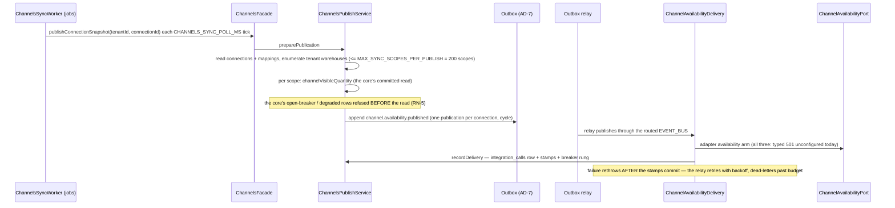
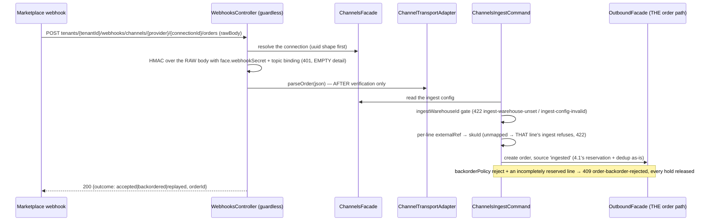

# Channels module

> The tenant's sales-channel integrations: the sealed-credential connection vault, the frozen provider registry, per-SKU standing buffers (ledger-backed through the reservation core), the per-channel availability publication through the transactional outbox — and, since story 7-2, the HMAC-verified webhook ingest into THE order path, the SKU-mapping routes, and the Shopify fulfillment writeback.

Paths are relative to `workspace/core/backend/wms-be`. Read [`../IMPLEMENTATION-GUIDE.md`](../IMPLEMENTATION-GUIDE.md) first — the command skeleton is followed closely here and is not repeated.

**Scope, deliberately:** story 7-1 built the vault/registry/buffers/sync. Story 7-2 (this story) landed the market-facing half — **Shopify-only transport** (RN-4: one testable-without-credentials transport beats three untestable ones; `amazon-in`/`flipkart` keep their typed verbatim `501 channel-transport-unconfigured` on every arm, ingestion included), the guardless webhook controller, the ingest into the OUTBOUND module's order path (the adapter still writes no stock or order state directly — every quantity and hold move rides `InventoryFacade`/outbound passthroughs), the fulfillment writeback, and the mapping routes. Webhook subscriptions are registered **merchant-side** (Shopify admin + the FE's copyable URL rows); API-side subscription management is a PENDING row.

The module exists for one invariant of its own beside AD-15's: **a buffer is a reservation, not a copy** (AD-13). A standing buffer IS a `held` reservations row (`owner_type: 'buffer'`, `owner_id: <integrationId>`, `expires_at: null`) held through the shared atomic-reservation script — it carves stock off the grantable pool and off every other channel's published quantity, never a number copied onto the connection row that reconciliation would have to keep.

---

## Owns

| Table | Holds | Key invariants |
|---|---|---|
| `integrations` (`schema.ts:3538`) | One row per connected provider per tenant: `provider`, `credential_sealed`, `credential_version`, `backorder_policy`, `ingest_warehouse_id` (nullable — 7-2's ingest gate; the single warehouse channel orders land on), `connected_by`, `rotated_at`/`rotated_by`, `last_synced_at`, `last_attempt_at`, `last_error`, `consecutive_failures`, `breaker_state` | See below |
| `channel_mappings` | `(integration_id, external_ref) → sku_id` — the mapping rows sync publishes for AND the ingest's per-line translate table | Exposed since 7-2 via `GET/PUT .../connections/{id}/mappings` (full replacement ≤ 200) |
| `integration_calls` | The append-only per-call meter: `kind` (`availability-sync\|credential-revoke\|order-ingest\|order-writeback` since 7-2), `status`, `latency_ms`, `error`, `at` | AD-7's companion, the meter RN-5 reads; the ingest's refused OUTCOMES meter as statuses (`order-ingest` kind), the writeback's deliveries as `order-writeback` |

CHECKs and RLS live only in `drizzle/0050_channels_integrations.sql` (the 0048/0049 pattern):

- `integrations_tenant_provider_unique` — one connection per provider per tenant; a concurrent double-connect is the deterministic 409, never a read-then-write race.
- `integrations_provider_check` (`shopify | amazon-in | flipkart`) — **the frozen three** (the launch decision). The suite-side test adapter swaps this CHECK via `admitTestProviderInDb` on a throwaway clone the way 6-1's suites treat the provider CHECK on other tables.
- `integrations_credential_sealed` envelope prefix — the CHECK pins a `v1:` prefix only (the carriers' `0025` precedent; it is NOT the full four-part `v1:<iv>:<tag>:<ct>` shape — a corrupt or truncated blob still passes). A code path that ever stored raw material fails the write; the four-part shape is TS-side.
- `integrations_status_check`, `integrations_backorder_policy_check`, `integrations_breaker_state_check`, `integrations_consecutive_failures_nonnegative_check` — vocabularies mirroring the TS tuples in `schema.ts` (`CHANNEL_PROVIDERS`, `INTEGRATION_STATUSES`, `BACKORDER_POLICIES`, `INTEGRATION_BREAKER_STATUSES`).
- fail-closed RLS per table — **the pinned RLS-policy count grew 61 → 64** (the `client-isolation` count pin updated in-story).

**And the standing-buffer backstop on the inventory-owned table:** `reservations_expires_at_standing_rule_check` — a row with `expires_at` NULL is admitted ONLY for `owner_type = 'buffer'` (AD-13); every other hold keeps its TTL, so the reaper's invariant is never weakened. 0050 also drops `reservations.expires_at`'s NOT NULL for the same reason.

**The registry owns no table.** `channel-registry.ts` is a compile-time registration of the frozen three, each with its credential field declarations in wire order (`shopify`: `shopDomain` + `accessToken` required, `apiVersion` optional, and since 7-2 the optional `webhookSecret` (the ingest's HMAC key — omitted means webhook ingestion stays off) and `locationId` (the fulfillment location the writeback writes against — absent means a named `writeback-location-unset` failure, never guessed); `amazon-in`: `sellerId` + `refreshToken` required, `marketplaceId` optional; `flipkart`: `appId` + `appSecret` required, `sellerId` optional). Since 7-2 each declaration also carries its **webhook topics** (the `orders`/`cancellations` endpoint bindings the ingest controller verifies against) and its transport arms; a fourth channel is additive (registry registration + the FE mirror + the CHECK's IN-list widened by a migration).

The module also writes `audit_events` and `idempotency_keys` (tenancy-owned, shared), and holds standing buffers in `reservations` **through the inventory facade only** (below).

---

## Public seam

`ChannelsModule` exports `ChannelsFacade` **alone**; `ChannelsSyncWorker` (in `src/jobs/jobs.module.ts`) drives it, and nothing reaches past it. Inside, several injectables keep the DAG acyclic:

- **`ChannelsCommand`** — the command skeletons (the `carrier.command.ts` landmark order: payload hash before the transaction, role re-read at entry, inline replay block, row lock, guards, write, then outbox → audit → idempotency).
- **`ChannelsPublishService`** — the availability-sync machinery (scan/append/meter/stamp) AND since 7-2 the ingest-metering writer (`recordIngestOutcome`/`recordIngestVerificationRefused`), standing as a provider BESIDE facade and command; the command consumes it for the manual retry, the facade delegates the worker's publish drive to it, neither edge cycles back. Extracted as its own service exactly because a `facade → command → facade` edge would be a provider cycle.
- **`ChannelAvailabilityDelivery`** — the event-bus subscriber that turns a relayed publication into the port attempt + metering/health stamps (below), and `ChannelWritebackDelivery` (7-2) — the relayer for packed/dispatched/cancel writebacks.
- **`ChannelsIngestCommand`** (7-2) — the webhook ingestion + cancellation echo behind `webhooks.controller.ts`, which is GUARDLESS (RD-9): verification is the authentication, and it rides the registry declaration + the sealed secret, never a session.

The inventory touchpoints (`applyChannelBuffer`, `channelVisibleQuantity`, `standingBuffersByOwnerInTx`, `standingBuffersForTenantInTx`, `restoreReservedUnits`) are read-and-arm passes on `InventoryFacade` — the channels module never runs a Valkey script and never writes `reservations` SQL raw (AD-6, the epic decision "the adapter never writes stock directly"). Order ingest rides `OutboundFacade`'s create/cancel passthroughs the same way (7-2's ingest is THE order path, not a second one).

---

## Commands and their guards

Every mutating arm requires `Idempotency-Key`; same-key replay re-serves the stored snapshot, a different payload under the same key → `422 idempotency-key-reuse`; a concurrent same-key → `409 conflict`; every arm re-asserts `channel.manage` **before** the replay lookup (the 1.5 fail-closed carve-out).

| Command | Guards (in order) | Failure arms | Events / side effects |
|---|---|---|---|
| `connect` | own-tenant → key present → unknown provider → credential shape (registry) → seal → `integrations_tenant_provider_unique` | `400 validation-failed` (unknown provider named + known codes listed; missing required / unknown / non-string / over-long field named **without echoing its value**); `409 connection-exists` (rotate or config is the repair); `503 channel-encryption-unavailable` | `channels.connected` audit (never a secret hash of the content) |
| `rotateCredentials` | own-tenant → key → uuid → row FOR UPDATE → adapter registered → credential shape → seal → overwrite in place | `400` (a provider the build no longer registers; shape); `404`; `503 channel-credential-unreadable` reads are a list-read concern — rotation writes fresh material | version +1, `rotatedAt`/`rotatedBy` paired. **7-2 (bl-9): the FE wholesale-replace rotates EVERY declared field** — a rotate omitting `webhookSecret` would leave every future delivery 401ing silently; the credential vocabulary must carry all four shopify fields |
| `updateConnectionConfig` (`backorderPolicy` + 7-2's `ingestWarehouseId`) | own-tenant → key → uuid → non-uuid warehouse → row → vocabulary | `400 validation-failed` (not `accept\|reject`; non-uuid `ingestWarehouseId`); `404` (unknown connection, or a foreign/unknown ingest warehouse named); `422 idempotency-key-reuse` | last-write-wins; policy consumed by 7-2's acceptance, the warehouse by the ingest gate. `ingestWarehouseId` ABSENT leaves it standing, `null` CLEARS it (the FE's '' sentinel → `null`) |
| `setConnectionMappings` (7-2, route-backed now) | own-tenant → key → uuid → row → per-item shape (no blanks, no duplicate `externalRef`, ≤ 200) → SKUs resolve in-tenant → publish-ceiling arithmetic (`skuCount × activeWarehouseCount` named verbatim in the 400) → full replacement in one tx | `400 validation-failed` (the cap / duplicates / the ceiling arithmetic); `404` (connection, or a mapped SKU outside the tenant) | **FULL replacement** — rows absent from the save are removed before the next publish cycle; an empty list clears the set; `channels.mappings_set` audit |
| `setConnectionBuffers` | own-tenant → key → uuid → per-item shape → **per-item `applyChannelBuffer` (each its OWN transaction, the reservation core arbitrates)** → final idempotency tx | `400` malformed item; `503 reservation-store-unavailable` (nothing written — the whole request); per-item verdicts otherwise: `applied \| unchanged \| refused` (`buffer-over-ceiling` — the reservation core's `409 unavailable` mapped, the OLD buffer standing) | counter mirrors restore after each commit; a crash mid-request replays safely because targets are ABSOLUTE |
| `disconnect` | own-tenant → key → PHASE 1 (authority + replay + row read with sealed blob) → PHASE 2 tx re-locks, re-404s (with the double-replay shape for a concurrent loser), releases buffers, deletes row + mappings → 204 → **post-commit: counter mirrors, then the CURRENT credential's revoke attempt + meter (7-2, RN-7/review-4 — outside any tx, logged, never blocking)** | `404` (unknown, or a repeat under a NEW key — same-key replays replay the 204); `409 conflict`; `503 reservation-store-unavailable` leaves everything standing | revoke attempted AFTER the delete commits (a port call inside the tx would hold the row lock up to `CHANNEL_HTTP_TIMEOUT_MS` against the pool-nesting gotcha; post-commit is equally correct because the delete is AD-15's local atomic act, and re-reading at the revoke means a rotate that landed between phases revokes the CURRENT blob, not the stale one) |
| `retryConnection` (manual) | own-tenant → key → uuid → row → **breaker state** → scopes read via the core between two transactions → half-open + append in the second tx | `503 reservation-store-unavailable` (the ATP read fails closed — nothing appended, nothing broken); `404` | re-appends the snapshot through the outbox; **half-open is reachable only from `open`** — a retry from a closed breaker re-appends and leaves the breaker closed |

**The webhook ingest is NOT in this table** — it carries no `Idempotency-Key` (the marketplace is the caller; redelivery dedup rides the order path's partial unique on `(tenant, integration_id, external_event_id)`), has no session guard, and is verified instead (below).

Credential shape rules live beside the registry (`max 16 fields`, one-line values ≤ 512 chars — the carriers precedent); field names never carry values in any error arm.

---

## The availability sync

The publish cycle (`channels.publish.ts`):

- **A connection with zero mappings publishes nothing** — RN-6's "only mapped scopes" is enforced by the fan-out, not by a separate gate.
- **RN-6's visible quantity:** `V = max(0, ATP) − buffer(scope)` computed in the **inventory core** (`channelVisibleQuantity`) — the sync delivers arithmetic results it never performs itself. The exhaustion property (V hits 0 while the pool still holds the buffer) is the buffer spec's AC, tested in `test/channel-sync.spec.ts`.
- **RN-3's deliberately-branching dual 409/503:** a 503 store outage means the ATP read failed closed → the row degrades, NOTHING is published; a 409 `unavailable` from the grant path is a real pool state → the clamped `0` publishes. The codes are machine branches in `channels.publish.ts`, never prose matches.
- **RN-5's breaker:** `consecutive_failures` on the connection row with `BREAKER_FAILURE_THRESHOLD = 5` (frozen const, `channels.view.ts:131`). `open` refuses further APPENDS (a cycle over an open breaker appends nothing and does not meter); a manual retry half-opens (only from `open`); a half-open failure reopens immediately; the first success closes and resets the rung. The delivery side meters honestly (re-drains re-meter).
- **Stalls** (`recordSyncStall`) — a scope preparation that throws degrades the row's stamps without appending, so the health read answers `degraded` while nothing lies about a `last_synced_at`.

## The webhook ingest (story 7-2)

The guarded-by-verification alternative (RD-9): `webhooks.controller.ts` has NO session guard — the marketplace's webhook poster is the caller. The check CHAIN is ordered, and every refused verification meters coarse (`recordIngestVerificationRefused`) so misconfig is seen same-day even though the 401 never says why:

- **Verification before parse, always** — a malformed body from an unverified source never reaches a parser (`app.factory.ts` keeps `rawBody: true` exactly for this; the HMAC is computed over the bytes the provider signed, not a re-serialized JSON). The parse arm's `null` → `400 validation-failed`.
- **The actor rule (RD-2)** — the ingest runs as `connected_by`; the command re-reads that user's `orders.manage` from the DB (the authority), losing it → `403 order-actor-unprivileged`. A NACK is correct: reconnect (rotate) heals it; retry lands the order later.
- **Source conflicts & replay** — the order path's partial unique decides: same ref same payload → `accepted`→`replayed` (first order's snapshot re-served); same ref divergent payload → `422 order-source-conflict`. The payload hash covers `ingestWarehouseId` (RD-1/triage 1): re-pointing the warehouse turns unchanged redeliveries into conflicts — a documented, metered, retry-budget-bounded consequence.
- **Zero-grant lines and kits (RD-3)** — the accept/reject decision reads phase-2's granted/demanded map (zero grants included, kit children as entries, kit parents `reservedQty: 0`): accept means "at least one mapped line got its full grant"; a policy-reject order where NO line fully reserves is the 409.
- **The cancellation echo** resolves the connection's order by `externalEventId` — an already-cancelled order is `outcome: 'ignored'` (200); no order carries the ref YET → `503 cancellation-unresolved` (NACK — the marketplace's retry lands after the create commits, RD-8). The release rides outbound's cancel (flip-first) as `connected_by`.

## The fulfillment writeback (story 7-2)

`ChannelWritebackDelivery` relays outbound's order lifecycle events through the port's `orderWritebackArm` (RD-7); every arm is idempotent via provider READ-BACK where it exists (pack→fulfillment: a packed read-back that answers packed is `noop`) and settles as `{settledAt, action: 'created'|'updated'|'cancelled'|'noop'}`:

| Outbound event | Writeback arm | Guard |
|---|---|---|
| order packed | fulfillment create (POST fulfillments.json against `locationId`) | the packed read-back guard; credential without `locationId` → attempt fails NAMED `writeback-location-unset` (metered, never retried past the relay budget — remediation = rotate) |
| order dispatched (tracked) | tracking append (POST fulfillments/{id}/tracking_info.json) | dispatched/tracked → `noop` when the tracking number was already written |
| order cancelled | cancel (POST orders/{id}/cancel.json) | `cancelled_at` already set → `noop`; the ORDER was never ingested by this channel (`source: 'manual'` / no external event) → nothing written |

- The meter rows are kind `order-writeback` and NOTHING ELSE (the delivery handler's own contract line) — refused/failed transport statuses differ only in the metered `status`, never a second kind.
- The transport (`channel-http.ts`) rides **node:https, not bun fetch** — per-request `rejectUnauthorized` honoring the TLS-off env override is needed by the stub-server tests and the jest runtime's fetch ignores in-process `NODE_TLS_REJECT_UNAUTHORIZED` (a real lesson: the transport shape was rewritten from the design's `fetch` and the change is logged in the spec). Timeouts parse per the poll-gate conventions (`CHANNEL_HTTP_TIMEOUT_MS`, invalid boots loud); credential and body content never reach any log.

## The event

| Event | Payload | Carries |
|---|---|---|
| `channel.availability.published` (outbox) | `{connectionId, provider, scopes: [{warehouseId, skuId, visibleMilli}], publishedAt}` (a scope's `visibleMilli` is RN-6's `V(c)` in milli-units — the port's `ChannelAvailabilityScope` verbatim) | ids and quantities **never a secret** — the credential material never leaves `integrations.credential_sealed` except opened in process by the delivery handler, which never logs or persists it |

The audit events (tenancy's `audit_events`, the actor = the command's user; **no secret hash of the content**):

`channels.connected` · `channels.credentials_rotated` · `channels.backorder_policy_set` · `channels.buffers_set` (the buffers PUT's Phase-3 key tx — one row per request, no outbox event; the next publish cycle carries the availability delta) · **`channels.mappings_set` (7-2 — full-replacement mappings PUT, one audit row per request)** · `channels.disconnected` · `channels.sync_retried`

The webhook ingest's own refusals are **not** audit events — they meter into `integration_calls` (kind `order-ingest`, the refused outcome as the metered status with coarse fingerprinting), and the ingest itself audits nothing: the order it creates carries the standard outbound audit trail as `connected_by`.

## Gotchas (the real-defect list)

- **Nullable union ApiProperties need explicit `type` pins** (the carriers precedent, now standing): tsc's jest decorator metadata renders `string | null` as `Object`, which swc/bun would render as `String` — an unpinned nullable field diverges between the served document and the committed `openapi/openapi.json`, and the api.spec drift guard fires. Pin `type: String`/`type: Number` on every nullable union field (see the spec's Change Log).
- **`busy`-style ref props across components**: the FE initially shared a `RefObject<boolean>` re-entry guard as a prop; the react-hooks lints (`react-hooks/immutability`, `react-hooks/refs`) forbid both mutating a prop ref and reading a ref during render. The landed shape: each component owns its ref and derives `inFlight` from state in render (this is the FE contract doc's line, kept here because it was found on this module's build).
- **The `client-isolation` RLS count pin moves with this module** (61 → 64; 7-2's migration adds tables WITHOUT policies — `integration_calls`/`channel_mappings` ride connection-id joins under the tenant-scoped parent reads, so the pin did not move again): a future story on these tables that adds/drops a policy without bumping the pin fails the suite — that failing test is the drift signal working as designed.
- **Verification order is load-bearing** (7-2): the HMAC is computed over the request's RAW bytes (`app.factory.ts` keeps `rawBody: true` solely for this) and runs BEFORE the JSON parse — move the parse first and an unverified malformed body reaches a parser. The 401 detail is deliberately EMPTY, and the meter's fingerprint is coarse, so an attacker learns nothing by probing the endpoint.
- **The webhook ingest carries no `Idempotency-Key`** — dedupe rides the order path's partial unique (`tenant_id, integration_id, external_event_id`) instead. Consequence: any change to the order create's dedupe or hash inputs changes ingest replay semantics. Never "fix" a duplicate webhook by adding a key column to the ingest route; the partial unique already answers redelivery and race.
- **Shared header objects bake in fixed keys** (found by the 7-2 loadtest harness's own 422): an `owner` header object with one `ulid()` baked in at construction, spread bare across DIFFERENT payloads, trips the idempotency-key-reuse guard on the second request. Mint the key per request (the harness's `sendJson` does), never per client.
- **The ingest-config PUT is semantic, not patchy** (7-2): `ingestWarehouseId` *absent* leaves it standing, `null` CLEARS it, non-uuid → 400, foreign warehouse → 404 naming it. A FE that omits the field while "saving policy" was silently dropping the standing warehouse in an earlier draft — always send the full shape from an editor UI.
- **The GET/PUT test-problem knobs must split** (FE): a stub that makes the mappings GET fail also made the editor never render its Save button, masking the save-failure test entirely. Separate read-side and write-side knobs, or a read failure hides every downstream assertion.
- **`react-hooks/set-state-in-effect` forbids synchronous setState in effects** (FE): the mapping editor's "open then fetch" became a `toggle()` that sets open and calls `load()` (a `.then/.catch` chain with a generation ref for dropping superseded responses), not an effect. Same pattern as the other `load()/toggle()` components.