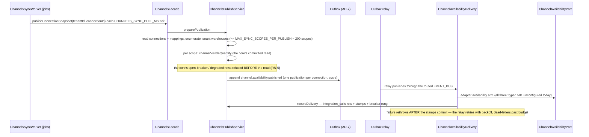

# Channels module

> The tenant's sales-channel integrations: the sealed-credential connection vault, the frozen provider registry, per-SKU standing buffers (ledger-backed through the reservation core), and the per-channel availability publication through the transactional outbox.

Paths are relative to `workspace/core/backend/wms-be`. Read [`../IMPLEMENTATION-GUIDE.md`](../IMPLEMENTATION-GUIDE.md) first — the command skeleton is followed closely here and is not repeated.

**Scope, deliberately (story 7-1's boundaries):** the module makes **no network calls** — the adapter is a port (`channel-availability-port.ts`) whose availability and revoke arms every registered provider answers with a typed, verbatim `501 channel-transport-unconfigured` until the launch story lands real transport with live credentials. **No order ingestion, no webhook endpoints, no fulfilment writeback** — all 7-2's; this story births the `integrations` identity 7-2's ingestion will reference. Mappings have **no route** — `ChannelsFacade.setChannelMappings`/`listChannelMappings` is facade-only (7-2's config path and the e2e seeder are the callers), so a fresh connection publishes nothing until a story seeds mappings for it.

The module exists for one invariant of its own beside AD-15's: **a buffer is a reservation, not a copy** (AD-13). A standing buffer IS a `held` reservations row (`owner_type: 'buffer'`, `owner_id: <integrationId>`, `expires_at: null`) held through the shared atomic-reservation script — it carves stock off the grantable pool and off every other channel's published quantity, never a number copied onto the connection row that reconciliation would have to keep.

---

## Owns

| Table | Holds | Key invariants |
|---|---|---|
| `integrations` (`schema.ts:3538`) | One row per connected provider per tenant: `provider`, `credential_sealed`, `credential_version`, `backorder_policy`, `connected_by`, `rotated_at`/`rotated_by`, `last_synced_at`, `last_attempt_at`, `last_error`, `consecutive_failures`, `breaker_state` | See below |
| `channel_mappings` | `(integration_id, external_ref) → sku_id` — the mapping rows sync publishes for | 7-1 never exposes them on a route |
| `integration_calls` | The append-only per-call meter: `kind` (`availability-sync\|credential-revoke`), `status`, `latency_ms`, `error`, `at` | AD-7's companion, the meter RN-5 reads |

CHECKs and RLS live only in `drizzle/0050_channels_integrations.sql` (the 0048/0049 pattern):

- `integrations_tenant_provider_unique` — one connection per provider per tenant; a concurrent double-connect is the deterministic 409, never a read-then-write race.
- `integrations_provider_check` (`shopify | amazon-in | flipkart`) — **the frozen three** (the launch decision). The suite-side test adapter swaps this CHECK via `admitTestProviderInDb` on a throwaway clone the way 6-1's suites treat the provider CHECK on other tables.
- `integrations_credential_sealed` envelope shape — `v1:<iv>:<tag>:<ct>` (the carriers' `0025` envelope CHECK mirrored). A code path that ever stored raw material fails the write.
- `integrations_status_check`, `integrations_backorder_policy_check`, `integrations_breaker_state_check`, `integrations_consecutive_failures_nonnegative_check` — vocabularies mirroring the TS tuples in `schema.ts` (`CHANNEL_PROVIDERS`, `INTEGRATION_STATUSES`, `BACKORDER_POLICIES`, `INTEGRATION_BREAKER_STATUSES`).
- fail-closed RLS per table — **the pinned RLS-policy count grew 61 → 64** (the `client-isolation` count pin updated in-story).

**And the standing-buffer backstop on the inventory-owned table:** `reservations_expires_at_standing_rule_check` — a row with `expires_at` NULL is admitted ONLY for `owner_type = 'buffer'` (AD-13); every other hold keeps its TTL, so the reaper's invariant is never weakened. 0050 also drops `reservations.expires_at`'s NOT NULL for the same reason.

**The registry owns no table.** `channel-registry.ts` is a compile-time registration of the frozen three, each with its credential field declarations in wire order (`shopify`: `shopDomain` + `accessToken` required, `apiVersion` optional; `amazon-in`: `sellerId` + `refreshToken` required, `marketplaceId` optional; `flipkart`: `appId` + `appSecret` required, `sellerId` optional). A fourth channel is additive (registry registration + the FE mirror + the CHECK's IN-list widened by a migration).

The module also writes `audit_events` and `idempotency_keys` (tenancy-owned, shared), and holds standing buffers in `reservations` **through the inventory facade only** (below).

---

## Public seam

`ChannelsModule` exports `ChannelsFacade` **alone**; `ChannelsSyncWorker` (in `src/jobs/jobs.module.ts`) drives it, and nothing reaches past it. Inside, two injectables keep the DAG acyclic:

- **`ChannelsCommand`** — the command skeletons (the `carrier.command.ts` landmark order: payload hash before the transaction, role re-read at entry, inline replay block, row lock, guards, write, then outbox → audit → idempotency).
- **`ChannelsPublishService`** — the availability-sync machinery (scan/append/meter/stamp), standing as a provider BESIDE facade and command; the command consumes it for the manual retry, the facade delegates the worker's publish drive to it, neither edge cycles back. Extracted as its own service exactly because a `facade → command → facade` edge would be a provider cycle.
- **`ChannelAvailabilityDelivery`** — the event-bus subscriber that turns a relayed publication into the port attempt + metering/health stamps (below).

The inventory touchpoints (`applyChannelBuffer`, `channelVisibleQuantity`, `standingBuffersByOwnerInTx`, `standingBuffersForTenantInTx`, `restoreReservedUnits`) are read-and-arm passes on `InventoryFacade` — the channels module never runs a Valkey script and never writes `reservations` SQL raw (AD-6, the epic decision "the adapter never writes stock directly").

---

## Commands and their guards

Every mutating arm requires `Idempotency-Key`; same-key replay re-serves the stored snapshot, a different payload under the same key → `422 idempotency-key-reuse`; a concurrent same-key → `409 conflict`; every arm re-asserts `channel.manage` **before** the replay lookup (the 1.5 fail-closed carve-out).

| Command | Guards (in order) | Failure arms | Events / side effects |
|---|---|---|---|
| `connect` | own-tenant → key present → unknown provider → credential shape (registry) → seal → `integrations_tenant_provider_unique` | `400 validation-failed` (unknown provider named + known codes listed; missing required / unknown / non-string / over-long field named **without echoing its value**); `409 connection-exists` (rotate or config is the repair); `503 channel-encryption-unavailable` | `channels.connected` audit (never a secret hash of the content) |
| `rotateCredentials` | own-tenant → key → uuid → row FOR UPDATE → adapter registered → credential shape → seal → overwrite in place | `400` (a provider the build no longer registers; shape); `404`; `503 channel-credential-unreadable` reads are a list-read concern — rotation writes fresh material | version +1, `rotatedAt`/`rotatedBy` paired |
| `updateConnectionConfig` (`backorderPolicy`) | own-tenant → key → uuid → row → vocabulary | `400 validation-failed` (not `accept|reject`); `404` | last-write-wins; consumed by 7-2's acceptance |
| `setConnectionBuffers` | own-tenant → key → uuid → per-item shape → **per-item `applyChannelBuffer` (each its OWN transaction, the reservation core arbitrates)** → final idempotency tx | `400` malformed item; `503 reservation-store-unavailable` (nothing written — the whole request); per-item verdicts otherwise: `applied | unchanged | refused` (`buffer-over-ceiling` — the reservation core's `409 unavailable` mapped, the OLD buffer standing) | counter mirrors restore after each commit; a crash mid-request replays safely because targets are ABSOLUTE |
| `disconnect` | own-tenant → key → FIRST tx (read row, meter the revoke attempt through the port — logged, never blocking) → SECOND tx re-locks, re-404s, deletes row + mappings, releases buffers through the core, mirrors after commit → 204 | `404` (unknown, or a repeat under a NEW key — same-key replays replay the 204); `409 conflict`; `503 reservation-store-unavailable` leaves everything standing | revoke attempted BEFORE the delete tx (AD-15: deletion is a local atomic act; an unreachable channel gets no say) |
| `retryConnection` (manual) | own-tenant → key → uuid → row → **breaker state** → scopes read via the core between two transactions → half-open + append in the second tx | `503 reservation-store-unavailable` (the ATP read fails closed — nothing appended, nothing broken); `404` | re-appends the snapshot through the outbox; **half-open is reachable only from `open`** — a retry from a closed breaker re-appends and leaves the breaker closed |

Credential shape rules live beside the registry (`max 16 fields`, one-line values ≤ 512 chars — the carriers precedent); field names never carry values in any error arm.

---

## The availability sync

The publish cycle (`channels.publish.ts`):

- **A connection with zero mappings publishes nothing** — RN-6's "only mapped scopes" is enforced by the fan-out, not by a separate gate.
- **RN-6's visible quantity:** `V = max(0, ATP) − buffer(scope)` computed in the **inventory core** (`channelVisibleQuantity`) — the sync delivers arithmetic results it never performs itself. The exhaustion property (V hits 0 while the pool still holds the buffer) is the buffer spec's AC, tested in `test/channel-sync.spec.ts`.
- **RN-3's deliberately-branching dual 409/503:** a 503 store outage means the ATP read failed closed → the row degrades, NOTHING is published; a 409 `unavailable` from the grant path is a real pool state → the clamped `0` publishes. The codes are machine branches in `channels.publish.ts`, never prose matches.
- **RN-5's breaker:** `consecutive_failures` on the connection row with `BREAKER_FAILURE_THRESHOLD = 5` (frozen const, `channels.view.ts:131`). `open` refuses further APPENDS (a cycle over an open breaker appends nothing and does not meter); a manual retry half-opens (only from `open`); a half-open failure reopens immediately; the first success closes and resets the rung. The delivery side meters honestly (re-drains re-meter).
- **Stalls** (`recordSyncStall`) — a scope preparation that throws degrades the row's stamps without appending, so the health read answers `degraded` while nothing lies about a `last_synced_at`.

## The event

| Event | Payload | Carries |
|---|---|---|
| `channel.availability.published` (outbox) | `{connectionId, provider, scopes: [{warehouseId, skuId, quantity, quantityMilli, publishedAt}], publishedAt}` | ids and quantities **never a secret** — the credential material never leaves `integrations.credential_sealed` except opened in process by the delivery handler, which never logs or persists it |

The audit events (tenancy's `audit_events`, the actor = the command's user; **no secret hash of the content**):

`channels.connected` · `channels.credentials_rotated` · `channels.backorder_policy_set` · `channels.disconnected` · `channels.sync_retried`

## Gotchas (the real-defect list)

- **Nullable union ApiProperties need explicit `type` pins** (the carriers precedent, now standing): tsc's jest decorator metadata renders `string | null` as `Object`, which swc/bun would render as `String` — an unpinned nullable field diverges between the served document and the committed `openapi/openapi.json`, and the api.spec drift guard fires. Pin `type: String`/`type: Number` on every nullable union field (see the spec's Change Log).
- **`busy`-style ref props across components**: the FE initially shared a `RefObject<boolean>` re-entry guard as a prop; the react-hooks lints (`react-hooks/immutability`, `react-hooks/refs`) forbid both mutating a prop ref and reading a ref during render. The landed shape: each component owns its ref and derives `inFlight` from state in render (this is the FE contract doc's line, kept here because it was found on this module's build).
- **The `client-isolation` RLS count pin moves with this module** (61 → 64): a future story on these tables that adds/drops a policy without bumping the pin fails the suite — that failing test is the drift signal working as designed.