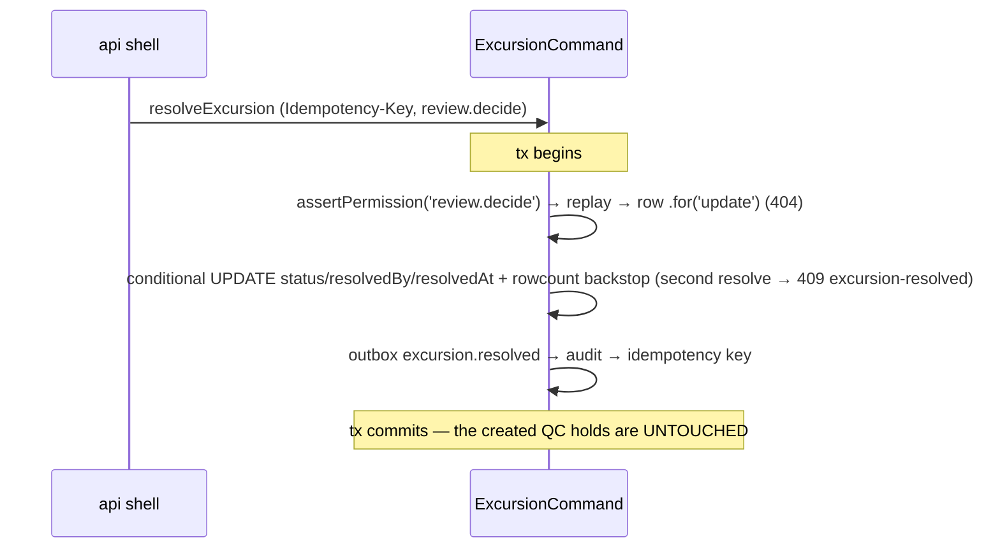
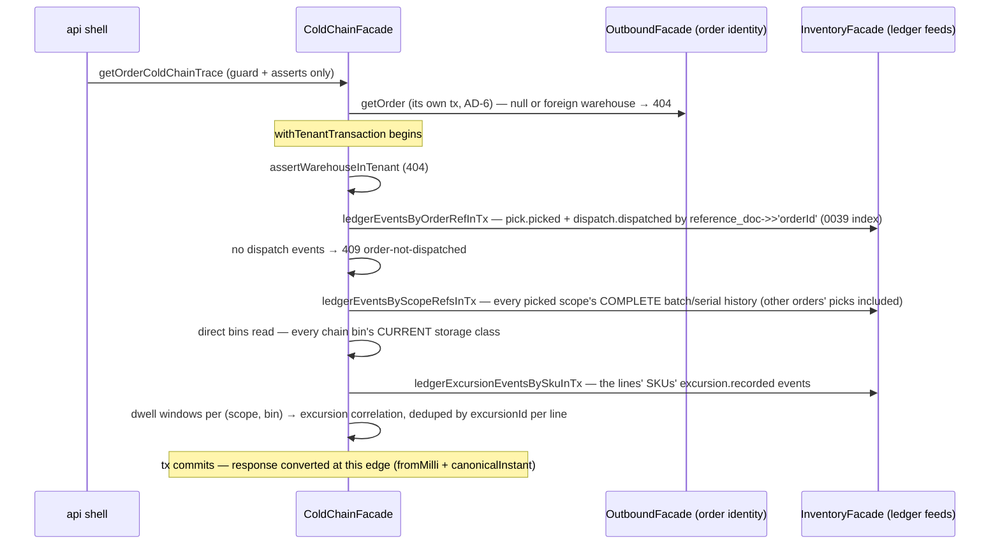

# Compliance module

> Temperature excursions (FR-44): an operator records a °C reading against a bin, every affected (sku, bin) scope is quarantined through the ordinary QC-hold semantics, and the excursion itself is a registered zero-delta ledger event — so cold-chain custody is reconstructible from the ledger alone (FR-45). Story 12-6 adds the FR-45 reader: the cold-chain trace, reconstructed from `ledger_events` alone.

All paths below are relative to `workspace/core/backend/wms-be`. Story 12-5 activated this module (an empty spine placeholder before it); story 12-6 added the read side.

Files: `src/modules/compliance/{compliance.module,excursion.command,excursion.facade,cold-chain.facade}.ts` + the API surface `src/api/{compliance.controller,compliance.dto}.ts`.

---

## Owns

One table, module-exclusive:

| Table | Holds | Invariants and where they live |
| --- | --- | --- |
| `temperature_excursions` (`drizzle/0038_temperature_excursions.sql`) | One row per recorded excursion: origin `bin_id`, `reading_c` numeric(6,2), `note` (nullable), `hold_ids uuid[]` (the QC holds this excursion created — links the queue item to its holds without touching `qc_holds`), `status` `open|resolved`, `recorded_by`, `occurred_at` (business time — the operator's reading instant), `resolved_by`/`resolved_at`. | `temperature_excursions_status_check` (`open|resolved`) and the fail-closed RLS policy live **only in the migration SQL** (the 0008 hand-append pattern — schema.ts deliberately carries neither; the snapshot's `isRLSEnabled: false` is why the next `db:generate` must not re-emit them). `tenantTimestamps` for the keyset cursor. |

The module writes **no other table**. The quarantine is inbound's `qc_holds` (written through `QcFacade.holdScopeInTx`, never directly); the ledger events are inventory's (written through `appendLedgerEventInTx`). The bin's on-hand sweep reads through `InventoryFacade.onHandInBinInTx`.

Not owned but read: `bins` (origin bin, with a `.for('update')` lock — serialized against hold, merge and retire), `skus` (serial/catch-weight pre-flight), `warehouses`, `qc_holds` (only through the facade: `openHoldsForBinsInTx` for the skip arm), `idempotency_keys`, `outbox_messages`, `audit_events`.

## Public seam

`ExcursionFacade` (`src/modules/compliance/excursion.facade.ts`) — `recordExcursion`, `resolveExcursion`, `listExcursions`. `ColdChainFacade` (`src/modules/compliance/cold-chain.facade.ts`) — `getOrderColdChainTrace` (the FR-45 read, no capability gate — reads are never gated). The compliance module is a **consumer** of inventory's facade (ledger + sweep), inbound's facade (the hold core) and outbound's facade (order identity — `OutboundModule` imported 12-6; it exports only its facade and imports nothing back, so no cycle); nothing imports compliance except the api shell.

## Flows

### recordExcursion — one excursion, N affected scopes

```mermaid
sequenceDiagram
    participant API as api shell
    participant C as ExcursionCommand
    participant Q as QcFacade (inbound)
    participant Inv as InventoryFacade (ledger)
    API->>C: recordExcursion (Idempotency-Key, excursion.record)
    C->>C: shape checks (bounds backstop, note ≤200, occurredAt UTC; note "" → null before the hash)
    C->>C: payloadHash over RAW request fields
    Note over C: tx begins
    C->>C: fresh role read → assertPermission('excursion.record')
    C->>C: replay lookup (same key + same hash → snapshot)
    C->>C: warehouse in tenant; bin row .for('update') (404) — system-owned refused (400)
    C->>C: onHandInBinInTx sweep — empty → 400 (FR-44 is against affected stock)
    C->>C: SKU pre-flight: any serial-tracked / catch-weight SKU → 400 naming every offender — ALL-OR-NOTHING, nothing written
    C->>Q: openHoldsForBinsInTx — scopes already under an open hold are SKIPPED (already out of ATP), not a 409
    loop per unheld scope
        C->>Q: holdScopeInTx (ordinary QC hold; reason 'temperature-excursion[: note…]', audit ref = excursionId)
    end
    C->>C: insert temperature_excursions row (holdIds, .returning createdAt)
    loop per AFFECTED scope (held or skipped)
        C->>Inv: appendLedgerEventInTx — zero-delta excursion.recorded, referenceDoc {kind:'excursion', excursionId, binId, readingC}
    end
    C->>C: snapshot (row's created_at) → outbox excursion.recorded → audit → idempotency key
    Note over C: tx commits
```

### resolveExcursion — the review flip, never a release



Stock disposition is deliberately out of scope here: releasing is `qc.manage`'s (release returns the units) and write-off is `stock.adjust`. The resolve is a review decision, and the verbs stay separate so a future matrix change answers each question in the open.

## Commands

### `ExcursionCommand.recordExcursion`

Guard order (the command skeleton order — load-bearing): shape checks **before** the transaction (reading bounds −100..200 with a 2-decimal cap at the DTO, `maxDecimalPlaces: 2`; the command's 2dp normalization is the backstop so the ledger `referenceDoc.readingC` and the row agree; note length; `occurredAt` Z-suffixed UTC mapped to 400) → `payloadHash` over the **raw** request fields (never resolved instants; a whitespace-only note normalizes to `null` **before** the hash so both spellings of "no note" replay identically) → in-tx: fresh role read → `assertPermission('excursion.record')` → replay → `assertWarehouseInTenant` → bin row `.for('update')` 404 → system-owned refuse → sweep → pre-flight → skip → holds → row → events → snapshot → outbox → audit → idempotency key (unique-violation → 409 `conflict`).

Errors: `400 validation-failed` (bad shape, out-of-bounds reading, >2 decimals, oversized note, empty or system-owned bin, empty sweep, unquarantinable SKUs naming each offender and why) · `401` · `403 role-denied` (`excursion.record`, or the hold core's `secure.move` gate on a cage-class bin) · `404` (warehouse/bin) · `409 conflict` (concurrent same-key) · `422 idempotency-key-reuse`.

**Ledger reach — the invariant that was nearly wrong:** the events cover every **affected** scope — every distinct SKU with on-hand > 0 in the bin — *including* scopes skipped because they already sit under an open hold. The skip governs the quarantine (no new hold, `holdIds` omits it), not the ledger: an excursion that quarantined nothing new still commits row + events, and FR-45 reconstructs the bin's exposure from the events alone. `holdIds` lists holds CREATED; the events record exposure; the two relationships are different and each is accurate.

### `ExcursionCommand.resolveExcursion`

`assertPermission('review.decide')` → replay → row `.for('update')` 404 / conditional UPDATE with a rowcount backstop → outbox `excursion.resolved` + audit → idempotency key. Errors: `403 role-denied` · `404` · `409 excursion-resolved` (terminal) · `422 idempotency-key-reuse`.

### `ExcursionFacade.listExcursions`

Keyset on `(created_at, id)` (newest first), `warehouseId` filter (foreign → `404`), `status=open|resolved` filter, `decodeCursorSafe` guard → `400 invalid-cursor`, default page 50 (1..200). The review-queue read for 12-7.

## Cold-chain read (story 12-6, FR-45)

`GET /tenants/{t}/warehouses/{w}/cold-chain/orders/{orderId}` — one READ-ONLY reconstruction of a dispatched order's storage trace from `ledger_events` alone: never from projections, never from the `temperature_excursions` rows. No capability gate, no idempotency, no writes. Response shape: `{order, bins[], lines[]}` — per order line, one chain per picked batch/serial scope, each chain event annotated with its bins' **current** storage classes, plus the line's dwell-window-correlated `excursions[]`.



**The join chain rides the ledger's own reference docs:** the `dispatch.dispatched` events whose doc names the order → the `pick.picked` events with the same `reference_doc->>'orderId'` → those picks' `batch_ref`/`serial_ref` scopes → each scope's complete chain via the `(tenant, batch_ref, seq)` / `(tenant, serial_ref, seq)` trace indexes. Migration `0039` is index-only: the partial expression index `ledger_events_order_ref_idx` on `((reference_doc->>'orderId')) WHERE reference_doc ? 'orderId'` — **the query must carry the `? 'orderId'` qual itself** or the planner cannot use the index (predicate-implied-by has no `->>`-equality rule; the review proved it with EXPLAIN — `inventory.facade.ts` carries it).

**Chain semantics.** A scope's chain is its COMPLETE batch/serial history (all events, chronological by `seq`) — other orders' picks included, because the batch's history is the batch's history. Zero-arm events (pack, dispatch, excursion) never appear in chains: the chain queries match on identity arms, which those types do not carry. Dwell window per bin = `[min occurredAt where to_bin_id = bin, max occurredAt where from_bin_id = bin]` over the complete chain, visits merged, **open-ended** when the scope never left (departure null — leftover stock still there); windows are clamped against inverted business times (a backdated pick must not make departure precede arrival). An excursion attaches to a line when its `skuId` matches, its doc's `binId` is on the scope's chain, and its business time is inside the window — deduped by `excursionId` per line (two scopes that dwelt in the same bin correlate it once).

**Storage-class honesty.** Every chain event is annotated with the bins' **CURRENT** class; the report never fabricates historical classes. The annotation is sound because the 12-1/12-3 class-edit guards refuse a change that strands stock (temperature classes may only have moved colder for bins that held stock); a bin whose row is gone annotates `null`. The caveat is stated in the route's OpenAPI description.

Errors: `400 validation-failed` (malformed warehouseId/orderId) · `401` · `403` (foreign-tenant session) · `404 not-found` (missing order, order of another warehouse in the same tenant, or warehouse outside the tenant) · `409 order-not-dispatched` (the order exists but has no dispatch events — FR-45 names dispatched units).

## Invariants

- **The ledger is the excursion's record (AD-11/FR-45).** One zero-delta `excursion.recorded` event per affected scope; both bin arms null (the zero-quantity envelope rule), `skuId` never null (hence one event per scope), batch/serial arms registry-closed. The relocation itself is the `qc.held` movements' work — the excursion event is the compliance fact, not a stock movement.
- **ONE hold implementation.** The module holds through `QcFacade.holdScopeInTx` and never writes `qc_holds` — no fork of hold semantics, so ATP exclusion, release, merge-guards and the ledger timeline all work unchanged. ATP drops purely because the units physically move into the system `QC-HOLD` bin (`qcHeldUnits`); `reservation.service.ts` is untouched.
- **All-or-nothing.** Any serial-tracked or catch-weight SKU in the bin refuses the ENTIRE excursion naming every offender — FR-44 never leaves units in ATP; per-unit quarantine stays Epic 15's.
- **Resolve is a review flip.** It releases nothing; the holds stay open until `qc.manage` disposes of them.
- **Manual capture only (UX-DR30).** No threshold model, sensor ingestion or auto-detection — an operator-captured reading against a bin; no handling-unit arm (Epic 15), no unit conversion (°C only).
- **The trace reads the ledger only (12-6).** The cold-chain reconstruction reads `ledger_events` (through inventory's facade — the only ledger door) and `bins` directly (the 12-5 shared-substrate precedent); it never reads `temperature_excursions` rows or projections. Excursion correlation is dwell-window based from the events alone, because the excursion arm carries no batch/serial (one event per affected (sku, bin) scope).

## Events

Ledger: `excursion.recorded` (registered in `ledger-registry.ts`, `sinceVersion: 1`, reference kind `excursion`, batch/serial arms closed). Outbox: `excursion.recorded` (payload carries `affectedSkus` = every affected scope, `holdIds` = the holds created) and `excursion.resolved` (from resolve). Audit: `excursion.recorded` (reference = the idempotency key) and `excursion.resolved` (reference = the excursion's idempotency key).

## Gotchas

- **The skip arm's ledger reach** — the first implementation emitted events only for *quarantined* scopes, which made an all-scopes-skipped excursion ledger-invisible (AD-11 violated). The 12-5 review caught it; the events loop walks the **sweep**, not the post-filter scopes. Do not "optimize" the loop back to the quarantined list.
- **The record snapshot's `createdAt` is the row's `created_at`**, never the business `occurredAt` — the row insert uses `.returning({ createdAt })` and the snapshot reports `canonicalInstant(row.createdAt)`. `createdAt` is the keyset cursor field; the record response and later list/resolve reads must agree on it.
- **`hold_ids` is a uuid[] column, not a join** — the queue item links its holds without cross-module table writes. Nothing else may infer excursion→hold from the ledger's `qc.held` events (their reference kind is `qc-hold`, holdId + fromBinId only); the linkage lives here.
- **The 403 on a secure bin comes from the hold core, not this module** — `assertSecureBinAuthority` fires when held units LEAVE the origin bin, so an operator recording a cage-class excursion is refused with `secure.move` even though `excursion.record` alone would admit them. The OpenAPI 403 arm documents both paths.
- **Ledger serial arms carry the resolved `serials.id`, not the scanned numbers** (found by 12-6's serial test) — an intake/adjust event's `serial_ref` is the catalog serial row's id, so a trace's serial scopes compare against resolved ids, never raw scan strings. Any future ledger query keyed by serial must resolve the scanned code to its id first.
- **The 0039 partial index needs its own qual in the query** — Postgres will not serve a partial index whose predicate (`reference_doc ? 'orderId'`) is not implied by the query's WHERE; an `->>'orderId' = $1` match alone plans a seq scan. Any query against that index must repeat the `? 'orderId'` predicate (the pattern lives in `ledgerEventsByOrderRefInTx`).