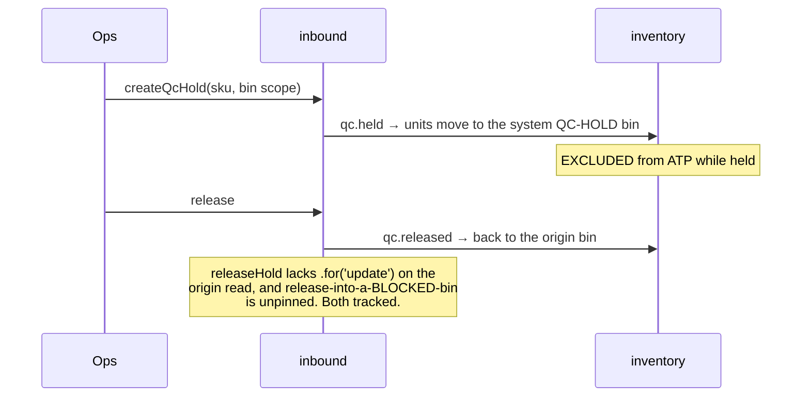

# Inbound module

> Vendors, the purchase-order lifecycle, scan-based receiving with over-receipt approval, and QC hold/release — everything upstream of putaway.

All paths are relative to `workspace/core/backend/wms-be/`.

Files: `src/modules/inbound/inbound.module.ts`, `vendors.command.ts`, `po.command.ts`, `inbound.facade.ts`, `receiving.command.ts`, `receiving.facade.ts`, `qc.command.ts`, `qc.facade.ts`, plus the DTOs (`inbound.dto.ts`, `receiving.dto.ts`, `qc.dto.ts`). HTTP shells: `src/api/inbound.controller.ts`, `src/api/receiving.controller.ts`.

---

## Owns

Six module-exclusive tables. All are declared in `src/shared/db/schema.ts`; RLS policies and every CHECK live **only** in the migration SQL (repo convention — text columns + hand-appended CHECK, never `pgEnum`).

| Table | Holds | Invariants / CHECKs |
| --- | --- | --- |
| `vendors` (`schema.ts:960`) | PO counterparties as a real entity (not free text), `is_default` for Epic 6's suggested-PO drafts. Tenant-scoped, **not** warehouse-scoped — a vendor is commercial master data. | `vendors_tenant_id_code_unique` (tenant, code). No edit path exists — create only. |
| `purchase_orders` (`schema.ts:998`) | Warehouse-scoped PO header: code, status, `carried_from_po_id` pointing at the closed predecessor. | `purchase_orders_tenant_id_code_unique`; `purchase_orders_status_check CHECK (status IN ('open','closed'))` (`drizzle/0011_tiresome_wraith.sql:74`). No FKs anywhere — `vendor_id` / `warehouse_id` / `carried_from_po_id` are bare uuids asserted inside the command transaction. |
| `purchase_order_lines` (`schema.ts:1051`) | `ordered_qty` / `received_qty` in **milli-units** (bigint, base UoM × 10³). `open_qty` is **never stored** — always derived `ordered − received`. | `status IN ('open','cancelled','carried')` (`0011:76`), `ordered_qty > 0`, `received_qty >= 0`, `unit_cost_paise >= 0` (`0011:84-88`). **There is deliberately no `received_qty <= ordered_qty` CHECK** — an approved over-receipt legitimately drives received past ordered (`drizzle/0013_steady_diamondback.sql:91-94`). |
| `goods_receipt_notes` (`schema.ts:1154`) | One GRN header per submit. `occurred_at` is device time (AD-1), `recorded_at` the server ingest instant. | `goods_receipt_notes_tenant_id_code_unique`; `status IN ('recorded')` (`0013:82`); `goods_receipt_notes_blind_pairing` — either `po_id IS NULL AND blind_reason_code IN ('unannounced-delivery','po-not-found','other')` or `po_id IS NOT NULL AND blind_reason_code IS NULL` (`0013:104`). The DB enforces the pairing both ways; the command's 400 is the friendly front end of it. |
| `goods_receipt_lines` (`schema.ts:1204`) | **Physical truth.** `qty` = everything that arrived; `applied_qty` = the within-open slice that hit the ledger and bumped `received_qty`. The difference pends as an `over_receipts` row. | `qty > 0`, `applied_qty >= 0`, `applied_qty <= qty` (`0013:95-99`). |
| `over_receipts` (`schema.ts:1241`) | One row per excess, awaiting `review.decide`. | `status IN ('pending','approved','rejected')`, `excess_qty > 0` (`0013:84-86`). |
| `qc_holds` (`schema.ts:1294`) | One Ops-Manager quarantine decision over a `(tenant, warehouse, sku, bin)` scope. `bin_id` is the **origin** bin captured at hold time — release returns stock there, never to a caller-chosen bin. | `qc_holds_open_scope_unique` — partial unique index `WHERE status = 'open'` on (tenant, warehouse, sku, bin), the DB backstop behind the command's 409; `status IN ('open','released')` and `qc_holds_release_pairing` (released ⇒ both `released_by` and `released_at` set; open ⇒ both null) (`drizzle/0014_fine_karen_page.sql:33-40`). |

**Not owned, read or written through seams:** `bins`/`zones` are tenancy master data — the Receiving and QC-hold system bins are ensured through `ensureReceivingBinInTx` / `ensureQcHoldBinInTx` (`src/modules/tenancy/receiving-bin.ts:51,114`), never written here. `batches` is catalog's — created through `CatalogFacade.ensureBatchesInTx`. All stock movement goes through `InventoryFacade`; this module writes **no** stock table (the `architecture.spec.ts` stock-table guard enforces it at build time).

---

---

## Schema (field level)

Seven tables. `tenantTimestamps` = `created_at`/`updated_at` (`timestamptz NOT NULL DEFAULT now()`). Every `id` is `uuid PRIMARY KEY` stamped `uuidv7()` in the app. No FKs. **Quantities are milli-units** (`bigint mode:'number'`); raw-SQL reads return strings and need `Number(...)`.

### `vendors`
`code` text NOT NULL (`unique (tenant_id, code)`) · `name` text NOT NULL · `is_default` boolean NOT NULL default `false` — **an unread flag today.** Written and read only by vendor create/list; `receiving.command.ts` references vendors nowhere, and a blind GRN carries `po_id = NULL` with no vendor at all. Its consumer is Epic 6's suggested-PO drafts (`schema.ts:961`), not yet built.

### `purchase_orders`

| Column | Type | Null | Default | Guard | Meaning |
|---|---|---|---|---|---|
| `vendor_id` | uuid | NO | — | — | |
| `code` | text | NO | — | `unique (tenant, code)` | Operator-facing PO number |
| `status` | text | NO | `'open'` | `purchase_orders_status_check` | `open \| closed` |
| `carried_from_po_id` | uuid | **YES** | — | — | Set on a **successor** PO created by `close()` carrying open quantity forward. Null on an original |

### `purchase_order_lines`

| Column | Type | Null | Default | Guard | Meaning |
|---|---|---|---|---|---|
| `ordered_qty` | bigint | NO | — | `..._ordered_qty_positive` | Milli-units |
| `received_qty` | bigint | NO | `0` | `..._received_qty_nonnegative` | Bumped by GRN apply **and** by an approved over-receipt |
| `unit_cost_paise` | integer | NO | — | `..._unit_cost_paise_nonnegative` | **Money — integer paise, NOT a quantity.** Deliberately not scaled by 10.1 |
| `expected_date` | timestamptz | **YES** | — | — | |
| `status` | text | NO | `'open'` | CHECK | Open quantity is derived (`ordered − received`), never stored |

### `goods_receipt_notes`

| Column | Type | Null | Default | Guard | Meaning |
|---|---|---|---|---|---|
| `code` | text | NO | — | `goods_receipt_notes_tenant_id_code_unique` (`0013:52`) | `GRN-<n>` zero-padded to 4 digits, **unique PER TENANT — two warehouses share one sequence** (`receiving.command.ts:173`, allocator locks `…':grn-seq'` at `:990`). Exhaustion should be a typed 409 and is not (epic-3 retro a14) |
| `po_id` | uuid | **YES** | — | `goods_receipt_notes_blind_pairing` | **Null on a blind receipt** |
| `blind_reason_code` | text | **YES** | — | same CHECK | **Compound, and stronger than a biconditional — it pins the enum too** (`0013:104-107`): `(po_id IS NULL AND blind_reason_code IN ('unannounced-delivery','po-not-found','other')) OR (po_id IS NOT NULL AND blind_reason_code IS NULL)`. **A new blind reason code needs a migration** |
| `status` | text | NO | `'recorded'` | CHECK | |
| `device_id` · `recorded_by` | uuid | NO | — | — | The badge-in session that produced it |
| `occurred_at` / `recorded_at` | timestamptz | NO | — | — | **Device time vs server time**, deliberately distinct |

### `goods_receipt_lines`

| Column | Type | Null | Default | Guard | Meaning |
|---|---|---|---|---|---|
| `po_line_id` | uuid | **YES** | — | — | Null on a blind line |
| `batch_id` | uuid | **YES** | — | — | Set only for a batch-tracked SKU |
| `qty` | bigint | NO | — | `..._qty_positive` | **What physically arrived** |
| `applied_qty` | bigint | NO | `0` | `..._applied_qty_nonnegative` **and** `goods_receipt_lines_applied_le_physical` (`applied_qty <= qty`) | What was applied to the PO line. **The difference is the over-receipt** |

### `over_receipts`

| Column | Type | Null | Default | Guard | Meaning |
|---|---|---|---|---|---|
| `po_id` · `po_line_id` | uuid | **YES** | — | — | Null when the excess came from a blind receipt |
| `excess_qty` | bigint | NO | — | `..._excess_qty_positive` | Milli-units. **Parked, not in stock, until approved** |
| `status` | text | NO | `'pending'` | `over_receipts_status_check` | `pending \| approved \| rejected` |
| `decided_by` / `decided_at` | uuid / timestamptz | **YES** | — | — | Stamped together on decision |

**Approve re-validates nothing about the PO today** — a close-then-approve bumps a closed line's ceiling (epic-3 retro a1).

### `qc_holds`

| Column | Type | Null | Default | Guard | Meaning |
|---|---|---|---|---|---|
| `sku_id` · `bin_id` | uuid | NO | — | partial unique on `open` | **The hold scope is (sku, bin)** — not a quantity, not a batch |
| `reason` | text | NO | — | — | |
| `status` | text | NO | `'open'` | `qc_holds_status_check` | `open \| released`. **One open hold per scope** |
| `released_by` / `released_at` | uuid / timestamptz | **YES** | — | — | |

**An open hold excludes that (sku, bin) from ATP** — the exclusion is computed, never written to stock.

---

## Public seam

Three exported facades (`inbound.module.ts:55`). Nothing outside imports a command service.

### `InboundFacade` (`inbound.facade.ts`)

| Method | Does | Called by |
| --- | --- | --- |
| `createVendor(command, idempotencyKey)` → `VendorSnapshot` | Delegates to `VendorCommand.create`. | `api/inbound.controller.ts:72` |
| `createPurchaseOrder / amendPurchaseOrder / closePurchaseOrder(command, key)` | Delegates to `PurchaseOrderCommand`. Close returns `ClosePoSnapshot` = closed PO + successor-or-null. | `api/inbound.controller.ts:136,256,309` |
| `listVendors(tenantId, query)` → `Page<VendorEntry>` (`:143`) | Keyset page, newest first. | inbound controller |
| `listPurchaseOrders(tenantId, warehouseId, query)` → `Page<PurchaseOrderEntry>` (`:185`) | Headers only, warehouse-scoped, optional status filter. Asserts the warehouse is in the tenant first (404). | inbound controller |
| `getPurchaseOrder(tenantId, poId)` → PO + lines, or `null` (`:236`) | Existence check precedes the line query so an unknown/foreign id is a 404, not an empty detail. | inbound controller |

### `ReceivingFacade` (`receiving.facade.ts`)

| Method | Does | Called by |
| --- | --- | --- |
| `submitGoodsReceipt(command, key)` (`:163`) | The whole-GRN device command. | `api/receiving.controller.ts:89` |
| `decideOverReceipt(command, key)` (`:171`) | approve/reject. | `api/receiving.controller.ts:239,273` (two routes, one command) |
| `listGoodsReceipts(tenantId, query)` (`:184`) | GRN headers + per-GRN `lineCount`/`totalUnits`/`appliedUnits`, folded in a **second query over the page's ids only** — never a full-table aggregate. | receiving controller |
| `listOverReceipts(tenantId, query)` (`:271`) | The Conflicts & Reviews queue, GRN code joined. | receiving controller |
| `getCatalogSnapshot(tenantId, warehouseId)` → `CatalogSnapshot` (`:326`) | The sealed AD-4 offline surface: SKUs (via `CatalogFacade.getSkuSummariesInTx`), the warehouse's open POs with per-line ordered/received/open, plus story 3.5's `bins` and `putawayTasks` composed through `PutawayFacade`'s in-tx reads. | `api/receiving.controller.ts:142` |

### `QcFacade` (`qc.facade.ts`)

`placeHold` (`:91`), `releaseHold` (`:96`), `listQcHolds(tenantId, query)` (`:105`) — warehouse- and status-filterable. Called from `api/receiving.controller.ts:311,355,386`.

### The one non-facade export

`openQcHoldsForBinsInTx(tx, tenantId, warehouseId, binIds)` (`qc.command.ts:80`) — a file-level helper in the `assertWarehouseInTenant` style, imported by `src/modules/tenancy/bin.command.ts:35`. Bin merge and retire must refuse a bin carrying an open hold; tenancy composes that guard through this function rather than reaching into `qc_holds` itself.

---

## Flows

### Receiving — PO to putaway task

```mermaid
sequenceDiagram
  autonumber
  actor Ops
  actor Op as Operator — device
  participant Ib as inbound
  participant Cat as catalog
  participant Inv as inventory
  participant Pt as putaway

  Ops->>Ib: createPurchaseOrder (vendor, lines)
  Note over Ib: status = expected
  Op->>Ib: GET catalog-snapshot
  Note over Ib,Cat: composed at the API SHELL across<br/>inbound + outbound — NOT by importing<br/>a sibling module (tried, reverted, flaked)
  Op->>Ib: recordGoodsReceipt (scans; ≤4 scans + 1 confirm budget)
  Ib->>Inv: appendLedgerEventInTx → grn.received (into the RECEIVING bin)
  Note over Ib: partial · blind · over-receipt all one flow
  alt over the line ceiling
    Ib->>Ib: over_receipts row → review queue
    Ops->>Ib: approve → bumps the PO line ceiling
    Note over Ib: does NOT re-validate PO/line status —<br/>a close-then-approve bumps a CLOSED line
  end
  Ib-->>Pt: stock now sits in the receiving bin = a putaway task
  Note over Pt: tasks are DERIVED from receiving-bin<br/>on-hand, not a queue table
```

### QC hold — quarantine without moving the ledger's mind



An adjustment through the QC bin is refused (`400 qc-bin-not-adjustable`) — it would drop ATP with no hold row and no release path.

---

## Commands

Every command follows the same invariant order inside `withTenantTransaction`:
**authority (fresh DB role read) → idempotency replay lookup → validation → master-data asserts → writes → in-tx outbox append → (audit row) → idempotency-key insert with payload hash + response snapshot.**

Authority sits **before** the replay lookup deliberately — a revoked actor must be refused even for a request that already committed. Everything else (validation, unit conversion) sits **behind** it, so a queued op that already settled replays its original response instead of answering 400 to rules that changed since (`receiving.command.ts:313-316`, `putaway`-style note repeated in `po.command.ts:140-149`).

Replay semantics are uniform: same key + same payload hash → the stored snapshot; same key + different hash → 422 `idempotency-key-reuse`; concurrent insert losing `idempotency_keys_tenant_id_key_unique` → 409 `conflict`.

### `vendor.create` — `VendorCommand.create` (`vendors.command.ts:57`)

Guards: `assertPermission('vendor.manage')` (`:74`) → replay → insert. Writes `vendors`. Emits outbox `vendor.created` (`:131`). Duplicate `(tenant, code)` → 409 naming the code (`:121`).

### `po.create` — `PurchaseOrderCommand.create` (`po.command.ts:170`)

Guards in order: `assertPermission('po.manage')` (`:191`) → replay (`:196`) → `assertWarehouseInTenant` → `assertVendorInTenant` → `assertSkuIdsInTenant` (one query returning each SKU's base UoM) → `scaleLines` (base → milli, refusing precision the UoM does not declare) (`:213`). Writes `purchase_orders` + `purchase_order_lines` (`received_qty` 0, `status` `open`). Emits `po.created` carrying the full PO+lines snapshot. Duplicate code → 409.

### `po.amend` — `PurchaseOrderCommand.amend` (`po.command.ts:261`)

The request carries the **complete new line set**: entries with an `id` update in place, entries without are added, existing lines absent from the request are **deleted**. `received_qty` is never touched.

Guards: permission → replay → `loadOpenPo` (`.for('update')`, 404 if missing, 409 `po-not-open` if closed, `:586`) → every referenced line id must belong to this PO (404) and appear at most once (400 — a repeated id is ambiguous under full-set semantics) → SKU asserts → scale. Writes: deletes, then in-place updates, then inserts; touches `purchase_orders.updated_at` even though only lines changed (`:348`), because that column rides the list/detail reads. Emits `po.amended`.

### `po.close` — `PurchaseOrderCommand.close` (`po.command.ts:377`)

See *Key algorithms → PO close and carry-forward*. Guards: permission → replay → `loadOpenPo` → close is **total** (exactly one disposition per line: duplicates 400, unknown ids 404, missing lines 400) → a `carried` line with `ordered − received <= 0` is 400 ("cancel it instead" — `ordered_qty > 0` must hold on the successor). Writes: optional successor PO + its lines, then `status='closed'` on the original and each line's disposition into `purchase_order_lines.status`. Emits `po.closed` with `{ purchaseOrder, successor }`.

### `grn.submit` — `ReceivingCommand.submitGoodsReceipt` (`receiving.command.ts:227`)

Device-authenticated. Guards in order:
1. Device row re-read `.for('update')`, fail-closed: missing, non-`active`, or `pinHash === null` → `deviceRevoked()` (`:268`).
2. Operator role re-read from `users` in the same tx; `accountant` (or unknown) → 403 `role-denied` (`:281`). The token is transport, never authority (AD-10).
3. Replay lookup (`:293`).
4. Body validation: ≥1 line, ≤200 lines, `occurredAt` a Z-suffixed UTC instant, blind pairing (`validateBlindPairing`, `:922`), per line `qty > 0` and `<= fromMilli(MAX_GRN_LINE_QTY)`, `mfgDate` UTC when present, and no `poLineId` on a blind receipt (`:305-330`).
5. `assertWarehouseInTenant`, `loadSkus` (404 naming the unknown SKU).
6. Unit conversion + precision refusal (`:345-352`) — below this point every quantity is milli-units.
7. `ensureReceivingBinInTx` (`:355`).
8. PO arm (only when `poId !== null`): PO row `.for('update')`, 404 if absent, **409 `po-not-open` if closed** — a stale queued receipt retracts visibly. PO lines locked `.for('update')` (`:358-388`).
9. `ensureBatchIdentity` (`:394`) — one `CatalogFacade.ensureBatchesInTx` per batch-tracked SKU; a batch code on an untracked SKU, or a missing one on a tracked SKU, is 400 before any write.

Writes: `goods_receipt_notes` (code from `allocateGrnCode`), `goods_receipt_lines`, `purchase_order_lines.received_qty` increments, `over_receipts` rows, `devices.last_seen_at` heartbeat, `idempotency_keys`. Ledger: one `grn.received` movement per applied line via `InventoryFacade.appendLedgerEventInTx` (`:537`), `fromBinId: null → toBinId: receivingBin`. Emits `grn.recorded` (`:636`) plus one `over_receipt.requested` per pending excess (`:644`).

### `review.decide` — `ReceivingCommand.decideOverReceipt` (`receiving.command.ts:677`)

Guards: `assertPermission('review.decide')` → replay → row `.for('update')`, 404 if absent, **409 `over-receipt-decided` if not `pending`** (decisions are terminal).

Approve: ensure the **Receiving** bin (not the QC bin — the excess is ordinary intake), append a further `grn.received` movement for `excess_qty` carrying the GRN line's batch identity (`:758`), then re-check the cumulative received ceiling and bump `received_qty` (`:786-801`). Reject: no movement at all. Both arms: conditional `UPDATE … WHERE status='pending'`, an `audit_events` row, and outbox `over_receipt.approved` | `over_receipt.rejected` (`:751`, `:821`).

Corrections are new events, never edits — that is why approval appends a second `grn.received` rather than amending the first.

### `qc-holds.place` — `QcCommand.placeHold` (`qc.command.ts:139`)

Guards: `assertPermission('qc.manage')` (`:150`) → replay → `reason` non-blank and ≤200 chars → `assertWarehouseInTenant` → SKU in tenant → **serial-tracked SKUs refused** (`:192`, see Gotchas) → bin row in the tenant's warehouse, locked `.for('update')` (`:212`) → the QC-hold bin itself may not be a hold origin (`:224`) → **12-3 secure-authority gate**: `assertSecureBinAuthority(role, [originBin])` on the locked row (`:281`) → 403 `role-denied` naming `secure.move` when the origin bin is secure-class and the actor lacks the capability (FR-42 — held units leave the origin; non-denying today, the users.spec invariant keeps the subset enforced; a replayed idempotency key returns the cached success before this gate) → no existing open hold for the scope (409 `qc-hold-open`, `:246`) → `InventoryFacade.qcScopeOnHandInTx` must return `quantity > 0` (400 otherwise — "a hold quarantines stock that exists").

Writes: one `qc.held` ledger movement per batch on-hand arm (untracked SKUs move on a single `batchRef: null` arm, `:266-271`), then the `qc_holds` row; the partial unique index is caught and re-thrown as the same 409 (`:316-325`). Emits outbox `qc_hold.placed` and an `audit_events` row (its `reference` is the caller's **idempotency key** — the excursion command passes an `excursionId` there instead, which is why `placeHold` keeps authority/replay/idempotency and delegates the movement+row-write core to `holdScopeInTx`).

**12-5 — ONE hold implementation.** The movement+row-write core of `placeHold` (per-scope SKU refusals, locked bin read, QC-HOLD-origin refusal, `assertSecureBinAuthority`, the one-open-hold 409 + unique-violation backstop, the per-batch `qc.held` arms, hold row, outbox, audit) is extracted verbatim into the in-tx helper **`holdScopeInTx(tx, command, role, auditReference)`** (`qc.command.ts`, exported via `QcFacade`). `placeHold` is now a shell around it — authority, replay, validation, then one call; its audit reference stays the idempotency key, while the excursion command passes its `excursionId`. The extracted core is byte-identical in behavior (pinned by the `placeHold` regression in `test/excursions.spec.ts`); the compliance module holds through it and never touches `qc_holds` directly.

### `qc-holds/:id/release` — `QcCommand.releaseHold` (`qc.command.ts:390`)

Guards: `qc.manage` → replay → hold row `.for('update')`, 404 / 409 `qc-hold-released` if already released → the **origin bin must still exist and not be retired** (409 `qc-hold-origin-bin-gone`, and the hold **stays open**) → **12-3 secure-authority gate**: `assertSecureBinAuthority(role, [origin])` on the origin read (`:552`) → 403 `role-denied` naming `secure.move` when the origin-return bin is secure-class and the actor lacks the capability (FR-42 — released units return to the origin). The origin read has no `.for('update')` (the standing PENDING `inbound:45` currency note; 12-3 adds the assert on the class read, not the lock) → the hold's own `qc.held` arms must exist (409 if none — refuses a blind release rather than guessing).

Writes: one `qc.released` movement per replayed arm, `qcBin → row.binId`; conditional `UPDATE … WHERE status='open'`; audit row; outbox `qc_hold.released`.

---

## Key algorithms

### The receiving fold (`receiving.command.ts:415-497`)

Per PO line, a running `openRemaining` map starts at `ordered_qty − received_qty` — derived under the PO-line row locks, never read from a stored `open_qty` — and **shrinks line by line** (`:418-420`, `:474`). That is what makes two GRN lines against the same PO line settle in receipt order rather than each independently seeing the full opening.

For each input line:
- **Blind arm** (`command.poId === null` or `input.poLineId === null`): the physical quantity applies in full — there is no PO to gate it (`:441`).
- **Unknown PO line** → pushed to `rejected` with code `po-line-not-found`; **non-`open` PO line** → `po-line-not-open`. Both leave the *other* lines settling (`:450`, `:461`). This is the partial-settlement contract: the response carries `rejectedLines` only when non-empty (`:628`), and a receipt where *every* line was rejected still records a GRN with zero settled lines (`:495`).
- **Otherwise**: `applied = max(0, min(qty, remaining))`, `excess = qty − applied` (`:471-473`). `applied` drives the ledger event and the `received_qty` bump; `excess > 0` becomes a pending `over_receipts` row (`:484`).

The GRN line itself always stores the **physical** `qty` with `applied_qty` alongside — so the DB CHECK `applied_qty <= qty` holds by construction and the excess is recoverable from the row pair without consulting `over_receipts`.

Two ceilings, both deliberately 400s rather than SQL overflows: the per-line cap (`MAX_GRN_LINE_QTY = MAX_QUANTITY_MILLI`, the 2⁵³ exact-integer ceiling JS and the Valkey Lua both cross, `:164-171`) and the **cumulative** cap — `poLine.receivedQty + applied > MAX_GRN_LINE_QTY` (`:560`). The cumulative one matters because per-line `@Max` admits quantities whose *sum* would overflow, and the same check is repeated in the approve arm (`:790`) so an over-receipt can never be stuck permanently pending behind a 500.

### GRN code allocation (`receiving.command.ts:988`)

`pg_advisory_xact_lock(hashtextextended(tenantId || ':grn-seq', 0))`, then `max(substring(code from '^GRN-([0-9]{1,9})$')::int) + 1`, zero-padded to 4. The regex is load-bearing three ways: a non-numeric suffix (fixture, import) is *ignored* rather than raising a cast error; a 5-digit code past the pad sorts numerically, not lexically; and the `{1,9}` bound means a forged oversized numeric tail overflows nothing. The unique `(tenant, code)` index is the race backstop behind the lock.

### Blind receipts

`poId: null ⇔ blindReasonCode ∈ {unannounced-delivery, po-not-found, other}` — enforced in `validateBlindPairing` (`:922`) as a 400 and again by `goods_receipt_notes_blind_pairing` in SQL. A blind receipt's lines carry no `poLineId` (400 otherwise, `:329`), apply in full, bump no `received_qty`, and raise no over-receipt. Blind GRNs are flagged on the web Inbound surface for later PO matching.

### The QC hold's ATP exclusion (`src/modules/inventory/reservation.service.ts:53`)

The hold is **not** a subtraction driven by the `qc_holds` table. The hold *relocates* stock: real `qc.held` movements carry the scope's on-hand from the origin bin into the warehouse's system QC-hold bin. `qcHeldUnits` then computes the held quantity as `sum(stock_on_hand.quantity)` joined to the bin whose `code = 'QC-HOLD' AND system_owned = true` (`reservation.service.ts:63-79`). ATP is `on-hand − reserved − qcHeld − buffer`, so the held stock is subtracted because of where it physically sits — no cross-module hold-table read, and ATP drops the moment the movement commits.

Two consequences an implementer must keep in mind:
- The QC-hold bin's identity is **code + `system_owned`**. `ensureQcHoldBinInTx` re-selects with both predicates (`receiving-bin.ts:164-170`) precisely so a user-created bin named `QC-HOLD` is never adopted — adopting it would park stock where the ATP hook counts zero.
- Release replays the hold's **own** arms, read back out of the ledger by `referenceDoc->>'holdId'` (`InventoryFacade.qcHeldArmsInTx`, `inventory.facade.ts:1092`), not the current on-hand of the QC bin. A concurrent hold of the same SKU from another origin bin therefore cannot be returned by the wrong release.

### PO close and carry-forward (`po.command.ts:377-515`)

Close is total and two-valued per line: `cancelled` or `carried`.

If any line is `carried`, exactly **one** successor PO is created in the same transaction: same vendor and warehouse, `carriedFromPoId` = the original, `status='open'`, and one line per carried line whose `orderedQty = line.orderedQty − line.receivedQty` with `receivedQty` reset to 0 (`:462-484`). The successor's code comes from `deriveSuccessorCode` (`:682`): the original code truncated to 60 chars (keeping `-C99` inside the DTO's 64-char bound) plus `-C{n}` for the first free `n` in 1..99; exhausting all 99 is a 409. The locked original means two concurrent closes cannot both reach here; the unique `(tenant, code)` index is the backstop.

**The arithmetic must run on raw rows.** `close` calls `lineRowsOf` (`:744`) — stored milli-units — never `linesOf`/`lineSnapshot`, which converts out to base units for the read edge. The comment at `po.command.ts:731-738` records the defect: handing an edge-converted snapshot to an internal caller made a carried PO line land on its successor **a thousand times too small**.

### The device catalog snapshot (`receiving.facade.ts:326`)

All four parts — catalog SKUs, open POs with lines, bins, derived putaway tasks — compose on **one** transaction via in-tx passthroughs (`:334`, `:380-381`). The earlier shape called pool-opening facade methods inside `Promise.all`, so one snapshot request held four pooled connections at once; postgres.js queues connection requests with no timeout, so past `max / 4` concurrent snapshots every outer transaction waited forever for a nested one that could never be granted — a permanent deadlock that also stranded connections at the server (`:368-379`). Composing in one transaction is also what makes "sealed snapshot" a single consistent read rather than four MVCC snapshots stitched together.

---

## Invariants

| Invariant | Enforced by |
| --- | --- |
| `open_qty` is never stored. | No column exists; `lineSnapshot` derives it at every read (`po.command.ts:768`). |
| A GRN line records physical truth; only the within-open slice applies. | The fold (`receiving.command.ts:471`) + `goods_receipt_lines_applied_le_physical` CHECK (`0013:99`). |
| `received_qty` may exceed `ordered_qty` (approved over-receipts). | The *absence* of a CHECK, recorded as a decision at `0013:91-94`. Do not "fix" this. |
| A PO is not stock. | This module writes no stock table; `architecture.spec.ts` stock-table guard fails the build if one appears. |
| Receipts land only against an **open** PO; a cancelled/carried *line* is rejected per-line while siblings settle. | `receiving.command.ts:375` (409) and `:459` (per-line rejection). |
| One open QC hold per `(tenant, warehouse, sku, bin)`. | Command pre-check 409 (`qc.command.ts:246`) + partial unique index `qc_holds_open_scope_unique`, whose violation is translated to the same 409 (`:316-325`). |
| Held stock returns to the bin the hold recorded — never a caller-chosen one. | `qc_holds.bin_id` captured at place time; release passes `row.binId` as `toBinId` (`qc.command.ts:505`). |
| A bin with an open hold can neither retire nor be a merge source/target. | `openQcHoldsForBinsInTx` consumed by `bin.command.ts:553` and `:834` → 409 `bin-merge-hold-open`. Without it the hold's stock is already in the QC bin, so the empty-gate alone would let the origin bin retire and strand the hold with no resolution path (`bin.command.ts:829-833`). |
| No partial release, no scrap disposition. | `releaseHold` replays every arm; a failed inspection keeps the hold open — quantity shrinkage is Epic 5's adjustment path (`qc.command.ts:383-388`). |
| Over-receipt decisions are terminal. | `.for('update')` + `status !== 'pending'` → 409, plus the conditional `UPDATE … WHERE status='pending'` (`receiving.command.ts:726`, `:803`). |
| Batch identity is only ever created through `CatalogFacade`. | `ensureBatchIdentity` (`receiving.command.ts:943`); no `batches` write exists in this module. |
| Bin/zone master data is tenancy-owned. | System bins reached only through `ensureReceivingBinInTx` / `ensureQcHoldBinInTx`. |
| Quantities are milli-units in the domain, base units at every edge. | `scaleLines` / `assertRecordableQuantity` on the way in; `fromMilli` in `lineSnapshot`, every snapshot, and every outbox payload. |

---

## Events

**Ledger event types** (registered in `src/modules/inventory/ledger-registry.ts`), all appended through `InventoryFacade.appendLedgerEventInTx`:

| Type | Reference kind | Batch arm | Serial arm | Shape |
| --- | --- | --- | --- | --- |
| `grn.received` (`ledger-registry.ts:221`) | `grn-receipt` (`grnId`, optional `poId`/`poLineId`) | yes | **no** — there is no serial intake path yet | `fromBinId: null → toBinId: Receiving bin` |
| `qc.held` (`:239`) | `qc-hold` (`holdId`, `fromBinId`) | yes | no | origin bin → QC-hold bin, one event per batch arm |
| `qc.released` (`:247`) | `qc-hold` (`holdId`) | yes | no | QC-hold bin → origin bin, replaying the hold's arms |

**Outbox types** (in-transaction append, AD-7 — a replayed command appends nothing because it returns before the append):

`vendor.created` · `po.created` · `po.amended` · `po.closed` (payload `{ purchaseOrder, successor }`) · `grn.recorded` (full GRN snapshot) · `over_receipt.requested` · `over_receipt.approved` · `over_receipt.rejected` · `qc_hold.placed` · `qc_hold.released`.

**Audit rows** (`audit_events`, `reference` = the idempotency key): `over_receipt.approved|rejected` (`receiving.command.ts:810`), `qc_hold.placed` (`qc.command.ts:369`), `qc_hold.released` (`qc.command.ts:546`). The PO and vendor commands write no audit row.

---

## Gotchas

1. **Never hand a `lineSnapshot` to an internal caller.** `linesOf` converts milli → base for the read edge; `lineRowsOf` returns stored milli-units. Close does arithmetic, so it must use `lineRowsOf`. The comment at `po.command.ts:731-738` names the actual defect: a carried PO line landed on its successor a thousand times too small.

2. **The device catalog snapshot must not nest transactions.** `receiving.facade.ts:368-379` records a real pool deadlock: four nested pool-opening reads inside one outer transaction, postgres.js queueing connection requests with no timeout, and every outer transaction past `max / 4` waiting forever. If you add a fifth part to the snapshot, add it as an `…InTx` passthrough on the caller's `tx`.

3. **The idempotency payload hash is over BASE units since story 10.2.** Conversion moved from the controller into the command, behind the replay lookup, so a key written by a pre-10.2 build now answers 422 `idempotency-key-reuse` instead of replaying. This is deliberate, has no compatibility branch, and is pinned as EXPECTED by the cross-version replay guard in `test/picking.spec.ts` (`receiving.command.ts:232-244`, `po.command.ts:171-180`). Do not "restore" pre-10.2 replay.

4. **Serial-tracked SKUs cannot be QC-held** (`qc.command.ts:186-197`). The `qc.held`/`qc.released` types have their serial arm closed, so a bulk `(sku, bin)` hold would relocate the stock while the serials' ledger-derived location records stayed at the origin bin — divergence with no repair path. The refusal is before any movement is appended.

5. **Authority before replay, conversion after.** Both halves matter. Moving `assertPermission` behind the replay lookup would let a revoked actor re-serve a snapshot; moving the precision refusal in front of it would answer 400 to a queued op that already committed (`receiving.command.ts:313-317`).

6. **`received_qty` has a cumulative ceiling that the per-line DTO `@Max` does not cover.** Checked in both the submit fold (`receiving.command.ts:558-563`) and the approve arm (`:788-795`); the approve-arm check exists so an unapprovable row cannot sit pending forever behind a SQL overflow 500.

7. **`received_qty` updates bind `::bigint` explicitly** (`receiving.command.ts:568`, `:801`). The column is bigint; an untyped literal beside it invites int4 inference and a 22003 at silo scale. `test/architecture.spec.ts:558` fails the build for any quantity bound into raw SQL without the cast.

8. **The QC-hold bin's identity is code + `system_owned`, not code alone** (`receiving-bin.ts:164-170`). A user-created bin named `QC-HOLD` is not the QC bin; adopting it would park stock where `qcHeldUnits` counts zero and ATP would silently stop excluding held stock.

9. **An all-rejected GRN still records.** `settled.length === 0` skips only the line insert (`receiving.command.ts:495`); the header, the outbox event, and the idempotency key are still written. A caller that treats "no lines" as failure will mis-handle a stale-cache receipt.

10. **`carriedFromPoId` has no FK and no cascade.** It is a bare uuid validated in-command; the `purchase_orders_tenant_carried_from_idx` index is what makes the chain walkable.
