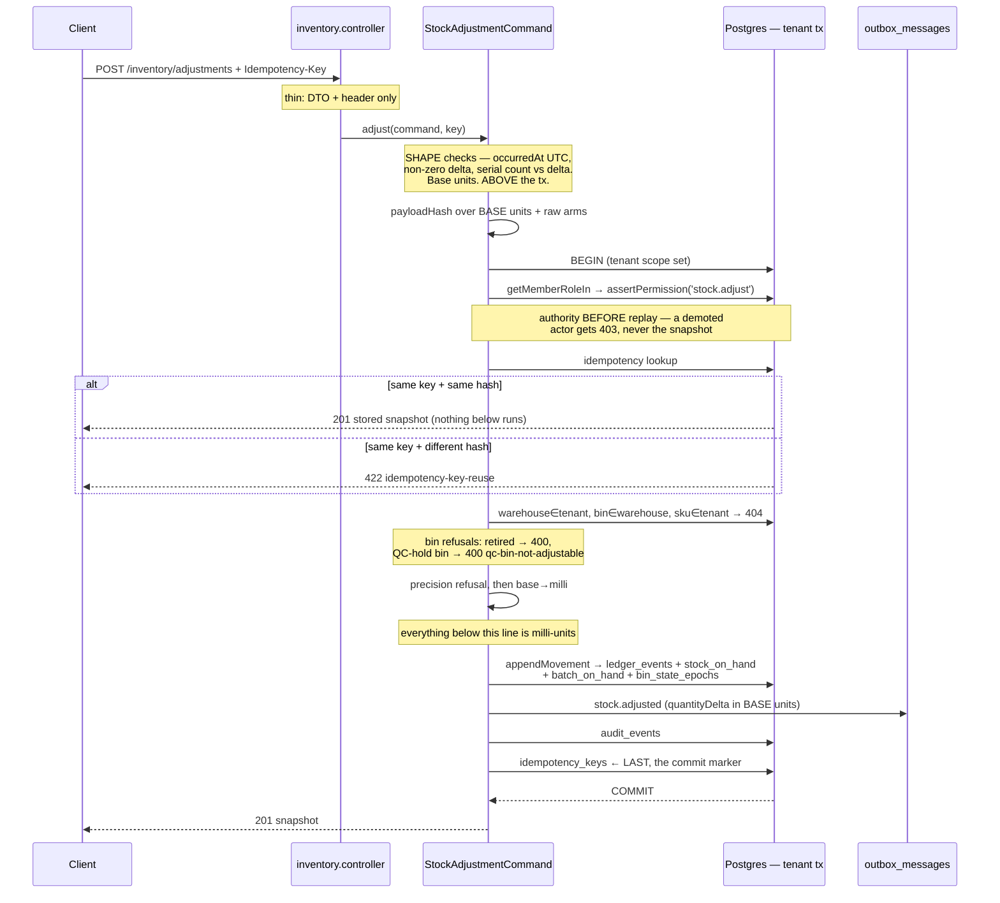
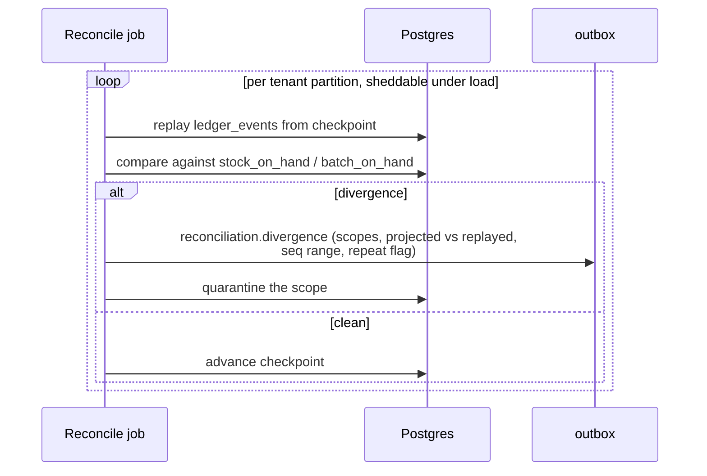

# Inventory module

> The append-only, hash-chained ledger that is the system's only stock truth, plus everything derived from it: the on-hand projections, the bin state epochs, reservations/ATP, and continuous replay-reconciliation.

All paths below are relative to `workspace/core/backend/wms-be`.

Files: `src/modules/inventory/{inventory.module,inventory.facade,inventory.command,inventory.dto,ledger.service,ledger-registry,reservation.service,reconcile,anchor-store}.ts`.

---

## Owns

Eight tables. Every one of them is module-exclusive: `test/architecture.spec.ts:116` fails any stock-table write from outside `src/modules/inventory`, and `test/architecture.spec.ts:134` further pins `stock_on_hand` / `batch_on_hand` / `bin_state_epochs` mutation to the single file `ledger.service.ts` (`PROJECTION_OWNER`, `test/architecture.spec.ts:37`). RLS policies, CHECKs and triggers for all of them live **only in the migration SQL**, never in `schema.ts` — the repo's hand-append pattern.

| Table | Holds | Invariants and where they live |
| --- | --- | --- |
| `ledger_events` (`src/shared/db/schema.ts:500`) | One immutable row per movement: `(tenant, warehouse, seq)`, `type` + `schema_version`, `sku_id`, signed `quantity_delta` (milli-units, bigint), `from_bin_id`/`to_bin_id`, `batch_ref`/`serial_ref`, `occurred_at` (business time) vs `recorded_at` (commit time), `reference_doc` jsonb, `prev_hash`/`event_hash`. | Append-only at the DB: `ledger_append_only_guard` rejects UPDATE/DELETE (`drizzle/0006_curvy_nehzno.sql:84-96`) **and TRUNCATE** via statement-level triggers (`:101-107`). `seq` gap-free and unique per warehouse: `ledger_events_tenant_warehouse_seq_unique` behind the advisory lock. Corrections are new compensating events, never edits. |
| `stock_on_hand` (`schema.ts:579`) | Derived quantity per (tenant, warehouse, sku, bin), milli-units. | `stock_on_hand_quantity_nonnegative` CHECK (`drizzle/0006_curvy_nehzno.sql:112`, re-added post-milli-units at `drizzle/0026_fractional_quantity_milli_units.sql:137`). Written only in the same transaction as the event that moves it. |
| `batch_on_hand` (`schema.ts:625`) | The batch arm of the same projection: (tenant, warehouse, sku, bin, **batch**). | `batch_on_hand_quantity_nonnegative` CHECK (`drizzle/0010_sharp_hardball.sql:78`). Re-derives exactly from the ledger; the fold rejects a batch over-draw first, naming the batch. |
| `bin_state_epochs` (`schema.ts:678`) | One opaque monotonic counter per (tenant, warehouse, bin) — AD-14's staleness token for device-queued ops. | `bin_state_epochs_epoch_positive` CHECK (`drizzle/0021_lean_george_stacy.sql:25`). Starts at 1, never 0 (0 on the wire is indistinguishable from "no epoch"). Bumped inside the folds, in the same transaction and under the same advisory lock as the movement. Compare for **equality only** — never a quantity, timestamp or sequence. |
| `ledger_anchors` (`schema.ts:707`) | Committed chain heads: `from_seq..to_seq` + `digest` + `anchored_at`. | Same append-only trigger pair as `ledger_events`. `ledger_anchors_tenant_warehouse_to_seq_unique` is the DB backstop against two overlapping anchor ranges. |
| `reservations` (`schema.ts:911`) | The hold journal — the durable truth Valkey mirrors. `(tenant, warehouse, sku)` scope, never bin-level; `owner_type`/`owner_id`; `quantity` (milli-units); `state`; `expires_at`. | `reservations_state_check` restricts state to `held|committed|released|expired` (`drizzle/0009_overjoyed_sway.sql:38`) — a typo'd state would silently drop the row out of every `state = 'held'` consumer and corrupt the mirror. `reservations_quantity_positive` (`:42`). `reservations_open_owner_scope_unique` is **partial on `state = 'held'`**: one open hold per owner scope. |
| `reconciliation_checkpoints` (`schema.ts:899`) | One row per (tenant, warehouse) partition: `last_seq` watermark, `invalid_attempts`, `last_divergences` (the repeat memory), `incremental_count` (story 10.4 — bounded passes since the last full pass; the scheduled full pass's trigger). | `reconciliation_checkpoints_last_seq_nonnegative` (`drizzle/0008_lowly_khan.sql:59`). One row per partition (unique index). An **existing** checkpoint's cycle state is never overwritten by the reconcile failure path — that path's fresh-row INSERT (`last_seq 0`, `ON CONFLICT DO NOTHING`, story 10.4) writes the no-checkpoint defaults and is the deliberate exception. |
| `inventory_quarantines` (`schema.ts:854`) | Scopes that diverged **repeatedly** inside one checkpoint window, with the divergent seq range. | `inventory_quarantines_status_check` (`open|resolved`, `drizzle/0008_lowly_khan.sql:55`), `from_seq <= to_seq` (`:61`), and one OPEN row per scope (partial unique index). Consumed by ATP: an open quarantine excludes that (sku, bin) from sellable on-hand. |

Not owned but read for integrity or scope: `bins`, `skus`, `warehouses` (tenancy/catalog master data — read-only, never written here), `idempotency_keys`, `outbox_messages`.

---

## Schema (field level)

Every column of every owned table. `tenantTimestamps` expands to `created_at` / `updated_at`, both `timestamptz NOT NULL DEFAULT now()`. Every `id` is `uuid PRIMARY KEY`, stamped `uuidv7()` **in the app** — no `gen_random_uuid()` default. No FK constraints anywhere (repo convention): a uuid column plus an index, validated in the command transaction.

**Quantities are milli-units** (base UoM × 10³) as `bigint` with Drizzle `mode: 'number'`, which maps through `Number(value)` — exact to 2⁵³, so ~9.0 × 10¹² base units. Raw SQL reads of these columns return **strings** from postgres.js and need `Number(...)` at the boundary.

### `ledger_events` — the only stock truth

| Column | Type | Null | Default | Guard | Meaning |
|---|---|---|---|---|---|
| `id` | uuid | NO | uuidv7 (app) | PK | |
| `tenant_id` | uuid | NO | — | RLS | |
| `warehouse_id` | uuid | NO | — | keyset idx | |
| `seq` | integer | NO | — | `ledger_events_tenant_warehouse_seq_unique` | **Gap-free per warehouse**, allocated under the warehouse advisory lock |
| `type` | text | NO | — | registry, not a CHECK | Grammar arm, e.g. `pick.picked`. Validated by `ledger-registry.ts` before write |
| `schema_version` | integer | NO | — | — | The arm's `sinceVersion` (AD-11) |
| `sku_id` | uuid | NO | — | — | Never null — `LedgerMovement` requires it even on zero-quantity events |
| `quantity_delta` | bigint `mode:'number'` | NO | — | **no CHECK** | **Signed** milli-units; direction is the sign, never a convention. Zero is legal (pack, dispatch) |
| `from_bin_id` | uuid | **YES** | — | — | Null on a pure receipt |
| `to_bin_id` | uuid | **YES** | — | — | Null on a pure draw. Both null on a zero-quantity event |
| `batch_ref` | text | **YES** | — | arm's `allowsBatchArm` | Set only where the arm permits it |
| `serial_ref` | text | **YES** | — | arm's `allowsSerialArm` | One event per unit when set |
| `actor_user_id` | uuid | NO | — | — | |
| `occurred_at` | timestamptz | NO | — | — | **Business time** — the device's clock |
| `recorded_at` | timestamptz | NO | — | — | **Commit time** — the server's. Deliberately distinct |
| `reference_doc` | jsonb | NO | — | discriminated union | `kind` + arm-specific fields. **JSON-serialised into the hash**, so a BigInt here throws |
| `prev_hash` | text | NO | — | — | Chain link |
| `event_hash` | text | NO | — | — | Over the canonical form. **Migration 0026 rewrote `quantity_delta` without rehashing** — every pre-migration event fails `verifyChain` by design |

**Indexes:** `ledger_events_tenant_warehouse_seq_unique` (tenant, warehouse, seq) · `(tenant_id, serial_ref, seq)` — the one-query serial history · keyset `(tenant_id, warehouse_id, created_at, id)`
**RLS:** `ledger_events_tenant_isolation`
**Triggers:** `ledger_append_only_guard` is the *function* (`0006:84`); the triggers are `ledger_events_append_only` (`:90`), `ledger_anchors_append_only` (`:94`) and their statement-level TRUNCATE twins `ledger_events_append_only_truncate` (`:101`) / `ledger_anchors_append_only_truncate` (`:105`). A table rewrite by `ALTER COLUMN TYPE` fires neither — which is why 0026 could migrate it.

### `stock_on_hand` — the primary projection

| Column | Type | Null | Default | Guard | Meaning |
|---|---|---|---|---|---|
| `id` | uuid | NO | uuidv7 | PK | |
| `tenant_id` · `warehouse_id` · `sku_id` · `bin_id` | uuid | NO | — | scope unique | The projection key |
| `quantity` | bigint `mode:'number'` | NO | — | `stock_on_hand_quantity_nonnegative` | Milli-units. **Never negative** — the fold refuses the draw first |

**Written by exactly one file** — `ledger.service.ts`, pinned as `PROJECTION_OWNER` in `architecture.spec.ts:37`. **RLS:** `stock_on_hand_tenant_isolation`

### `batch_on_hand` — the batch arm

Same shape as `stock_on_hand` plus `batch_id uuid NOT NULL`; the key is (tenant, warehouse, sku, bin, **batch**). Guard `batch_on_hand_quantity_nonnegative`. The fold rejects a batch over-draw **before** the plain arm, so the refusal names the batch.

### `bin_state_epochs` — AD-14's staleness token

| Column | Type | Null | Default | Guard | Meaning |
|---|---|---|---|---|---|
| `tenant_id` · `warehouse_id` · `bin_id` | uuid | NO | — | `bin_state_epochs_scope_unique` | |
| `epoch` | bigint `mode:'number'` | NO | **`1`** | `bin_state_epochs_epoch_positive` | Opaque monotonic counter. **Starts at 1, never 0** — 0 on the wire is indistinguishable from "no epoch". Compare for **equality only**: never a quantity, timestamp or sequence |

Bumped inside the folds, same transaction and same advisory lock as the movement.

### `ledger_anchors`

| Column | Type | Null | Guard | Meaning |
|---|---|---|---|---|
| `from_seq` · `to_seq` | integer | NO | `ledger_anchors_tenant_warehouse_to_seq_unique` | Committed chain head range; the unique index is the backstop against two overlapping anchors |
| `digest` | text | NO | — | Chain digest over the range |
| `anchored_at` | timestamptz | NO | — | |

Same append-only trigger pair as `ledger_events`. **No HTTP route and no job** — facade-only, exercised today by tests.

### `reservations` — the hold journal Valkey mirrors

| Column | Type | Null | Default | Guard | Meaning |
|---|---|---|---|---|---|
| `tenant_id` · `warehouse_id` · `sku_id` | uuid | NO | — | — | **Scope is (tenant, warehouse, sku) — never bin-level** |
| `owner_type` | text | NO | — | — | **Only `order` is ever written** (`ORDER_OWNER_TYPE`, `order.command.ts:74`, written at `:767`). Picking carries the *order's* hold forward rather than minting a line-scoped one |
| `owner_id` | text | NO | — | — | text, not uuid |
| `quantity` | bigint `mode:'number'` | NO | — | `reservations_quantity_positive` | Milli-units |
| `state` | text | NO | `'held'` | `reservations_state_check` | `held \| committed \| released \| expired`. **A typo'd state would silently drop the row out of every `state = 'held'` consumer** and corrupt the mirror |
| `expires_at` | timestamptz | NO | — | — | TTL; the reaper sweeps `held` only |

**`reservations_open_owner_scope_unique` is PARTIAL on `state = 'held'`** — one open hold per owner scope, and the reason a `committed` owner read cannot use it.

### `reconciliation_checkpoints`

| Column | Type | Null | Default | Guard | Meaning |
|---|---|---|---|---|---|
| `last_seq` | integer | NO | `0` | `..._last_seq_nonnegative` | Watermark the partition has replayed through |
| `invalid_attempts` | integer | NO | `0` | — | Repeat counter driving quarantine |
| `last_divergences` | jsonb | **YES** | — | — | The repeat memory. `parseLastDivergences` must tolerate a malformed entry |

One row per (tenant, warehouse) partition, unique.

### `inventory_quarantines`

| Column | Type | Null | Default | Guard | Meaning |
|---|---|---|---|---|---|
| `warehouse_id` · `sku_id` · `bin_id` | uuid | NO | — | partial unique on OPEN — `(tenant_id, warehouse_id, sku_id, bin_id) WHERE status = 'open'` (`0008:26`) | The quarantined scope |
| `from_seq` · `to_seq` | integer | NO | — | `from_seq <= to_seq` | The divergent range |
| `reason` | text | NO | — | — | |
| `status` | text | NO | `'open'` | `inventory_quarantines_status_check` | `open \| resolved`. **One OPEN row per scope** (partial unique) |

**Consumed by ATP:** an open quarantine excludes that (sku, bin) from sellable on-hand.

---

## Public seam

`InventoryFacade` (`src/modules/inventory/inventory.facade.ts`) is the **only** thing a sibling may import — `test/architecture.spec.ts:165` fails any import of `modules/inventory/...` or `../inventory/...` that is not `inventory.facade`, `inventory.module` or `inventory.dto`, in both import-path forms. Types that cross the seam (`LedgerMovement`, `AppendedMovement`, `LedgerReferenceDoc`, `AtpSnapshot`, `GrantReservationCommand`, `ReservationSnapshot`) are **re-exported from the facade** (`inventory.facade.ts:27-36`) precisely so nobody reaches into `ledger.service` or `ledger-registry` for a type.

Two shapes recur. A plain method opens its own tenant transaction. A `…InTx(tx, …)` method runs inside the **caller's** transaction so the caller can compose the inventory write with its own writes atomically; those never open or commit anything themselves.

### Commands and writes

| Method (`inventory.facade.ts:`) | Does | Called by |
| --- | --- | --- |
| `adjustStock(command, idempotencyKey)` :227 | The `stock.adjustment` command; returns the snapshot. | `src/api/inventory.controller.ts` |
| `adjustmentFingerprint(command)` :265 | Command-owned payload hash for the api layer's replay pre-check — the api layer never hashes payload bytes itself. | `src/api/inventory.controller.ts:150` |
| `replayAdjustment(tenantId, key, payloadHash)` :278 | Returns the stored snapshot on hash match, throws 422 `idempotency-key-reuse` on mismatch, `null` when no row. **Replay beats composition** — see Gotchas. | `src/api/inventory.controller.ts:147` |
| `appendLedgerEventInTx(tx, movement)` :242 | The in-transaction ledger passthrough — registry gate, hash chain, projection fold, advisory locks. | receiving, qc, putaway, bin-merge, pick, pack, dispatch commands (7 files) |
| `lockSerialsInTx(tx, tenantId, serialRefs)` :252 | Pre-locks a whole serial set tenant-wide in sorted order before the first append. Deadlock avoidance — mandatory for multi-serial callers. | putaway, bin, pick commands |
| `lockWarehouseInTx(tx, tenantId, warehouseId)` :781 | Takes the same per-warehouse advisory xact lock `appendMovement` takes, so a caller that reads stock state and then acts on it holds writers off for the whole decision. Callers own lock **order**. | `outbound/pick.command.ts` |
| `rebuildProjections(tenantId, warehouseId, scope?)` :486 | Operator/test repair: rewrite divergent scopes to replayed quantities, alert in the same commit. | tests / operator |
| `reconcile` :468 / `reconcileNext` :477 | One reconciliation cycle / one partition per tick. | `src/jobs/jobs.module.ts:170` |
| `anchorChain(tenantId, warehouseId, uptoSeq?)` :444 | Verify-before-anchor, then commit one anchor row. Returns `ChainBreakReport` instead of anchoring on a break. | tests only today — no HTTP route, no job |
| `expireDueReservations()` :871 | The reaper entry. | `src/jobs/jobs.module.ts:234` |
| `rebuildReservationCounters(tenantId, warehouseId?)` :860 | Re-seed Valkey counters from the journal (Postgres wins). | tests / operator |

### Reservations

| Method | Does | Called by |
| --- | --- | --- |
| `grantReservation(command)` :499 | The atomic grant. Idempotent per owner scope; race loser gets 409 `unavailable`; store down gets 503 `reservation-store-unavailable`. | `outbound/order.command.ts` |
| `commitReservation` :504 / `commitReservationInTx` :518 | `held → committed`. Counter untouched — committed units stay deducted from ATP. | `outbound/pick.command.ts` (in-tx) |
| `releaseReservation` :527 / `releaseReservationInTx` :540 | `held → released`. The **in-tx** arm does the journal half ONLY; the caller applies one net `restoreReservedUnits` after commit. | order (plain), pick + pack (in-tx) |
| `retireCommittedReservationInTx` :561 | `committed → released` — the dispatch retirement, conditional on `state = 'committed'`. Until it runs, a picked order's units are deducted from ATP twice. | `outbound/dispatch.command.ts` |
| `grantReservationInTx(tx, command, releasedFrom)` :582 | Re-grant of the remainder of a hold this same transaction released for the same owner scope. Returns `null` (not a throw) when the remainder cannot be held — that is the partial-order path, not a fault. A violated precondition **does** throw. | `outbound/pick.command.ts` |
| `restoreReservedUnits(t, w, sku, units)` :596 | ONE net post-commit counter restore. | pick, pack, dispatch |
| `atp(tenantId, warehouseId, skuId)` :855 | `max(0, onHand − reserved − qcHeld − buffer)`, quarantine-excluded. | `outbound/order.command.ts` |
| `reservationsByIds` :612 / `reservationsByIdsInTx` :686 | Journal rows by id. | order, wave commands |
| `heldReservationsByOwnerInTx` :641 / `committedReservationsByOwnerInTx` :664 | Holds by OWNER, not by id — deliberately; see Gotchas. | pack / dispatch |
| `holdLivenessInTx` :624 | `{state, expiresAt, expired}` with `expired` judged by **the database's clock**. | `outbound/pick.command.ts` |

### Reads

`listEvents` :292 (keyset, newest first), `listStock` :369, `batchOnHand` :885, `batchBinsOnHand` :923 (tenant-wide by batch), `serialHistory` :945, `serialLocation` :981, `batchHistory` :1007, `replay` :420, `verifyChain` :430, `exportDigest` :453.

In-transaction reads for composing callers: `stockByBinsInTx` :706, `batchOnHandByBinsInTx` :791, `batchOnHandForBinInTx` :827, `binStateEpochInTx` :744, `binStateEpochsInTx` :760, `qcScopeOnHandInTx` :1047, `qcHeldArmsInTx` :1092, `serialsLocatedInBinInTx` :1132, `onHandInBinInTx` :1882 (every (sku, quantity>0) arm in one bin, ordered by SKU — 12-5's excursion sweep).

**Units rule.** The HTTP-facing reads convert milli-units back to base UoM with `fromMilli` at the boundary (`inventory.facade.ts:351`, `:407`, `:911`, `:936`). The `…InTx` helpers feed **commands**, not responses, and deliberately stay in milli-units (`inventory.facade.ts:346-350`). Getting this backwards silently scales a quantity by 1000.

---

## Flows

### Adjustment — the only path that opens the ledger from outside a domain flow



The serial arm (`adjustToSnapshot`) locks the whole serial set first, then appends N events of `QUANTITY_SCALE` each; the snapshot reports the **last** event with the bin's final on-hand — which is the mismatch recorded in `PENDING.md`.

### The ATP decision — deliberately split, and fail-closed

```mermaid
sequenceDiagram
  participant Cmd as A granting command
  participant V as Valkey — counter mirror
  participant PG as Postgres — the journal

  Cmd->>V: EVAL grant.lua (atomic check-and-decrement)
  alt counter missing
    V-->>Cmd: refuse
    Note over Cmd: FAIL CLOSED — never grant blind
  else granted
    V-->>Cmd: ok
    Cmd->>PG: journal the reservation (held)
    Note over Cmd,PG: journal is truth; the counter is a cache
  end
  Note over V,PG: post-commit mirrors NEVER throw —<br/>a decrement outliving a rollback reads as<br/>ATP the journal still holds. The reaper's<br/>parity pass self-heals; a 500 does not.
```

### Reconciliation — the correctness oracle



This is what makes the projections a cache rather than a second source of truth, and it is the acceptance oracle every quantity-shaped migration is judged against. **Nothing schedules `verifyChain` today**, and every pre-migration event reports severity-1 by design since 0026 rewrote `quantity_delta` without rehashing.

---

## Commands

### `StockAdjustmentCommand.adjust` (`inventory.command.ts:213`)

The only command service in the module. One request → one ledger event (or N, one per serial) + the projections, in ONE transaction.

Guards, in order — the order is load-bearing:

1. **Before the transaction** (shape questions about the request, answerable without a SKU row): `occurredAt` must be Z-suffixed UTC, mapped to 400 rather than surfacing the primitive's raw throw as a 500 (`:219-233`); non-zero delta (`:234`, `assertNonZeroDelta` `:380`); `serialRefs.length === |quantityDelta|` (`:243-251`) — an array length is a unit count, so this compares against the base-UoM delta.
2. `payloadHash = fingerprint(command)` (`:259`), over base units and over the **raw** request arms, never the FEFO-resolved refs.
3. Inside the tenant transaction, first: `assertPermission(getMemberRoleIn(...), 'stock.adjust')` (`:267`) — a DB role read **before** the idempotency lookup, so an actor demoted after the original request gets 403, never the stored snapshot.
4. Idempotency lookup (`:272-290`): same key + same hash replays the snapshot with no second event; same key + different hash is 422 `idempotency-key-reuse`.
5. Integrity: warehouse in tenant, bin in warehouse, SKU in tenant (`:295-300`) — all 404 before any write. The bin read also refuses a **retired** bin (400 `bin-retired`, `:424`) and the system **QC-hold bin** (400 `qc-bin-not-adjustable`, `:436`): an adjustment through the QC bin would drop ATP with no hold row and no release path.
6. Only now the precision refusal and the base→milli conversion (`:311-318`), using the SKU's `uom`. Everything above that line is base units; everything below is milli-units.

Writes: the ledger event(s) + `stock_on_hand` + `batch_on_hand` + `bin_state_epochs` (all through `appendMovement`), the `outbox_messages` row, and the `idempotency_keys` row. A unique violation on the idempotency key is a 409 `conflict` telling the caller to retry and read the settled result (`:357-363`).

Emits: `stock.adjusted` on the outbox (`:327-346`), with `occurredAt` as **business time**, not the relay's publish clock, and `quantityDelta` in **base** units — the outbox contract did not change when the domain went to milli-units.

Serial movements (`adjustToSnapshot` `:485`): lock the whole serial set first (`:496-498`), then append N events of magnitude `QUANTITY_SCALE` each carrying its own `serialRef`. The snapshot reports the **last** appended event and the bin's final on-hand.

Everything else that writes the ledger is a command in another module going through `appendLedgerEventInTx`: receiving (`grn.received`), QC (`qc.held`/`qc.released`), putaway (`putaway.placed`), bin merge (`bin.merged`), pick (`pick.picked`), pack (`pack.packed`), dispatch (`dispatch.dispatched`), compliance (`excursion.recorded`).

---

## Key algorithms

### How a movement folds into projections (`appendMovement`, `ledger.service.ts:451`)

1. Registry gate (`:452-466`): unregistered type, a `referenceDoc.kind` the type does not declare, or a batch/serial arm on a type that does not allow one — all throw before any write.
2. Locks (`:474-477`): the per-(tenant, warehouse) `pg_advisory_xact_lock` (`warehouseAdvisoryLock`, `:142`), plus the tenant-wide **serial** lock when `serialRef` is set (`serialAdvisoryLock`, `:156`). Transaction-scoped; they die with the commit or rollback. No retry loops on sequence races — the lock is the sanctioned mechanism.
3. Serial guards under the lock (`assertSerialArmLegal`, `:381`), reading the serial's latest event **tenant-wide** (`:336`): pure intake of a serial that already has a location is 409 `duplicate-serial`; a relocation or draw whose `fromBinId` is not where the serial lives is 409 `serial-elsewhere`; a never-moved serial is 404 `serial-unknown`. The read is tenant-wide, which is exactly why the lock must be too.
4. `seq = max(seq) + 1`, `prevHash = head.eventHash ?? GENESIS_PREV_HASH` (`:484-497`).
5. Hash + insert (`:501-540`).
6. The fold (`:549-596`): **magnitude**, not signed delta. `toBinId` receives `+magnitude`, `fromBinId` releases `−magnitude` — a two-arm relocation carries the same magnitude on both arms from one event. The batch arm folds the same magnitudes into `batch_on_hand`. An event with both bins null (`pack.packed`, `dispatch.dispatched`) folds nothing.
7. Each fold's upsert (`addToOnHand` `:632`, `addToBatchOnHand` `:702`) reads current, refuses `current + delta < 0` with 422 `insufficient-on-hand` naming the bin/batch, then upserts, then bumps the bin's epoch (`bumpBinEpochInTx` `:1437`). The epoch bump lives in **both** folds, so the invariant is local to each fold rather than dependent on call order (`:755-761`).

### FEFO — not here

The inventory module owns **no** FEFO ordering. Batch expiry is catalog-owned, on-hand is inventory-owned, and the join is composed one layer up: `src/api/inventory.controller.ts:359-390` for the adjustment draw (expiry ASC, nulls LAST, expired batches never default-drawn), `src/modules/outbound/replan.ts:62-110` and `wave.command.ts:1115-1150` for the plan, `pick.command.ts:1457` for the re-derivation at pick time. Inventory contributes only `batchOnHand` / `batchOnHandByBinsInTx` / `batchOnHandForBinInTx`. If you are tempted to add a FEFO helper to this module, that is the AD-6 boundary you would be crossing.

### Reservation grant/commit/release, and where Postgres vs Valkey decides

**The split.** Valkey arbitrates **grant vs grant** — two independent callers racing for the same last units, where only an atomic decrement of one counter can pick a winner. Postgres arbitrates **everything else**: the journal is truth, terminal transitions, and grant vs stock movement.

`grant` (`reservation.service.ts:279`):

1. Validate ids, quantity, TTL (1..10 years — a zero TTL expires the instant it is journalled; beyond the ceiling `expires_at` becomes an invalid date and a raw 500) (`:281-316`).
2. One committed-read probe transaction (`:323-329`): existing open hold (idempotency), the ceiling, the QC-held figure. An existing hold with the same quantity returns untouched; a **different** quantity is 409 (`idempotentHit` `:437`) — silently returning the hold would let a caller ask for 5, keep 2, and get a success-shaped reply.
3. Ceiling = `max(0, committed quarantine-excluded on-hand − qcHeld − buffer)` (`committedCeiling` :1030, `committedOnHand` :1042, `qcHeldUnits` :53). QC-held is the stock physically sitting in the warehouse's system `QC-HOLD` bin — no cross-module hold-table read.
4. The Lua grant script (`src/shared/valkey/reservation-scripts.ts:42`): fail closed unless the ready marker exists AND the counter exists; `reserved + qty > ceiling` → `unavailable`; otherwise `INCRBY`. The script never reads Postgres — the ceiling arrives as ARGV.
5. **A2 re-validation** (`:368-389`): inside the journal transaction, re-read the ceiling with the scope's `stock_on_hand` rows locked `FOR UPDATE` (`revalidatedCeiling` :1183). Every stock-mutating command must UPDATE those rows, so a concurrent adjustment serializes behind this lock and the locked re-read sees it. `counter > lockedCeiling` → compensate and 409. Without this step the "never oversells" claim would cover grant-vs-grant only.
6. Insert the `held` journal row. On failure, `compensate` (`:961`) releases the Valkey decrement — the decrement must never outlive a missing journal row.

`commit` / `commitInTx`: a conditional `UPDATE … WHERE state = 'held'`; rowcount is the single-winner proof (AD-12). **The counter is untouched** — committed units stay deducted from ATP until dispatch retires them.

`release` / `expire`: journal first (conditional UPDATE), mirror second (`restoreCounter` :983). A mirror that never lands leaves the counter too HIGH — ATP understated, the fail-safe direction — and the next rebuild or parity pass repairs it.

The in-tx arms (`releaseInTx` :1293, `retireCommittedInTx` :1325, shared body `releaseFromStateInTx` :1340) do the **journal half only**. Touching Valkey inside the caller's transaction would let a decrement outlive a rollback, leaving the counter LOW against a journal that still holds the units — ATP too high, the *overselling* direction. The caller applies one net `restoreReservedUnits` after commit (`:1507`), and it is deliberately ONE mutation, not a restore-then-retake pair: the pair would open a window where the scope reads as if the whole hold were free.

`grantInTx` (`:1435`) is the re-grant half of the short-pick pair and has **no** arbitration. It is safe only because the scope's journal-reserved total cannot rise across the commit (`R ≤ M`). Its preconditions are structural, not documentary — same owner scope, `releasedFrom.state === 'released'`, `quantity ≤ releasedFrom.quantity`, and the caller holding the warehouse advisory lock — and a violation **throws** rather than answering `null`, because swallowing it as "no ATP" would hide an oversell.

### Replay-reconciliation and its divergence compare

The fold (`foldLedgerInTx`, `ledger.service.ts:1088`) walks events in `seq` order — the replay order (AD-11) — accumulating magnitudes into per-(sku, bin) and per-(sku, bin, batch) buckets. Quantities are **absolute**, so the fold is always whole from seq 1; `toSeq` bounds which events are folded (the watermark), `windowFromSeq` records which scopes the window touched.

Two compares:

- `replayInTx` (`:1228`) — the full compare. Every replay bucket must equal its projection row exactly, **and** every projection row with no bucket, and every bucket with no row, is itself a divergence (`:1277`, `:1322`).
- `reconcileScanInTx` (`:1344`) — the bounded scan. Folds from seq 1 but compares only the scopes touched by events in `(fromSeq, toSeq]`. A pre-existing divergence on an untouched scope is caught by a full pass or a rebuild, not by this scan (`test/reconciliation.spec.ts:688` pins that).

One cycle (`reconcile.ts:141`) has exactly two phases:

- **Detection** (`detect` :381), one tenant transaction pinned to `repeatable read` (`:560`): checkpoint validation → watermark (ledger head) → fold → compare → on a clean pass, advance the checkpoint in the same snapshot. The compare takes **no lock**: a movement committing mid-cycle is invisible to the whole snapshot (its event and its projection write together), so it has `seq > watermark` and is the next cycle's problem — never a false positive.
- **Repair** (`:181-290`), a second transaction under the same per-warehouse advisory lock the append path uses, read-committed so anything that committed in between is included rather than clobbered: quarantine the repeats, `rebuildProjectionsInTx`, and append the `reconciliation.divergence` alert **in the same transaction** — alert and rebuild together; silence is never an outcome.

Checkpoint validation: `last_seq > head` is corruption. First consecutive failure skips the pass; the second discards the checkpoint, alerts `reconciliation.checkpoint_invalid`, and replays fully **in the discarding cycle itself** (`:420-484`), re-earning the checkpoint if that replay is clean. The non-advanced cycle writes `last_divergences` — and only that plus `invalid_attempts`, never `last_seq` (`:271-287`).

Pass kind (story 10.4): a cycle runs the **full** compare (`replayInTx`) when there is no checkpoint (`lastSeq === 0` — first cycle or post-discard) **or** `incremental_count` has reached `RECONCILE_FULL_PASS_EVERY` (default 20, env knob, loud-boot parsed); every other cycle is the bounded scan. The counter follows the pass kind, not the upsert arm: a bounded pass increments it (clean or divergent), a full pass resets it to 0 — across all three checkpoint writes (clean advance, repair arm, post-discard re-earn).

`rebuildProjectionsInTx` (`ledger.service.ts:1494`) re-folds fresh, rewrites the requested scopes to the replayed quantity, **deletes** rows no event supports (fabricated state), leaves matching scopes untouched, and re-derives the whole batch arm of each scope (`rebuildBatchArmInTx` :1598). Then it bumps the epoch of every bin it actually rewrote (`:1579-1586`) — this path writes absolutely and appends no event, so without that bump the one path that exists *because* state diverged would be the one path that cannot report divergence, and a device holding a pre-repair epoch would read a repaired bin as unchanged.

### The hash chain and anchoring

`event_hash = sha256(canonicalEventBytes)` (`eventHashOf` :243). The canonical form is a JSON object built with a fixed literal key order (`:189-227`) — `JSON.stringify` is key-order dependent, so the shape is written out literally rather than spread. The reference doc is canonicalized with **alphabetically sorted keys** (`:257`) because Postgres `jsonb` does not preserve key order: hashing the doc "as stored" would make the verifier compute different bytes than the appender did. Timestamps normalize through the shared `canonicalInstant` primitive. `eventHashOf` is the single composition point — append and verify call the same function so they cannot drift into hashing slightly different things, and it is exported so tests build genuinely valid chains rather than re-implementing the canonical form.

`verifyChainInTx` (`:1684`) walks in seq order, recomputes each hash, and checks `row.prevHash === predecessor.eventHash`. A mid-chain start verifies against the real predecessor row. A **short range** (an out-of-band deletion via the replication-role bypass the trigger does not cover) is reported as a gap, not walked as a silently short chain (`:1708-1717`). An unparseable timestamp is its own break reason (`:1770-1779`).

`anchorChain` (`:906`) takes the warehouse lock, computes `fromSeq = lastAnchor.toSeq + 1`, refuses a gapped range (`:964`), then **verifies before anchoring** (`:975`): on a break it returns the `ChainBreakReport` and the transaction commits nothing. `digestOverRange` (`:273`) is sha256 over `seq:eventHash` lines joined by newline — independently recomputable from any export of the same rows. `exportDigest` (`:1018`) produces the same digest on demand and also refuses gapped or empty ranges.

Anchoring has **no HTTP route and no background job**. Today it is driven only by tests (`test/ledger.spec.ts:499`, `test/reconciliation.spec.ts:855`). The anchor target is a seam (`LedgerAnchorStore`, `anchor-store.ts:34`) so a real external WORM store can replace the Postgres table; both operations run in the caller's transaction and the store never opens its own.

---

## Invariants

| Invariant | Enforced by |
| --- | --- |
| The ledger is the only stock truth; no projection write exists without an event | Architecture test: `test/architecture.spec.ts:116` (no stock write outside the module), `:134` (exactly one quantity-mutation path — `ledger.service.ts`), `:309`/`:323`/`:343` (the pick, dispatch and wave commands touch no inventory table directly) |
| Ledger events and anchors are immutable | DB triggers, UPDATE/DELETE **and** TRUNCATE: `drizzle/0006_curvy_nehzno.sql:84-107`; probed by `test/ledger.spec.ts:414`, `:780`, `:790` |
| `seq` is gap-free and unique per warehouse | `pg_advisory_xact_lock` at `ledger.service.ts:474` + `ledger_events_tenant_warehouse_seq_unique` as backstop |
| On-hand never goes negative | Command guard `ledger.service.ts:653` / `:725` (422 naming the bin or batch) + DB CHECK (`drizzle/0006_curvy_nehzno.sql:112`, `drizzle/0010_sharp_hardball.sql:78`) |
| A serial lives in exactly one bin | `assertSerialArmLegal` (`ledger.service.ts:381`) under the tenant-wide serial lock — **not** a catalog index; AD-6 puts the rule here |
| Event types exist only by registration | `ledger-registry.ts:189` (duplicate registration throws) + the gate at `ledger.service.ts:452-466` |
| Grammar evolution is additive only | Union arms are added, never reshaped (`ledger-registry.ts:18-167`); `allowsBatchArm`/`allowsSerialArm` gate NEW writes only, so old events with null arms verify identically |
| Exactly one terminal transition per reservation wins (AD-12) | Conditional `UPDATE … WHERE state = <one state>`; rowcount is the proof (`reservation.service.ts:456`, `:1340`) |
| The journal is truth; the mirror repairs toward Postgres, never the reverse | `rebuildCounters` (`:651`), `parityPass` (`:804`), the grant/ATP heal arms (`:924`, `:615`) |
| Never oversell | Ceiling + Lua script (grant-vs-grant) + A2 locked re-validation (grant-vs-stock, `:1183`); every failure mode fails closed |
| One open hold per owner scope | `reservations_open_owner_scope_unique`, partial on `state='held'`; the unique-violation loser re-probes and collapses into the winner (`:408-425`) |
| ATP is `max(0, onHand − reserved − qcHeld − buffer)` and never invents a figure | `atp` (`:585`); a missing or unproven counter is 503, not zero |
| A bin's quantity and its epoch can never disagree | Both written in the same transaction under the same lock (`ledger.service.ts:690`, `:762`, `:1585`) |
| Detection never produces a false positive from a concurrent movement | `repeatable read` snapshot (`reconcile.ts:560`; pinned by `test/reconciliation.spec.ts:927`) + the `toSeq` watermark in the fold |
| A rebuild never clobbers a concurrent increment | The same per-warehouse advisory lock as the append path, plus a fresh read-committed re-fold (`ledger.service.ts:801`, `reconcile.ts:186`) |
| A projection is never rewritten without being proven divergent by replay | `rebuildProjections` returns early when `report.matches` (`ledger.service.ts:805`) |
| An anchor is only ever committed over a chain that still verifies | Verify-before-anchor (`ledger.service.ts:975`); `test/reconciliation.spec.ts:840` |

---

## Events

**Ledger event types** (registered in `ledger-registry.ts`, grammar version 1 throughout — arms append, the version does not move):

| Type | Reference kind | Batch arm | Serial arm | Note |
| --- | --- | --- | --- | --- |
| `stock.adjusted` :203 | `manual-adjustment` | yes | yes | |
| `grn.received` :220 | `grn-receipt` | yes | no | |
| `qc.held` :238 / `qc.released` :246 | `qc-hold` | yes | no | |
| `putaway.placed` :265 | `putaway` | yes | yes | Two-arm relocation |
| `bin.merged` :285 | `bin-merge` | yes | yes | Two-arm relocation |
| `pick.picked` :307 | `pick` | yes | yes | Pure draw — `toBinId` null |
| `pack.packed` :331 | `pack` | **no** | **no** | `quantityDelta: 0`, both bins null — folds nothing |
| `dispatch.dispatched` :356 | `dispatch` | **no** | **no** | `quantityDelta: 0`, both bins null — folds nothing |
| `excursion.recorded` (12-5) | `excursion` (`excursionId`, `binId`, `readingC`) | **no** | **no** | `quantityDelta: 0`, both bins null — folds nothing; **one event per affected (sku, bin) scope** (every on-hand SKU in the excursion's origin bin, including scopes already under an open hold). The compliance module's only ledger write — FR-45 reconstructs the excursion (bin, reading, affected scopes) from these events alone |

The two zero-quantity types keep both identity arms closed on purpose: they re-count nothing, and opening an arm would let a caller record a batch/serial claim the verification never made.

**Outbox event types emitted from this module** (all ride the transactional outbox, AD-7 — they are not ledger events and do not touch the registry):

- `stock.adjusted` — `inventory.command.ts:330`, in the command's transaction. Payload quantity is in **base** units.
- `ledger.chain_broken` — severity-1, from `verifyChain` (`ledger.service.ts:880`) and `anchorChain` (`:998`). It has no domain write to piggyback on, so it opens its own small tenant transaction, and a failure to append **propagates**: a lost chain-break alert must fail loudly.
- `reconciliation.divergence` — from the reconcile cycle (`reconcile.ts:243`) and from a manual rebuild (`ledger.service.ts:828`, with `trigger: 'manual-rebuild'`). One alert per cycle naming every divergent scope, its projected/replayed quantities in base units, its seq range, and whether it is a repeat. A batch-arm divergence additionally names its `batchRef` (optional key, story 10.4 — payload only; repeat classification and quarantine stay (sku, bin)-keyed).
- `reconciliation.checkpoint_invalid` — on the twice-invalid checkpoint discard (`reconcile.ts:434`).

---

## Background jobs

Both live in the jobs shell, not here; the module exposes the entry points through the facade and holds no timer.

**`ReconciliationWorker`** (`src/jobs/jobs.module.ts:136`) — interval poll over `reconcileNext()`, one (tenant, warehouse) partition per tick, oldest-checkpoint-first so no partition starves (`reconcile.ts:473`). The partition query has three arms (`reconcile.ts:506-508`): pending events (`head > last_seq`), a checkpoint ahead of head (the discard path, reachable from the worker too), and — story 10.4 — a **caught-up partition owed a full pass** (`incremental_count ≥ RECONCILE_FULL_PASS_EVERY`, default 20; the counter schedules the periodic full compare that closes the bounded scan's blind spot, including on a partition that has stopped receiving events). Env-gated OFF unless `OUTBOX_RECONCILE_POLL_MS` is set — tests drive `reconcileNext()` directly and must not race a background cycle. Shed by an in-process `running` flag, `unref`'d timer, shutdown hook. A failing cycle logs and retries next tick; before rethrowing, `reconcileNext` first **inserts an empty checkpoint row** (`last_seq 0`, `ON CONFLICT DO NOTHING` — an existing checkpoint's cycle state is never overwritten) and then stamps the checkpoint's `updated_at` (`reconcile.ts:426-460`), so a persistently failing partition re-queues behind the others instead of wedging every tick at the head of the queue.

**`ReservationReaper`** (`src/jobs/jobs.module.ts:200`) — interval poll over `expireDueReservations()`. Env-gated on `RESERVATION_REAPER_POLL_MS`, same shed/unref/shutdown shape. `expireDue` (`reservation.service.ts:744`) selects up to `REAP_BATCH` (100) due rows on the BYPASSRLS connection, then expires each in its own tenant transaction. A row that throws is **logged and skipped**, not rethrown: it re-selects first every cycle, so aborting would starve every later due hold in the batch. Each cycle also runs `parityPass` (`:804`).

Expiry sweeps `state IN ('held','committed')` — see Gotchas. Valkey key TTLs (`COUNTER_TTL_SECONDS`, 7 days, `:39`) are a **backstop only**; expiry of holds is Postgres-driven.

**Startup:** `onModuleInit` (`:250`) rebuilds every tenant's counters from the journal. Best-effort — if Valkey is down it logs and grants fail closed until a rebuild succeeds.

---

## Failure modes and their handling

The governing asymmetry: a counter that is too HIGH understates ATP (a sale is refused that could have been made — recoverable). A counter that is too LOW overstates ATP (stock is sold that does not exist — not recoverable). Every ambiguous path is pushed toward "too high".

| Situation | Behaviour | Why |
| --- | --- | --- |
| Valkey unreachable during a grant | 503 `reservation-store-unavailable`, nothing written (`:338-343`, `runGrantScript` :905) | Fail closed. A grant decided without the counter is an oversell. |
| Valkey unreachable during an ATP read | 503, never a computed figure (`:601`, `:627`) | A read that cannot prove the reserved figure never invents one. |
| Ready marker absent (cold start / rebuild in progress) | 503 with an explicit "being rebuilt — ATP is unavailable, **not zero**" detail (`:604-611`); a grant additionally triggers a journal rebuild so the *next* grant can proceed, while this one still fails closed (`:912-923`) | Fail closed. The `__ready__` marker is the whole fail-closed gate (`src/shared/valkey/reservation-keys.ts:13-16`). |
| Counter missing under a ready marker | Divergence, not a decision: heal from the journal with `SET NX` and retry the script once (grant, `:924-951`) or re-read after the heal (ATP, `:615-626`) | `SET NX` so a concurrent winning script or re-creation is never clobbered by a stale sum. |
| Counter present but WRONG | The reaper's `parityPass` (`:804`) compares every live scope against its journal sum and rebuilds the warehouse on any mismatch | The lazy heal arms only fix *missing*; a present-but-wrong counter would persist silently otherwise. |
| Journal insert fails after the script won | `compensate` (`:961`) releases the decrement; if compensation itself cannot reach Valkey it logs and the counter over-counts until the next rebuild | The decrement must never outlive a missing journal row; over-counting is the safe direction. |
| Release/expiry mirror fails | Logged, never thrown (`restoreCounter` :983, `restoreReservedUnits` :1507) | The journal already committed; failing the caller would make a settled operation look unrecorded. |
| 503 vs 409 | Two distinct machine codes: 503 `reservation-store-unavailable` = "nothing was written, retry"; 409 `unavailable` = "the decision was made: no stock" (`:169-191`) | Callers must be able to tell "retry" from "don't". |
| Replay diverges | **Never auto-heals silently.** Detect → alert + rebuild in one transaction; a repeat within the same checkpoint window → quarantine + re-alert (`reconcile.ts:191-260`) | Silence is never an outcome, and a scope that keeps diverging needs a human, not a third rewrite. |
| Quarantined scope | Its (sku, bin) on-hand is excluded from the ATP ceiling (`committedOnHand` :1053-1065) | Fail closed: you cannot promise stock the system does not trust. |
| Chain break | Error log + `ledger.chain_broken` outbox event; detection only, **never auto-heal** (`ledger.service.ts:867-891`). The alert append failure propagates. | An auto-healed audit chain is not an audit chain. |
| Checkpoint corrupt | First failure skips the pass; second discards it and replays fully, alerting (`reconcile.ts:420-484`) | One transient read must not throw away a good checkpoint; two in a row is corruption. |
| Fold accumulator overflows the exact-integer range | `assertExactQuantity` fails the fold loudly by name (`ledger.service.ts:1162-1172`) | Past the safe range the fold rounds, the compare fails, and reconciliation quarantines stock that is fine — the correctness oracle crying wolf, which trains people to ignore it. |
| Startup rebuild fails | Logs; grants fail closed until a rebuild succeeds (`:265-271`) | |

---

## Gotchas

These have all caused, or were caught one review short of causing, a real defect.

1. **`greatest($1, 0)` without `::bigint` caps quantities at ~2.1 million base units.** An untyped parameter beside an integer literal makes Postgres resolve both to `int4`, so a milli-unit delta dies as a raw 22003 nowhere near the bigint column that could hold it. `ledger.service.ts:673-678` and `:738-741`. The `greatest(…, 0)` clamp itself is also load-bearing: Postgres evaluates the table CHECK on the **speculative insert tuple** before the arbiter detects the conflict, so a negative delta against an existing row would fail the non-negative CHECK on the discarded tuple even though the UPDATE arm is the one that lands.

2. **`::bigint` sums arrive from `postgres.js` as JS strings on a raw read.** The parity pass compared `number !== string`, which is always true: every cycle declared the first scope divergent and rebuilt, and `rebuildCounters` disarms the ready marker first — so grants and ATP reads 503'd for the whole window. Silent in every test that does not watch for a rebuild that should *not* happen. The coercion is `reservation.service.ts:840`, the explanation `:832-839`. The same pattern applies at `:80`, `:1070`, `:1117`.

3. **Replay beats composition.** The api layer must call `replayAdjustment` (the facade's pre-check, `inventory.facade.ts:278`) **before** any composition — identity ensure, tracked-SKU validation, FEFO resolution — or a retry of a succeeded draw fails because the FEFO batch has since been exhausted. See `src/api/inventory.controller.ts:142-155`. The fingerprint therefore hashes the **raw** request arms, never the resolved refs (`inventory.command.ts:162-173`).

4. **Multi-serial appends deadlock without a pre-lock.** Two concurrent adjustments with overlapping serial sets acquiring per-event locks in input order will deadlock. Every multi-serial caller must call `lockSerialsInTx` once before the first append; the per-append re-acquire is then a re-entrant no-op. `ledger.service.ts:617-625`, caller side `inventory.command.ts:496-498`.

5. **An `…InTx` method must not call a standalone sibling.** `commitInTx` and `releaseFromStateInTx` read the current state inline (`reservation.service.ts:525-533`, `:1365-1373`) rather than calling `terminalConflict` — which opens its own transaction, would deadlock behind the caller's row locks, and could not see the caller's uncommitted writes anyway.

6. **Never touch Valkey inside a caller's transaction.** A decrement that outlives a rollback leaves ATP high against a journal that still holds the units — the overselling direction. The in-tx release arms do the journal half only and the caller applies one net `restoreReservedUnits` after commit (`reservation.service.ts:1280-1288`, `:1489-1506`). And it must be **one net mutation**, not restore-then-retake.

7. **The bounded fold needs its bin filter on *both* sides.** Without the `toBinId OR fromBinId` condition at `ledger.service.ts:1108-1113`, sibling bins of the SKU — excluded from the projection side of the comparison — surface as phantom divergences.

8. **The rebuild must bump bin epochs itself.** It writes absolutely and appends no event, so the fold's bump never fires. `ledger.service.ts:1579-1586`.

9. **Hold reads for pack and dispatch are keyed by OWNER, not by reservation id.** A short pick releases a line's whole hold and re-grants the remainder as a NEW row that may be referenced by no `order_lines` or `picklist_lines` column at all — its only link back is `owner_id`. A caller collecting ids from those columns misses exactly the hold that leaks. `reservation.service.ts:1533-1546`.

10. **The reaper sweeps `committed`, not just `held`.** Dispatch is the only `committed → released` writer, and an order packed but never dispatched can reach neither cancel nor dispatch: its units left `stock_on_hand` at pick **and** stayed on the reserved counter, so ATP was understated for them permanently. `expires_at` is set at grant and never refreshed, so the bound is the acceptance TTL. `reservation.service.ts:730-742`, test `test/reservations.spec.ts:521`.

11. **Hold expiry is judged by the database's clock.** `expires_at` is written and reaped Postgres-side; comparing it against the app node's clock lets skew refuse a live hold or settle a dead one. `holdLivenessInTx` puts the comparison in SQL (`reservation.service.ts:1265`), and keeps `state === 'held'` and "not expired" as two separate answers — the reaper is a cleaner, never the authority.

12. **The QC release replays the hold's own `qc.held` events.** `qcHeldArmsInTx` (`inventory.facade.ts:1092`) queries by `referenceDoc->>'holdId'`, not by current bin state, so a concurrent hold of the same SKU from another origin bin cannot come back with the wrong release.

13. **The bin state epoch is opaque.** Compare it for equality and nothing else — it is not a quantity, a timestamp or a sequence, and `null` (no row) means "no movement has ever touched this bin", which callers treat as a match. `inventory.facade.ts:732-752`, `ledger.service.ts:1424-1436`.

14. **Known residual races, deliberately open.** (a) `revalidatedCeiling` locks `stock_on_hand` rows but **not** `qc_holds` or `inventory_quarantines` — a QC hold or quarantine opened between the probe and the re-read lowers the ceiling without touching a locked row. Closing it needs a lock-ordering audit against the QC and quarantine commands, which take these locks in the opposite order; deferred to epic 5. `reservation.service.ts:1194-1202`. (b) A grant whose journal row commits *after* `rebuildCounters`' correction pass re-converges only on the next rebuild. `reservation.service.ts:702-707`.

15. **`stockByBinsInTx` is a read, never an allocation.** Nothing in the system allocates stock to a bin — a reservation binds to (tenant, warehouse, sku, owner) and carries no bin — so bin choices derived from it are suggestions re-derived at execution time. `inventory.facade.ts:700-705`.

16. **Cursor payloads reach a `::uuid` / `::timestamptz` cast in SQL.** `decodeCursorSafe` (`inventory.facade.ts:185`) validates both the uuid shape and the exact canonical instant shape — `Date.parse` alone accepts far looser input — so a crafted cursor is a 400, not a 500.

17. **Changing `canonicalEventBytes` or `fingerprint` breaks stored data.** The canonical byte shape is what every stored `event_hash` was computed over, and the fingerprint is what every stored idempotency key was hashed with. Story 10.2 moved unit conversion behind the replay lookup and thereby changed the fingerprint; that break was taken deliberately under the pre-launch premise and is pinned as EXPECTED by the cross-version replay guard in `test/picking.spec.ts` (`inventory.command.ts:143-152`). There is no compatibility branch. Do not change either function without an equivalent decision and an equivalent pin.
