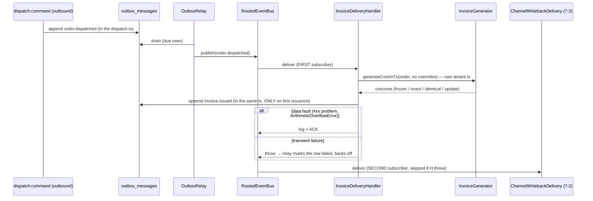
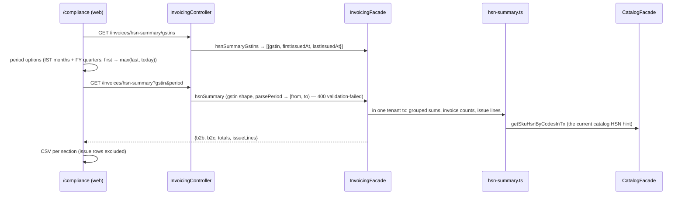

# Invoicing module

> GST invoices (story 8-1, regulatory pass 8-1b): one invoice per dispatched order, derived from persisted dispatch facts until it issues and **frozen** from then on, taxed in exact integer math with a stored rupee round-off, numbered in its **supplier GSTIN's** own series per financial year, and printed on the web's `/compliance` surface. The HSN summary (8-2a, GSTR-1 Table 12) reads the issued invoices back per supplier GSTIN and period. E-way bills (8-2) and the 3PL client-billing model (21-5) extend this module.

Paths are relative to `workspace/core/backend/wms-be`. Read [`../IMPLEMENTATION-GUIDE.md`](../IMPLEMENTATION-GUIDE.md) first. The command skeleton is followed closely here and is not repeated.

**Why `invoicing/`, not `compliance/`:** the epic-8 context named a "new `compliance/` module", but `src/modules/compliance/` was already 12-5's temperature-excursion module. GST work lives in this sibling. 8-2 extends `invoicing/`, not `compliance/`.

The module exists for two invariants. **Until it issues, an invoice is derived, never trusted**: every generation re-reads the order, its lines, the picks, the parties and the state-code list, and never reads the event payload beyond the order id, so a retry, a redelivery or a manual regenerate converges on the same document by derivation, not by caching. **Once it issues, it is a legal document and is frozen** (8-1b): generation returns the stored row and never recomputes it, so a later catalog edit can never reach it. Corrections need credit/debit notes (deferred).

---

## Owns

| Table | Holds | Key invariants |
|---|---|---|
| `invoices` (`schema.ts:3753`) | One row per `(tenant_id, order_id)`: `status` (`awaiting-data \| issued \| voided`), `invoice_no` / `fy_label` / `series_seq` (null until first issuance), `origin_gstin`, `consignee_gstin`, `place_of_supply` (two-digit code), `supply_type` (`intra \| inter`), `subtotal_paise` / `gst_paise` / `total_paise` (exact), `payable_paise` / `round_off_paise` (8-1b, the stored rupee rounding), `revision`, `document` (jsonb), `issued_at` (8-2a, read model) | **`invoices_tenant_order_unique`**: the one-invoice rule, and the race arbiter. `invoices_tenant_gstin_invoice_no_unique` on `(tenant_id, origin_gstin, invoice_no) WHERE invoice_no IS NOT NULL` (8-1b; two GSTINs may share a number). CHECKs: `subtotal + gst = total`; (0054) `payable = total + round_off`, `round_off BETWEEN -49 AND 50`, `payable % 100 = 0`, `payable >= 0`, and `status <> 'issued' OR (invoice_no IS NOT NULL AND origin_gstin IS NOT NULL)` |
| `invoice_lines` (`:3804`) | The computation's output for the current revision: SKU code/name/HSN snapshots, `uom` (8-2a, read model), `qty_milli`, `rate_paise`, `rate_source` (`order_line \| manual`), `taxable_paise`, `gst_bps`, `cgst/sgst/igst_paise`, `hsn_gap` | Rebuilt whole on every content change (delete then insert). It carries no identity of its own. `invoice_lines_invoice_order_line_unique` on `(invoice_id, order_line_id)` (0055) |
| `invoice_series` (`:3842`) | One row per `(tenant_id, origin_gstin, fy_label)`, holding `last_seq` (8-1b) | `invoice_series_tenant_gstin_fy_unique`, **partial** `WHERE origin_gstin IS NOT NULL`; `last_seq` is advanced only under the row's `FOR UPDATE` lock. **The NULL invariant:** a NULL `origin_gstin` marks a legacy 8-1 per-tenant series (`FY-2627-000001` format) — kept as history, never allocated from again, never deleted. Every row this build writes has a GSTIN; issuance cannot happen without one (the issued CHECK above) |
| `gst_state_codes` (`:3865`) | **Global** reference data: the CBIC state-code list, 38 rows (`26` = Dadra & Nagar Haveli and Daman & Diu, `37` = Andhra Pradesh, `38` = Ladakh, `97` = Other Territory, `99` = Other Country; `25` and `28` are absent) | Hand-seeded in 0053. **No RLS**: it is India-wide law, not tenant data (the `app_metadata` precedent). The count is pinned by `invoicing.spec.ts`'s seed proof, and the FE mirrors it in `GST_STATE_NAMES` |

CHECKs, RLS and the seed live only in `drizzle/0053_invoicing_core.sql`, hand-amended; 8-1b's columns, CHECKs, index swaps and data rewrites are `drizzle/0054_invoice_regulatory_pass.sql` (hand-written, proven by `test/invoicing-migration.spec.ts` on a scratch database). 8-2a's two read-model columns are `drizzle/0055_hsn_summary_columns.sql` (see "The HSN summary" below). Policies follow the guide's shape (`invoices_tenant_isolation`, …), and **the `client-isolation` RLS count pin moved 64 → 67**.

**Owned columns on other modules' tables.** Each is written only by its owner's command, never by invoicing:

| Column | Owner, written by | Read as |
|---|---|---|
| `tenants.gstin` | tenancy — registration (create-only) | the supplier GSTIN fallback |
| `warehouses.gstin` | tenancy — warehouse create (create-only) | the supplier GSTIN, preferred |
| `orders.consignee_gstin` | outbound — order create | the buyer's registration; its prefix is the place of supply |
| `order_lines.rate_paise` | outbound — order create | the rate **frozen at acceptance**; never written after create |

All four GSTIN columns carry a shape CHECK (`^[0-9]{2}[A-Za-z0-9]{13}$`). The canonical form is uppercase, and every write path normalizes first (`src/shared/primitives/gstin.ts`).

The module also writes `audit_events` and `idempotency_keys` (tenancy-owned, shared). `test/architecture.spec.ts` pins the ownership: no invoice-table write outside `invoicing/`, and no outbound or tenancy table write from inside it.

---

## Public seam

`InvoicingModule` imports `OutboundModule` (for `OutboundFacade.orderInvoiceFactsInTx` only) and exports three providers:

- **`InvoicingFacade`**: the reads (`listInvoices` keyset page, `getInvoice`, the in-tx `getInvoiceForOrderInTx`). Reads are never capability-gated.
- **`InvoicingCommand`**: the manual generate/regenerate, consumed by `src/api/invoicing.controller.ts`.
- **`InvoiceGenerator`**: the one computation (`generateCoreInTx`) both generation paths run inside their own tenant transaction.

Party facts (tenant name and GSTIN, warehouse name, GSTIN and origin) come through `invoicePartyFactsInTx` in `tenancy.service.ts`. It is imported directly as an in-tx function (the `order.command` precedent: no DI cycle, no tenancy table write).

`InvoiceDeliveryHandler` subscribes to `order.dispatched` at `onModuleInit`.

---

## Flows

### The event path: dispatch → invoice



### The manual path: price → issue

```mermaid
sequenceDiagram
    participant C as InvoicingController
    participant M as InvoicingCommand
    participant G as InvoiceGenerator
    C->>M: generate({orderId, rates?}, key)
    M->>M: hash (rates sorted by orderLineId — never throws)
    M->>M: assert invoice.generate → replay lookup → rates shape
    M->>G: generateCoreInTx(order, rates)
    alt invoice already issued / voided (frozen)
        G-->>M: rates non-empty → 409 invoice-frozen; else the stored row, unchanged
    end
    alt InvoiceRaceLostError (the delivery inserted first)
        M->>M: retry ONCE in a fresh tx (winner awaiting → update path, rates apply; winner issued → freeze → 409 invoice-frozen)
    end
    M->>M: invoice.issued (first issuance) → audit → idempotency key
    M-->>C: {invoice} (200)
```

---

## The command and its guards

`POST /tenants/{t}/invoices` (`invoice.generate`, Owner + Ops Manager). The guard order is the skeleton's, and it is load-bearing:

| Step | What | Failure arm |
|---|---|---|
| hash | `{kind: 'invoicing.generate', orderId, rates}`, rates sorted by `orderLineId` (a reordered resend is the SAME command) | — (never throws: the sort uses `String()`) |
| permission | role re-read in the tx | `403 role-denied` |
| replay | same key, same hash → stored snapshot | `422 idempotency-key-reuse` on a different hash |
| rates shape | non-negative safe integer `ratePaise`, non-empty `orderLineId`, no duplicate line | `400 validation-failed` |
| lock + freeze (8-1b) | the order's invoice row is locked FIRST; an `issued`/`voided` row short-circuits before anything below — non-empty `rates` refuse, a plain call returns the stored row (no write, no revision, no event) | `409 invoice-frozen` (outranks the line checks) |
| facts | order exists; status `dispatched` | `404 not-found`, `409 order-not-dispatched` |
| overrides | every override names a line of the order, **and an unpriced one** | `409 line-not-of-order`, `409 line-already-priced` |
| write | insert, or an update of the settled row | unique violation → `InvoiceRaceLostError` → one retry |
| tail | `invoice.issued` (first issuance only) → audit `invoice.generated` → idempotency key last | `409 conflict` on a concurrent same-key |

The delivery handler runs the same core with no overrides. It writes **no audit row** (`audit_events.actor_user_id` is NOT NULL and an event has no actor) and no idempotency key; it is idempotent by derivation.

---

## Key algorithms

**Rate resolution, per dispatched line.** A kit parent drops at zero picks.

1. `order_lines.rate_paise`, the rate frozen at acceptance, **always wins**. An override naming a priced line is refused (`409`) rather than silently applied or ignored.
2. else the command's override, for an unpriced line,
3. else the manual rate carried in the current document (an operator's pricing survives every regenerate that does not override it),
4. else unpriced: a blocking `unpriced-line` gap.

`rate_source` is `order_line` when (1) applied, otherwise `manual`.

**Place of supply.** `resolveStateCode` (`generator.ts:215`) handles both sides. A GSTIN's first two digits ARE the state code and outrank the address text. Text resolution (normalized: trim, lowercase, `&` → `and`, then the alias map `orissa`/`pondicherry`/`uttaranchal`) exists for GSTIN-less (B2C) parties.
- A GSTIN/text mismatch is a `pos-discrepancy` **warning**, raised independently for each side; the GSTIN wins.
- Origin GSTIN = warehouse GSTIN, else tenant GSTIN.
- Supply type = `intra` when origin code = destination code, otherwise `inter`.

**Gaps.** `document.gaps: [{kind, detail, orderLineId?}]`.

| Kind | Blocking? | Scope |
|---|---|---|
| `unpriced-line` | blocking (parks `awaiting-data`) | line (carries `orderLineId`) |
| `place-of-supply` | blocking | invoice (either side unresolvable) |
| `supplier-gstin` | blocking | invoice (neither warehouse nor tenant has a GSTIN) |
| `hsn-gap` | warning | line (carries `orderLineId`) |
| `pos-discrepancy` | warning | invoice |

`orderLineId` is structured (WMS-BE #70) so a client acts on gaps without parsing `detail` prose. The FE pricing panel offers exactly the `unpriced-line` ids.

**Arithmetic** (`arith.ts`). Integer paise, basis points and milli-units throughout; `computeLineTax` takes `Paise`/`GstBps`. Products run in BigInt, then:
- `taxable = halfUp(qtyMilli × ratePaise, 1000)`, then `tax = halfUp(taxable × bps, 10000)`, **per line**, never on totals.
- Intra-state splits CGST = ⌊tax/2⌋ and SGST/UTGST = the remainder, so the odd paisa goes to SGST. Inter-state carries the whole tax as IGST. An unresolved supply charges zero.
- Totals are sums of rounded lines, re-checked by `assertInvoiceTotals` (`subtotal + gst = total`, `cgst + sgst + igst = gst`).
- **Rupee rounding (8-1b), `roundToRupee`:** half-up at 50 paise — `payable = ⌊(total + 50) / 100⌋ × 100`, `roundOff = payable − total` ∈ −49…+50 (228060 → 228100 +40; 435449 → 435400 −49; 435450 → 435500 +50). It touches **only** `total → payable`; taxable, GST and every per-tax amount stay paise-exact. Both figures are stored (row columns and `document.totals`); `roundOff` is a checked signed integer, not `Paise`. Migration 0054's `div(total + 50, 100) * 100` is the SQL twin; a parity test pins that the two agree byte-for-byte.
- `document.totals` is `{subtotal, gst, total, roundOff, payable}`. 8-1's `payAble` was renamed `total` (its value was always the exact sum) and 0054 rewrote every stored document and idempotency snapshot, so readers learn one spelling.
- **Downstream figures:** e-way's total invoice value and GSTR-1's invoice value read `payable`; e-way's "other value" carries `roundOff`; the HSN summary and per-tax figures stay exact.

**Numbering (8-1b: one consecutive series per supplier GSTIN).** It happens only on the flip to `issued`, with one clock read for both the FY and `issuedAt`.
- `fyLabelFor` reads the IST clock (April–March): `FY-2627`.
- `allocateSeriesSeq(tenant, originGstin, fy)` locks (or creates, then re-locks) the GSTIN's series row and increments it. Its `ON CONFLICT DO NOTHING` names the partial unique's predicate (`target: [tenantId, originGstin, fyLabel], where: origin_gstin is not null`) — Postgres only infers a partial index as the arbiter when the predicate matches.
- `formatInvoiceNo` gives `29/2627/000001`: the **GSTIN's own** first two characters (never `resolveStateCode`'s answer), the FY digits, the 6-digit sequence — 14 chars, asserted ≤ 16 (Rule 46's limit; a 7-digit sequence still fits).
- Each GSTIN starts at `000001`, which cannot collide with a legacy `FY-…` number; legacy series rows (NULL GSTIN) stop allocating.
- **Two GSTINs in the same state print identical numbers.** The pair `(originGstin, invoiceNo)` identifies an invoice: the unique, the list entry, the `invoice.issued` payload and every consumer key on it, never on `invoiceNo` alone.
- A tenant-GSTIN fallback for an out-of-state warehouse numbers in the tenant's state series (the existing `pos-discrepancy` case).

**The freeze (8-1b).** `generateCoreInTx` locks the invoice row **first**, before the facts read; an `issued` or `voided` row returns from the stored row (`contentChanged: false`, `firstIssuance: false`) before the facts, the override checks and the computation. Because the lock comes first, a generation that waited on a concurrent awaiting→issued flip reads the issued row after the winner's commit and freezes — exactly one issuance, one number, one `invoice.issued`. The freeze is total, **warnings included**: a blank-HSN line on an issued invoice stays blank, and the HSN summary must handle blank-HSN lines.

**Revisions.** `documentsEqual` (`:814`) compares canonicalized documents, excluding `revision` (jsonb re-sorts object keys, so a naive stringify would bump on key order alone). It now only runs on **awaiting** rows: an identical re-derivation writes nothing; a changed one bumps `revision` and rewrites the row and lines.

---

## The HSN summary (8-2a) — GSTR-1 Table 12

A **read**, member-open, over **issued** invoices only (never `awaiting-data` or `voided`): `InvoicingFacade.hsnSummary(tenant, gstin, period)` and `hsnSummaryGstins(tenant)`, served by `GET /invoices/hsn-summary` and `GET /invoices/hsn-summary/gstins` (declared before `:invoiceId`). Code: `hsn-summary.ts` (periods, aggregate, rows) and `uqc.ts` (the unit table).

**The read model (migration 0055).** Two columns, both written by the generator, both backfilled from the frozen document, neither on any view, DTO, snapshot or `documentsEqual` input:
- `invoices.issued_at timestamptz` — the SAME value as `document.header.issuedAt`: both issuance paths (the insert and the awaiting→issued update) write it from the one `issuedAt` variable `buildDocument` gets (one clock read); `null` while awaiting. Two-way CHECKs: `invoices_awaiting_unissued_check` (awaiting ⇒ NULL) and `invoices_issued_at_stamped_check` (issued/voided ⇒ NOT NULL). The backfill touched issued/voided rows only — a re-parked 8-1 row's stale `issuedAt` stays out. Partial index `invoices_tenant_gstin_issued_at_idx (tenant_id, origin_gstin, issued_at) WHERE status = 'issued'`.
- `invoice_lines.uom text NOT NULL` — the SKU's base UoM at generation (the document line's `uom`), **no vocabulary CHECK** (a frozen snapshot must survive a vocabulary change). Backfilled on `(invoice_id, orderLineId)`, which 0055 made UNIQUE.

0055 runs guard → pre-flight (every offender at once: a non-ISO-Z `issuedAt` on an issued/voided row, a line matching zero or several document lines, a blank matched `uom`, duplicate `(invoice_id, order_line_id)`) → nullable ADD → backfill → NOT NULL → CHECKs → UNIQUE → index. `invoicing-migration.spec.ts` applies it to seeded 0054 rows and proves every row's `to_jsonb(row)` minus the new column is unchanged, `updated_at` included.



**Periods.** `parsePeriod` accepts `YYYY-MM` (01–12) and `FY-yyyy-Qn` (consecutive two-digit years, Q1 Apr–Jun … Q4 Jan–Mar of the next calendar year — the `FY-2627` label's convention). It computes `[from, to)` in TypeScript as the UTC instants of IST midnights from the generator's `IST_OFFSET_MS` and binds them as `timestamptz` — never `date_trunc` or a session time zone. `to` is exclusive and the response says so (`toExclusive: true`).

**Aggregation.** SQL over `invoices ⨝ invoice_lines`: `status = 'issued'`, tenant, `origin_gstin = $gstin` (exact, no case folding), `issued_at` in range, grouped by B2B (`consignee_gstin IS NOT NULL`), `nullif(btrim(hsn), '')`, `uom`, `gst_bps`, with `sum(…)::bigint` → `Number()` + `isSafeInteger`. Then in TS: `uom → uqcFor → UQC`, and rows sharing (section, HSN, UQC, rate) merge in integers; a row records its `sourceUoms` and `mixedUnits` (only `OTH` can merge). Order: HSN ascending with issue rows last, then UQC, then rate. `invoiceCount` is `count(*)` over `invoices` (a lineless issued invoice counts).

**HSN issues are kept.** Validity is `HSN_PATTERN = ^[0-9]{4}([0-9]{2}){0,2}$` on the SQL-normalized value `nullif(btrim(hsn), '')` (whitespace-only is a blank, i.e. null), ONE pattern used by the TS row check (no second JS trim) and the SQL issue-line filter. The summary's three reads run in one REPEATABLE READ transaction so rows, counts and issue lines share a snapshot; the `status = 'issued'` predicate is a literal so the partial index stays usable under a generic plan. An issue row stays in the totals (so they reconcile to the invoices), is listed line by line in `issueLines` with the SKU's current catalog HSN (a hint — the invoice is never rewritten), and the web leaves it out of the CSV.

**Exactness.** Every figure is the paise sum of frozen lines; nothing is rounded per row and the invoice round-off is never spread (Table 12's values are taxable + tax). The reconciliation test compares the totals to Σ `invoices.subtotal_paise` / Σ `gst_paise` read independently.

**UoM → UQC (`uqc.ts`).** `UOM_TO_UQC: Record<Uom, Uqc>` covers all 35 units (a missing entry is a compile error; the suite also asserts completeness over the runtime tuple). No scaling ever: where no UQC means the same unit it maps to `OTH` (`case`, `pallet`, `crate`, `tin`, `jar`, `tray`, `sheet`, `bar`, `cylinder`, `keg`, `mm`); an unknown stored unit is `OTH` with `exact: false`. The UQC *descriptions* (`KGS-KILOGRAMS`) and the pinned CSV header live on the web (`wms-fe/src/lib/hsn-summary.ts`).

**Not modelled** (PENDING): credit/debit-note netting, cess (always 0), HSN-master validation.

---

## Invariants

- Exactly one invoice per `(tenant, order)`; a lost insert race never produces a second row or a second tax.
- Generation never touches dispatch state; a generation failure leaves the order `dispatched`.
- `order_lines.rate_paise` is never written after create; overrides freeze into the invoice document.
- No ledger writes: an invoice is a derived money artifact, not stock motion.
- Only an `issued` invoice has a number, and every issued invoice has a number and a supplier GSTIN (a CHECK since 0054). `voided` exists for vocabulary stability; there is no void command.
- **An issued or voided invoice is never recomputed, re-priced or renumbered** — no write, no revision bump, no event (8-1b). Corrections need credit/debit notes.
- `payable_paise = total_paise + round_off_paise`, a whole number of rupees, round-off in −49…+50 — in storage, not only in `arith.ts`.

## The event

| Event | Emitted | Payload |
|---|---|---|
| `invoice.issued` (outbox, in-tx) | on the **first** flip to `issued` only (by either path); an issued invoice never changes again | `{invoiceId, orderId, warehouseId, originGstin, invoiceNo, fyLabel, revision, subtotalPaise, gstPaise, totalPaise, payablePaise, roundOffPaise}`: flat and client-agnostic (21-5 reads it). Built by ONE function, `invoiceIssuedPayload` (`events.ts`), for both emitters. **Consumers key on `(originGstin, invoiceNo)`** |

No consumer exists yet (8-2, 21-5). Audit: `invoice.generated`, one row per manual call, with the actor and the idempotency key as reference.

---

## Gotchas (the real-defect list)

- **`order.dispatched` has two subscribers, and the bus stops at the first throw.** Runtime order is invoicing, then the 7-2 channel writeback (verified in-session). A rethrown deterministic failure would starve the marketplace writeback until dead-letter, so the handler ACKs data faults and rethrows only transient errors. The cost: a data-faulted dispatch has no invoice until someone regenerates, and nothing lists them (PENDING). Any new subscriber to a shared event must decide the same question.
- **A command that loses the insert race must retry, not adopt.** The first build returned the winner's (unpriced) row with 200, silently dropping the operator's rates and writing no key. A deterministic test now forces the overlap with a barrier on `writeLines`, then a lock-wait poll.
- **The override precedence was inverted.** Override-first let a later override-less regenerate (an event redelivery) revert an operator's re-price under a numbered invoice. The frozen rate now wins and an override on it is refused.
- **An invoice issued with no supplier GSTIN.** The origin resolved from address text, so nothing blocked it. That is now the blocking `supplier-gstin` gap.
- **Raw Postgres timestamps on the wire.** The views passed `timestamptz` text through, so the list's own `nextCursor` failed its cursor regex and page 2 answered 400. Views use `canonicalInstant`, and the cursor uses `fullPrecisionInstant(created_at::text)` (millisecond truncation skips same-millisecond rows).
- **Nullable union ApiProperties need `type: String`** (the channels gotcha, again): `TenantResponse.gstin` / `WarehouseResponse.gstin` tripped the OpenAPI drift guard.
- **Gaps that name a line must carry its id structurally.** The first document shape put the unpriced line's id only in `detail` prose. The FE (which never parses prose) could not price anything, and a follow-up PR added `orderLineId`. When pinning a document shape, ask who acts on each field.
- **A partial unique index needs its predicate in `ON CONFLICT`** (8-1b design review #1). Without `where: origin_gstin is not null` Postgres cannot infer the arbiter and every first issuance errors with "no unique or exclusion constraint matching". It is invisible until the first insert of a series row.
- **A migration's NOT NULL / CHECK before its backfill fails only on a non-empty table** — CI's databases are empty, so it is invisible there. 0054 orders guard → pre-flight → nullable ADD → backfill → rewrite → SET NOT NULL → CHECKs, and `invoicing-migration.spec.ts` runs it over seeded 0053 rows.
- **Idempotency snapshots embed the response shape forever.** Changing a document shape without rewriting `idempotency_keys.response_snapshot` makes a pre-change key replay the old shape to a client that no longer reads it; 0054 rewrites them.
- **Count pins move with this module**: capabilities 33 → 34 (`users.spec.ts`, FE `users.test.ts`), RLS policies 64 → 67 (`client-isolation.spec.ts`).
- **A route literal beside a `:param` route must be declared first** (8-2a). Express matches in declaration order, so `GET /invoices/hsn-summary` declared after `GET /invoices/:invoiceId` would answer `400 invoiceId must be a uuid`. The controller declares it first and `invoicing-hsn.spec.ts` pins both the behaviour and the method order.
- **FE: keep `DataTable` mounted while a page loads.** Swapping it for a loading line on every page change remounts it onto page one, so Prev never enables. Likewise, a success banner rendered inside a subtree that remounts after the save vanishes on arrival; lift it above the remount, keyed to its invoice.
