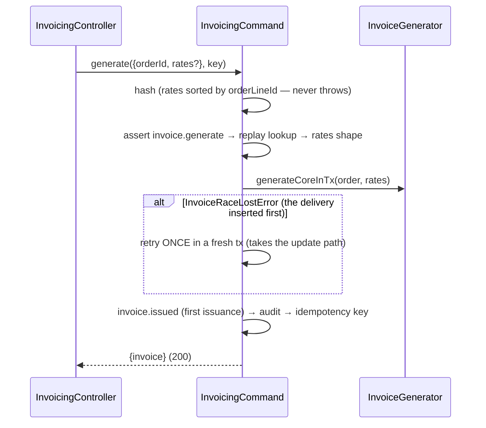

# Invoicing module

> GST invoices (story 8-1): one invoice per dispatched order, derived from persisted dispatch facts, taxed in exact integer math, numbered per tenant per financial year, and printed on the web's `/compliance` surface. E-way bills and the HSN summary (8-2) and the 3PL client-billing model (21-5) extend this module.

Paths are relative to `workspace/core/backend/wms-be`. Read [`../IMPLEMENTATION-GUIDE.md`](../IMPLEMENTATION-GUIDE.md) first. The command skeleton is followed closely here and is not repeated.

**Why `invoicing/`, not `compliance/`:** the epic-8 context named a "new `compliance/` module", but `src/modules/compliance/` was already 12-5's temperature-excursion module. GST work lives in this sibling. 8-2 extends `invoicing/`, not `compliance/`.

The module exists for one invariant: **an invoice is derived, never trusted**. Every generation re-reads the order, its lines, the picks, the parties and the state-code list. It never reads the event payload beyond the order id, so a retry, a redelivery or a manual regenerate converges on the same document by derivation, not by caching.

---

## Owns

| Table | Holds | Key invariants |
|---|---|---|
| `invoices` (`schema.ts:3753`) | One row per `(tenant_id, order_id)`: `status` (`awaiting-data \| issued \| voided`), `invoice_no` / `fy_label` / `series_seq` (null until first issuance), `origin_gstin`, `consignee_gstin`, `place_of_supply` (two-digit code), `supply_type` (`intra \| inter`), `subtotal_paise` / `gst_paise` / `total_paise`, `revision`, `document` (jsonb) | **`invoices_tenant_order_unique`**: the one-invoice rule, and the race arbiter. `invoices_tenant_invoice_no_unique` is partial (`WHERE invoice_no IS NOT NULL`). `invoices_totals_balance_check`: `subtotal + gst = total` in storage |
| `invoice_lines` (`:3804`) | The computation's output for the current revision: SKU code/name/HSN snapshots, `qty_milli`, `rate_paise`, `rate_source` (`order_line \| manual`), `taxable_paise`, `gst_bps`, `cgst/sgst/igst_paise`, `hsn_gap` | Rebuilt whole on every content change (delete then insert). It carries no identity of its own |
| `invoice_series` (`:3842`) | One row per `(tenant_id, fy_label)`, holding `last_seq` | `invoice_series_tenant_fy_unique`; `last_seq` is advanced only under the row's `FOR UPDATE` lock |
| `gst_state_codes` (`:3865`) | **Global** reference data: the CBIC state-code list, 38 rows (`26` = Dadra & Nagar Haveli and Daman & Diu, `37` = Andhra Pradesh, `38` = Ladakh, `97` = Other Territory, `99` = Other Country; `25` and `28` are absent) | Hand-seeded in 0053. **No RLS**: it is India-wide law, not tenant data (the `app_metadata` precedent). The count is pinned by `invoicing.spec.ts`'s seed proof, and the FE mirrors it in `GST_STATE_NAMES` |

CHECKs, RLS and the seed live only in `drizzle/0053_invoicing_core.sql`, hand-amended. Policies follow the guide's shape (`invoices_tenant_isolation`, …), and **the `client-isolation` RLS count pin moved 64 → 67**.

**Owned columns on other modules' tables.** Each is written only by its owner's command, never by invoicing:

| Column | Owner, written by | Read as |
|---|---|---|
| `tenants.gstin` | tenancy — registration (create-only) | the supplier GSTIN fallback |
| `warehouses.gstin` | tenancy — warehouse create (create-only) | the supplier GSTIN, preferred |
| `orders.consignee_gstin` | outbound — order create | the buyer's registration; its prefix is the place of supply |
| `order_lines.rate_paise` | outbound — order create | the rate **frozen at acceptance**; never written after create |

All four GSTIN columns carry a shape CHECK (`^[0-9]{2}[A-Za-z0-9]{13}$`). The canonical form is uppercase, and every write path normalizes first (`src/shared/primitives/gstin.ts`).

The module also writes `audit_events` and `idempotency_keys` (tenancy-owned, shared). `test/architecture.spec.ts` pins the ownership: no invoice-table write outside `invoicing/`, and no outbound or tenancy table write from inside it.

---

## Public seam

`InvoicingModule` imports `OutboundModule` (for `OutboundFacade.orderInvoiceFactsInTx` only) and exports three providers:

- **`InvoicingFacade`**: the reads (`listInvoices` keyset page, `getInvoice`, the in-tx `getInvoiceForOrderInTx`). Reads are never capability-gated.
- **`InvoicingCommand`**: the manual generate/regenerate, consumed by `src/api/invoicing.controller.ts`.
- **`InvoiceGenerator`**: the one computation (`generateCoreInTx`) both generation paths run inside their own tenant transaction.

Party facts (tenant name and GSTIN, warehouse name, GSTIN and origin) come through `invoicePartyFactsInTx` in `tenancy.service.ts`. It is imported directly as an in-tx function (the `order.command` precedent: no DI cycle, no tenancy table write).

`InvoiceDeliveryHandler` subscribes to `order.dispatched` at `onModuleInit`.

---

## Flows

### The event path: dispatch → invoice

### The manual path: price → issue

---

## The command and its guards

`POST /tenants/{t}/invoices` (`invoice.generate`, Owner + Ops Manager). The guard order is the skeleton's, and it is load-bearing:

| Step | What | Failure arm |
|---|---|---|
| hash | `{kind: 'invoicing.generate', orderId, rates}`, rates sorted by `orderLineId` (a reordered resend is the SAME command) | — (never throws: the sort uses `String()`) |
| permission | role re-read in the tx | `403 role-denied` |
| replay | same key, same hash → stored snapshot | `422 idempotency-key-reuse` on a different hash |
| rates shape | non-negative safe integer `ratePaise`, non-empty `orderLineId`, no duplicate line | `400 validation-failed` |
| facts | order exists; status `dispatched` | `404 not-found`, `409 order-not-dispatched` |
| overrides | every override names a line of the order, **and an unpriced one** | `409 line-not-of-order`, `409 line-already-priced` |
| write | insert, or an update of the settled row | unique violation → `InvoiceRaceLostError` → one retry |
| tail | `invoice.issued` (first issuance only) → audit `invoice.generated` → idempotency key last | `409 conflict` on a concurrent same-key |

The delivery handler runs the same core with no overrides. It writes **no audit row** (`audit_events.actor_user_id` is NOT NULL and an event has no actor) and no idempotency key; it is idempotent by derivation.

---

## Key algorithms

**Rate resolution, per dispatched line.** A kit parent drops at zero picks.

1. `order_lines.rate_paise`, the rate frozen at acceptance, **always wins**. An override naming a priced line is refused (`409`) rather than silently applied or ignored.
2. else the command's override, for an unpriced line,
3. else the manual rate carried in the current document (an operator's pricing survives every regenerate that does not override it),
4. else unpriced: a blocking `unpriced-line` gap.

`rate_source` is `order_line` when (1) applied, otherwise `manual`.

**Place of supply.** `resolveStateCode` (`generator.ts:215`) handles both sides. A GSTIN's first two digits ARE the state code and outrank the address text. Text resolution (normalized: trim, lowercase, `&` → `and`, then the alias map `orissa`/`pondicherry`/`uttaranchal`) exists for GSTIN-less (B2C) parties.
- A GSTIN/text mismatch is a `pos-discrepancy` **warning**, raised independently for each side; the GSTIN wins.
- Origin GSTIN = warehouse GSTIN, else tenant GSTIN.
- Supply type = `intra` when origin code = destination code, otherwise `inter`.

**Gaps.** `document.gaps: [{kind, detail, orderLineId?}]`.

| Kind | Blocking? | Scope |
|---|---|---|
| `unpriced-line` | blocking (parks `awaiting-data`) | line (carries `orderLineId`) |
| `place-of-supply` | blocking | invoice (either side unresolvable) |
| `supplier-gstin` | blocking | invoice (neither warehouse nor tenant has a GSTIN) |
| `hsn-gap` | warning | line (carries `orderLineId`) |
| `pos-discrepancy` | warning | invoice |

`orderLineId` is structured (WMS-BE #70) so a client acts on gaps without parsing `detail` prose. The FE pricing panel offers exactly the `unpriced-line` ids.

**Arithmetic** (`arith.ts`). Integer paise, basis points and milli-units throughout; `computeLineTax` takes `Paise`/`GstBps`. Products run in BigInt, then:
- `taxable = halfUp(qtyMilli × ratePaise, 1000)`, then `tax = halfUp(taxable × bps, 10000)`, **per line**, never on totals.
- Intra-state splits CGST = ⌊tax/2⌋ and SGST/UTGST = the remainder, so the odd paisa goes to SGST. Inter-state carries the whole tax as IGST. An unresolved supply charges zero.
- Totals are sums of rounded lines, re-checked by `assertInvoiceTotals` (`subtotal + gst = total`, `cgst + sgst + igst = gst`).
- No rupee rounding is stored; whether the printed payable rounds is 8-2's regulatory question.

**Numbering.** It happens only on the flip to `issued`, with one clock read for both the FY and `issuedAt`.
- `fyLabelFor` reads the IST clock (April–March): `FY-2627`.
- `allocateSeriesSeq` locks (or creates, then re-locks) the series row and increments it, giving `FY-2627-000001`.
- An already-numbered invoice keeps its number and `issuedAt` forever, and a status never regresses. A recompute of an issued invoice may find warnings, and in practice cannot find blocking gaps: every blocking input is frozen or create-only.

**Revisions.** `documentsEqual` (`:814`) compares canonicalized documents, excluding `revision` (jsonb re-sorts object keys, so a naive stringify would bump on key order alone). An identical re-derivation writes nothing. A changed one bumps `revision` and rewrites the row and lines **under the same number**.

---

## Invariants

- Exactly one invoice per `(tenant, order)`; a lost insert race never produces a second row or a second tax.
- Generation never touches dispatch state; a generation failure leaves the order `dispatched`.
- `order_lines.rate_paise` is never written after create; overrides freeze into the invoice document.
- No ledger writes: an invoice is a derived money artifact, not stock motion.
- Only an `issued` invoice has a number. `voided` exists for vocabulary stability; there is no void command in 8-1.

## The event

| Event | Emitted | Payload |
|---|---|---|
| `invoice.issued` (outbox, in-tx) | on the **first** flip to `issued` only (by either path), not on later revisions | `{invoiceId, orderId, warehouseId, invoiceNo, fyLabel, revision, subtotalPaise, gstPaise, totalPaise}`: flat and client-agnostic (21-5 reads it) |

No consumer exists yet (8-2, 21-5). Audit: `invoice.generated`, one row per manual call, with the actor and the idempotency key as reference.

---

## Gotchas (the real-defect list)

- **`order.dispatched` has two subscribers, and the bus stops at the first throw.** Runtime order is invoicing, then the 7-2 channel writeback (verified in-session). A rethrown deterministic failure would starve the marketplace writeback until dead-letter, so the handler ACKs data faults and rethrows only transient errors. The cost: a data-faulted dispatch has no invoice until someone regenerates, and nothing lists them (PENDING). Any new subscriber to a shared event must decide the same question.
- **A command that loses the insert race must retry, not adopt.** The first build returned the winner's (unpriced) row with 200, silently dropping the operator's rates and writing no key. A deterministic test now forces the overlap with a barrier on `writeLines`, then a lock-wait poll.
- **The override precedence was inverted.** Override-first let a later override-less regenerate (an event redelivery) revert an operator's re-price under a numbered invoice. The frozen rate now wins and an override on it is refused.
- **An invoice issued with no supplier GSTIN.** The origin resolved from address text, so nothing blocked it. That is now the blocking `supplier-gstin` gap.
- **Raw Postgres timestamps on the wire.** The views passed `timestamptz` text through, so the list's own `nextCursor` failed its cursor regex and page 2 answered 400. Views use `canonicalInstant`, and the cursor uses `fullPrecisionInstant(created_at::text)` (millisecond truncation skips same-millisecond rows).
- **Nullable union ApiProperties need `type: String`** (the channels gotcha, again): `TenantResponse.gstin` / `WarehouseResponse.gstin` tripped the OpenAPI drift guard.
- **Gaps that name a line must carry its id structurally.** The first document shape put the unpriced line's id only in `detail` prose. The FE (which never parses prose) could not price anything, and a follow-up PR added `orderLineId`. When pinning a document shape, ask who acts on each field.
- **Count pins move with this module**: capabilities 33 → 34 (`users.spec.ts`, FE `users.test.ts`), RLS policies 64 → 67 (`client-isolation.spec.ts`).
- **FE: keep `DataTable` mounted while a page loads.** Swapping it for a loading line on every page change remounts it onto page one, so Prev never enables. Likewise, a success banner rendered inside a subtree that remounts after the save vanishes on arrival; lift it above the remount, keyed to its invoice.
