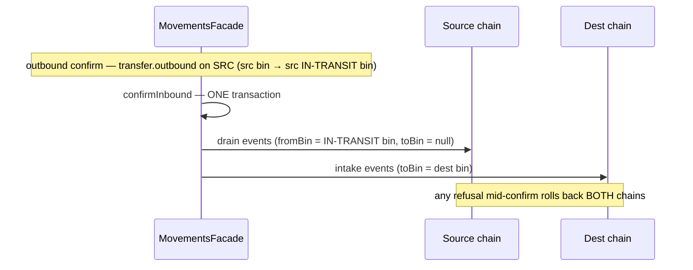

# Movements module

> Stock that MOVES by plan: transfer orders (the two-leg ledger legs), cycle counts (stored observational tasks over a frozen bin state), and later stock adjustments with approval thresholds and variance review. The last spine module to be populated — story 5-1 (FR-18/FR-29) gave it its first citizen.

Paths are relative to `workspace/core/backend/wms-be`. Read [`../IMPLEMENTATION-GUIDE.md`](../IMPLEMENTATION-GUIDE.md) first — the command skeleton is followed closely here and is not repeated.

**The module's one idea:** every planned stock movement is a pair of ledger legs, not a field on a row. The stock never "leaves the system" between the legs — it parks, physically and visibly, in a system-owned IN-TRANSIT bin, so the serial-in-exactly-one-bin invariant survives unbroken and ATP exclusion falls out of a bin-code predicate rather than a state flag.

This doc covers the transfer-orders slice (story 5-1), the cycle-count slice (story 5-3) and the variance-resolution slice (story 5-4). Stock adjustments (5-2) and the human review queue (5-5) grow here.

---

## Owns

| Table | Holds | Key invariants |
|---|---|---|
| `transfer_orders` (`src/shared/db/schema.ts`) | One row per transfer: `source_warehouse_id`, `dest_warehouse_id`, `status`, `note`, `created_by`, plus the per-transition stamps (`outbound_confirmed_by/at`, `inbound_confirmed_by/at`, `cancelled_by/at`) | See below |
| `transfer_order_lines` | One row per line: `sku_id`, `quantity_milli`, `from_bin_id`, `to_bin_id` (the PLANNED dest bin — the scanned bin at confirm is authoritative), `batch_ref`, `note` | Line qty positive (CHECK); a line is immutable after create |
| `count_policies` (**5-3**) | One row per (tenant, warehouse, abcClass): `interval_days` — the ABC schedule the worker generates due tasks from | Unique on `(tenant, warehouse, abc_class)` (CHECK); upsert semantics, no delete verb yet |
| `count_tasks` (**5-3**) | One row per count: `warehouse_id`, `bin_id`, `status` (`pending \| completed`), `origin` (`on_demand \| scheduled \| recount`), `bin_state_epoch` (nullable bigint — FROZEN at task start), `created_by` (null = the scheduler), `completed_by/at` | One OPEN task per bin (SELECT-then-INSERT under the tenant advisory lock); a system-owned bin is NEVER countable |
| `count_task_lines` (**5-3**) | One row per expected SKU: `sku_id`, `expected_quantity_milli`, `counted_quantity_milli` (null = not yet counted) | Expected is the bin state **at task start**, never recomputed; `expected/counted ≥ 0` (CHECK) |
| `count_variances` (**5-3**, resolved **5-4**) | One row per differing SKU at submit: `task_id`, `sku_id`, `expected/counted/delta` (delta CHECK = counted − expected), `epoch_conflict` bool, `status` (`open` → `adjusted \| recounted` — the 0046 CHECK drop/re-ADD; `open` was 5-3's whole vocabulary), plus 5-4's resolution columns: `threshold_quantity_milli` (nullable — the policy value FROZEN at submit; null = no policy covered the submit), `resolved_by/at`, `recount_task_id` (bare uuid, no FK — repo convention, validated in-command), `considered_event_seqs` (jsonb — the consulted ledger seqs, deduped ascending, ≤ 200) | Variance is SKU-level (no batch/serial detail). Resolution is a TERMINAL transition: one `UPDATE … WHERE status = 'open'` under the row lock (the 5-2 conditional-update belt); the recount arm rewrites `expected/delta` in the SAME UPDATE (only what it was counted against changes) |
| `count_variance_policies` (**5-4**) | One row per tenant: `quantity_threshold_milli` (nullable int4 — null = the flow is DISABLED, the 5-2 `stockAdjustmentPolicies` mirror; BASE-units ceiling `MAX_VARIANCE_THRESHOLD_BASE = Math.floor(2^31−1 / 1000)` guards the milli overflow) | `unique(tenant_id)`; upsert via PUT; the pen is `variances.resolve` (CHECKPOINT 1: the resolver set's, not `counts.manage`); submit stamps the value on EVERY variance row under the policy and emits one owner-notification outbox event per OVER-threshold row (strictly greater) |

CHECKs and RLS live only in `drizzle/0043_transfer_orders.sql` (transfers), `drizzle/0045_cycle_counts.sql` (counts — fail-fast `to_regclass` guard, CHECKs, RLS for all four count tables, `skus.abc_class` additive column) and `drizzle/0046_variance_resolution.sql` (resolution — fail-fast `to_regclass` guard, `count_variance_policies` + its fail-closed RLS `count_variance_policies_tenant_isolation`, the 0046 columns on `count_variances`, the status CHECK re-ADD, threshold CHECKs, deferred indexes `count_variances_task_id_idx` + `skus_tenant_id_abc_class_idx` — both carried from PENDING's 5-3 note):

- `transfer_orders_status_check` — `draft | in_transit | completed | cancelled` (the three-layer vocabulary: TS tuple + CHECK + `@IsIn`).
- `transfer_order_lines_quantity_check` — `quantity_milli > 0`.
- `transfer_orders_tenant_isolation` / `transfer_order_lines_tenant_isolation` — the standard fail-closed RLS policy (the `NULLIF(current_setting('app.tenant_id', true), '')` shape), pinned by the suite's RLS probes for BOTH tables.
- Keyset indexes: `transfer_orders_tenant_created_at_id_idx` (list), `transfer_order_lines_transfer_id_idx` (detail), `transfer_orders_dest_warehouse_status_idx` (the device task feed).
- **No FKs anywhere** (repo convention).

The module also writes `audit_events` and `idempotency_keys` (tenancy-owned, shared).

**It does NOT own stock.** Every stock write rides `InventoryFacade.appendLedgerEventInTx` → the ledger append — PROJECTION_OWNER: movements never writes `stock_on_hand`/`batch_on_hand` directly.

---

## The in-transit representation

A system-owned **IN-TRANSIT bin per warehouse** (zone `IN-TRANSIT`, bin `IN-TRANSIT`, `system_owned = true`, type `staging`, the other system bins' generous capacity sentinel):

- **Outbound confirm** physically moves the units into the SOURCE warehouse's IN-TRANSIT bin (per-line `transfer.outbound` ledger events, `fromBinId` = source bin, `toBinId` = the IN-TRANSIT bin). The units are real rows in `stock_on_hand` — serial-in-exactly-one-bin survives.
- **ATP exclusion is structural**: `inTransitUnits` (`inventory/reservation.service.ts`) sums stock on system-owned IN-TRANSIT bins by code + system-owned, and `committedCeiling` subtracts it beside `qcHeldUnits` — so an order acceptance cannot promise parked units, and the read-model `atp()` reports the same number. Deleting the ceiling term is caught by the suite's grant arm (a request that fits on-hand but not the ceiling refuses 409 naming the parked units).
- **Inbound confirm** drains the IN-TRANSIT bin: same-warehouse = a relocation event (IN-TRANSIT → dest bin); cross-warehouse = a drain event on the source chain (`toBinId` null — the `pick.picked` pure-draw precedent) + an intake event on the dest chain, in ONE transaction (a mid-confirm refusal rolls back BOTH chains — the suite pins this).
- **Seeding**: migration 0043 seeds zone+bin for existing warehouses (fail-fast pre-flight refuses a tenant orphan or a USER bin coded `IN-TRANSIT`, naming the remediation; post-assertion re-checks every warehouse). New warehouses get NOTHING at creation — both system bins are **lazy-ensured at first use** (`ensureInTransitBinInTx` beside the QC-hold bin's `ensureQcHoldBinInTx`; the QC-hold precedent, story 3.4). A user bin squatting the code makes the ensure throw typed `409 transfer-in-transit-bin-conflict` naming the rename/retire remediation.
- **System bins are refused as transfer endpoints** by the shared placement gate (400 `validation-failed`) — the transfer legs are the ONLY writer that parks units in the IN-TRANSIT bin, and `stock.adjust` refuses it alongside the QC-hold bin (`qc-bin-not-adjustable`, the shared system-bin guard).

---

## Public seam

`MovementsModule` imports `InventoryModule` + `TenancyModule` and exports `MovementsFacade` **alone**; `test/architecture.spec.ts` has the movements block (the facade allowlist covers the `transfer.facade` specifier). The api shell composes `getTransferTasks` into the device catalog snapshot (`receiving.controller.ts` — the sanctioned cross-module join pattern).

`MovementsFacade` (`src/modules/movements/transfer.facade.ts`) carries: `createTransfer`, `confirmOutbound`, `confirmInbound`, `cancelTransfer`, `listTransfers` (keyset on `(createdAt, id)`), `getTransfer` (detail with BOTH legs' events), `getTransferTasksInTx` — the device snapshot's derived task read (no task table; the putaway precedent): in-transit transfers destined to the warehouse, over-read `MAX_SNAPSHOT_TRANSFER_TASKS + 1` then sliced, each task line quoting the planned dest bin's `binStateEpoch` captured **on the same tx as the task** (the pick precedent — a stale quote is how the server LEARNS the bin moved) — and `getCountTasksInTx` (**5-3**, `count.command.ts`'s service + `count.dto.ts`): the snapshot's **stored** count-task feed — the movements module's first stored task table. Pending tasks for the warehouse, oldest first, `MAX_SNAPSHOT_COUNT_TASKS + 1` over-read then sliced; the over-read row IS the truncation signal and emits a `logger.warn` naming tenant + warehouse (5-1's computed-then-dropped signal is the anti-shape). Each card quotes the task row's frozen `binStateEpoch`, never a live re-read.

The scheduler worker (`CountSchedulerWorker` in `src/jobs/jobs.module.ts`, the `ReservationReaper` shell: parse-env `COUNT_SCHEDULER_POLL_MS`, unset/0 = OFF, `unref?.()`, single-flight running flag, shutdown clear) enumerates `select distinct on (tenant_id, warehouse_id) … from count_policies` and drives `generateScheduledTasksInTx` in one tenant transaction per scope — direct domain writes + outbox events, no HTTP command layer (the reaper precedent).

---

## Flows

### Same-warehouse transfer (bin→bin)

```mermaid
sequenceDiagram
    participant P as Planner (transfers.manage)
    participant F as MovementsFacade
    participant L as Ledger (inventory)
    P->>F: createTransfer (Idempotency-Key)
    F->>F: guards → draft row
    P->>F: confirmOutbound
    F->>L: per line-arm transfer.outbound (src bin → src IN-TRANSIT bin)
    Note over F,L: one tx; status → in_transit; src ATP excludes parked units
    O->>F: confirmInbound (operator/device, transfers.execute)
    F->>L: per line-arm transfer.inbound (IN-TRANSIT → dest bin)
    Note over F,L: one tx; status → completed; epochs bump both bins
```

### Cross-warehouse transfer



### Cycle count (5-3)

```mermaid
sequenceDiagram
    participant W as Worker (CountSchedulerWorker)
    participant C as CountService
    participant I as InventoryFacade (PROJECTION_OWNER)
    participant D as Device (counts.execute, badge-in)
    W->>C: generateScheduledTasksInTx (per tenant+warehouse scope)
    C->>I: stockedBinIdsForAbcClassInTx (per-class candidates)
    C->>I: stockArmsInBinsInTx + binStateEpochsInTx (expected FROZEN)
    Note over C: storage bins only — system bins post-filtered; open-task recheck under locks
    D->>C: submitCount (one op per task)
    C->>C: epoch compare EQUALITY under locks (null matches)
    Note over C: differing lines → variance rows (open); mismatch → epochConflict + fresh recount task, same tx
    Note over C: NEVER a stock/ledger write — resolution is 5-4
```

---

## Commands

All four follow the command skeleton (shape checks → fingerprint → authority → replay → parent asserts → locks → guards → writes → outbox → audit → **idempotency key last**). Guard-order specifics:

### `createTransfer` (transfers.manage)

Guards, in order: body shape → catch-weight SKU refused **fail-closed** (400 — a transfer cannot carry a catch-weight quantity) → batch- AND serial-tracked SKU refused → batch line requires `batchRef` → serial-tracked line scannability guards (whole-unit quantity, ≤ 200 units — the per-confirm serial scan cap; both at create because the draft can be corrected) → sub-precision quantity refused (zero-scaling input) → kit SKUs refused (409 `kit-cannot-hold-stock`) → bins/warehouses exist + tenant-scoped (foreign → 404) → system bin on either end refused → status `draft`. Outbox `transfer.created` + audit.

### `confirmOutbound` (transfers.manage)

Re-reads the order `.for('update')`: wrong-state → 409 `transfer-wrong-state`; already-in-transit under the SAME idempotency key → replayed snapshot. Per line: optional serial scans validated against the line quantity (count match, no dupes) and resolved to refs (404 `serial-unknown` for an unresolvable code; 400 duplicate-in-payload). **Locks in the canonical acyclic order** (see Gotchas): source bin rows `.for('update')` sorted → serial advisory set tenant-wide sorted → warehouse advisory LAST (acquired inside the first append, re-entrant). Source-short guard per (sku, bin) — and per (sku, bin, batchRef) for batch lines — against on-hand (serial lines skip the probe; the serial guards are the per-unit authority): 409 `transfer-source-short`, order stays draft. Then the writes: IN-TRANSIT bin ensured, per-arm `transfer.outbound` appends (each `referenceDoc {kind:'transfer', transferId, lineId}`), outbox `transfer.outbound-confirmed`, audit, idempotency key last (unique violation → 409).

### `confirmInbound` (transfers.execute — the floor verb; `AnySessionGuard` on the route)

The mobile op's transport: a device badge-in session's operator confirms the leg; a bare enrollment credential → 401. Whole-quantity only — every line lands in one tx and the order completes; a partial receipt is a cancel + a new transfer.

Guard order: order `.for('update')` + wrong-state → `transfer-wrong-state`; landing-bin resolution (the op's `destBinId` is authoritative for ALL lines — a redirect replans every line; a line with no bin and no op bin → 400); **locks (canonical order)**: landing bin rows sorted → per-line serial arms (derived from the OUTBOUND events filtered by `referenceDoc->>'lineId'` — NOT by skuId, see Gotchas) locked tenant-wide sorted → warehouse advisory lock(s) sorted by uuid → **the epoch compare runs UNDER the locks** (op epoch vs live; absent = match; mismatch → 409 `transfer-bin-changed`) → SKU re-read `.for('update')` + kit/catch-weight refusals REPEATED (the SKU can flip via sku.edit between the confirms; parked units are exactly what these guards keep out) → placement gates ONE call per landing bin with the summed intake (`assertPlacementGatesInTx` — capacity, storage class, hazard pairwise incl. moving-SKU-vs-moving-SKU, bulk-asset, secure authority 403) → the leg writes → outbox `transfer.inbound-confirmed`.

Gate refusals answer **409** with the gate's own machine code (order stays in_transit) — putaway refuses the same codes with 400 on its own surface; the status is per-surface, the code is shared. Serial resolution on this leg: 404 `serial-unknown`, 400 duplicate scan.

### `cancelTransfer` (transfers.manage)

Draft-only: `.for('update')` + status check → `409 transfer-wrong-state` for anything else. No stock effect, no ledger events — a draft moves nothing. Outbox `transfer.cancelled` + audit.

### `createCount` (counts.manage — 5-3)

Guards, in order: body shape → warehouse exists (404) → bin read (404 unknown bin) → **system-owned bin refused 400 `validation-failed`** (Receiving/QC-hold/In-Transit are moved by their own commands — counts target storage bins only; the transfer command's source-bin gate, mirrored) → warehouse advisory lock LAST → open-task-per-bin probe under the lock (409 `count-task-open`) → expected arms read through `InventoryFacade.stockArmsInBinsInTx` (positive rows only, the PROJECTION_OWNER seam — movements never projects stock tables) + `binStateEpochInTx` frozen verbatim (`null` freezes null) → task `pending` + per-SKU lines → outbox `count.created` + audit → idempotency key last (hash mismatch → `422 idempotency-key-reuse`).

### `submitCount` (counts.execute — the floor verb; `AnySessionGuard` on the route)

The mobile op's transport (badge-in required on the device arm; actor = device badge session). Guard order: task `.for('update')` + wrong-state → 409 `count-task-completed` → duplicate skuId on two lines → 400; unknown/foreign skuId → 404 (no phantom line written); any line without `countedQuantity` → 400 `count-incomplete` (0 is valid only explicitly entered) → bin row + warehouse advisory locks (canonical order) → **epoch compare under the locks, EQUALITY, `null` matches** → beyond-task SKUs append lines with expected 0 → differing lines write one `open` variance row per SKU (delta = counted − expected); mismatch rows carry `epochConflict: true` AND **auto-create a fresh recount task for the bin in the same tx** (origin `recount`, `createdBy` null, bounded by the open-task-per-bin rule) → task `completed` + stamps → audit → idempotency key last. **Counts NEVER write stock or ledger** — the variance record is the only output; resolution is 5-4.

### `upsertCountPolicies` (counts.manage — 5-3)

Takes the same tenant-scoped warehouse advisory lock the count commands take (a policy write serializes against in-flight ticks). UPDATE-then-INSERT per named row: a class written twice in one body is upsert semantics (the second UPDATE sees the first INSERT — last interval wins, no deterministic 409); the 409 arm is reserved for the unique-violation race loser. No delete verb yet (unschedule is deferred admin surface). Idempotency-aware like every mutating endpoint.

### `setVariancePolicy` / `getVariancePolicy` (variances.resolve on the PUT — 5-4)

`variance-policy.command.ts` (`VariancePolicyCommand`): `thresholdToMilli` multiplies the BASE-unit input by QUANTITY_SCALE — fractional BASE input refused at the wire (`@IsInt`), the overflow assert guards the int4 ceiling. Upsert on `unique(tenant_id)`; `quantityThreshold ?? null` normalized BEFORE the fingerprint hash, so absent and explicit-null PUTs hash the same. Null clears the policy (the flow is disabled). Audit `count.variance_policy_updated`. GET is plain (null → `404 not-found`, the 5-2 convention); the controller widens route-param assertions it rides.

### `resolveCountVariance` (variances.resolve — 5-4)

Shape checks above the tx (business time, decision vocabulary, `CONSIDERED_SEQS_MAX = 200` on the normalized set, approve-arm non-empty) → fingerprint (normalized seqs) → in-tx: **capability** (`getMemberRoleIn`, fail-closed BEFORE the replay lookup — the deliberate carve-out) → **idempotency replay** → variance row `.for('update')` → 404 (foreign/unknown) → 409 `variance-resolved` → **frozen-threshold owner guard** (the row's OWN submit-time stamp decides, never today's policy: `|delta| > stamp` and role ≠ owner → 403 `variance-owner-required`; at-or-below resolves by manager) → **stale-seqs probe** (`ledgerSeqsExistInTx`, warehouse-scoped, 400 `validation-failed` echoing the missing seq — refused BEFORE any write; a seq that exists in the tenant's OTHER warehouse does not pass) → task read (no lock — terminal and immutable) → **locks, canonical order**: bin row `.for('update')` → warehouse advisory LAST (gotcha 1) → **epoch-equality guard**, approve arm ONLY (`binStateEpochsInTx` under the locks vs `task.binStateEpoch`, null matches null — 409 `variance-basis-moved`, recount is the remedy) → the arm (approve_adjust: rebuilt `AdjustStockCommand` with `reasonCode 'stock-count'`, `occurredAt` = decision time, delta from the stored `deltaMilli` — the 5-2 approve-adjusted-arm `quantityMilli` precedent — through assert/apply; recount: open-task-per-bin probe under the locks → 409 `count-task-open`, `createRecountTaskInTx`, new expected ← the recount line or 0, delta recomputed) → **terminal conditional UPDATE** `.where(status = 'open')` → audit `count.variance.resolved` (reference: the idempotency key — no payload column) → outbox `count.variance.resolved` echo → **idempotency key last**.

### `generateScheduledTasksInTx` (the scheduler worker — 5-3)

Per (tenant, warehouse) scope, one tenant transaction: policy rows read PRE-lock (policy writes serialize on the same warehouse advisory lock, so a flip lands before or after the whole tick, never inside it) → per-class candidate scan through `InventoryFacade.stockedBinIdsForAbcClassInTx` (distinct positive-quantity bins holding SKUs of the class) → due-bins probe (no open task, not counted within the interval — a bin holding a mix of classes counts under the SHORTEST effective interval) → bin rows `.for('update')` + **system-owned bins post-filtered out** (system bins hold classed SKUs' on-hand rows; without the filter every tick mints a recurring task for a bin mid-way through its own movement) → warehouse advisory lock → open-task recheck under the lock → mint `scheduled` tasks (`createdBy` null = system actor) with frozen expecteds + epochs → outbox `count.created` per task. Whole tick rolls back on partial failure and retries next interval.

### Variance resolution (5-4)

A submit under an enabled policy wraps every variance row in the frozen stamp and routes over-threshold ones to a resolve-capable role:

1. **Stamp every row** — the policy's threshold (as of THAT submit) is written to every variance row the submit mints, whatever its delta; the owner-notification outbox event `count.variance.threshold_exceeded` (notifyRole owner, the 5-2 per-pend event shape) fires only per row with `|delta| > threshold` — STRICTLY greater, so an at-threshold variance is stamped, resolved by manager, and notifies no one (the boundary is test-pinned).
2. **Resolution is never capability-gated on reads** — the variance queue and the policy read are member reads; only the resolve POST and the policy PUT gate.
3. **The resolve re-executes the correction through the inventory core** (`assertAdjustableInTx` → `applyAdjustmentInTx`), not a `stock_adjustment_pendings` round-trip: the variance row IS the stored pending — 5-2's pend exists because requester ≠ approver, and here the approver decides in one step. Guard-set refusals (retired bin, batch/serial-tracked, catch-weight, kit SKU) answer verbatim with full rollback — the variance stays `open`; recount is the remedy (a batch/serial/kit variance can never build a legal bare correction).
4. **Fingerprint discipline**: the resolve's idempotency fingerprint hashes `normalizeConsideredSeqs` (dedupe + ascending) — a retry that reorders or duplicates the stated seqs replays 200 with the stored snapshot instead of answering 422; the row and the outbox echo store the NORMALIZED set, and the echo carries `null` (never `[]`) when the resolution stated nothing.

---

## Invariants

1. **Every stock write rides the ledger** — movements never projects stock directly.
2. **Serial-in-exactly-one-bin is never broken** — in-transit stock is REAL stock in a REAL bin; nothing is "in limbo".
3. **The two legs are one logical movement, correlated by `referenceDoc {kind:'transfer', transferId, lineId?}`** — the detail read assembles both legs from the chains; the inbound serial arms derive from the outbound events BY LINE.
4. **Cross-warehouse inbound is atomic across chains** — one tx, drain + intake, lock order sorted; a refusal rolls back both.
5. **Lines are immutable after create** — corrections are new compensating orders (Decision 3: no in-transit cancellation; draft-only cancel).
6. **The IN-TRANSIT bin has exactly one writer** — the transfer legs; every other writer (adjust, placement intake) is refused on system bins.
7. **A count never writes stock or ledger** (5-3) — the variance row is the only output; `open` is the whole variance vocabulary in 5-3, and no code path updates a variance row afterwards (5-4 owns resolution).
8. **A system-owned bin is never countable** (5-3) — refused on demand, post-filtered in the scheduler. In-transit/QC-hold bins hold classed SKUs' on-hand rows by design, so the candidate scan WOULD shortlist them every tick; the exclusion is the difference between counting the shelf and counting traffic.
9. **Expected is frozen at task start; the epoch compare is EQUALITY under the locks, `null` matches `null`** (5-3) — a pristine bin's null epoch freezes null verbatim and matches null at submit; a live non-null epoch against a frozen null is a conflict (OQ-2), not a pass.
10. **The threshold is frozen on the variance at submit; the resolve gates on the STAMP, never the live policy** (5-4) — a later policy PUT cannot re-threshold (or un-stamp) history; the over-threshold owner-only rule is a command check on the stamp, not a capability split.
11. **Variance resolution is terminal and conditional** (5-4) — one `UPDATE … WHERE status = 'open'` under the row lock; the 404/409/403 guards run on the locked read and the conditional update is the belt (the 5-2 decide shape). Nothing re-opens a resolved row.

---

## Events

- **Ledger chain events**: `transfer.outbound` (source chain, per arm), `transfer.inbound` (dest chain, per arm; cross-warehouse also writes the drain arm on the SOURCE chain with `toBinId` null). Additive registration in `ledger-registry.ts` with the `transfer` reference-doc arm.
- **Outbox lifecycle events**: `transfer.created`, `transfer.outbound-confirmed`, `transfer.inbound-confirmed`, `transfer.cancelled`.
- **Vocabulary cost**: the story grew the capability vocabulary 25 → 27 (`transfers.manage`, `transfers.execute`) and the RLS policy count 46 → 48 — the pinned counts in `test/users.spec.ts` / `test/client-isolation.spec.ts` carry the story reference.
- **5-3's count events**: outbox lifecycle events `count.created` (all three origins); the ledger has NO count events — counts are observational. Vocabulary cost 28 → 30 (`counts.manage`, `counts.execute`) and RLS policy count 50 → 54 (the four count tables).
- **5-4's resolution events**: outbox `count.variance.threshold_exceeded` (at submit, one per over-threshold row, notifyRole owner — Epic 9 owns delivery) and `count.variance.resolved` (payload carries the decision, the recomputed basis on the recount arm, the frozen threshold, and `consideredEventSeqs` — null when none stated, never `[]`; the audit row carries action/target/reference only). The approve-arm's ledger write is the ONE `stock.adjusted` event the inventory core always writes. Vocabulary cost 30 → 31 (`variances.resolve`) and RLS policy count 54 → 55 (`count_variance_policies_tenant_isolation`).

---

## Gotchas

Each of these caused or nearly caused a real defect in 5-1's review; they are the module's load-bearing rules.

1. **Lock order is the codebase's canonical acyclic order, and BOTH confirms obey it: bin-row locks → serial advisory locks → warehouse advisory lock(s) (sorted by uuid when two).** The original spec said "advisory-first" — which reversed putaway/pick's documented order (`inventory.facade.ts` `lockWarehouseInTx` doc, `pick.command.ts`) and deadlocked against them: `appendMovement` re-acquires the warehouse advisory inside the ledger append, so an advisory-first writer holds the advisory while blocking on the bin row that putaway/pick hold while blocking on the advisory. If you add a movement verb, derive its lock order from the canonical chain, never from "what feels safe for this one command".
2. **Any staleness gate (epoch compare) runs UNDER the locks, not before them.** A pre-lock epoch read races a concurrent epoch-bumping write between read and lock and lets a genuinely moved bin slip past the refusal. Read → lock → compare.
3. **Derive per-line data from `referenceDoc->>'lineId'`, never by grouping events on skuId.** Two lines of the same SKU are legal; a per-SKU grouping makes each line inherit both lines' serials and the order becomes permanently un-confirmable with a misleading 422.
4. **The placement gates repeat create/outbound-time guards at inbound confirm.** SKU facts (kit, catch-weight) can flip between the confirms; the inbound write is the one that lands unrepresentable stock.
5. **Both system bins are lazy-ensured at first use — nothing is seeded at warehouse creation.** Do not "fix" this by adding call sites; the QC-hold precedent is the pattern, and a user bin squatting the `IN-TRANSIT` code throws typed `409 transfer-in-transit-bin-conflict` with the remediation in the message.
6. **Gate refusals are 409 here, 400 on putaway's surface — deliberately.** Same codes, different surface semantics: a placement refusal during a confirm is a conflict with another writer's state, not a malformed request.
7. **The scheduler's candidate scan reads the stock projection — so it shortlists system bins unless explicitly excluded** (5-3's review round 1, a real defect caught before merge): in-transit/QC-hold bins hold classed SKUs' on-hand rows by design (gotcha 8's reason), and without the `systemOwned` post-filter every tick minted a recurring count task for a bin whose own commands were mid-way through moving that stock. Any future "derive work from stock rows" worker must exclude system bins at the source.
8. **The truncation signal must be surfaced, not computed-then-dropped** (5-3: the `getCountTasksInTx` over-read emits `logger.warn` naming tenant + warehouse) — 5-1's shape (compute the boolean, drop it) is the anti-pattern the spec's Code Map names.
9. **Count policies are UPSERT, not replace** (5-3): the PUT names rows to write, never the full set — a class written twice is last-write-wins, and an absent class is untouched (no delete verb yet; deferred admin surface).
10. **The resolve's fingerprint must hash the seq SET, not the seq list** (5-4's review pass 1): a fingerprint over the raw array turns a reordered retry into `422 idempotency-key-reuse` against a resolution whose outcome did not depend on order — `normalizeConsideredSeqs` (dedupe + ascending) is what makes "the statement names a set" true end to end.
11. **`@IsInt` on a milli-multiplied wire field is load-bearing** (5-4, the 5-2 `AdjustmentPolicyDto` rule confirmed again): `thresholdToMilli` × 1000 turns a fractional input into milli-units the int4 column cannot carry; refusing at the wire names the field in the 400 instead of surfacing the command's overflow assert as a 500.
7. **Parked units are subtracted in `committedCeiling`, not just reported in `atp()`** — a grant validates against the ceiling; an exclusion that lives only in the read model oversells the source warehouse.