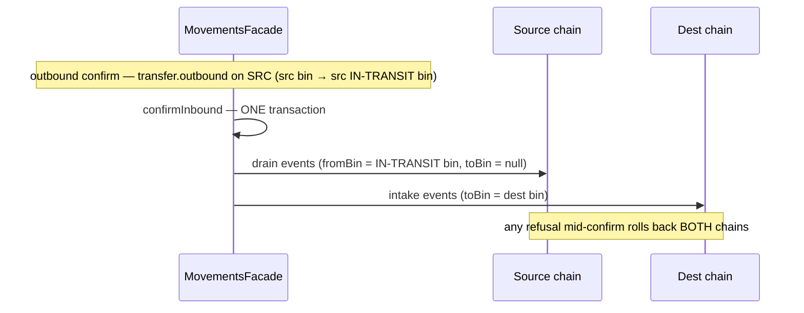

# Movements module

> Stock that MOVES by plan: transfer orders (the two-leg ledger legs), and later stock adjustments with approval thresholds, cycle counts and variance review. The last spine module to be populated — story 5-1 (FR-18/FR-29) gave it its first citizen.

Paths are relative to `workspace/core/backend/wms-be`. Read [`../IMPLEMENTATION-GUIDE.md`](../IMPLEMENTATION-GUIDE.md) first — the command skeleton is followed closely here and is not repeated.

**The module's one idea:** every planned stock movement is a pair of ledger legs, not a field on a row. The stock never "leaves the system" between the legs — it parks, physically and visibly, in a system-owned IN-TRANSIT bin, so the serial-in-exactly-one-bin invariant survives unbroken and ATP exclusion falls out of a bin-code predicate rather than a state flag.

This doc covers the transfer-orders slice (story 5-1). Stock adjustments (5-2), cycle counts (5-3), variance review (5-4) and the human review queue (5-5) grow here.

---

## Owns

| Table | Holds | Key invariants |
|---|---|---|
| `transfer_orders` (`src/shared/db/schema.ts`) | One row per transfer: `source_warehouse_id`, `dest_warehouse_id`, `status`, `note`, `created_by`, plus the per-transition stamps (`outbound_confirmed_by/at`, `inbound_confirmed_by/at`, `cancelled_by/at`) | See below |
| `transfer_order_lines` | One row per line: `sku_id`, `quantity_milli`, `from_bin_id`, `to_bin_id` (the PLANNED dest bin — the scanned bin at confirm is authoritative), `batch_ref`, `note` | Line qty positive (CHECK); a line is immutable after create |

CHECKs and RLS live only in `drizzle/0043_transfer_orders.sql`:

- `transfer_orders_status_check` — `draft | in_transit | completed | cancelled` (the three-layer vocabulary: TS tuple + CHECK + `@IsIn`).
- `transfer_order_lines_quantity_check` — `quantity_milli > 0`.
- `transfer_orders_tenant_isolation` / `transfer_order_lines_tenant_isolation` — the standard fail-closed RLS policy (the `NULLIF(current_setting('app.tenant_id', true), '')` shape), pinned by the suite's RLS probes for BOTH tables.
- Keyset indexes: `transfer_orders_tenant_created_at_id_idx` (list), `transfer_order_lines_transfer_id_idx` (detail), `transfer_orders_dest_warehouse_status_idx` (the device task feed).
- **No FKs anywhere** (repo convention).

The module also writes `audit_events` and `idempotency_keys` (tenancy-owned, shared).

**It does NOT own stock.** Every stock write rides `InventoryFacade.appendLedgerEventInTx` → the ledger append — PROJECTION_OWNER: movements never writes `stock_on_hand`/`batch_on_hand` directly.

---

## The in-transit representation

A system-owned **IN-TRANSIT bin per warehouse** (zone `IN-TRANSIT`, bin `IN-TRANSIT`, `system_owned = true`, type `staging`, the other system bins' generous capacity sentinel):

- **Outbound confirm** physically moves the units into the SOURCE warehouse's IN-TRANSIT bin (per-line `transfer.outbound` ledger events, `fromBinId` = source bin, `toBinId` = the IN-TRANSIT bin). The units are real rows in `stock_on_hand` — serial-in-exactly-one-bin survives.
- **ATP exclusion is structural**: `inTransitUnits` (`inventory/reservation.service.ts`) sums stock on system-owned IN-TRANSIT bins by code + system-owned, and `committedCeiling` subtracts it beside `qcHeldUnits` — so an order acceptance cannot promise parked units, and the read-model `atp()` reports the same number. Deleting the ceiling term is caught by the suite's grant arm (a request that fits on-hand but not the ceiling refuses 409 naming the parked units).
- **Inbound confirm** drains the IN-TRANSIT bin: same-warehouse = a relocation event (IN-TRANSIT → dest bin); cross-warehouse = a drain event on the source chain (`toBinId` null — the `pick.picked` pure-draw precedent) + an intake event on the dest chain, in ONE transaction (a mid-confirm refusal rolls back BOTH chains — the suite pins this).
- **Seeding**: migration 0043 seeds zone+bin for existing warehouses (fail-fast pre-flight refuses a tenant orphan or a USER bin coded `IN-TRANSIT`, naming the remediation; post-assertion re-checks every warehouse). New warehouses get NOTHING at creation — both system bins are **lazy-ensured at first use** (`ensureInTransitBinInTx` beside the QC-hold bin's `ensureQcHoldBinInTx`; the QC-hold precedent, story 3.4). A user bin squatting the code makes the ensure throw typed `409 transfer-in-transit-bin-conflict` naming the rename/retire remediation.
- **System bins are refused as transfer endpoints** by the shared placement gate (400 `validation-failed`) — the transfer legs are the ONLY writer that parks units in the IN-TRANSIT bin, and `stock.adjust` refuses it alongside the QC-hold bin (`qc-bin-not-adjustable`, the shared system-bin guard).

---

## Public seam

`MovementsModule` imports `InventoryModule` + `TenancyModule` and exports `MovementsFacade` **alone**; `test/architecture.spec.ts` has the movements block (the facade allowlist covers the `transfer.facade` specifier). The api shell composes `getTransferTasks` into the device catalog snapshot (`receiving.controller.ts` — the sanctioned cross-module join pattern).

`MovementsFacade` (`src/modules/movements/transfer.facade.ts`) carries: `createTransfer`, `confirmOutbound`, `confirmInbound`, `cancelTransfer`, `listTransfers` (keyset on `(createdAt, id)`), `getTransfer` (detail with BOTH legs' events), and `getTransferTasksInTx` — the device snapshot's derived task read (no task table; the putaway precedent): in-transit transfers destined to the warehouse, over-read `MAX_SNAPSHOT_TRANSFER_TASKS + 1` then sliced, each task line quoting the planned dest bin's `binStateEpoch` captured **on the same tx as the task** (the pick precedent — a stale quote is how the server LEARNS the bin moved).

---

## Flows

### Same-warehouse transfer (bin→bin)

```mermaid
sequenceDiagram
    participant P as Planner (transfers.manage)
    participant F as MovementsFacade
    participant L as Ledger (inventory)
    P->>F: createTransfer (Idempotency-Key)
    F->>F: guards → draft row
    P->>F: confirmOutbound
    F->>L: per line-arm transfer.outbound (src bin → src IN-TRANSIT bin)
    Note over F,L: one tx; status → in_transit; src ATP excludes parked units
    O->>F: confirmInbound (operator/device, transfers.execute)
    F->>L: per line-arm transfer.inbound (IN-TRANSIT → dest bin)
    Note over F,L: one tx; status → completed; epochs bump both bins
```

### Cross-warehouse transfer



---

## Commands

All four follow the command skeleton (shape checks → fingerprint → authority → replay → parent asserts → locks → guards → writes → outbox → audit → **idempotency key last**). Guard-order specifics:

### `createTransfer` (transfers.manage)

Guards, in order: body shape → catch-weight SKU refused **fail-closed** (400 — a transfer cannot carry a catch-weight quantity) → batch- AND serial-tracked SKU refused → batch line requires `batchRef` → serial-tracked line scannability guards (whole-unit quantity, ≤ 200 units — the per-confirm serial scan cap; both at create because the draft can be corrected) → sub-precision quantity refused (zero-scaling input) → kit SKUs refused (409 `kit-cannot-hold-stock`) → bins/warehouses exist + tenant-scoped (foreign → 404) → system bin on either end refused → status `draft`. Outbox `transfer.created` + audit.

### `confirmOutbound` (transfers.manage)

Re-reads the order `.for('update')`: wrong-state → 409 `transfer-wrong-state`; already-in-transit under the SAME idempotency key → replayed snapshot. Per line: optional serial scans validated against the line quantity (count match, no dupes) and resolved to refs (404 `serial-unknown` for an unresolvable code; 400 duplicate-in-payload). **Locks in the canonical acyclic order** (see Gotchas): source bin rows `.for('update')` sorted → serial advisory set tenant-wide sorted → warehouse advisory LAST (acquired inside the first append, re-entrant). Source-short guard per (sku, bin) — and per (sku, bin, batchRef) for batch lines — against on-hand (serial lines skip the probe; the serial guards are the per-unit authority): 409 `transfer-source-short`, order stays draft. Then the writes: IN-TRANSIT bin ensured, per-arm `transfer.outbound` appends (each `referenceDoc {kind:'transfer', transferId, lineId}`), outbox `transfer.outbound-confirmed`, audit, idempotency key last (unique violation → 409).

### `confirmInbound` (transfers.execute — the floor verb; `AnySessionGuard` on the route)

The mobile op's transport: a device badge-in session's operator confirms the leg; a bare enrollment credential → 401. Whole-quantity only — every line lands in one tx and the order completes; a partial receipt is a cancel + a new transfer.

Guard order: order `.for('update')` + wrong-state → `transfer-wrong-state`; landing-bin resolution (the op's `destBinId` is authoritative for ALL lines — a redirect replans every line; a line with no bin and no op bin → 400); **locks (canonical order)**: landing bin rows sorted → per-line serial arms (derived from the OUTBOUND events filtered by `referenceDoc->>'lineId'` — NOT by skuId, see Gotchas) locked tenant-wide sorted → warehouse advisory lock(s) sorted by uuid → **the epoch compare runs UNDER the locks** (op epoch vs live; absent = match; mismatch → 409 `transfer-bin-changed`) → SKU re-read `.for('update')` + kit/catch-weight refusals REPEATED (the SKU can flip via sku.edit between the confirms; parked units are exactly what these guards keep out) → placement gates ONE call per landing bin with the summed intake (`assertPlacementGatesInTx` — capacity, storage class, hazard pairwise incl. moving-SKU-vs-moving-SKU, bulk-asset, secure authority 403) → the leg writes → outbox `transfer.inbound-confirmed`.

Gate refusals answer **409** with the gate's own machine code (order stays in_transit) — putaway refuses the same codes with 400 on its own surface; the status is per-surface, the code is shared. Serial resolution on this leg: 404 `serial-unknown`, 400 duplicate scan.

### `cancelTransfer` (transfers.manage)

Draft-only: `.for('update')` + status check → `409 transfer-wrong-state` for anything else. No stock effect, no ledger events — a draft moves nothing. Outbox `transfer.cancelled` + audit.

---

## Invariants

1. **Every stock write rides the ledger** — movements never projects stock directly.
2. **Serial-in-exactly-one-bin is never broken** — in-transit stock is REAL stock in a REAL bin; nothing is "in limbo".
3. **The two legs are one logical movement, correlated by `referenceDoc {kind:'transfer', transferId, lineId?}`** — the detail read assembles both legs from the chains; the inbound serial arms derive from the outbound events BY LINE.
4. **Cross-warehouse inbound is atomic across chains** — one tx, drain + intake, lock order sorted; a refusal rolls back both.
5. **Lines are immutable after create** — corrections are new compensating orders (Decision 3: no in-transit cancellation; draft-only cancel).
6. **The IN-TRANSIT bin has exactly one writer** — the transfer legs; every other writer (adjust, placement intake) is refused on system bins.

---

## Events

- **Ledger chain events**: `transfer.outbound` (source chain, per arm), `transfer.inbound` (dest chain, per arm; cross-warehouse also writes the drain arm on the SOURCE chain with `toBinId` null). Additive registration in `ledger-registry.ts` with the `transfer` reference-doc arm.
- **Outbox lifecycle events**: `transfer.created`, `transfer.outbound-confirmed`, `transfer.inbound-confirmed`, `transfer.cancelled`.
- **Vocabulary cost**: the story grew the capability vocabulary 25 → 27 (`transfers.manage`, `transfers.execute`) and the RLS policy count 46 → 48 — the pinned counts in `test/users.spec.ts` / `test/client-isolation.spec.ts` carry the story reference.

---

## Gotchas

Each of these caused or nearly caused a real defect in 5-1's review; they are the module's load-bearing rules.

1. **Lock order is the codebase's canonical acyclic order, and BOTH confirms obey it: bin-row locks → serial advisory locks → warehouse advisory lock(s) (sorted by uuid when two).** The original spec said "advisory-first" — which reversed putaway/pick's documented order (`inventory.facade.ts` `lockWarehouseInTx` doc, `pick.command.ts`) and deadlocked against them: `appendMovement` re-acquires the warehouse advisory inside the ledger append, so an advisory-first writer holds the advisory while blocking on the bin row that putaway/pick hold while blocking on the advisory. If you add a movement verb, derive its lock order from the canonical chain, never from "what feels safe for this one command".
2. **Any staleness gate (epoch compare) runs UNDER the locks, not before them.** A pre-lock epoch read races a concurrent epoch-bumping write between read and lock and lets a genuinely moved bin slip past the refusal. Read → lock → compare.
3. **Derive per-line data from `referenceDoc->>'lineId'`, never by grouping events on skuId.** Two lines of the same SKU are legal; a per-SKU grouping makes each line inherit both lines' serials and the order becomes permanently un-confirmable with a misleading 422.
4. **The placement gates repeat create/outbound-time guards at inbound confirm.** SKU facts (kit, catch-weight) can flip between the confirms; the inbound write is the one that lands unrepresentable stock.
5. **Both system bins are lazy-ensured at first use — nothing is seeded at warehouse creation.** Do not "fix" this by adding call sites; the QC-hold precedent is the pattern, and a user bin squatting the `IN-TRANSIT` code throws typed `409 transfer-in-transit-bin-conflict` with the remediation in the message.
6. **Gate refusals are 409 here, 400 on putaway's surface — deliberately.** Same codes, different surface semantics: a placement refusal during a confirm is a conflict with another writer's state, not a malformed request.
7. **Parked units are subtracted in `committedCeiling`, not just reported in `atp()`** — a grant validates against the ceiling; an exclusion that lives only in the read model oversells the source warehouse.