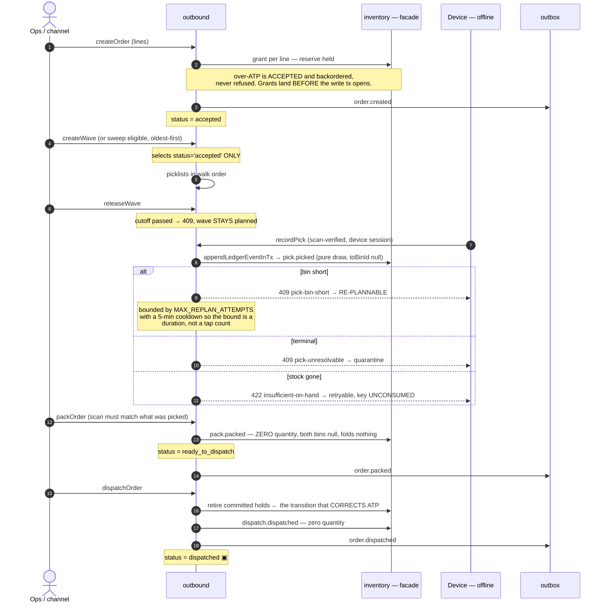
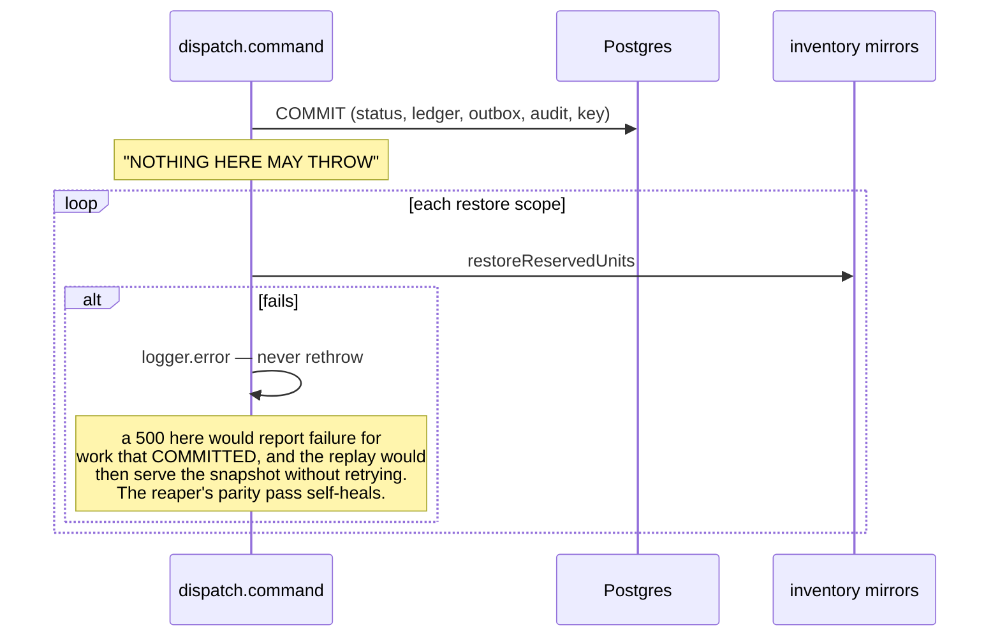

# Outbound module

> Orders and the order state machine, wave planning, the directed pick path, scan-verified picking with short-pick re-planning, pack verification and dispatch — the whole path from an accepted order to units leaving the building.

Source: `workspace/core/backend/wms-be/src/modules/outbound/`. Every `file:line` below is relative to `wms-be/` unless it names another repo. Read `../IMPLEMENTATION-GUIDE.md` first — this document only covers what is specific to outbound.

---

## Owns

Seven tables, module-exclusive (AD-6, enforced by `test/architecture.spec.ts`). All quantities are **milli-units** (`base × 10³`) in the columns and **base units** at every read shape.

| Table | Holds | Key invariants / CHECKs |
|---|---|---|
| `orders` (`src/shared/db/schema.ts:1420`) | The order header: `status`, `source` (`manual`\|`ingested`), the channel arms `integration_id` / `external_event_id` / `source_payload_hash` | `orders_status_check` = `accepted, ready_to_dispatch, dispatched, cancelled` (widened 0017 → `0023_packed_order_arm.sql:20` → `0024_dispatched_order_arm.sql:25`). `orders_source_event_unique` is a **partial** unique index on `(tenant_id, integration_id, external_event_id)` where both channel arms are non-null (`schema.ts:1449`) — manual orders never participate. It is the channel-dedup race backstop, not a nicety |
| `order_lines` (`schema.ts:1473`) | Per line: `qty` ordered, `reserved_qty` actually held, `reservation_id`, `status` (`open`\|`backordered`), and — **11.4** — `parent_line_id`, the kit-explosion link to the kit line this child was exploded from | `order_lines_qty_positive`, `order_lines_reserved_qty_nonnegative`, `order_lines_reserved_qty_lte_qty` (`drizzle/0017_ambiguous_santa_claus.sql:65-69`). **The shortfall is derived (`qty − reserved_qty`), never stored** (`order.command.ts:1019`). The line caches only the hold's *id*; its live state is read through `InventoryFacade` every time (`order.command.ts:931`) |
| `wave_policies` (`schema.ts:1517`) | The rule a wave is generated under: `grouping` (`single`\|`batch`), `priority`, `max_orders`, `cutoff_local_time` (`HH:MM`), unvalidated `carrier_ref` | `wave_policies_warehouse_name_unique`; grouping/priority/max-orders/cutoff-shape CHECKs (`0018_narrow_lake.sql:106-119`). `max_orders` null ≠ uncapped — the module applies `DEFAULT_WAVE_MAX_ORDERS = 200` (`wave.command.ts:99`) |
| `waves` (`schema.ts:1569`) | The grouping aggregate: `status`, `released_at`, `cancelled_at` | `waves_status_check` = `planned, released, cancelled`; `waves_released_at_pairing` / `waves_cancelled_at_pairing` — a released wave always names when, a cancelled one always names when (`0018:145-147`) |
| `picklists` (`schema.ts:1609`) | One unit of floor work. `order_id` set on a `single` picklist, **null on a `batch` picklist** | `picklists_status_check` = `planned, ready, cancelled`. `picklists_tenant_warehouse_status_idx` is the driving index of the device snapshot read — without it that read seq-scans every picklist the tenant ever had, on the one endpoint every device hits every refresh (`schema.ts:1626-1634`) |
| `picklist_lines` (`schema.ts:1671`) | **One slice of one order line**: the bin/batch *suggestion*, `qty` to draw, `shortfall_qty`, `reason_code`, `slice_seq` (per order line), `walk_seq` (per picklist), `status` | `picklist_lines_open_order_line_unique` — partial unique on `(tenant_id, order_line_id, slice_seq) WHERE status <> 'cancelled'` (`schema.ts:1731`) **is the one-open-wave-per-order invariant**. `picklist_lines_slice_shape`, `_short_pairing`, `_reason_code_check` (`0022_steep_morbius.sql:28-57`). `picklist_lines_pickable_walk_idx` is partial on `status = 'planned' and bin_id is not null`, so it holds open floor work only and does not grow with picking history |
| `picks` (`schema.ts:1771`) | The settlement record of one drawn slice: scanned `bin_id` vs `suggested_bin_id`, re-derived `batch_id` vs `suggested_batch_id`, `reservation_committed`, `conflict_class`, `qty`, device time `picked_at` | `picks_line_unique` on `(tenant_id, picklist_line_id)` — one pick per line, the diverged-replay backstop. `picks_qty_positive` (`0019_flippant_komodo.sql:44`) is why **a zero-unit short pick writes no `picks` row at all**. `picks_reservation_pairing` (`0019:50`). `picks_conflict_class_check` = `none, applied, settled` (`0021_lean_george_stacy.sql:43`) |

**Not owned, and never written directly:** `reservations`, `ledger_events`, `stock_on_hand`, `batch_on_hand`, `bin_state_epochs` (inventory); `bins`, `devices` (tenancy); `skus`, `batches`, `serials` (catalog). Every touch goes through `InventoryFacade` / `CatalogFacade`, and the stock-moving ones go through the **in-transaction passthroughs** (`appendLedgerEventInTx`, `lockSerialsInTx`, `lockWarehouseInTx`, `commitReservationInTx`, `releaseReservationInTx`, `grantReservationInTx`, `retireCommittedReservationInTx`) so they commit with this module's own writes.

---

---

## Schema (field level)

Seven tables. `tenantTimestamps` = `created_at` / `updated_at`, `timestamptz NOT NULL DEFAULT now()`. Every `id` is `uuid PRIMARY KEY` stamped `uuidv7()` in the app. No FKs — uuid column plus index, validated in the command transaction. **Quantities are milli-units** as `bigint mode:'number'`; a raw-SQL read returns a **string** and needs `Number(...)`.

### `orders`

| Column | Type | Null | Default | Guard | Meaning |
|---|---|---|---|---|---|
| `status` | text | NO | `'accepted'` | `orders_status_check` | `accepted \| cancelled \| ready_to_dispatch \| dispatched`. **Widened twice** (0023, 0024) by DROP-then-ADD. Every guard reading it is an **allow-list** — the 4.5 review found a deny-list that would have corrupted data |
| `source` | text | NO | `'manual'` | `orders_source_check` (`0017:58`) | `manual \| ingested`. **There is no `channel` arm** — `ORDER_SOURCES`, `order.command.ts:67` |
| `integration_id` | uuid | **YES** | — | — | Null on a manual order. **Unvalidated** — no integrations table until Epic 7 |
| `external_event_id` | text | **YES** | — | partial unique | Channel dedup (AD-5) |
| `source_payload_hash` | text | **YES** | — | — | Ingested payload fingerprint. **Convention changed in 10.2** — base units now, so no pre-10.2 payload matches |
| `destination_contact_name` … `destination_pincode` | text ×7 | **YES** | — | — | The shipment destination (story 11-1, migration `0030`): `contact_name`, `phone`, `line1`, `line2`, `city`, `state`, `pincode`. **Point-in-time** — copied at create, never re-resolved. `pincode` is TEXT, `/^\d{6}$/` — leading zeros significant, never an integer. Required at create (command-side, `assertAddress`); pre-11.1 rows read back `destination: null`. **The destination joined both payload hashes in 11.1** with a fixed key position — pre-11.1 keys answer `422`, the accepted break pinned in `test/shipment-addresses.spec.ts` |

**`orders_source_event_unique`** is PARTIAL on `(tenant, integration_id, external_event_id) WHERE integration_id IS NOT NULL AND external_event_id IS NOT NULL` — manual orders never participate.
**The address model exists as of story 11-1** (see `destination_*` above) — the gap that blocked story 4-6d (rate shopping) is closed on the data side; the carrier surface itself is still 4-6d's.

### `order_lines`

| Column | Type | Null | Default | Guard | Meaning |
|---|---|---|---|---|---|
| `qty` | bigint | NO | — | `order_lines_qty_positive` | Ordered, milli-units |
| `reserved_qty` | bigint | NO | `0` | `..._reserved_qty_nonnegative` **and** `order_lines_reserved_qty_lte_qty` (`reserved_qty <= qty`) | What acceptance actually held. **Shortfall is derived (`qty − reserved_qty`), never stored** |
| `reservation_id` | uuid | **YES** | — | — | Null on a fully-backordered line — an unavailable line gets no hold. **11.4 amendment:** also always null on a kit **parent** line, open or backordered — a parent line holds nothing; every hold the kit earns belongs to its child component lines. A downstream reader keying on `reservation_id is null` to mean "this line got nothing" is wrong for kit parents |
| `status` | text | NO | `'open'` | CHECK | `open` when fully reserved, `backordered` when short |
| `parent_line_id` | uuid | **YES** | — | `order_lines_parent_line_idx` (`0033`) | **11.4, kit explosion** — set on the child component lines a kit line explodes into, pointing at their kit line; null on ordinary lines and on kit parents themselves. No FK (the repo convention). A child line is a first-class order line: it holds its own reservation, appears in waves/picklists/picks, and the parent line is only the display/trace link |

**The live reservation state is read through the inventory facade, never copied here.**

### `wave_policies`

| Column | Type | Null | Default | Guard | Meaning |
|---|---|---|---|---|---|
| `name` | text | NO | — | `wave_policies_warehouse_name_unique` on `(tenant, warehouse, name)` (`0018:66`) | Operator-facing policy name |
| `grouping` | text | NO | `'single'` | CHECK | `single \| batch` |
| `priority` | integer | NO | `0` | — | **Not a quantity** — unscaled |
| `max_orders` | integer | **YES** | — | — | **Null is NOT uncapped** — it inherits `DEFAULT_WAVE_MAX_ORDERS = 200` (`wave.command.ts:99`, applied at `:987`). `schema.ts:1529` says so outright |
| `cutoff_local_time` | text | **YES** | — | — | Local wall-clock, India-only by design |
| `carrier_ref` | uuid | **YES** | — | **none** | **Deliberately unvalidated** — story 4-6b added a carriers table but chose not to retro-validate this |

### `waves`

`status` text NOT NULL default `'planned'`, CHECK `planned \| released \| cancelled`. `released_at` / `cancelled_at` timestamptz nullable — and the stamping is a **database rule, not a convention**: `waves_released_at_pairing` and `waves_cancelled_at_pairing` (`0018:145,147`).

### `picklists`

`order_id` is **nullable** — null on a batch picklist spanning orders. `status` default `'planned'`, CHECK `planned \| ready \| cancelled`.

### `picklist_lines` — the richest table here

| Column | Type | Null | Default | Guard | Meaning |
|---|---|---|---|---|---|
| `bin_id` · `bin_code` | uuid / text | **YES** | — | — | **Null means an unfulfillable shortfall, not a stop.** A surface must not render it as a walk step |
| `batch_id` | uuid | **YES** | — | — | A **suggestion**; the pick re-derives FEFO |
| `reservation_id` | uuid | **YES** | — | — | |
| `qty` | bigint | NO | — | `picklist_lines_qty_nonnegative` | Planned, milli-units |
| `shortfall_qty` | bigint | NO | `0` | `..._shortfall_qty_nonnegative` | |
| `reason_code` | text | **YES** | — | `picklist_lines_reason_code_check` | Short-pick reason, closed set |
| `slice_seq` · `walk_seq` | integer | NO | — | — | **Not quantities** — unscaled. `walk_seq` is the walk order; render by it |
| `status` | text | NO | `'planned'` | `picklist_lines_status_check` (`0022:13`) | `planned \| unfulfillable \| picked \| short \| cancelled`. **`unfulfillable` is the arm a null `bin_id` carries** |

**Two compound CHECKs — the ones a careless change breaks. Both were dropped and RE-CREATED by `0026:97-98,152-163`, so the live definitions are there, not in their originating migration** (`slice_shape` originates `0018:137`, `short_pairing` `0022:41`):
- `picklist_lines_short_pairing` — `status = 'short'` and `reason_code` must be set together
- `picklist_lines_slice_shape` — the slice/shortfall/bin arms must agree

**`picklist_lines` carries the one-open-wave-per-order invariant** via a partial unique index.

### `picks`

| Column | Type | Null | Default | Meaning |
|---|---|---|---|---|
| `bin_id` | uuid | NO | — | **What the operator actually scanned** |
| `suggested_bin_id` | uuid | **YES** | — | What the plan named. **Report actual-vs-suggested, never the plan alone** |
| `batch_id` / `suggested_batch_id` | uuid | **YES** | — | Same distinction; `batch_id` is server-re-derived FEFO |
| `reservation_committed` | boolean | NO | `false` | **False on all but the last picked slice** of a multi-bin line |
| `conflict_class` | text | NO | `'none'` | AD-14 taxonomy arm |
| `qty` | bigint | NO | — | `picks_qty_positive`, milli-units |
| `picked_at` | timestamptz | NO | — | **Device time**, not server time |
| `device_id` | uuid | NO | — | The badge-in session's device |

**`picks_line_unique`** on `(tenant, picklist_line_id)` — the DB backstop against a second draw on one line. **`picks_reservation_pairing`** (`0019:50`) pairs `reservation_id` with `reservation_committed`.

---

## Public seam

`OutboundFacade` (`src/modules/outbound/outbound.facade.ts`) is the only thing a sibling or the api shell may import. Everything is `(command, idempotencyKey)` for writes and `(tenantId, …)` for reads.

| Method | Shape | Does | Called by |
|---|---|---|---|
| `createOrder` `:124` | `(CreateOrderCommand, key) → OrderSnapshot` | Manual entry and adapter-ready ingestion through ONE path; reserves per line | `POST :tenantId/outbound/orders` (`src/api/outbound.controller.ts:61`) |
| `cancelOrder` `:129` | `(CancelOrderCommand, key) → OrderSnapshot` | `accepted → cancelled`, releases every open hold | `.../orders/:orderId/cancel` (`outbound.controller.ts:116`) |
| `getOrder` `:141` | `(tenantId, orderId) → order \| null` | Detail read with live hold states; null → the shell 404s | `outbound.controller.ts:262` |
| `listOrders` `:163` | `(tenantId, warehouseId, query) → Page<OrderEntry>` | Keyset page over `(created_at, id)`, headers only | `outbound.controller.ts:296` |
| `createWavePolicy` `:210` | `(CreateWavePolicyCommand, key) → WavePolicySnapshot` | The rule a wave is generated under | `outbound.controller.ts:330` |
| `generateWave` `:218` | `(GenerateWaveCommand, key) → WaveSnapshot` | Gathers accepted orders into picklists and plans the walk | `outbound.controller.ts:399` |
| `releaseWave` `:223` | `(WaveTransitionCommand, key) → WaveSnapshot` | `planned → released`; picklists go `ready` | `outbound.controller.ts:444` |
| `cancelWave` `:228` | `(WaveTransitionCommand, key) → WaveSnapshot` | Withdraws the wave, frees non-drawing lines | `outbound.controller.ts:478` |
| `getWave` `:238` | `(tenantId, waveId) → wave \| null` | Wave + picklists + lines in walk order | `outbound.controller.ts:583` |
| `listWaves` `:260` | `(tenantId, warehouseId, query) → Page<WaveEntry>` | Keyset page, with `picklistCount` per row | `outbound.controller.ts:613` |
| `listWavePolicies` `:319` | `(tenantId, warehouseId, query) → Page<policy>` | A policy must be discoverable to be referenced | `outbound.controller.ts:373` |
| `recordPick` `:353` | `(RecordPickCommand, key) → PickSnapshot` | One scan-verified pick: ledger draw + hold settlement in one tx | `POST .../outbound/picks`, **device-gated** (`outbound.controller.ts:512`) |
| `packOrder` `:366` | `(PackOrderCommand, key) → PackSnapshot` | Verifies the parcel against what was PICKED, flips `ready_to_dispatch` | `outbound.controller.ts:156` |
| `dispatchOrder` `:381` | `(DispatchOrderCommand, key) → DispatchSnapshot` | Terminal flip + hold retirement (the ATP correction) | `outbound.controller.ts:207` |
| `getPickTasksInTx` `:402` | `(tx, tenantId, warehouseId) → PickTask[]` | The device's walk, **in the caller's transaction** | in-module composition |
| `getPickTasks` `:417` | `(tenantId, warehouseId) → PickTask[]` | The same read in its own transaction | `src/api/receiving.controller.ts:160`, which joins it onto the device catalog snapshot |

`getPickTasksInTx` exists in both shapes deliberately (`outbound.facade.ts:388-421`): the api shell composes the two facades **sequentially**, so the snapshot's connection is released before this one is taken. A pool-opening sibling called while the outer transaction is held reserves a second connection, and postgres.js queues connection requests with no timeout — enough concurrent snapshots deadlock the pool permanently. A convenience wrapper here caused exactly that once.

Capabilities: `orders.manage` (Owner, Ops Manager), `waves.manage` (Owner, Ops Manager), `picks.execute` / `pack.execute` / `dispatch.execute` (Owner, Ops Manager, **Operator**) — `src/modules/tenancy/permissions.ts:49-76`. Reads are never capability-gated; they assert tenant + warehouse only.

---

## The order state machine

`ORDER_STATUSES` (`order.command.ts:59`) is the registry; `orders_status_check` (`0024:25`) mirrors it; `test/orders.spec.ts` pins the two together. **This module owns the machine exclusively (AD-6)** — no other module may add or transition an arm.

```
                  packOrder                dispatchOrder
   accepted ───────────────────▶ ready_to_dispatch ───────────────▶ dispatched ▣
      │
      │ cancelOrder
      ▼
  cancelled ▣
```

| Transition | Writer | Guards, in order |
|---|---|---|
| `∅ → accepted` | `createOrder` (`order.command.ts:218`) | `orders.manage` → replay → line shape → channel-arm coherence → warehouse in tenant → SKUs in tenant → channel dedup pre-check → per-line grants all land before the write tx opens |
| `accepted → cancelled` | `cancelOrder` (`:487`) | `orders.manage` → replay → order locked `FOR UPDATE` → already-`cancelled` is an idempotent 200 no-op (`:530`) → any **other** non-`accepted` arm is a 409 (`:547`) → no `committed` hold (`:571`) → no pick line that **drew units** (`:607`) → conditional flip → re-check under the flip's own tx (`:664`) |
| `accepted → ready_to_dispatch` | `packOrder` (`pack.command.ts:193`) | `pack.execute` → replay → measurement shape → order locked → already-packed: re-read the key under the lock, else 409 (`:253`) → not `accepted` → 409 (`:274`) → the order was actually picked (`:287-332`) → scan matches what was picked (`:395`) |
| `ready_to_dispatch → dispatched` | `dispatchOrder` (`dispatch.command.ts:169`) | `dispatch.execute` → replay → carrier text shape → order locked → already-dispatched: re-read the key under the lock, else 409 (`:239`) → not `ready_to_dispatch` → 409 (`:257`) |

**Terminal:** `dispatched` and `cancelled` outright. `ready_to_dispatch` is terminal for every *pre-dispatch* flow — cancel refuses it, both wave-selection paths select `accepted` only (`wave.command.ts:1012`, `:1045`), and a queued pick against it quarantines.

Every status guard in this module is an **allow-list**, never a deny-list, so a new arm is refused everywhere by construction until someone deliberately admits it. Story 4.5 audited and converted the two that were not (`wave.command.ts:747-755`, `:904-919`) — see Gotchas.

The one place a new arm *must* be classified by hand is `orderNotAcceptedRefusal` (`pick.command.ts:1876`), and that is a `switch` with a `never` default: adding an `ORDER_STATUSES` arm fails `tsc` rather than silently falling into the retryable branch.

Sub-machines this module also owns: **wave** `planned → released`, `planned|released → cancelled` (`wave.command.ts:38`); **picklist** `planned → ready|cancelled` (`:42`); **pick line** `planned → picked|short|cancelled`, with `unfulfillable` created rather than transitioned (`:60`). `picked` and `short` are terminal and sit **outside** `'cancelled'` on purpose — see Invariants.

---

## Flows

### The order's whole life



**The reservation lifecycle is the spine of this diagram.** `held` at accept, `committed` at pick, `released` at dispatch or cancel. The known leak: a **packed-but-abandoned order understates ATP indefinitely** — `expireDue` sweeps `held` only, cancel refuses a packed order, and dispatch is the sole `committed → released` writer. There is no path out.

### Why post-commit work never throws



---

## Commands

Every command follows the standard skeleton (authority → replay → validate → lock → guard → write → outbox → audit → idempotency key last). Only the outbound-specific parts are below.

### `createOrder` — `order.command.ts:218`

Three phases, and the split is the point.

1. **Read tx**: `orders.manage`, replay, validation, master-data asserts, milli-unit conversion (`:305-314`), and the channel-dedup pre-check (`:319`) — a redelivered identical payload returns the first order's snapshot and writes the key against it; a *divergent* payload on the same ref is `422 order-source-conflict`.
2. **Grants, outside any transaction** (`:359-379`). A reservation grant is itself a multi-transaction atomic unit (probe → Valkey script → journal), so it cannot nest. Per line `min(qty, ATP)` under the fixed backorder policy; a `409 unavailable` race loser re-probes up to `MAX_GRANT_ATTEMPTS = 4` (`:85`, `reserveLine` at `:751`) and then takes the backorder outcome rather than failing the order. A 503 from the store aborts everything: `releaseAll` runs and nothing is written. **The invariant is "nothing accepted half-reserved", not "one transaction".**
3. **Write tx**: `orders` + `order_lines` (`status: 'backordered'` when `reserved < qty`) + `order.created` outbox + audit + key. A unique violation on `orders_source_event_unique` becomes `DedupLostError`, thrown inside the tx so its rollback discards the order, and resolved against the settled winner outside (`:815`).

TTL on every acceptance hold is `ORDER_RESERVATION_TTL_SECONDS = 7 days` (`:82`). Expiry is detected downstream at commit time, not by order-state machinery.

**Kit lines explode into child order lines (11.4), inside the same three phases.** Phase 1, after the SKU asserts, resolves each kit line's composition through `CatalogFacade.getKitCompositionInTx` and runs `explodeKitLine`: per component, the child's milli quantity is the kit line's milli quantity × the per-kit component milli quantity **÷ 1000** (kit-line milli × component-per-kit milli lands in nano-scale; the divide brings it back to the component's milli-units — the code does this division; the frozen spec sentence omitted it, flagged in the spec's triage log). Two refusals fire here, before any grant moves:

- **Precision** — the child must satisfy the component's own declared `uomPrecision` (`child % 10^(QUANTITY_DECIMALS − precision) ≠ 0` → 400, naming the line, the kit and the child value). This subsumes the sub-milli check and closes the permanently-unpickable line: a kg-kit with an `each` component cannot accept 0.5 kg, because no pick could ever record a 0.5-`each` draw (`assertRecordableQuantity` would refuse it at pick, stranding the stock until TTL).

Phase 2 grants the components as one block with the **all-or-nothing per kit** rule: components grant in composition order through the ordinary `reserveLine`, but a kit may not hold *part* of anything — a hold below the component's full exploded quantity is a shortfall too, so the siblings this attempt granted are **released** (`'kit-backorder'`) and the whole kit line backorders. A kit never ships half its contents and never half-holds; the parent line carries zero `reserved_qty` either way and its shortfall is the all-or-nothing outcome. A mixed order (kit line + ordinary lines) behaves as before for the ordinary ones. The partial-hold check matters because `reserveLine` grants `min(qty, ATP)` — the plain line's legitimate partial grant — which a kit must never keep.

Phase 3 then inserts the child lines beside their parent: one per component, `parentLineId` set, each carrying its own `reservationId`/`reservedQty`/`status` from the grants. The explosion is **point-in-time** — component ids and quantities are copied into the children at acceptance, so a later composition edit (`KitCommand.put`) never re-explodes an accepted order. `releaseAll` (the failure path and cancel) covers child grants too, and `order.created` carries the exploded children in its payload — no kit-aware machinery exists below the outbound module: waves, picklists, picks, pack and dispatch read only child lines and see ordinary SKUs.

**How the web order detail shows this (11.6, client-side only):** the FE groups `parentLineId` children under their parent (the join is `GET /catalog/kits` — kit-ness is derived, never a flag the API carries), sums its line totals over **top-level lines only** (the children share the parent's quantity; summing the flat list would double-count), and renders the parent's hold span honestly: a parent's `reservation_id` is always null, so a naive `Hold: <state>` would read "No hold" — instead a kit parent gets `kitParentHoldLabel(line, order.status)`, which arms on the **order** status (`dispatched` → "holds retired", `cancelled` → "holds released"), then on the line status (`backordered` → "nothing held; a component is short"), then the static kit-holds sentence. Line status alone could not carry those arms — line `status` is only `open | backordered`.

### `cancelOrder` — `order.command.ts:487`

**Flip first, release after** (`:618-623`). Releasing first leaves a crash window where stock is free while the order still reads `accepted` — units sellable twice. This ordering inverts it: a crash leaves the order `cancelled` with live holds, ATP understated until the reaper expires them. Phase 4 (`:706`) therefore may not throw; a release that will not settle is logged and left to the TTL.

Two refusals before anything is written: a `committed` hold (`:571`) and **a pick line that actually drew units** (`:607`, keyed on `picklistLineDrewUnits()`). A `held` reservation is not proof the order is still pre-pick stock — a hold settles only when the *last* open slice of its order line is picked, so a two-bin line with one slice drawn still reads `held`.

Writes: `orders.status`, `order_lines.reserved_qty = 0` + `reservation_id = null` (`:647`), `order.cancelled` outbox, audit, key. Note the line `status` column is **not** reset, so a cancelled order's lines keep reading `open`/`backordered`.

### `createWavePolicy` — `wave.command.ts:286`

One transaction. Validates name (≤120), grouping, priority (0..1000), `maxOrders` (1..500), `cutoffLocalTime` against `CUTOFF_RE`, and that `warehouseId` / `carrierRef` are uuids even for non-HTTP callers (a raw `22P02` is never an answer). `wave_policies_warehouse_name_unique` violation → 409. Emits `wave.policy-created`.

### `generateWave` — `wave.command.ts:434`

One transaction, no reservation moves anywhere: a wave carries each order line's **existing** hold forward by id.

Guards: `waves.manage` → replay → shape (≤`MAX_SELECTED_ORDERS = 500`) → warehouse in tenant → policy loaded and belonging to that warehouse → `selectOrders` (`:981`) → live-hold filter (`:505-520`) → plan → write.

`selectOrders` takes `FOR UPDATE` on the order rows in `(created_at, id)` order — the same order `cancelOrder` takes it in, so concurrent commands queue instead of deadlocking (`:976-979`). An explicit selection earns precise refusals (unknown order 404, non-`accepted` named, already-on-an-open-wave named, over-cap 422 `wave-cap-exceeded`); an omitted selection sweeps `accepted` orders not already claimed, oldest first, capped.

A hold the journal no longer reports as `held` is not pickable stock (`:505`). With an **explicit** selection, an order whose lines all lost their holds is refused by name (`:533`) — an operator who names five orders and gets three picklists back cannot tell which two vanished. A sweep skips them silently, because refusing the whole wave over one stale order would block waving entirely.

Writes: one `waves` row, one `picklists` row per group (`batch` → exactly one with `order_id: null`, `single` → one per order), and the planned `picklist_lines` in `sortWalk` order. A unique violation on `picklist_lines_open_order_line_unique` becomes `WaveClaimLostError` → the whole plan rolls back and the winner is re-read and named (`:594-604`, `:1082`). Emits `wave.generated`.

### `releaseWave` — `wave.command.ts:664`

The cutoff gate runs **before** the flip and writes nothing past it: `localTimeOfDay(this.clock.now()) > policy.cutoffLocalTime` → `409 cutoff-passed`, wave stays `planned` and is re-releasable tomorrow (`:711-723`). `WAVE_CLOCK` (`wave.clock.ts:13`) is injectable precisely so both sides of 16:30 IST are assertable without sleeping.

With the flip, in the same commit: pick lines of orders **cancelled** since planning are flipped to `cancelled` (`:756`), a picklist with no non-cancelled bin-bearing line left is cancelled rather than shipped empty (`:770`), and the rest go `ready` (`:786`). Already-`released` under a new key is a 200 no-op with no second event; `cancelled` is a 409. Emits `wave.released`.

### `cancelWave` — `wave.command.ts:839`

Flips the wave, then flips every line that did **not** draw units (`not picklistLineDrewUnits()`) whose order is `accepted` or `cancelled`, then flips every picklist (`:920-934`). That line flip **is** what frees the orders — the partial unique index's predicate is `status <> 'cancelled'`. Drawn lines keep their claim forever, because their units have physically left the bin. No reservation moves. Emits `wave.cancelled`.

### `recordPick` — `pick.command.ts:338`

The module's only stock-moving command, and the richest. One transaction, in this order:

1. Device row re-read `FOR UPDATE`, fail-closed (`:388`) — the token is transport, never authority.
2. Role re-read from the DB → `picks.execute` (`:402`).
3. Replay (`:406`), with defaults filled for pre-4.3b/4.4 snapshots (`:430-438`).
4. Validation: `qty ≥ 0`, reason code in `SHORT_PICK_REASON_CODES` (`:58`), a zero-unit pick needs a reason (`:463`).
5. Line + picklist + wave loaded and joined (`:471`); picklist/warehouse coherence (`:498`).
6. **State gates**, split by terminality (`:534-599`): a `planned` wave or `planned` picklist is a *retryable* `conflict`; `cancelled` anything, an already-`picked` or `short` line, and an `unfulfillable` line are `pick-unresolvable`.
7. Order gate → `orderNotAcceptedRefusal` (`:638`).
8. Scanned SKU vs line SKU (`wrongItem`, `:642`), SKU row read, **then** milli-unit conversion and the precision refusal (`:671`) — behind the replay, because the unit is what says how precise the draw may be.
9. `qty > line.qty` is a hard 400; `qty < line.qty` is a short pick and needs a reason (`:681-693`).
10. Bin row `FOR UPDATE` (`:701`) + system/retired/blocked refusals. A SKU that is both batch- and serial-tracked is refused outright (`:748`) — the scan carries no batch per serial, so the arms cannot be paired without guessing.
11. Serial arm resolved and the whole set pre-locked (`:797`), **before** the warehouse lock, keeping putaway's acyclic `bins-row → serial → warehouse` order.
12. `lockWarehouseInTx` (`:815`), then the epoch read and AD-14 classification (`:838`), then hold liveness (`:859`).
13. Batch arms re-derived FEFO **in the bin the operator actually scanned** (`:887`), sufficiency pre-check (`:908`), then `pick.picked` appends — one per batch arm, or one per serial unit at magnitude 1 (`:949-992`).
14. Line flip `planned → picked|short` conditionally (`:1004`); a lost flip is `pick-unresolvable`.
15. The hold: settled, or released-and-re-granted (below).
16. `picks` row — **skipped entirely at `qty = 0`** (`:1235`) — then `pick.recorded` outbox, audit (`pick.picked` or `pick.short-picked`, targeting the *line* when there is no pick row), device heartbeat, key.
17. After the commit only: `restoreReservedUnits` for the net the short-pick owed (`:1354`).

### `packOrder` — `pack.command.ts:193`

Completeness is **line-status based, never `picks`-based** (`:281-332`): an order is fully picked when it has at least one `picklist_lines` row and none is still `planned`. A zero-unit short pick writes no `picks` row and a multi-slice line writes several, so counting pick rows answers neither question. Two refusals with the same "not picked" meaning: zero rows (`:297`) and **every row `cancelled`** (`:318`).

Verification is against **PICKED, never ORDERED** (`:395`) — short picks are a first-class outcome, and comparing to ordered quantities would refuse every short-picked order. Every divergence is listed at once (`:611`), capped by `namedSample` at 20.

Then, in one commit: the flip, one zero-quantity `pack.packed` event per **order line** (both bin arms null — picking already drew the units out of stock), the dead-hold sweep (`:511-530`), `order.packed` outbox, audit, key. Counter restores ride out and are applied after the commit (`:586`).

### `dispatchOrder` — `dispatch.command.ts:169`

Flip, one zero-quantity `dispatch.dispatched` event per order line carrying the optional carrier/tracking text, then **retire every `committed` hold the order owns** (`:389-410`) — the point of the command. `order.dispatched` outbox, audit, key. Counter restores after the commit, each isolated in its own `try` (`:479-492`).

---

## Key algorithms

### Wave generation and the directed pick path

`buildStockPool` (`replan.ts:71`) is pure and shared by both the planner and the re-plan lookup, so the definition of "pickable" cannot drift into two copies. For each SKU it walks bins in `bins.code` ascending — `pickableBinsInTx` (`replan.ts:143`) applies putaway's filter set: not blocked, not system-owned, not retired, which is also why QC-held stock never plans (a hold *moves* stock into the system-owned QC bin). Within a bin, batches rank **FEFO — expiry ascending, no-expiry last** (`:105-113`), and neither a blocked nor an expired batch is drawable (`:75-83`).

The per-bin budget at `replan.ts:114-131` is subtle and load-bearing: the plain projection row is the ceiling for the **whole bin**, not for each batch in it. Units the batch fold cannot attribute (`uncovered`) are still pickable and emit a batch-less slot; units held by a blocked or expired batch are *accounted for* and therefore never resurface in that remainder.

`planSlices` (`wave.command.ts:1124`) consumes that pool **destructively**, so two lines of the same SKU never both claim the same units. Every quantity a picklist names is the order line's `reserved_qty`, never `qty` (`:1165`). Uncovered reserved units emit one trailing `unfulfillable` slice with `bin_id: null` and the units in `shortfall_qty` (`:1188`).

`sortWalk` (`:1438`) is the walk: `bin_code` ascending so all lines for one bin are contiguous and a bin is visited once (the whole batch-picklist promise), bin-less slices forced last via `'￿'`, ties broken by `(sku, order, orderLine, sliceSeq)` so a regenerated plan is byte-identical. Bins carry **no spatial data** — code order *is* the walk, which is exact for grid-generated `A-01-01` codes and stable-but-arbitrary for hand-typed ones.

### The FEFO draw at pick time

`deriveBatchArms` (`pick.command.ts:1466`) re-derives the arms **in the bin the operator scanned**, not the bin the plan named, against live per-batch stock read bin-scoped in SQL (reading the whole warehouse under a held lock would be work done under a lock). Expiry is judged against **the op's own `occurredAt`** (`:1489`), not `now()` — a pick queued offline and replayed the next morning must not be re-judged against the replay instant. A shortfall is *reported* as `{ drawable }`, never thrown from here; the caller decides which refusal it becomes (`:1513-1518`).

### Short-pick re-planning and slice allocation

A short pick (`pick.command.ts:1071-1184`):

1. **Releases the whole hold** and re-grants the remainder. A reservation is a whole-quantity row with no partial commit (AD-12), and `grant` treats a different quantity on the same owner as a hard 409 — so release must precede re-grant, and both ride the pick's transaction.
2. The remainder is `released.quantity − drawnBySiblings − scaled.qty` (`:1107`). **Not** `quantity − qty`: nothing ever shrinks `reservations.quantity` as slices are drawn, so on a multi-slice line the released quantity is still the whole original hold. An 8-unit line with a 4-unit slice already picked and this one short at 1 owes 3, not 7.
3. `grantReservationInTx` takes the just-released hold as an argument so it can *prove* it takes no more than that hold gave back (`inventory.facade.ts:582`). It returns `null` rather than throwing when the remainder cannot be held — that is FR-15's partial-order path, not a fault.
4. Every still-open sibling slice is re-pointed at the successor hold (`:1143`). Left alone they would replay into `pick-unresolvable` — a pick the operator can physically perform, refused because a *different* stop came up short.
5. `findReplanSlices` (`replan.ts:200`) builds the pool for this one SKU, **excludes the bin that just came up short by id** (re-planning onto it hands the operator the same empty shelf twice), and subtracts the units other open `planned` lines already claim per bin (`openClaimsInTx`, `replan.ts:282`). The planner gets that subtraction free by consuming its pool within one wave; a re-plan runs long after that wave committed, so it must read outstanding claims back out of `picklist_lines`. Without it a re-plan routes the operator to units a sibling slice is already walking towards.
6. `insertReplanSlices` (`pick.command.ts:1396`) writes **new lines, never a mutation**: `picks_line_unique` allows one pick row per line and the short line already has one. `slice_seq` is `max + 1` over every slice the order line ever had (cancelled included), because the partial unique index keys on it; the `FOR UPDATE` over the order line's slices (`:1051`) is what serializes that. `walk_seq` lands after every stop the picklist already has — a stop inserted *behind* the operator is one they have already walked past.

An empty result is not an error: what can be re-planned is, what cannot stays short and the order ships under-filled honestly.

The `FOR UPDATE` at `:1051` has a second job: two slices of one order line picked concurrently would each read the other as still `planned`, and **neither** would settle the hold — it would stay `held` forever and ATP would stay short by its quantity.

### Pack verification

Two questions, two sources, on purpose (`pack.command.ts:167-173`): *is anything outstanding* reads `picklist_lines`; *how many units moved* reads `picks`, grouped by `(order_line, sku)` with a `::bigint` sum (`:341-352`) — an `int4` sum of milli-units overflows at ~2.1M base units, and `int8` returns as a **string**, coerced at `:356`. Scans aggregate per SKU (`aggregateScan`, `:737`) with both a per-line and an **aggregate** cap, then sort before hashing — the bench counts units, it does not choose an order to count them in, so two postings of the same parcel must replay rather than collide. An extra SKU reads as picked 0, a missing one as scanned 0, so all three mismatch cases are one check.

### Dispatch hold retirement

A pick settles its hold `held → committed` and draws the units out of stock entirely, so until story 4.6 a fully-picked order's units were subtracted from ATP **twice** — once as on-hand the draw removed, once as reserved nobody restored. Seed 100, accept 10, pick it all, and ATP read 80 against an on-hand of 90, permanently, because the counter rebuild sums `state in ('held','committed')` and faithfully reproduced the wrong number (`dispatch.command.ts:119-135`).

The retirement is **owner-keyed, never id-keyed** (`:389`): a short pick's re-granted remainder is a new row that no outbound column references — its only link back is `owner_id`. It is conditional on `state = 'committed'` inside the facade, which is what makes exactly one dispatch retire a hold; a hold already `released` simply does not come back from the read, so nothing is double-restored. ATP stays understated for the pick→dispatch window — a deliberate decision, because retiring at pick would change what `committed` means to the rebuild.

---

## Offline and the device contract

**What the catalog snapshot carries.** `getPickTasksInTx` (`pick.command.ts:1581`) returns every `planned`, bin-bearing line of every `ready` picklist on a `released` wave in the warehouse, in walk order, with `skuCode` / `skuName` / `binCode` / `batchCode` resolved, `qty` in base units, `sliceSeq`, `walkSeq`, per-picklist `stopCount`, and `binStateEpoch`. The whole walk rides the snapshot so the device can name the *next* bin on this walk holding the expected SKU with no network call.

It is bounded at `MAX_SNAPSHOT_PICK_TASKS = 500` (`:272`) and truncated on **picklist boundaries** by `truncateToWholePicklists` (`:1698`) — a half-delivered walk makes the device's "next walk bin" hint point at a stop the snapshot does not contain. The exception is a single picklist larger than the ceiling (a `batch` policy can emit one across 200 orders): there, a truncated walk beats handing the warehouse's devices an empty one forever.

The epoch rides **this** read rather than the snapshot's `bins` array (`:1638-1641`), because the two are stitched on different transactions in the api shell and a task must come from one consistent read with the epoch the device will quote back.

**What the device sends.** `RecordPickDto` (`outbound.dto.ts:585`): `warehouseId`, `picklistId`, `picklistLineId`, `skuId`, the **scanned** `binId`, `qty` in base units, device-time `occurredAt`, optional `serials`, optional `binStateEpoch`, optional `reasonCode`. No batch — the server re-derives it. The `Idempotency-Key` is the queued op's own id (`wms-mobile/src/state/op-dispatch.ts:84`), and the epoch is captured at **confirm**, from the sealed snapshot the walk was read from (`wms-mobile/src/picking/draft.ts:481,526-529`) — capturing it at replay time would defeat the point, since it would always match.

**The AD-14 taxonomy.** The epoch is compared for **equality only**, under the per-warehouse advisory lock, before any write (`pick.command.ts:800-846`). Three inputs read as "no conflict": no epoch sent, no epoch row on the bin, or an epoch that still matches. A **self-inflicted** bump counts as movement, deliberately — the bin really did change, and if the second queued stop on that bin is now short, re-planning it is the right outcome.

| # | Arm | Wire | Client | Why |
|---|---|---|---|---|
| 1 | apply | `201`, `conflictClass: 'applied'` | settles | The epoch moved, the draw stood on its own |
| 2 | settle | `201`, `conflictClass: 'settled'` | settles | The moved-on bin covered the draw **and** this pick settled the hold |
| 3 | re-plan | `409 pick-bin-short` (`:1839`) | **KEEPS the op** — `re-plannable` | The epoch proves the bin moved and it no longer covers the draw. The operator's physical pick was real; deleting it is the loss this exists to stop |
| 4 | quarantine | `409 pick-unresolvable` (`:1923`) | **quarantines with session attribution** | A premise moved terminally: hold gone/terminal/expired, line cancelled/picked/short/unfulfillable, picklist or wave cancelled, order `cancelled`/`ready_to_dispatch`/`dispatched` |
| — | no epoch | `422 insufficient-on-hand` (`:1816`) | `rejected` | Exactly the pre-4.3b behaviour, so a device whose cache predates the field is never refused for a field it could not have sent |

`binCannotCover` (`:1950`) is the single router between 3 and the 422. Retryable-and-not-terminal refusals keep the plain `conflict` code: a wave still `planned` or a picklist still `planned` becomes replayable once someone releases it (`:534-559`). The client mapping is `wms-mobile/src/state/replay-classification.ts:16-48`; it branches on `code` and never on prose.

**Idempotency and replay.** Nothing on the refusal paths persists and none of them consumes the key, so the client keeps its op. The payload hash (`:349-376`) covers intent only: `reasonCode` is in it (two picks of one line for the same quantity with different reasons are two different commands); **`binStateEpoch` is deliberately out of it** — it is an observation, and hashing it would answer `422 idempotency-key-reuse` before the taxonomy ever ran, which is the exact undifferentiated rejection 4.3b replaces. Absent optional fields normalize to `undefined` so a full-quantity pick hashes byte-identically to a pre-4.4 one and keys already in flight still replay.

Story 10.2 moved quantity conversion behind the replay lookup, which **changed the hash for every quantity-bearing command** — a key written by a pre-10.2 build now answers `422 idempotency-key-reuse` instead of replaying, and an ingested channel payload answers `order-source-conflict` instead of resolving. Accepted deliberately under the pre-launch premise, and pinned as EXPECTED by the cross-version replay guard in `test/picking.spec.ts` (`order.command.ts:235-245`, `pick.command.ts:339-348`).

---

## Invariants

| Invariant | Enforced by |
|---|---|
| One order belongs to at most one **open** wave | `picklist_lines_open_order_line_unique` — the *index*, not a pre-check (`schema.ts:1731`). Without it two waves plan the same reserved units and the reservation cannot catch it, because both picks draw against the same held quantity |
| A `picked` or `short`-with-draw line never leaves the index | Both arms sit outside `'cancelled'` (`wave.command.ts:60`); both cancel paths key on `picklistLineDrewUnits()` (`:74`). A **zero-unit** short report *is* freed — nothing moved, so stranding it would wedge the order line out of every future wave |
| Nothing is accepted half-reserved | Grants all land before the create tx opens; any failure releases every grant and writes nothing (`order.command.ts:365-379`) |
| A kit line reserves only through its children — never half-holds (11.4) | The explosion's all-or-nothing per kit: a child hold below the component's full exploded quantity releases its siblings (`'kit-backorder'`) and the whole kit line backorders; the parent's `reservation_id`/`reserved_qty` are always empty |
| The explosion is point-in-time | Component ids and quantities are copied into the child lines at acceptance; a later `KitCommand.put` never re-explodes an accepted order |
| A pick's ledger draw and its hold settlement commit together | One `withTenantTransaction` via `commitReservationInTx`. There is no fail-safe ordering: split, a crash either frees stock that left the bin or holds stock never drawn (`pick.command.ts:281-288`) |
| A hold settles only when the **last** open slice of its order line is drawn | `openSiblings[0] === undefined` under the order-line `FOR UPDATE` (`pick.command.ts:1186`) |
| A bin never goes below zero | Bin row `FOR UPDATE` + the sufficiency pre-check + the ledger's own fold guard as the backstop (`pick.command.ts:701`, `:908`) |
| One pick per pick line | The conditional `planned →` flip, with `picks_line_unique` as the diverged-replay backstop |
| A picklist quantity is always the order line's `reserved_qty` | `planSlices` (`wave.command.ts:1165`); `order_lines_reserved_qty_lte_qty` bounds the source |
| The bin and batch on a pick line are a **suggestion**, never an allocation | Re-derived at pick time (`deriveBatchArms`); a reservation binds to `(tenant, warehouse, sku, owner)` and carries no bin, so a bin-level claim here would be a second, weaker source of truth |
| A blocked or expired batch is never drawn or suggested | `drawableBatch` (`replan.ts:75`) and `deriveBatchArms` (`pick.command.ts:1490-1494`), both judged at the op's business time |
| Valkey counters are mirrored **after** the journal commits, never inside | Post-commit restores returned from the transaction callback, never staged in an outer `let` (`pick.command.ts:378-385`, `pack.command.ts:210-214`, `dispatch.command.ts:201-204`) |
| Post-commit work never throws | `dispatch.command.ts:466-494`, `order.command.ts:700-737` |
| An order reaches `ready_to_dispatch` once, and `dispatched` once | Order row `FOR UPDATE` + the conditional flip, with the key re-read under the lock for the same-key race (`pack.command.ts:253`, `dispatch.command.ts:239`) |
| The module writes no inventory, catalog or tenancy table | Facade passthroughs only; `test/architecture.spec.ts` fails any direct write or past-the-facade import |

---

## Events

**Ledger events produced** (through `appendLedgerEventInTx`; grammar arms in `src/modules/inventory/ledger-registry.ts`):

| Type | Shape | Reference doc |
|---|---|---|
| `pick.picked` (`ledger-registry.ts:307`) | `fromBinId` = the scanned bin, `toBinId: null` — a pure draw. One event per `(sku, batch)` arm, or one per serial unit at magnitude 1 | `kind: 'pick'` with picklist/wave/order/orderLine ids, `reservationId`, `suggestedBinId` only when the operator drew elsewhere, and `shortPick`/`shortfallQty`/`reasonCode` only on a short draw (`:83-107`) |
| `pack.packed` (`:331`) | **Zero-quantity**, both bin arms null, folds no projection. One per order **line**. Batch and serial arms closed | `kind: 'pack'` with `packedQty` and the optional weight/dimensions — which have nowhere else durable to live |
| `dispatch.dispatched` (`:356`) | Same shape; the terminal event of an order's life | `kind: 'dispatch'` with `dispatchedQty` and the optional free-text `carrierName` / `trackingNumber` |

Reference docs are **annotated, not inferred** (`const referenceDoc: LedgerReferenceDoc = {…}`) so excess-property checking makes an undeclared key a compile error rather than a field the ledger quietly persists. Their quantities are in **base units** — the doc ships verbatim on the ledger timeline.

**Ledger events consumed:** none. The module reads *projections* (`stockByBinsInTx`, `batchOnHandByBinsInTx`, `batchOnHandForBinInTx`) and reservation state through the facade.

**Outbox types emitted** (AD-7, always in-transaction and before the idempotency key): `order.created`, `order.cancelled`, `wave.policy-created`, `wave.generated`, `wave.released`, `wave.cancelled`, `pick.recorded`, `order.packed`, `order.dispatched`. Payloads are the command's own snapshot — the same object the HTTP body and the stored replay carry, in base units.

**Audit actions**: the same names, except picking, which splits `pick.picked` from `pick.short-picked` (`pick.command.ts:1337`) — *"why did this order go out under-filled"* is a different question from *"who picked this line"*, and one action name for both makes it unanswerable. A zero-unit short pick has no `picks` row, so its audit row targets `picklist_line`.

---

## Gotchas

Each of these has actually cost something.

1. **A deny-list status guard broke the moment the machine grew an arm.** `releaseWave`'s drop of cancelled orders' lines used to read `status <> 'accepted'` — which, once `ready_to_dispatch` existed, would have flipped already-**picked** lines to `cancelled`, dropping them out of the partial unique index and freeing the order to be re-waved against units that had left the bin (`wave.command.ts:747-755`). Now an allow-list on `'cancelled'`. `cancelWave`'s disposal was narrowed the same way (`:904-930`). **Keep every order-status guard an allow-list.**

2. **A hand-maintained terminal/retryable list silently misclassified a new arm.** `dispatched` was added to the order machine and fell into the *retryable* branch — a device retrying a dead op forever. The fix is a `switch` with a `never` default (`pick.command.ts:1876-1911`). Adding an `ORDER_STATUSES` arm now fails `tsc`.

3. **The re-grant remainder is not `quantity − qty`.** `reservations.quantity` never shrinks as slices are drawn, so terminal siblings' draws must be subtracted first (`pick.command.ts:1085-1107`). Getting it wrong either holds phantom units against ATP forever or drops a re-plannable line onto the partial-order path.

4. **The warehouse advisory lock must be taken before the epoch is read.** The bins-row lock mutexes other *picks* and nothing else — adjustments, putaway, receiving and the reconciliation rebuild all bump a bin's epoch under the warehouse lock without touching that row. Without the lock at `pick.command.ts:815`, an adjustment committing between the epoch read and the on-hand read shows an unmoved epoch against a drained bin, and the refusal becomes the `422` a device **deletes** instead of the `409` it keeps. Lock order is `bins-row → serials → warehouse`; the serial set is pre-locked at `:797` to keep it acyclic.

5. **A phase-1 guard in its own transaction is not a guard.** `cancelOrder`'s status check released its `FOR UPDATE` at its commit, so a pack could land in the window and the conditional flip would match no row for a completely different reason — serving a 200 with a `ready_to_dispatch` order and storing that as the idempotency snapshot. The fix re-checks under the flip's own transaction (`order.command.ts:654-671`).

6. **A wholly-withdrawn plan wedged the order.** `cancelWave` deliberately leaves the order `accepted` and re-wavable, so an order with rows, none `planned`, and no `picks` at all would pass completeness, match an empty scan, and flip to `ready_to_dispatch` holding nothing — with no path back, since cancel refuses non-`accepted` and both wave paths exclude it. Refused explicitly at `pack.command.ts:304-323`. A **mixed** order (some picked, one withdrawn) stays packable, which is why `cancelled` is not dropped from the settled set generally.

7. **Story 4.4 created an ATP leak that 4.5 closes.** A short pick's re-granted remainder that could not be re-planned is referenced by no `order_lines` and no `picklist_lines` column — only `owner_id` — and counts against ATP for units that will never ship. Cancel used to release it; 4.5 made cancel refuse a packed order. The owner-keyed dead-hold sweep at `pack.command.ts:487-530` is the closure.

8. **Two commands hashed to the same bytes.** `JSON.stringify` drops `undefined` keys, so a dispatch with no carrier arms serialized to exactly `{tenantId, orderId}` — byte-identical to `cancelOrder`'s hash for the same order. Since `replay()` runs before the status guard, one key reused across the two would serve the *other* command's snapshot, with the payload-hash check agreeing. `DISPATCH_COMMAND_KIND` (`dispatch.command.ts:32,194`) is load-bearing, not decorative.

9. **An unqualified column in a correlated subquery counts nothing.** Postgres resolves an ambiguous name against the **inner** FROM list, so `where pl.wave_id = id` silently matched `pl.id` and every `picklistCount` came back wrong rather than erroring. Table-qualify by hand inside raw `sql` fragments (`outbound.facade.ts:280-289`).

10. **A pool-opening read inside a held transaction deadlocks permanently.** postgres.js queues connection requests with no timeout. `getPickTasksInTx` is in-tx-only for this reason and the api shell composes the two facades sequentially (`outbound.facade.ts:388-421`).

11. **A refusal gate must fail closed.** `localTimeOfDay` throws rather than defaulting to `'00:00'` when `Intl` data is incomplete — the default would compare below every cutoff and wave every late release straight through (`wave.command.ts:1466-1473`).

12. **`short` is not the same as "drew nothing".** `picklistLineDrewUnits()` (`wave.command.ts:74`) exists so both cancel paths ask the real question. Keying on `status = 'short'` alone strands a zero-unit empty-bin report inside `picklist_lines_open_order_line_unique` forever.

13. **`walk_seq` is a tidiness guarantee, not a correctness one.** Its `max` is read across the whole picklist, which the order-line lock does **not** cover; what actually serializes two short picks on one picklist is the per-warehouse advisory lock. `walk_seq` carries no uniqueness constraint, so a duplicate only orders two stops arbitrarily — recorded honestly at `pick.command.ts:1386-1394` rather than claimed for the wrong lock.

14. **`::bigint` sums come back as strings.** Both roll-ups coerce at the boundary (`pack.command.ts:348,356`; `dispatch.command.ts:299,303`; `replan.ts:295,308`). An `int4` sum of milli-units overflows at ~2.1M base units.

### Stated plainly: things the code leaves open

- **`pick-unresolvable`'s `title` does not reach the wire.** `ProblemDetailsFilter` renders the wire `title` from the exception message, which `ProblemException` sets to the *detail*. So the distinct cause names (`'Hold expired…'`, `'Wave was cancelled'`, …) are in-process only today; the causes stay distinguishable through `detail`. Fixing the filter is repo-wide and was explicitly deferred (`pick.command.ts:1926-1937`).
- **`cancelOrder` does not reset `order_lines.status`.** It zeroes `reserved_qty` and nulls `reservation_id` (`order.command.ts:647-650`) but leaves the line reading `open` or `backordered`. Whether that is intended is not stated anywhere in the module.
- **A wholly-`unfulfillable` order packs to an empty parcel.** Its lines are settled (not `planned`) and not all `cancelled`, so completeness passes, an empty scan matches zero picked units, and the order flips to `ready_to_dispatch` with `totalUnits: 0` — then dispatches with nothing retired (its `held` holds having been swept by the pack dead-hold release). The code comments the all-`cancelled` case at length and say nothing about this one; treat it as unverified intent rather than a designed path.
