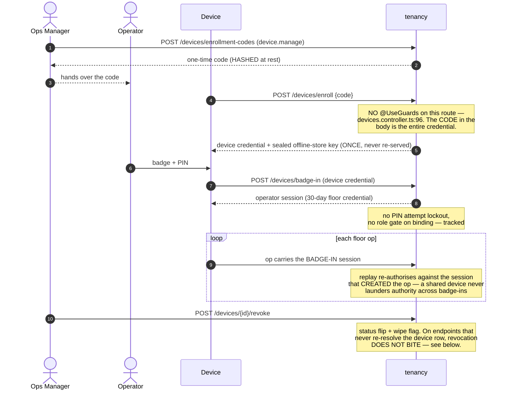
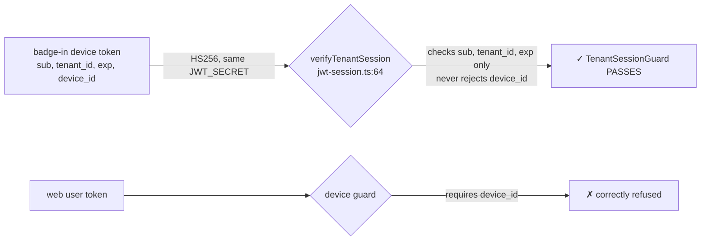

# Tenancy module

> Who a caller is, what they may do, and the physical places they do it in: tenants, sign-in, users and the capability matrix, warehouses, zones, bins, and the floor devices that carry an operator's session.

Paths are relative to `workspace/core/backend/wms-be`. Read [`../IMPLEMENTATION-GUIDE.md`](../IMPLEMENTATION-GUIDE.md) first — the command skeleton, migration checklist and vocabulary pattern below are assumed, not repeated.

This module is the spine every other module calls into. `assertPermission` + `getMemberRoleIn` are the two functions **every** command service in the repo runs at entry, and `permissions.ts` is mirrored by hand into `wms-fe/src/lib/users.ts`.

---

## Owns

| Table | Holds | Key invariants |
|---|---|---|
| `tenants` (`src/shared/db/schema.ts:42`) | One row per customer org | `tenant_id` is stamped **equal to `id`** (`registration.command.ts:93-94`) so the uniform RLS policy scopes the tenant row to itself |
| `users` (`schema.ts:81`) | Owner + team members: email, scrypt hash, role, invite lifecycle | `email` is **globally unique across all tenants** (`users_email_unique`). `role` is the `user_role` pgEnum — the one Postgres enum in the schema. `status` ∈ {`invited`,`active`}. `invite_token_hash` is sha256; the raw token exists only in the invite response |
| `warehouses` (`schema.ts:130`) | Stocking sites | `warehouses_tenant_id_code_unique` |
| `zones` (`schema.ts:159`) | Floor areas | `zones_warehouse_id_code_unique` — scoped to the **warehouse**, not the tenant |
| `bins` (`schema.ts:201`) | Putaway/pick locations | `bins_warehouse_id_code_unique`; `capacity` is milli-units with `bins_capacity_whole_units` (`% 1000 = 0 AND > 0`, `drizzle/0027_uom_vocabulary.sql:360`); 11-5 adds the nullable physical capacity `length_mm`/`width_mm`/`height_mm` (`> 0 AND <= 100000`) and `max_weight_grams` (`<= 100000000`) — integer WYSIWYG, CHECKs only in migration `0034`; `retired_at`/`retired_by` stamped together (`bins_retired_pairing`, `drizzle/0016_numerous_bloodscream.sql:6`) and never cleared; `system_owned` marks the Receiving/QC-hold bins |
| `devices` (`schema.ts:1099`) | Floor handhelds: enrollment code hash, label, badge PIN hash, operator binding, revocation | `devices_enrollment_code_hash_unique` is a **partial** index (`where enrollment_code_hash is not null`) — it is what makes redemption single-shot. `devices_status_check` ∈ {`active`,`revoked`} (`drizzle/0012_lonely_the_renegades.sql:40`) |
| `audit_events` (`schema.ts:104`) | Append-only actor/action/target trail; `reference` carries the idempotency key | No update or delete code path exists anywhere. **Shared with inbound, putaway, outbound and carriers** — it is the one table this module owns that siblings write |
| `idempotency_keys` (`schema.ts:238`) | AD-5 storage: `(tenant_id, key)` unique + payload hash + response snapshot | Also written by every other module. Extra `idempotency_keys_key_idx` exists solely for registration's key-only replay lookup |

Every table carries `tenant_id` with a fail-closed `tenant_isolation` RLS policy declared **only** in migration SQL (`drizzle/0001_greedy_scarecrow.sql:55-70`).

`bins.blocked` is owned by **putaway**, not here — story 3.6 re-homed the toggle's logic to `src/modules/putaway/bin-state.command.ts` because a blocked bin is operational state. The URL (`PATCH …/bins/{binId}`) still lands on this module's controller, which delegates (`tenancy.controller.ts:402`). Since 11-5 that one route **dispatches per body**: a `blocked` field goes to putaway's `setBlocked`, capacity attributes (`lengthMm`/`widthMm`/`heightMm`/`maxWeightGrams`) go to this module's `editBinCapacity` under `bin.create`; sending both (or neither) is one 400 `validation-failed` telling the caller to send separate PATCH requests — one idempotency key per request. The two arms never mix a snapshot. `blocked` is strictly boolean — a present-but-non-boolean value (including `null`: class-validator's `@IsOptional` skips null too, which a 500 proved before the review caught it) is a 400 at the controller, before dispatch; the capacity attrs keep their null-means-clear reading.

---

---

## Schema (field level)

### `tenants`
`id` uuid PK · `tenant_id` uuid NOT NULL — **self-referencing**, so RLS is uniform across every table including this one · `name` text NOT NULL.

### `users`

| Column | Type | Null | Default | Guard | Meaning |
|---|---|---|---|---|---|
| `email` | text | NO | — | **globally unique** | Not per-tenant — one tenant per email, by design. Duplicate → `409 duplicate-email` |
| `password_hash` | text | NO | — | — | **scrypt.** Never leaves the row. `DUMMY_HASH` equalises timing so an unknown email and a wrong password are indistinguishable |
| `role` | `user_role` **pgEnum** | NO | `'operator'` | the enum type | `owner \| ops_manager \| operator \| accountant`. **The only `pgEnum` in the schema** — every later vocabulary uses a CHECK instead, because extending an enum needs `ALTER TYPE` |
| `status` | text | NO | `'active'` | **NO CHECK — app-layer only** | `invited \| active`, enforced solely by `USER_STATUSES` (`schema.ts:66`). One of the unguarded vocabularies the docs flag elsewhere |
| `invite_token_hash` | text | **YES** | — | — | **sha256 of the one-time token.** The raw value is returned once and also persists in the idempotency snapshot so a replay re-serves it |
| `invite_expires_at` | timestamptz | **YES** | — | — | 7-day TTL |

### `warehouses` / `zones`
`warehouses`: `code` (unique per tenant), `name`, plus the origin address columns (story 11-1, migration `0030`): `origin_contact_name`, `origin_phone`, `origin_line1`, `origin_line2`, `origin_city`, `origin_state`, `origin_pincode` — text ×7, all nullable, pre-11.1 rows read back `origin: null`. **Set at create only** (`origin` is required on `POST /warehouses`); there is no update endpoint — story 4-6d owns that decision. `pincode` is TEXT, `/^\d{6}$/`.
`zones`: `warehouse_id`, `code` (unique per warehouse), `name`.

### `devices`

| Column | Type | Null | Default | Guard | Meaning |
|---|---|---|---|---|---|
| `operator_user_id` | uuid | **YES** | — | — | Null until badge-in binds an operator |
| `label` | text | **YES** | — | — | |
| `status` | text | NO | `'active'` | `devices_status_check` | `active \| revoked` |
| `revoked_at` / `revoked_by` | timestamptz / uuid | **YES** | — | — | |
| `wipe_flag` | boolean | NO | `false` | — | Set on revoke; the device wipes its cache on next connection |
| `enrollment_code_hash` | text | **YES** | — | **partial unique WHERE NOT NULL** | One-way hash of the mint code |
| `enrollment_code_expires_at` | timestamptz | **YES** | — | — | |
| `enrolled_at` | timestamptz | **YES** | — | — | |
| `pin_hash` | text | **YES** | — | — | **scrypt.** No attempt lockout exists (epic-3 retro a6) |
| `last_seen_at` | timestamptz | **YES** | — | — | |

**No column holds the sealed offline-store key** — it is returned once at enrollment and persists only in `idempotency_keys.response_snapshot`.

### `audit_events`
`actor_user_id` · `action` (the outbox event name) · `target_type` · `target_id` · `reference` (nullable — the idempotency key) · `occurred_at` default `now()`. **Append-only by convention, not by trigger** — unlike `ledger_events`.

### `idempotency_keys`

| Column | Type | Null | Guard | Meaning |
|---|---|---|---|---|
| `key` | text | NO | `unique (tenant_id, key)` | ULID. **Tenant-scoped** — the cross-tenant hijack fixed in 4.3 |
| `payload_hash` | text | NO | — | sha256 over the command's fields. **Convention changed in 10.2** (base units, not milli) — no pre-10.2 key replays |
| `response_snapshot` | jsonb | NO | — | **Durable and re-served on replay. Never put secret material here** — story 3.2 did, and story 4-6b forbids it |

---

## Public seam

`TenancyModule` exports exactly two providers (`tenancy.module.ts:55`): `TenancyService` and `EnrollmentCommand`.

**`TenancyService`** (`tenancy.service.ts:139`) — for siblings and the api shell:

- `getMemberRole(tenantId, userId, tx?)` `:156` — the authority read. Pass `tx` and it runs inside your transaction; omit it and it opens its own. **Every foreign module calls this**, never `users` directly.
- `requireActiveWarehouse(tenantId)` `:170` → `{warehouseId, code, name}` or 422 `no-active-warehouse`. The zero-warehouse invariant guard for stock-record creation.
- `listWarehouses` `:200` / `listZones` `:241` / `listBins` `:282` — keyset-paginated reads. `listBins` converts `capacity` out of milli-units (`:330`) and, since 11-5, echoes the four physical-capacity attributes **raw** (integer facts, no `fromMilli`).
- `computeSetupChecklist(tenantId)` `:344` — the four onboarding steps, computed on read from counts. No stored step rows.

**File-level functions** other modules import directly (they are the shared command-entry pattern, not a facade breach):

- `assertPermission(role, capability)` — `permissions.ts:143`
- `getMemberRoleIn(tx, tenantId, userId)` — `tenancy.service.ts:111`
- `assertWarehouseInTenant(tx, tenantId, warehouseId)` — `tenancy.service.ts:76`
- `hashCommandPayload` / `parseRequiredIdempotencyKey` / `IdempotencyKey` — `idempotency-guard.ts`
- `idempotencyKeyReuse()` — `registration.command.ts:147`
- `TenantSessionGuard` / `CurrentSession` / `DeviceSessionGuard` / `CurrentDeviceSession`
- `ensureReceivingBinInTx` / `ensureQcHoldBinInTx` — `receiving-bin.ts:51,114`. Inbound calls these so bin master data stays tenancy-owned even when a GRN or a QC hold creates a bin.

**`EnrollmentCommand`** (`enrollment.command.ts:200`) is exported so the api shell's `DevicesController` can reach it: `mintEnrollmentCode`, `enroll`, `badgeIn`, `revokeDevice`, `list`, `selfTestEcho`.

**`UsersCommand`** and the bin/zone/warehouse commands are **not** exported — they are reachable only through this module's own controllers.

---

## Flows

### Device onboarding — three credentials, three lifetimes

### The one-way claim-shape hole

The docstring asserts the two families are "mutually exclusive by claim shape". **That holds one direction only.** A 30-day floor credential opens the web surface for its own tenant. Not cross-tenant and not privilege escalation — `sub` is the operator, so capabilities are the operator's — but revocation stops biting wherever the device row is not re-resolved. Verified; tracked.

### Bin administration

`merge` moves stock (emitting `bin.merged`, a two-arm relocation) and `retire` is **terminal and requires empty**. Both live in `bin.command.ts`, not putaway — putaway *directs* placement, tenancy *owns* the bin. `bins` is the one table deliberately shared by column: tenancy owns structure — since 11-5 that includes the four physical-capacity attributes (`editBinCapacity`) — and `retired_at`, putaway owns `blocked`. It has **no architecture-test block**, which makes the shared-ownership case the least-guarded one in the repo.

---

## Commands

Every command follows the skeleton in the implementation guide. Only the deviations and the module-specific guards are listed here.

### `RegistrationCommand.register` (`registration.command.ts:61`)

Creates the tenant + its Owner user + the idempotency row in one transaction.

1. Normalize email (`trim().toLowerCase()`), hash the payload over `{name, ownerEmail}` — **never password material** `:68`.
2. Replay lookup **by `key` alone** on `AUTH_DATABASE` `:74-84`. This is the one command with no tenant context, so the normal `(tenant_id, key)` predicate is impossible; a foreign key-holder fails the payload-hash comparison and 422s.
3. `hashPassword` **after** the replay check `:86` — a replay must not pay the ~100 ms scrypt round.
4. Insert `tenants` (with `tenantId = id`), then `users` with `role: 'owner'`; a `users_email_unique` violation → 409 `duplicate-email` `:107-114`.

Writes: `tenants`, `users`, `idempotency_keys`. Emits `tenant.registered`.

No capability check — there is no role to read yet.

### `SignInCommand.execute` (`sign-in.command.ts:47`)

Not a state change; **no idempotency key**. Runs entirely on `AUTH_DATABASE` (cross-tenant email lookup).

1. Look up by email.
2. `status === 'invited'` → burn one scrypt round against `DUMMY_HASH`, then 403 `invite-pending` `:61-74`.
3. `verifyPassword(password, user?.passwordHash ?? DUMMY_HASH)` — **always** one scrypt round `:77`.
4. Unknown email and wrong password are one 401 `unauthenticated` with identical text.

Returns the token plus `user {id,email,role,status}`. The role in that body is **for FE surface gating only** — the command path re-reads it.

### `WarehouseCommand.create` / `ZoneCommand.create`

Guards in order: `warehouse.create` / `zone.create` → replay → (zone only) `assertWarehouseInTenant` → insert. Duplicate code → 409 `duplicate-warehouse-code` / `duplicate-zone-code` naming the code. Emits `warehouse.created` / `zone.created`.

Note the ordering difference: `WarehouseCommand` has no parent assert; `ZoneCommand` runs its parent assert **after** the replay lookup (`zone.command.ts:97`).

### `BinCommand.createBin` (`bin.command.ts:201`)

Guards: `bin.create` → replay → `assertWarehouseInTenant` → `assertZoneInWarehouse` (inside `insertBin`, `:997`) → `assertWholeUnitCapacity` → (11-5) `assertBinCapacityAttributes` → insert. The four optional physical-capacity attributes (`lengthMm`/`widthMm`/`heightMm`/`maxWeightGrams`) default to NULL = unconstrained when absent or null.

**Emits nothing.** The spec named `zone.created` / `bins.generated` / `bin.blocked` only, so a manually created bin produces no outbox row (`:218-220`).

### `BinCommand.generateGrid` (`bin.command.ts:290`)

Guards: arithmetic size check **before** materializing codes (`:295`; a `Z×99×99` request must not build a 255k array to reject it) → `grid-too-large` 422 above `MAX_BINS_PER_GRID_RUN` = 500 → `bin.create` → replay → warehouse + zone asserts → (11-5) `assertBinCapacityAttributes` → in-transaction collision pre-check naming the first conflicting code (`:358-365`) → one bulk insert. Every generated bin carries the same optional attributes.

One transaction, one idempotency record, all-or-nothing. Emits `bins.generated`.

### `BinCommand.mergeBin` (`bin.command.ts:462`)

The heaviest command in the module. Guards in exact order (`:474-665`):

1. `bin.retire` capability (Owner + Ops Manager — **not** a `bin.*` capability of its own).
2. Replay.
3. `assertWarehouseInTenant`.
4. **Both bin rows locked `.for('update')`, id-sorted, before any arm is read** (`:508-519`). The `warehouseId` predicate *is* the cross-warehouse gate — a foreign id simply never resolves → 404.
5. Structural: same-bin, source system-owned, target system-owned, source retired, target retired, target blocked. **A blocked *source* is allowed** — it is the only way to empty a blocked bin (`:548`).
6. Open QC hold on either bin → 409 `bin-merge-hold-open` naming bin + hold (`:553-561`).
7. **Conformance gate** (12-1): every moved SKU's `storageClass` must satisfy the target's (`storageClassSatisfies`, `:723`) → else 400 `bin-storage-mismatch`. Read from rows already in hand.
8. **Hazard co-location gate** (12-2, FR-41): the target's occupants come from putaway's `occupantHazardClassesInTx` (the `binBlocked` precedent for importing the helper); per moved SKU, any target occupant **incompatible** with it (`hazardClassesCompatible`, sorted-key pair set) → 400 `bin-segregation-conflict` naming both parties and classes (`:735-785`). **Own-SKU pairs are skipped** (same-SKU consolidation — merging stock into a bin already holding that SKU is legitimate, explosive included); **null-class rows skip** (null carries no rule). **Moved-vs-moved is NOT re-checked** — the source bin already co-locates its own occupants, and the premise holds while `stock.adjust` is the named bypass (the only writer able to form incompatible co-location in a source bin; recorded in PENDING).
9. Capacity, all-or-nothing, 11-5 order — unit gate first: `targetLoad.units + movedUnits > target.capacity` → 400 `bin-full`; then the physical gates over the moved milli-loads: `bin-overweight` / `bin-volume-exceeded`, then a per-moved-SKU dim-fit loop → 400 `bin-item-oversize` naming the offending SKU (`:878-923`). The load read is putaway's shared `binOccupancyInTx` (weight/volume as `::numeric` sums), never a re-derivation.

Then: serial refs pre-locked tenant-wide, sorted, before the first append (`:673-679` — the stock-adjustment deadlock rule); one `bin.merged` ledger event per arm through `InventoryFacade`; source retired in the same commit; outbox → audit → idempotency key.

Writes: `ledger_events` (via the facade), `bins` (source retirement), `audit_events`, `idempotency_keys`. Emits `bin.merged`.

### `BinCommand.editBinCapacity` (story 11-5)

Guards in skeleton order: **`bin.create`** (structure is tenancy master data — deliberately not a new capability) → replay → `assertWarehouseInTenant` → bin row locked `.for('update')` limit 1 → unknown bin 404 → `binRetired409` (a retired bin's physical capacity is dead history; **system bins stay editable** — they are tenancy-owned structure, only putaway's `blocked` toggle refuses system bins) → `assertBinCapacityAttributes` **behind the replay lookup** (the `CreateBinDto.capacity` no-`@IsInt`-before-replay rule of gotchas below, applied to the new fields) → UPDATE. Each field is `command.x === undefined ? row.x : command.x` — **absent leaves unchanged, present (even `null`) overwrites**, so `null` clears a limit back to unconstrained. **Accepted (11-5 triage #14):** the command does NOT compare the new limits against the bin's live load — limits below what the bin already holds are stored silently, after which every placement/merge into the bin refuses and the suggestion drops it (fail-open philosophy; the operator learns from the next refused placement, not from this write).

Writes `bins.{length_mm,width_mm,height_mm,max_weight_grams}` + `updated_at`. Emits outbox `bin.capacity_changed` with the four (possibly null) values, plus an audit row (`action: 'bin.capacity_changed'`) — same shape as `bin.blocked`. `createBin` still emits nothing.

`assertBinCapacityAttributes` mirrors `assertSkuAttributes`: absent or null skips, anything present must be a positive whole number within its cap — `MAX_BIN_DIMENSION_MM` = 100 000 mm and `MAX_BIN_WEIGHT_GRAMS` = 100 000 000 g, each 100× the SKU-side cap (`MAX_SKU_DIMENSION_MM` = 10 000, `MAX_SKU_WEIGHT_GRAMS` = 1 000 000), so any recordable SKU fits inside any recordable bin — else 400 `validation-failed` ("X is not a recordable bin capacity"). The CHECKs in migration `0034` backstop; they live only in the SQL, never `schema.ts` (the migration-checklist rule).

### `BinCommand.retireBin` (`bin.command.ts:765`)

Guards: `bin.retire` → replay → warehouse assert → row locked → system bin 400 → already retired 409 `bin-retired` (terminal) → open QC hold 409 → empty gate. The empty gate names every offending `(sku, batch, qty)` in the rejection (`:878-889`).

The row is never deleted: `(warehouse_id, code)` keeps the code reserved forever. Emits `bin.retired`.

### `UsersCommand.invite` (`users.command.ts:133`)

Guards: `users.invite` (Owner only) → replay → global email pre-check on `AUTH_DATABASE` (`:166-173`) → insert with `passwordHash: DUMMY_HASH`, `status: 'invited'`, sha256 invite-token hash, 7-day expiry.

The **raw invite token's only durable store is the idempotency snapshot** (`:54-58`), so a same-key replay re-serves the exact link. Emits `user.invited`, writes an audit row.

### `UsersCommand.setUserRole` (`users.command.ts:254`)

Guards: `users.role_change` (Owner only) → replay → target exists in tenant (404).

The last-Owner guard is **atomic**: when demoting an owner, the owner rows are locked `FOR UPDATE` first (`:308-314`), then the UPDATE carries `1 < (select count(*) … role = 'owner')` in its own WHERE (`:324-325`). A demotion matching no rows → 409 `last-owner`. Without the row locks, two concurrent demotions of *different* owners would each count 2 from their own READ COMMITTED snapshot.

Emits `user.role_changed`. Effective on the user's **next command**, not next login.

### `UsersCommand.acceptInvite` (`users.command.ts:402`)

Unauthenticated. Replay lookup on `AUTH_DATABASE` but **scoped to `(tenant_id, key)`** (`:416-425`) — the path always names a tenant, unlike registration. Token must match, belong to this tenant, be `invited`, and be unexpired; all failures are one indistinguishable 400 `invite-invalid`.

The UPDATE re-carries every validity condition including `inviteExpiresAt > now()` (`:459-477`), so two concurrent accepts cannot both win. Emits `user.accepted`.

### Device commands — see **Key algorithms** below

`mintEnrollmentCode` (`device.manage`), `enroll` (unauthenticated), `badgeIn` (device token, no idempotency key), `revokeDevice` (`device.manage`), `selfTestEcho` (badge-in session).

---

## Key algorithms

### The capability model (`permissions.ts`) — read this before touching any module

**One tuple, one matrix, one assert.**

- `CAPABILITIES` (`:9-87`) is the closed `as const` tuple of machine names. Each entry carries the story that added it and why that role set.
- `ROLE_CAPABILITIES` (`:100-131`) maps each of the four roles to a `ReadonlySet`:
  - `owner` — everything.
  - `ops_manager` — everything except `users.invite` and `users.role_change`.
  - `operator` — exactly four: `putaway.execute`, `picks.execute`, `pack.execute`, `dispatch.execute`. The floor executes; it does not plan.
  - `accountant` — the empty set.
- `assertPermission(role, capability)` (`:143`) throws 403 `role-denied` naming both the role and the capability.

**Reads are never gated.** Any tenant member may list warehouses, SKUs, users, devices, carrier connections, the checklist. Only command services consult the matrix, and only at entry.

**Where the role is re-read.** Never from a JWT claim. `assertPermission(await getMemberRoleIn(tx, tenantId, actorUserId), '…')` runs **inside the command's own tenant transaction**, so the DB read *is* the authority epoch — a role change applies to that user's next command with no re-login. A missing member row fails closed with the same 403 (`tenancy.service.ts:121-129`). Foreign modules get the same read through `TenancyService.getMemberRole(tenantId, userId, tx)` so they never touch `users`.

**Adding a capability is a four-file change:** the tuple here, the role sets here, the command that asserts it, and `wms-fe/src/lib/users.ts`. CI's `check:capability-mirror` reads this file and fails naming the drift.

### Auth model and token shapes (`jwt-session.ts`)

Hand-rolled HS256 over `node:crypto` HMAC — no JWT library, no refresh tokens. Secret is `JWT_SECRET` (≥16 chars, `:30-38`); **both token families share it** and are told apart purely by claim shape.

| | Web session | Device credential | Badge-in session |
|---|---|---|---|
| Minted by | `signTenantSession` `:44` | `signDeviceToken` `:150` | `signBadgeInSession` `:160` |
| Claims | `sub`, `tenant_id`, `iat`, `exp` | `device_id`, `tenant_id`, `iat`, `exp` | `device_id`, `tenant_id`, `sub`, `iat`, `exp` |
| TTL | 15 min (`SESSION_TTL_SECONDS`) | 30 days | 30 days |
| Verified by | `verifyTenantSession` `:64` | `verifyDeviceSession` `:182` | `verifyDeviceSession` |

Signature comparison is `timingSafeEqual` after a length check (`:92`). There is **no role claim in either family** — that is the point.

**The two families are only one-way exclusive.** `verifyDeviceSession` *requires* a `device_id` claim (`:224`), so a web token never passes the device guard. `verifyTenantSession` does **not** reject a `device_id` claim — it checks only `sub`, `tenant_id` and `exp` (`:105-108`). A badge-in token carries all three and is signed with the same secret, so it satisfies `TenantSessionGuard`. The docstring at `:177-181` claims mutual exclusivity; that is true in one direction only. See Security notes.

Guards are transport only. `TenantSessionGuard` (`tenant-session.guard.ts:27`) parses `Bearer` case-insensitively, verifies, and parks claims on the request. Ownership of the path is a separate `assertOwnTenant(session, tenantId)` at each controller method — 403 `permission-denied`.

### Password and PIN handling (`passwords.ts`)

`scrypt:<salt hex>:<key hex>`, 16-byte salt, 64-byte key, `timingSafeEqual` compare. The same primitive hashes account passwords **and** device badge PINs — a device never sees an account password.

`DUMMY_HASH` (`:39`) is a precomputed valid-format hash of an unguessable random value. It exists so sign-in, invite and badge-in all pay **exactly one scrypt round on every path**: unknown email, wrong password, pending invite and unknown operator are indistinguishable in body *and* in time. It is also the sentinel `passwordHash` an invited user carries until they accept (`users.command.ts:189`).

### Device enrollment and badge-in (`enrollment.command.ts`)

**Mint** (`:215`). `device.manage` → replay → insert a **pending-redemption `devices` row** carrying only `enrollment_code_hash` (sha256 of a 32-byte base64url code) and a 15-minute `enrollment_code_expires_at`. Creating the row at mint time is what makes redemption a single conditional UPDATE. The raw code lives only in the response and its idempotency snapshot.

**Enroll** (`:320`, unauthenticated). Order matters:

1. Replay lookup on `AUTH_DATABASE` **scoped to `(tenant_id, key)`** (`:338-347`). The comment at `:329-337` is the reason: the snapshot is a device credential *plus a sealed offline-store key*, and a key-only lookup would hand it to a caller enrolling on another tenant's path. Pinned by `test/devices.spec.ts:703`.
2. PIN shape (4–6 digits) and label length.
3. Read the pending row by code hash; wrong tenant / expired / absent → one 400 `enrollment-code-invalid`, **checked before the burn** so the code survives for its real tenant (`:379-388`).
4. Generate the offline-store key and seal it under `DEVICE_ENCRYPTION_KEY`; a missing key is mapped to 503 `device-encryption-unavailable` rather than a raw 500 (`:397-411`).
5. The redemption UPDATE re-carries **every** validity condition — id, tenant, code hash, `status = 'active'`, `expires_at > now()` (`:428-436`). Two concurrent redemptions cannot both succeed. It nulls `enrollment_code_hash`/`_expires_at` and sets `label`, `pin_hash`, `enrolled_at`.

Returns the device token, the TTL, and `offlineStoreKeySealed` — delivered exactly once; the server never needs it again.

**Badge-in** (`:491`). Not a state change beyond the binding + last-seen, so **no idempotency key** (the sign-in pattern). Device row locked `.for('update')`; unknown / revoked / not-yet-enrolled → 403 `device-revoked` (all identical). PIN verified against `device.pinHash ?? DUMMY_HASH` — one scrypt round always. `bound` (`:513-516`) requires an **active** user in this tenant and either an unbound device or the *same* operator: a device is single-operator until re-enrollment. Wrong operator or wrong PIN → one 401 `badge-invalid`.

**Revoke** (`:554`). Status flip + `revoked_at`/`revoked_by` + `wipe_flag` + audit + `device.revoked`, one transaction. A re-revoke of an already-revoked device re-serves the state with **no second audit row and no second outbox event** (`:595-613`) while still writing its idempotency row.

**Fail-closed re-authorization.** `selfTestEcho` (`:720`) is the model every device-authenticated command follows: re-resolve the device row (`:732-741`, 403 `device-revoked`) and re-read the operator's role from the DB (`:745-758`, `accountant` → 403 `role-denied`) **before** the replay lookup. Revocation is therefore effective on the device's next request — that is what buys the 30-day token its long TTL.

### Bin grid generation (`bin.command.ts:142-174`)

Code shape is `<aisle letter>-<2-digit bay>-<2-digit level>`, e.g. `A-01-01`. `aisleRangeCount` (`:150`) rejects a descending or out-of-`A–Z` span as 400 `validation-failed` rather than producing an empty grid. `buildGridCodes` iterates aisle → bay → level, so `firstCode`/`lastCode` in the snapshot bracket the run in that order. Aisle letters are uppercased *before* hashing the payload (`:308-318`) so a case-variant replay still replays.

### Bin capacity (`bin.command.ts:974`)

Capacity is the one quantity in the system with **no unit at all** — a bin holds many SKUs measured many ways. `assertWholeUnitCapacity` therefore refuses anything that is not a whole integer ≥ 1, then converts to milli-units. Three aligned gates: the DTO documents `minimum: 1` (`tenancy.dto.ts:232-247` — deliberately *not* `@IsInt`, see gotchas), this function enforces, `bins_capacity_whole_units` backstops.

**The physical capacity (11-5) is a different animal.** `lengthMm`/`widthMm`/`heightMm`/`maxWeightGrams` are plain integers with real units (mm, g) and **no milli scaling** — the WYSIWYG principle applied to a different scale: what the API takes is what the column holds is what the gate compares. The gates live in putaway (`candidateFitsSku`) and compare milli-loads against `limit × 1000`; `assertBinCapacityAttributes` is the only input gate and the `0034` CHECKs the backstop. The whole-unit and physical capacities coexist deliberately and conservatively: a dimmed SKU counts against the unit gate *and* the physical gates — see the putaway module doc.

### System bins (`receiving-bin.ts`)

`ensureReceivingBinInTx` / `ensureQcHoldBinInTx` create the fixed-code `RECEIVING` and `QC-HOLD` zone+bin pairs idempotently **inside the caller's transaction**: insert `onConflictDoNothing`, then re-select. A concurrent first receipt races on the unique index and the loser re-selects the winner's rows. Both are `system_owned`, type `staging`, capacity 1,000,000 base units — intake is never capacity-gated.

The QC-hold re-select additionally requires `systemOwned = true` (`:169`): adopting a user-created bin named `QC-HOLD` would park stock where the ATP hook counts zero.

---

## Invariants

| Invariant | Enforced by |
|---|---|
| A capability check never reads a token claim | `assertPermission` takes a `UserRole`; the only producer is `getMemberRoleIn`, which reads `users` inside the caller's tx |
| A non-member has no capabilities | `getMemberRoleIn` throws 403 `role-denied` on a missing row (`tenancy.service.ts:121`) |
| A tenant always has ≥ 1 Owner | Atomic last-Owner guard (`users.command.ts:308-331`) |
| One account per email, system-wide | `users_email_unique` + the `AUTH_DATABASE` pre-check in invite |
| An `invited` user cannot sign in | 403 `invite-pending` (`sign-in.command.ts:68`), and their `passwordHash` is `DUMMY_HASH` |
| An invite/enrollment code is redeemable exactly once | The redemption UPDATE carries every validity condition; the partial unique index backs the code hash |
| A session cannot act on another tenant's path | `assertOwnTenant` at every controller method + RLS |
| Bin retirement is terminal and code-reserving | `bins_retired_pairing` CHECK, `bin-retired` 409, no delete path, `(warehouse_id, code)` unique |
| System bins are never blocked, merged or retired | `systemOwned` guards in `mergeBin` `:532-541`, `retireBin` `:820`, `bin-state.command.ts` |
| A merge moves stock only through real ledger events | `BinCommand` injects `InventoryFacade`; `test/architecture.spec.ts` bans direct stock-table writes outside inventory |
| A bin's capacity is a whole number of units | Three gates (above) |
| A bin's physical capacity (11-5) is positive and bounded — or unconstrained | `assertBinCapacityAttributes` on create/grid/edit; the four `0034` CHECKs backstop; NULL = unconstrained |
| Zone/bin codes are unique per **warehouse**, warehouse codes per **tenant** | The three unique indexes |
| A revoked device is dead on its next request | Every device command re-resolves the row before acting |

---

## Security notes

**Cross-tenant access** is stopped in three independent layers, and all three are load-bearing:

1. **`assertOwnTenant`** at the controller — the session's `tenant_id` must equal the path's (`tenancy.controller.ts:529`, `users.controller.ts:202`, `api/devices.controller.ts:268`). This is what makes a valid token for tenant A useless against tenant B's URL.
2. **App-layer `WHERE tenant_id`** on every query — the authoritative filter.
3. **RLS** — `tenant_isolation` with `NULLIF(current_setting('app.tenant_id', true), '')::uuid`, set transaction-locally by `withTenantTransaction` (`src/shared/db/tenant-scope.ts:27`). The `NULLIF` makes an unscoped session see **zero rows** rather than error.

Warehouse ownership is *not* an RLS dimension — RLS stays single-dimension and `assertWarehouseInTenant` catches a foreign warehouse as 404 inside the command transaction.

**`AUTH_DATABASE` is the deliberate hole.** It is a BYPASSRLS connection (`src/shared/db/db.ts:35-51`) used by exactly four paths that have no tenant scope yet: sign-in, registration's replay lookup, invite's global email pre-check, accept-invite's and enroll's lookups. Two rules govern it: **reads only**, and **scope the predicate to a tenant wherever a tenant is known**. Registration is the only key-only lookup, and only because it genuinely has no tenant.

**Password/PIN handling.** scrypt only, never reversible, never in a response, never in an idempotency payload hash (registration `:68`, accept-invite `:404` both deliberately exclude it — a leaked idempotency row must not become an offline password oracle, and a salted hash could not be replay-deterministic anyway). Enumeration is closed by the `DUMMY_HASH` round on every rejection path.

**Session expiry.** Web tokens die in 15 minutes with no refresh — re-authenticate. Device tokens live 30 days but are **server-checked on every request**, so revocation does not wait for expiry.

**A badge-in token satisfies `TenantSessionGuard`.** Both families are HS256 under the same `JWT_SECRET`, and `verifyTenantSession` checks only `sub`/`tenant_id`/`exp` — all of which a badge-in token carries. A floor operator's 30-day device session therefore also opens the web surface for its own tenant, with whatever capabilities that operator's role grants. Not exploitable across tenants (`assertOwnTenant` and RLS still hold) and not a privilege escalation (the role is re-read per command either way), but it does hand a 30-day credential to a surface designed around a 15-minute one, and revocation only bites on endpoints that re-resolve the device row — which the web endpoints do not. Not recorded in `../PENDING.md`; verify before relying on the 15-minute TTL as a control.

**Known gaps** (`../PENDING.md` → tenancy): no PIN attempt lockout on badge-in, and no role gate on the operator *binding* — any `active` user of the tenant with the device's PIN can become its bound operator (`enrollment.command.ts:513-516`). The role gate exists only on the commands themselves.

---

## Events

All appended in-transaction through `OUTBOX_SINK` (AD-7); a replayed command appends nothing because the replay returns before the append.

| Type | Emitted by | Payload |
|---|---|---|
| `tenant.registered` | `register` | `{name, ownerEmail}` |
| `warehouse.created` | `WarehouseCommand.create` | `{warehouseId, code, name}` |
| `zone.created` | `ZoneCommand.create` | `{zoneId, warehouseId, code}` |
| `bins.generated` | `generateGrid` | `{warehouseId, zoneId, count, firstCode, lastCode}` |
| `bin.merged` | `mergeBin` | `{mergeId, tenantId, warehouseId, source*/target* ids and codes, moved, retiredAt, retiredBy}` |
| `bin.retired` | `retireBin` | `{binId, binCode, warehouseId, retiredAt, retiredBy}` |
| `user.invited` / `user.role_changed` / `user.accepted` | `UsersCommand` | ids, email, role |
| `device.enrollment_code_minted` / `device.enrolled` / `device.revoked` | `EnrollmentCommand` | `{deviceId, …}` — **never** the code, PIN or sealed key |
| `bin.blocked` | putaway's `BinStateCommand` | — |
| `bin.capacity_changed` (11-5) | `editBinCapacity` | `{binId, warehouseId, lengthMm, widthMm, heightMm, maxWeightGrams}` |

`createBin` emits nothing (see Commands).

---

## Gotchas

**`UsersCommand.invite` opens a second pooled connection inside an open transaction.** `this.authDb.select()` at `users.command.ts:166` runs while the `DATABASE` tenant transaction is held. postgres.js queues connection requests with **no timeout**, so this is the exact shape documented as having deadlocked a catalog endpoint (`catalog.facade.ts:88-94`). It has not bitten here — the auth read is short — but do not copy the pattern, and do not add a second one.

**`assertOwnTenant` is copy-pasted into ten controllers.** `tenancy.controller.ts:529`, `users.controller.ts:202`, `catalog/catalog.controller.ts:239`, and every controller in `src/api/` (devices, carriers, inbound, receiving, outbound, inventory, putaway) — each with its own private `function assertOwnTenant`. Two of them take a `TenantSession`, the rest take a bare `tokenTenantId: string`. A new controller that forgets the call has no compile-time or test-time signal. Grep before adding a route.

**`CreateBinDto.capacity` deliberately has no `@IsInt()`.** `tenancy.dto.ts:238-247`: a validator-level refusal fires in the `ValidationPipe`, **in front of the idempotency replay lookup**, which would answer 400 to a queued device op that already committed. The whole-unit rule lives in the command instead. The same reasoning governs every quantity edge in the repo — do not "tighten" the DTO.

**The bin payload-hash break is intentional and pinned.** Story 10.2 moved capacity scaling into the command, so a key written by a pre-10.2 build now 422s `idempotency-key-reuse` instead of replaying (`bin.command.ts:202-216`). `test/picking.spec.ts` asserts this as EXPECTED. Do not "fix" it with a compatibility branch.

**Pre-3.6 idempotency snapshots lack `systemOwned`/`retiredAt`/`retiredBy`.** `normalizeBin` (`tenancy.controller.ts:516-527`) fills the absent fields on replay. Pinned by `test/bin-admin.spec.ts:838`. Any new nullable bin field needs the same treatment — 11-5 followed it, and `normalizeBin` now defaults the four capacity attributes to `null` so a pre-11.5 snapshot replays through the new response shape.

**`retireBin`'s empty gate reads `stock_on_hand` and `batch_on_hand` only** (`bin.command.ts:844-877`). `../PENDING.md` records the missing serial-arm gate: a serial the ledger locates in the bin while its projection reads zero would not block retirement. `mergeBin` *does* cross-check (`:601-609`) and refuses on disagreement.

**`mergeBin`'s lock order is load-bearing and acyclic**: both bin rows (id-sorted) → serial locks (sorted, all arms together) → the warehouse advisory lock taken inside `appendLedgerEventInTx`. Reordering any of these reintroduces the stock-adjustment deadlock.

**Minted-but-never-redeemed device rows are immortal.** `mintEnrollmentCode` inserts a row; nothing expires or deletes it, and `list` hides it forever via `isNull(enrollmentCodeHash)` (`enrollment.command.ts:686-689`). They accumulate. Harmless today, but a cleanup job must not simply delete by `status`.

**`computeSetupChecklist` calls `catalogFacade.getImportSummary` after its own transaction closes** (`tenancy.service.ts:345-364`), not inside it — two sequential transactions, deliberately. Moving that call inside would nest connections.

**`decodeCursorSafe` exists in eleven private copies across the repo**, three of them in this module (`tenancy.service.ts:425`, `users.command.ts:632`, `enrollment.command.ts:822`). They are not identical — carriers' additionally pins the instant shape with a regex. A crafted cursor that skips validation reaches the `::uuid`/`::timestamptz` cast and surfaces as a 500, which is exactly what these exist to prevent (`test/tenancy.spec.ts:521`).

**`../PENDING.md` records that the enroll replay lookup was missing its `tenantId` predicate** (epic-3 retro a6). The code at `enrollment.command.ts:338-347` now carries it and `test/devices.spec.ts:703` pins it — that arm is closed; the PIN-lockout and binding-role-gate arms are not.
